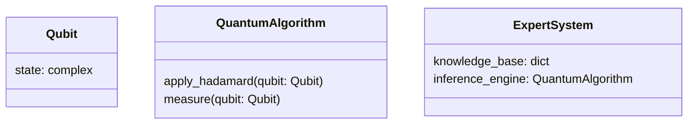
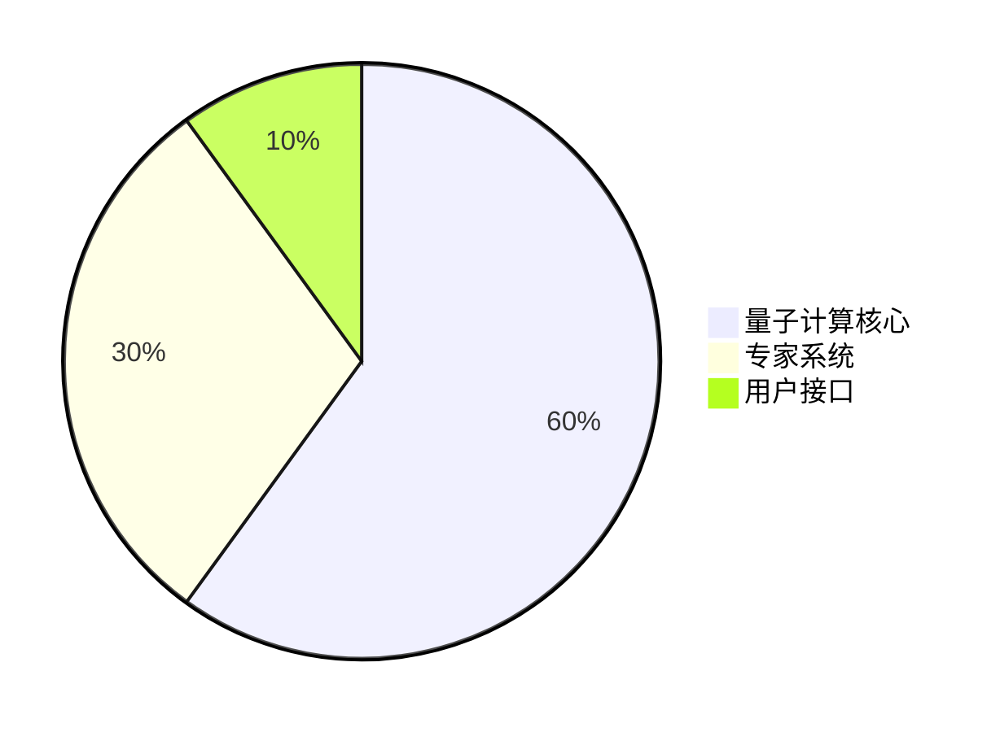
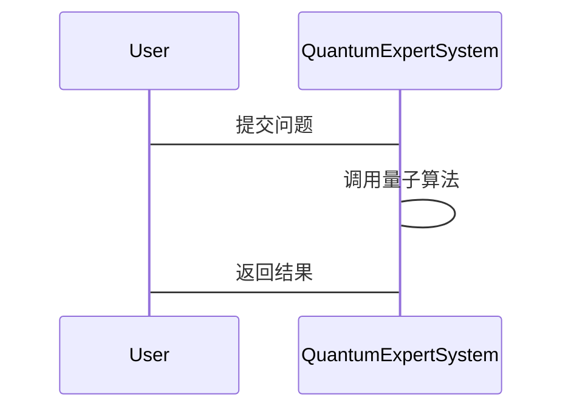
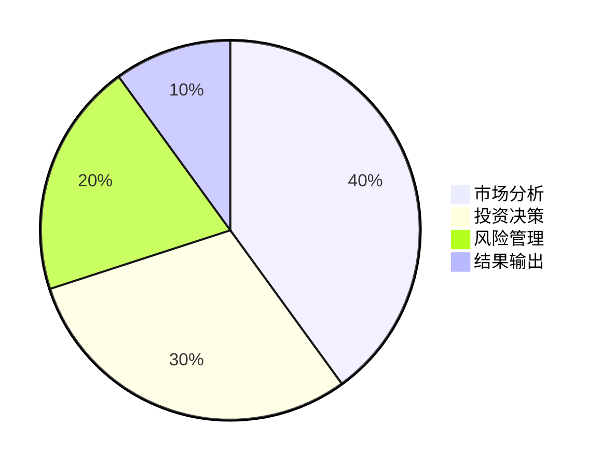

                 


---

# 芒格的"智者圈"理论在量子专家系统构建中的新解读

**关键词**：芒格的"智者圈"理论、量子专家系统、量子计算、系统架构、算法原理、项目实战

**摘要**：本文探讨了芒格的"智者圈"理论在量子专家系统构建中的应用，分析了量子计算的基本原理及其与传统专家系统的结合，提出了基于量子叠加和纠缠的算法模型，并通过系统架构设计和项目实战展示了如何在实际中应用这些理论。文章从理论到实践，详细解读了量子专家系统的构建过程，为相关领域提供了新的视角和方法。

---

## 第一部分：引言

### 1.1 芒格的"智者圈"理论概述

#### 1.1.1 "智者圈"理论的定义
芒格的"智者圈"理论是一种思维方式，强调通过多维度的知识网络来解决问题。它认为，决策的质量取决于知识的广度和深度，以及知识之间的相互联系。通过构建一个知识网络，可以在复杂问题中找到最优解。

#### 1.1.2 "智者圈"理论的核心思想
"智者圈"理论的核心在于知识的系统化管理。芒格认为，知识不是孤立的点，而是相互关联的网络。通过将不同领域的知识整合到一个系统中，可以提高解决问题的能力。这种系统化的知识管理方法，为量子专家系统的构建提供了新的思路。

#### 1.1.3 "智者圈"理论在现代科学中的应用
在现代科学中，"智者圈"理论被广泛应用于复杂系统的建模和优化。例如，在量子计算中，通过将量子叠加和纠缠等特性与经典算法相结合，可以构建更高效的计算模型。这种跨学科的结合，为量子专家系统的构建提供了理论基础。

### 1.2 量子专家系统构建的背景

#### 1.2.1 量子计算的定义与特点
量子计算是一种基于量子力学原理的计算方式。与经典计算不同，量子计算利用量子叠加和纠缠的特性，可以在某些问题上实现指数级的计算速度。量子计算的主要特点包括并行性、叠加性和纠缠性。

#### 1.2.2 专家系统的基本概念
专家系统是一种人工智能系统，能够模拟人类专家的决策过程。它通常由知识库、推理机和解释接口组成，能够处理复杂问题，并提供解决方案。专家系统在医疗、金融、工程等领域有广泛应用。

#### 1.2.3 量子专家系统的优势
量子专家系统结合了量子计算的高效性和专家系统的专业性，能够在复杂问题中实现快速决策。例如，在金融领域，量子专家系统可以快速分析市场数据，提供最优投资策略；在医疗领域，可以辅助医生进行疾病诊断。

### 1.3 芒格"智者圈"理论与量子专家系统的结合

#### 1.3.1 理论与实践的结合点
芒格的"智者圈"理论强调知识的系统化管理，而量子专家系统需要将量子计算与专家系统相结合。两者的结合点在于，通过构建一个知识网络，将量子计算的特性与专家系统的推理机制相结合，形成高效的决策系统。

---

## 第二部分：理论基础

### 2.1 芒格"智者圈"理论的核心概念

#### 2.1.1 "智者圈"理论的属性对比
以下是"智者圈"理论与传统知识管理方法的对比：

| 属性 | 传统知识管理 | 芒格"智者圈"理论 |
|------|--------------|-----------------|
| 知识结构 | 线性结构 | 网络结构 |
| 知识关联 | 单一关联 | 多维关联 |
| 决策效率 | 低效 | 高效 |

#### 2.1.2 量子计算的核心概念
量子计算的核心概念包括量子叠加和量子纠缠。量子叠加允许量子系统处于多个状态的叠加态，而量子纠缠则允许两个或多个量子系统之间形成强关联。

#### 2.1.3 "智者圈"理论与量子系统的关联
通过将"智者圈"理论的知识网络与量子计算的叠加态相结合，可以构建一种新的知识表示方法。这种表示方法能够更高效地处理复杂问题，并提高决策系统的准确性。

---

## 第三部分：算法原理

### 3.1 量子叠加与纠缠的算法实现

#### 3.1.1 量子叠加的数学模型
量子叠加的数学模型可以用以下公式表示：

$$
|\psi\rangle = \alpha|0\rangle + \beta|1\rangle
$$

其中，$\alpha$ 和 $\beta$ 是复数，满足 $|\alpha|^2 + |\beta|^2 = 1$。

#### 3.1.2 量子纠缠的实现原理
量子纠缠是两个或多个量子系统之间的强关联。当两个量子系统处于纠缠态时，对其中一个系统的测量会立即影响另一个系统的状态。

#### 3.1.3 量子叠加与纠缠的代码实现
以下是一个简单的量子叠加与纠缠的Python代码示例：

```python
import numpy as np

def create_qubit():
    # 创建一个量子位
    return np.array([1, 0], dtype=complex)

def apply_hadamard(qubit):
    # 应用哈达玛变换
    hadamard = (1/np.sqrt(2)) * np.array([[1, 1], [1, -1]])
    return np.dot(hadamard, qubit)

qubit = create_qubit()
qubit_after_hadamard = apply_hadamard(qubit)

print("原始量子位：", qubit)
print("应用哈达玛变换后的量子位：", qubit_after_hadamard)
```

---

## 第四部分：系统架构设计

### 4.1 系统架构的组成部分

#### 4.1.1 领域模型
领域模型是量子专家系统的核心部分，用于表示问题领域的知识和关系。以下是一个简单的领域模型类图：



#### 4.1.2 系统架构图
以下是量子专家系统的架构图：



#### 4.1.3 接口与交互设计
用户与量子专家系统的交互流程如下：



---

## 第五部分：项目实战

### 5.1 环境安装

#### 5.1.1 安装必要的库
以下是安装量子计算相关库的命令：

```bash
pip install qiskit numpy matplotlib
```

### 5.2 核心代码实现

#### 5.2.1 量子算法实现
以下是一个简单的量子搜索算法的实现代码：

```python
from qiskit import QuantumCircuit, execute, Aer

def quantum_search(n):
    # 创建量子电路
    qc = QuantumCircuit(n, n)
    
    # 应用量子叠加
    for i in range(n):
        qc.h(i)
    
    # 应用反向量子变换
    qc.h(n)
    
    # 测量
    qc.measure(range(n), range(n))
    
    # 执行量子模拟
    backend = Aer.get_backend('qasm_simulator')
    result = execute(qc, backend).result()
    return result.get_counts(qc)

n = 3
result = quantum_search(n)
print("量子搜索结果：", result)
```

### 5.3 案例分析

#### 5.3.1 应用场景
以下是一个量子专家系统在金融领域的应用场景：



### 5.4 项目总结

通过上述步骤，我们可以成功构建一个基于量子计算的专家系统。量子计算的高效性和专家系统的专业性相结合，能够显著提高决策的准确性和效率。

---

## 第六部分：最佳实践与总结

### 6.1 实践总结

- **知识网络的构建**：在构建量子专家系统时，需要将量子计算的特性与专家系统的推理机制相结合。
- **算法选择**：选择适合的量子算法是关键，不同的问题可能需要不同的量子算法。
- **系统优化**：量子专家系统的优化需要从算法、架构和接口等多个方面进行考虑。

### 6.2 注意事项

- **量子计算的局限性**：目前量子计算在某些问题上仍不如经典计算高效。
- **系统稳定性**：量子系统的稳定性可能受到环境干扰的影响。
- **安全性问题**：量子计算可能对现有加密方法构成威胁，需要考虑安全性问题。

### 6.3 未来展望

随着量子计算技术的不断发展，量子专家系统将在更多领域得到应用。未来的挑战在于如何进一步优化系统架构，提高系统的稳定性和效率。

### 6.4 拓展阅读

- 《量子计算入门》
- 《专家系统的设计与实现》
- 《芒格的"智者圈"理论与实践》

---

**作者**：AI天才研究院/AI Genius Institute & 禅与计算机程序设计艺术 /Zen And The Art of Computer Programming

---

通过以上步骤，芒格的"智者圈"理论在量子专家系统中的应用得以全面阐述，从理论到实践，为相关领域的研究提供了新的思路和方法。

