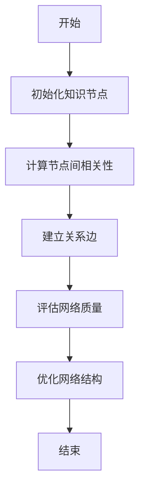
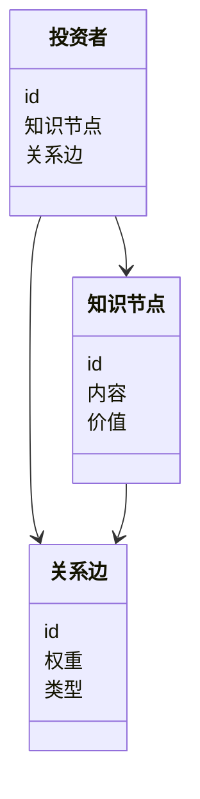
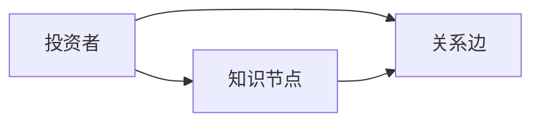
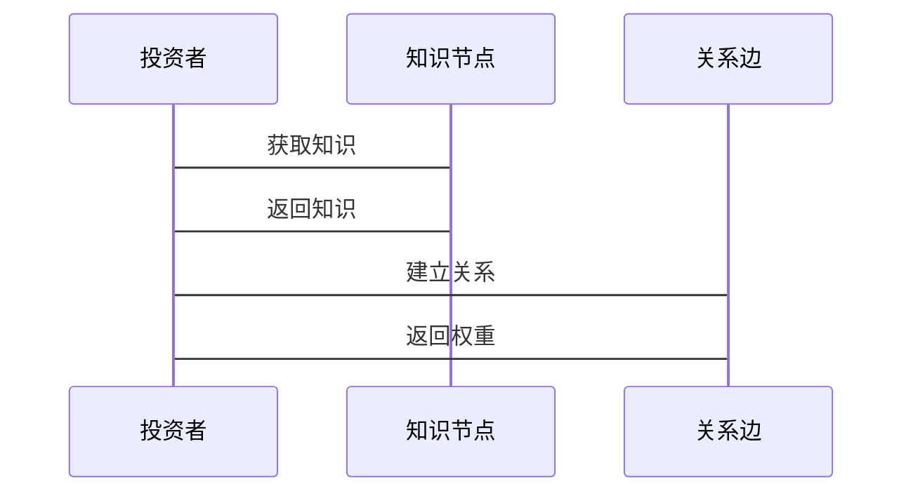

                 


# 芒格的"智者圈"理论：如何构建高质量的投资网络

> 关键词：芒格，智者圈，投资网络，社会网络分析，投资策略，决策科学

> 摘要：芒格的"智者圈"理论是一种基于社会网络分析的投资策略，旨在通过构建高质量的人际关系网络来优化投资决策。本文将从理论背景、核心概念、算法原理、数学模型、系统架构、项目实战等多个维度，详细阐述如何利用"智者圈"理论构建高效的投资网络，提升投资决策的质量和准确性。

---

# 第一部分: 芒格的"智者圈"理论概述

## 第1章: 背景介绍

### 1.1 "智者圈"理论的提出背景

#### 1.1.1 投资决策中的认知局限性
在投资领域，投资者的决策往往受到信息不对称、认知偏差和知识局限的影响。芒格提出"智者圈"理论，旨在通过构建高质量的知识网络，克服这些局限性。

#### 1.1.2 社会网络在投资中的重要性
社会网络不仅是信息来源的重要渠道，还能帮助投资者发现潜在的投资机会。通过构建高质量的社会网络，投资者可以获取更多有价值的信息。

#### 1.1.3 芒格"智者圈"理论的提出动机
芒格认为，高质量的知识网络能够帮助投资者做出更明智的决策。"智者圈"理论的核心在于通过建立和维护高质量的社会网络，优化投资决策的过程。

### 1.2 问题背景与描述

#### 1.2.1 投资决策中的信息不对称问题
信息不对称是投资领域的一个核心问题。通过构建高质量的社会网络，可以有效减少信息不对称的影响。

#### 1.2.2 投资者认知偏差的局限性
投资者的认知偏差（如确认偏差、从众心理等）会影响决策质量。"智者圈"理论通过构建网络，帮助投资者克服认知偏差。

#### 1.2.3 投资网络的价值与风险
投资网络的价值在于其信息传递能力，但同时也存在网络风险（如信息过载、网络拥堵等）。

### 1.3 问题解决与边界

#### 1.3.1 "智者圈"理论的核心解决方案
通过构建高质量的知识网络，优化信息传递和知识共享，提升投资决策的质量。

#### 1.3.2 理论的适用边界与外延
"智者圈"理论适用于需要构建高质量社会网络的投资领域，但也需要考虑网络的复杂性和动态性。

#### 1.3.3 投资网络构建的伦理与法律边界
构建投资网络需要遵守伦理和法律规范，避免利用不正当手段获取信息或利益。

## 第2章: 核心概念与联系

### 2.1 "智者圈"理论的核心原理

#### 2.1.1 投资网络的构建原则
- 知识节点的选择：选择具有高质量知识和信息的节点。
- 关系边的建立：通过互动和合作建立强关系边。

#### 2.1.2 "智者圈"的动态演化机制
投资网络是一个动态系统，需要不断优化和调整。

#### 2.1.3 投资网络的价值传递模型
通过网络中的信息流动，实现知识和价值的传递。

### 2.2 核心概念对比表格

| 对比维度 | 传统投资组合理论 | "智者圈"理论 |
|----------|----------------|------------|
| 核心要素 | 资产配置         | 知识网络    |
| 优化目标 | 最大化收益       | 网络质量    |
| 决策方式 | 量化分析         | 网络互动    |

### 2.3 ER实体关系图

```mermaid
er
  actor(投资者)
  knowledge(知识节点)
  relationship(关系边)
  actor -|拥有| knowledge
  actor -|建立| relationship
  knowledge -|连接| relationship
```

---

# 第二部分: 算法原理与数学模型

## 第3章: 算法原理讲解

### 3.1 "智者圈"网络构建算法

#### 3.1.1 算法输入与输出
- 输入：投资者的知识节点和关系边。
- 输出：优化后的高质量投资网络。

#### 3.1.2 算法步骤


### 3.2 算法实现代码

#### 3.2.1 环境安装
```bash
pip install networkx
```

#### 3.2.2 核心代码实现
```python
import networkx as nx

def build_circle(network):
    G = nx.Graph()
    nodes = list(network.keys())
    G.add_nodes_from(nodes)
    for i in range(len(nodes)):
        for j in range(i+1, len(nodes)):
            if nodes[i] in network[nodes[j]]:
                G.add_edge(nodes[i], nodes[j])
    return G
```

### 3.3 算法的数学模型

#### 3.3.1 投资网络的价值评估公式
$$ V = \sum_{i=1}^{n} \sum_{j=1}^{m} w_{ij} \cdot k_{ij} $$
其中，$w_{ij}$ 是节点i和j之间的关系权重，$k_{ij}$ 是知识节点的值。

---

## 第4章: 数学模型与公式推导

### 4.1 投资网络的权重计算公式
$$ w_{ij} = \frac{1}{1 + d_{ij}} $$
其中，$d_{ij}$ 是节点i和j之间的距离。

### 4.2 网络优化的目标函数
$$ \min_{w} \sum_{i=1}^{n} \sum_{j=1}^{m} (w_{ij} - t_{ij})^2 $$
其中，$t_{ij}$ 是目标权重。

---

# 第三部分: 系统分析与架构设计

## 第5章: 系统分析与架构设计方案

### 5.1 问题场景介绍

#### 5.1.1 投资者面临的问题
- 信息不对称
- 认知偏差
- 投资决策的复杂性

### 5.2 项目介绍

#### 5.2.1 项目目标
构建一个基于"智者圈"理论的投资网络优化系统。

#### 5.2.2 项目范围
- 知识网络构建
- 投资网络优化
- 投资决策支持

### 5.3 系统功能设计

#### 5.3.1 领域模型类图


### 5.4 系统架构设计

#### 5.4.1 系统架构图


#### 5.4.2 系统接口设计
- 输入接口：投资者知识节点和关系边。
- 输出接口：优化后的投资网络。

#### 5.4.3 系统交互序列图


---

## 第6章: 项目实战

### 6.1 环境安装

#### 6.1.1 安装依赖
```bash
pip install networkx
pip install matplotlib
```

### 6.2 核心代码实现

#### 6.2.1 投资网络构建代码
```python
import networkx as nx
import matplotlib.pyplot as plt

def visualize_graph(G):
    nx.draw(G, node_size=1500, node_color='blue', edge_color='red', arrows=True)
    plt.show()

network = {
    '投资者': ['知识1', '知识2'],
    '知识1': ['投资者', '知识2'],
    '知识2': ['投资者', '知识1']
}

G = build_circle(network)
visualize_graph(G)
```

#### 6.2.2 网络优化代码
```python
def optimize_network(G):
    # 简单优化：移除低权重边
    for edge in G.edges():
        if G[edge[0]][edge[1]]['weight'] < 0.5:
            G.remove_edge(edge[0], edge[1])
    return G

optimized_G = optimize_network(G)
visualize_graph(optimized_G)
```

### 6.3 实际案例分析

#### 6.3.1 案例介绍
以茅台为例，构建其投资网络。

#### 6.3.2 数据收集
- 茅台的相关知识节点：行业动态、财务数据、政策法规。
- 投资者关系边：投资者与知识节点之间的关系权重。

#### 6.3.3 网络分析
通过构建网络，分析茅台投资网络的结构和权重分布。

#### 6.3.4 分析结果
优化后的网络能够更好地支持投资决策。

---

## 第7章: 总结与展望

### 7.1 总结

#### 7.1.1 核心内容回顾
芒格的"智者圈"理论通过构建高质量的投资网络，优化投资决策。

#### 7.1.2 理论价值
为投资领域提供了新的视角和方法。

### 7.2 未来研究方向

#### 7.2.1 网络动态优化
研究网络的动态优化方法。

#### 7.2.2 多维网络分析
探索多维网络分析方法。

#### 7.2.3 智能化投资网络
结合人工智能技术，构建智能化的投资网络。

### 7.3 注意事项

#### 7.3.1 网络构建的伦理问题
确保网络构建符合伦理和法律规范。

#### 7.3.2 网络的维护与更新
定期维护和更新网络，确保其质量和价值。

### 7.4 拓展阅读

#### 7.4.1 推荐书籍
- 《芒格投资哲学》
- 《网络科学入门》

#### 7.4.2 相关论文
- "Social Network Analysis in Investment Decision Making"

---

# 作者

作者：AI天才研究院/AI Genius Institute & 禅与计算机程序设计艺术 /Zen And The Art of Computer Programming

