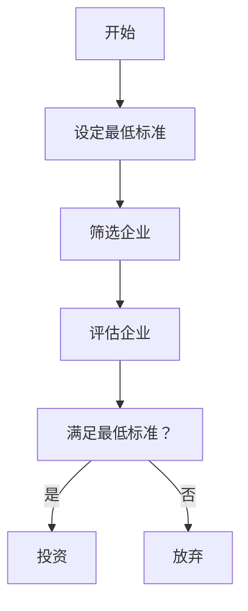
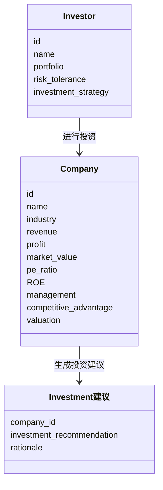

                 


# 芒格的"最低标准"原则在选股中的应用

## 关键词：芒格，投资原则，选股，最低标准，风险管理，价值投资，投资策略

## 摘要：芒格的"最低标准"原则是投资领域的重要理论，本文将详细探讨该原则在选股中的应用，从理论基础到实际操作，结合算法原理和数学模型，分析其在投资决策中的作用，并通过案例和系统设计展示其实际应用。

---

# 第一部分: 芒格的"最低标准"原则背景与基础

## 第1章: 芒格的生平与投资理念

### 1.1 芒格的早年经历

- **芒格的早年经历**：芒格出生于美国奥马哈，年轻时对投资产生了浓厚兴趣，通过自学掌握了大量投资知识。
- **芒格与巴菲特的合作**：芒格与巴菲特的合作始于1957年，两人共同创立了伯克希尔哈撒韦公司，芒格负责公司的投资决策。
- **芒格的投资哲学**：芒格强调价值投资，认为市场先生是疯狂的，投资者应关注企业的内在价值。

### 1.2 芒格的投资理念

- **价值投资**：芒格认为投资的本质是寻找具有持续竞争优势的企业，并以合理的价格买入。
- **多元思维模型**：芒格提倡投资者应具备跨学科的知识，以全面评估企业的价值。
- **风险管理**：芒格强调风险管理的重要性，认为避免重大损失是投资成功的关键。

## 第2章: "最低标准"原则的定义与核心要素

### 2.1 "最低标准"原则的定义

- **定义**："最低标准"原则是指在投资决策中，设定一系列最低标准，只有当企业满足这些标准时，才考虑投资。

### 2.2 "最低标准"原则的核心要素

- **企业基本面**：包括企业的盈利能力、财务状况、行业地位等。
- **管理层素质**：管理层是否具备诚信、能力。
- **竞争优势**：企业是否有独特的竞争优势。
- **估值合理**：企业估值是否低于其内在价值。

### 2.3 "最低标准"原则的适用范围

- **选股**：用于筛选具备长期投资价值的企业。
- **风险控制**：通过设定最低标准，避免投资于高风险企业。

---

# 第二部分: "最低标准"原则的核心概念与联系

## 第3章: "最低标准"原则的核心原理

### 3.1 "最低标准"原则的理论基础

- **经济学基础**：基于微观经济学和宏观经济学的基本原理。
- **投资学基础**：包括资产定价、市场效率等理论。
- **心理学基础**：考虑投资者的心理行为对市场的影响。

### 3.2 "最低标准"原则的数学模型

- **数学模型的构建**：将企业基本面指标转化为数学公式，例如ROE（净资产收益率）= 净利润 / 平均股东权益。
- **数学模型的验证**：通过历史数据验证模型的有效性。
- **数学模型的应用**：将模型应用于实际选股中，筛选满足最低标准的企业。

## 第4章: "最低标准"原则的核心概念对比

### 4.1 对比维度

| 对比维度 | "最低标准"原则 | 其他投资原则 |
|----------|----------------|--------------|
| 核心要素 | 企业基本面、管理层素质、竞争优势、估值合理 | 技术分析、市场情绪、短期趋势 |
| 适用范围 | 选股、风险控制 | 短期交易、高频交易 |

### 4.2 ER实体关系图

```mermaid
erDiagram
    company {
        id
        name
        industry
        revenue
        profit
        market_value
        pe_ratio
       ROE
        management
        competitive_advantage
        valuation
    }
    investor {
        id
        name
        portfolio
        risk_tolerance
        investment_strategy
    }
    company <-o[投资] investor
```

---

# 第三部分: "最低标准"原则的算法原理与数学模型

## 第5章: "最低标准"原则的算法原理

### 5.1 算法原理的



---

# 第四部分: 系统分析与架构设计

## 第6章: 系统分析与架构设计

### 6.1 项目介绍

- **项目名称**：基于"最低标准"原则的选股系统。
- **项目目标**：开发一个能够自动筛选满足"最低标准"原则的企业，并生成投资建议的系统。

### 6.2 功能设计



### 6.3 系统架构设计


---

# 第五部分: 项目实战

## 第7章: 项目实战

### 7.1 环境安装

- **Python环境**：安装Python 3.8及以上版本。
- **相关库的安装**：安装pandas、numpy、scikit-learn等库。

### 7.2 核心实现

```python
import pandas as pd

def calculate_ROE(profit, equity):
    return profit / equity

def is_qualify(company_data, min_ROE=0.1, min_profit=1000000):
    return company_data['ROE'] >= min_ROE and company_data['profit'] >= min_profit

# 示例数据
data = {
    'company': ['公司A', '公司B', '公司C'],
    'ROE': [0.15, 0.08, 0.2],
    'profit': [2000000, 800000, 1500000]
}

df = pd.DataFrame(data)

# 筛选满足最低标准的企业
qualified = df[df.apply(lambda x: is_qualify(x, min_ROE=0.1, min_profit=1000000), axis=1)]

print("满足最低标准的企业：")
print(qualified)
```

### 7.3 代码应用解读与分析

- **代码功能**：上述代码通过定义ROE和利润的最低标准，筛选出满足条件的企业。
- **实际案例分析**：假设我们有三家企业，通过代码筛选出ROE >= 10%且利润 >= 100万元的企业。

### 7.4 项目小结

- **总结**：通过代码实现，我们可以快速筛选出满足"最低标准"原则的企业，提高选股效率。

---

# 第六部分: 最佳实践与总结

## 第8章: 最佳实践与总结

### 8.1 最佳实践 tips

- **长期投资**：芒格强调长期投资，避免频繁交易。
- **持续学习**：保持对市场的学习和理解，更新投资策略。
- **风险管理**：设定止损点，避免重大损失。

### 8.2 小结

- **总结**：芒格的"最低标准"原则为投资者提供了一种系统化的选股方法，通过设定最低标准，筛选出具有长期投资价值的企业。

### 8.3 注意事项

- **避免短期波动**：短期市场波动可能影响股价，但不应影响长期投资决策。
- **定期调整**：定期审视投资组合，根据企业基本面变化进行调整。
- **分散投资**：避免将所有资金投入单一行业或企业，分散投资以降低风险。

### 8.4 拓展阅读

- **芒格的其他投资原则**：进一步阅读芒格的其他投资原则，如“格雷厄姆的烟屁股”理论。
- **投资心理学**：了解投资者心理对市场的影响，避免情绪化决策。

---

# 作者

作者：AI天才研究院/AI Genius Institute & 禅与计算机程序设计艺术 /Zen And The Art of Computer Programming

