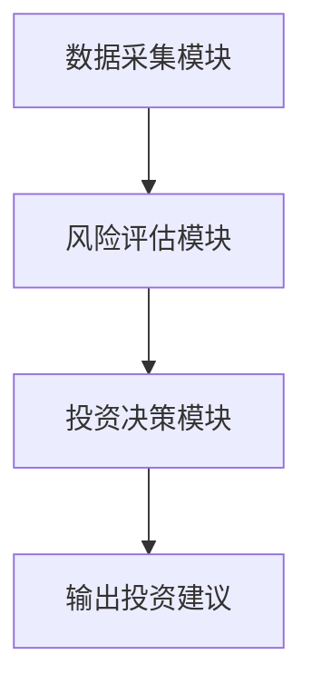

                 


# 芒格的"极端后果"思维在气候适应性技术投资中的应用

## 关键词：芒格思维，气候适应性技术，投资决策，风险管理，系统架构

## 摘要：
本文探讨了芒格的"极端后果"思维在气候适应性技术投资中的应用。通过分析极端天气事件的潜在影响，结合数学模型和系统架构设计，提供了一种稳健的投资决策方法，帮助投资者在应对气候变化的技术选择中规避风险，实现可持续发展。

---

## 第一部分：芒格的"极端后果"思维与气候适应性技术投资背景

### 第1章：芒格"极端后果"思维概述

#### 1.1 芒格"极端后果"思维的定义与核心要素

芒格的"极端后果"思维是一种在决策过程中考虑最坏情况的思维方式。其核心在于通过预估极端可能的后果，来制定更为稳健的投资策略。这种思维要求投资者在决策时，不仅要考虑常规情况，还要评估在极端条件下的潜在损失或收益。

**关键要素：**

1. **极端情况识别**：识别可能发生的极端天气事件，如洪水、干旱、飓风等。
2. **后果评估**：分析这些极端事件对投资项目的影响，包括经济损失和技术失效的可能性。
3. **决策优化**：基于评估结果，优化投资策略，选择能够在极端情况下表现最佳的技术方案。

#### 1.2 气候适应性技术的基本概念

气候适应性技术是指能够帮助人类应对和减轻气候变化影响的技术，包括可再生能源、节能技术、气候监测系统等。这些技术在减少碳排放、提高资源利用效率、保护生态环境等方面发挥着重要作用。

**核心特征：**

1. **可持续性**：技术在设计和运行过程中具有低环境影响。
2. **适应性**：能够适应不同气候条件和极端天气事件。
3. **经济性**：具备较高的成本效益比，能够在经济上承受极端后果的影响。

#### 1.3 芒格思维与气候适应性技术投资的联系

将芒格的"极端后果"思维应用于气候适应性技术投资，可以帮助投资者在面对极端天气事件时做出更稳健的决策。通过评估不同技术在极端情况下的表现，投资者可以选择更具抗风险能力的技术方案，从而降低投资风险，提高投资回报。

---

## 第二部分：核心概念与联系

### 第2章：极端后果思维在气候投资中的应用

#### 2.1 极端后果思维在气候投资中的核心原理

极端后果思维要求投资者在决策时考虑最坏情况下的后果，包括技术失效、市场崩盘、政策变化等。在气候适应性技术投资中，这具体表现为评估极端天气事件对技术运行的影响，以及这些影响对投资收益的潜在冲击。

#### 2.2 气候适应性技术分类与特性

气候适应性技术可以分为以下几类：

1. **可再生能源技术**：如太阳能、风能，能够在极端天气条件下提供稳定的能源供应。
2. **节能技术**：通过提高能源使用效率，减少碳排放。
3. **气候变化监测系统**：用于实时监测气候变化，提供预警信息。

#### 2.3 极端后果思维与气候适应性技术的关系

极端后果思维通过评估极端天气事件对技术的影响，帮助投资者选择能够在这些极端情况下表现最佳的技术方案。这种思维方式强调预防性投资，避免因极端事件导致的重大损失。

---

## 第三部分：数学模型与算法

### 第3章：基于极端后果思维的气候投资评估模型

#### 3.1 风险评估矩阵

为了评估极端天气事件对气候适应性技术的影响，可以建立一个风险评估矩阵，包括以下因素：

1. **事件发生的概率**：通过历史数据分析确定极端天气事件的发生概率。
2. **潜在影响程度**：评估事件对技术运行和投资收益的具体影响。
3. **应对措施的有效性**：评估采取的应对措施在极端情况下的有效性。

#### 3.2 数学模型构建

基于上述因素，可以构建一个数学模型，用于评估不同技术在极端情况下的投资风险。模型公式如下：

$$
R = \sum_{i=1}^{n} p_i \times I_i \times (1 - e_i)
$$

其中，$R$ 表示总风险，$p_i$ 表示第 $i$ 个极端事件发生的概率，$I_i$ 表示该事件对投资的影响程度，$e_i$ 表示应对措施的有效性。

#### 3.3 算法实现

通过上述模型，可以实现对不同技术投资风险的量化评估。投资者可以根据评估结果，选择风险最低的技术方案进行投资。

---

## 第四部分：系统分析与架构设计

### 第4章：气候适应性技术投资的系统架构

#### 4.1 系统功能设计

为了实现基于极端后果思维的气候适应性技术投资决策，可以设计一个功能完善的系统架构，包括以下几个模块：

1. **数据采集模块**：实时采集气候数据和市场信息。
2. **风险评估模块**：基于历史数据和数学模型，评估极端天气事件对技术投资的影响。
3. **投资决策模块**：根据评估结果，制定最优投资策略。

#### 4.2 系统架构设计

以下是系统的架构设计图，展示了各模块之间的交互关系：



#### 4.3 接口设计与交互流程

系统各模块之间的接口设计需要确保数据的高效传递和模块的协同工作。例如，数据采集模块通过API接口将数据传递给风险评估模块，风险评估模块通过计算模型生成评估结果，并传递给投资决策模块，最终生成投资建议。

---

## 第五部分：项目实战

### 第5章：基于极端后果思维的气候适应性技术投资实战

#### 5.1 项目背景介绍

假设我们计划投资于一种新型太阳能发电技术。为了确保投资的稳健性，我们需要评估该技术在极端天气条件下的表现。

#### 5.2 环境安装与数据采集

首先，需要在项目现场安装气象监测设备，实时采集气候数据，包括温度、湿度、风速等。

#### 5.3 核心代码实现

基于采集的数据，运行风险评估模型，评估极端天气事件对太阳能发电技术的影响。

代码示例：

```python
import numpy as np
import pandas as pd

# 假设数据为极端天气事件发生的概率和影响程度
prob = np.array([0.05, 0.1, 0.15])
impact = np.array([0.2, 0.3, 0.4])
effectiveness = np.array([0.8, 0.9, 0.7])

# 计算总风险
total_risk = np.sum(prob * impact * (1 - effectiveness))
print("Total Risk:", total_risk)
```

#### 5.4 案例分析与结果解读

通过运行代码，我们可以得出该太阳能发电技术在极端天气条件下的总风险。根据计算结果，我们可以评估该技术是否具备足够的抗风险能力。

---

## 第六部分：总结与展望

### 第6章：总结与展望

#### 6.1 总结

通过本文的分析，我们得出结论：将芒格的"极端后果"思维应用于气候适应性技术投资中，可以帮助投资者在极端天气事件中做出更稳健的决策，降低投资风险，提高投资回报。

#### 6.2 未来展望

未来，随着气候变化的加剧，极端天气事件的发生频率和强度可能会进一步增加。因此，我们需要进一步优化数学模型，提高评估精度，并探索更多适应性技术，以应对更加复杂的气候挑战。

---

## 作者：AI天才研究院 & 禅与计算机程序设计艺术

---

通过以上结构，本文系统地探讨了芒格的"极端后果"思维在气候适应性技术投资中的应用，从理论分析到实际案例，为投资者提供了切实可行的指导。

