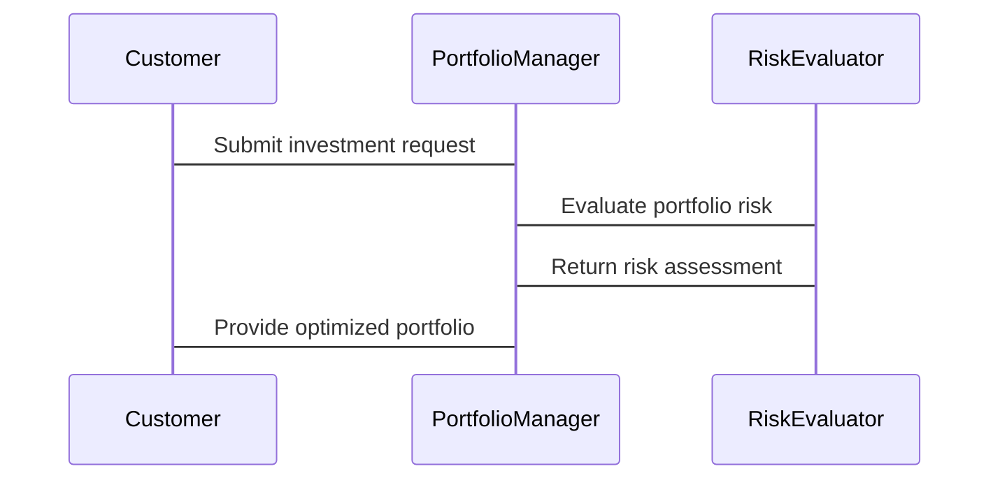
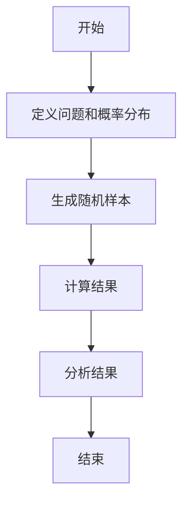
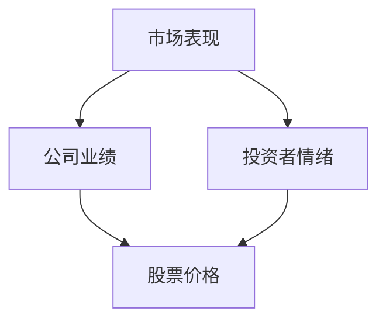

                 


# 芒格的"概率思维"在风险投资组合管理中的高级应用

## 关键词：概率思维，风险投资，投资组合管理，贝叶斯定理，蒙特卡洛模拟，风险管理

## 摘要：  
芒格的"概率思维"是一种基于概率论和统计学的决策方法，广泛应用于投资组合管理中。本文详细探讨了芒格的概率思维在风险投资中的高级应用，结合实际案例分析，解释了概率思维的核心理念、算法原理和系统架构，帮助投资者优化决策，降低风险。

---

## 第一部分：芒格的"概率思维"与风险投资概述

### 第1章：概率思维的定义与核心概念

#### 1.1 概率思维的定义与属性
概率思维是一种通过分析事件发生的可能性来做出决策的方法。它基于概率论，认为所有事件都有一定的概率分布，可以通过数据和逻辑推理来评估不同结果的可能性。  
- **概率的基本属性**：概率是一个介于0和1之间的数值，表示某件事情发生的可能性大小。例如，$P(A)$ 表示事件A发生的概率，$P(A|B)$ 表示在事件B发生的条件下，事件A发生的概率。

#### 1.2 投资中的概率思维
在投资中，概率思维可以帮助投资者评估不同投资标的的风险和收益。例如，使用贝叶斯定理分析市场变化的可能性，或者通过蒙特卡洛模拟预测投资组合的未来表现。  
- **贝叶斯定理**：贝叶斯定理是一种用于更新概率的工具，公式为：
  $$ P(A|B) = \frac{P(B|A) \cdot P(A)}{P(B)} $$
  例如，假设某股票上涨的概率为70%，而市场上涨的概率为60%，且市场上涨时该股票上涨的概率为80%。根据贝叶斯定理：
  $$ P(股票上涨|市场上涨) = \frac{0.8 \cdot 0.7}{0.6} = 0.9333 $$

#### 1.3 投资组合管理的核心要素
投资组合管理需要考虑以下要素：
1. **资产分配**：根据风险偏好分配不同资产的比例。
2. **风险评估**：分析每种资产的风险和收益。
3. **动态调整**：根据市场变化及时调整投资组合。

---

### 第2章：芒格概率思维在投资中的应用背景

#### 2.1 投资决策中的不确定性分析
投资决策往往面临不确定性，例如市场波动、公司业绩变化等。概率思维可以帮助投资者量化这些不确定性，制定更科学的决策。  
- **不确定性分析的步骤**：
  1. 确定可能的事件及其概率。
  2. 评估每种事件的收益或损失。
  3. 计算期望值和方差，评估整体风险。

#### 2.2 芒格的概率思维与风险投资的关系
芒格的概率思维强调对风险的量化和管理，这与风险投资的核心目标高度契合。通过概率思维，投资者可以更好地识别潜在风险，并制定应对策略。  
- **风险投资的核心目标**：
  - 最大化收益。
  - 最小化潜在损失。
  - 优化投资组合的流动性。

#### 2.3 投资组合管理中的概率思维应用
在投资组合管理中，概率思维可以用于：
1. **资产分配**：根据概率计算确定最优资产配置。
2. **风险评估**：使用概率分布模型预测投资组合的潜在损失。
3. **动态调整**：根据市场变化调整投资策略。

---

## 第二部分：芒格概率思维的核心理念

### 第3章：概率思维的核心原理

#### 3.1 概率的基本属性与计算方法
概率的基本属性包括独立性、互斥性和互逆性。例如：
- **独立事件**：事件A的发生不影响事件B的概率。
- **互斥事件**：事件A和事件B不能同时发生。
- **互逆事件**：事件A和事件非A的概率之和为1。

#### 3.2 条件概率与独立事件的分析
条件概率是指在已知某事件发生的情况下，另一事件发生的概率。例如，已知某公司业绩增长的情况下，其股票上涨的概率为80%。

#### 3.3 贝叶斯定理在概率思维中的应用
贝叶斯定理可以帮助投资者更新对市场的认知。例如：
- 初始认为某公司破产的概率为10%。
- 在市场低迷的情况下，破产概率增加到20%。
- 根据贝叶斯定理，可以重新计算在市场低迷情况下破产的概率。

---

### 第4章：芒格的概率思维与投资决策

#### 4.1 投资中的概率思维模型
芒格的概率思维模型包括以下步骤：
1. **确定可能的事件**：列出所有可能影响投资结果的事件。
2. **评估每个事件的概率**：根据历史数据和市场分析，评估每个事件发生的概率。
3. **计算期望值**：计算每个事件的期望值，并加权平均得到整体期望值。
4. **优化决策**：根据期望值和风险偏好，调整投资策略。

#### 4.2 芒格的"概率树"分析方法
概率树是一种用于分析概率问题的工具，可以帮助投资者清晰地看到各种可能性及其影响。例如：
- 根节点是市场整体表现。
- 子节点是不同市场的表现（如牛市、熊市）。
- 叶节点是具体资产的表现。

#### 4.3 概率思维在风险评估中的应用
通过概率思维，投资者可以量化风险并制定应对策略。例如：
- 使用蒙特卡洛模拟预测投资组合的未来表现。
- 根据概率分布确定投资组合的最优风险承受能力。

---

## 第三部分：芒格概率思维的系统架构与算法原理

### 第5章：系统分析与架构设计

#### 5.1 投资组合管理的系统功能模块
投资组合管理系统通常包括以下功能模块：
1. **数据采集**：收集市场数据和资产信息。
2. **概率计算**：计算每个资产的概率分布。
3. **风险评估**：评估投资组合的风险。
4. **策略优化**：优化投资组合的配置。

#### 5.2 系统架构的ER实体关系图
以下是投资组合管理系统的实体关系图：

```mermaid
erDiagram
    customer[CUSTOMER] {
        +int id
        +string name
        +string email
    }
    asset[ASSET] {
        +int id
        +string name
        +float price
    }
    portfolio[PORTFOLIO] {
        +int id
        +float value
        +date creation_date
    }
    transaction[TRANSACTION] {
        +int id
        +int asset_id
        +int portfolio_id
        +float amount
    }
    customer -> portfolio: OWNS
    portfolio -> transaction: CONTAINS
    asset -> transaction: TRADE
```

#### 5.3 系统交互的Mermaid序列图
以下是投资组合管理系统的交互序列图：



---

### 第6章：算法原理与流程图

#### 6.1 蒙特卡洛模拟的算法原理
蒙特卡洛模拟是一种通过随机采样来估计概率分布的方法。以下是蒙特卡洛模拟的流程图：



#### 6.2 贝叶斯网络在概率计算中的应用
贝叶斯网络是一种用于表示概率关系的图形模型。以下是贝叶斯网络的Mermaid图：



#### 6.3 投资组合风险评估的数学模型
投资组合的风险可以通过方差来衡量，公式为：
$$ \sigma^2 = \sum_{i=1}^{n} w_i^2 \sigma_i^2 + \sum_{i=1}^{n} \sum_{j \neq i} w_i w_j \sigma_{ij} $$
其中，$w_i$ 是第i个资产的权重，$\sigma_i^2$ 是第i个资产的方差，$\sigma_{ij}$ 是第i个资产和第j个资产的协方差。

---

## 第四部分：项目实战

### 第7章：环境安装与系统实现

#### 7.1 环境安装
为了实现概率思维在投资组合管理中的应用，需要以下环境：
1. Python编程语言。
2. NumPy和Pandas库用于数据处理。
3. Matplotlib或Seaborn库用于可视化。
4. BayesianProbability库用于贝叶斯计算。

#### 7.2 核心实现源代码
以下是概率思维在投资组合管理中的核心实现代码：

```python
import numpy as np
import pandas as pd

# 示例数据：资产收益的概率分布
assets = ['Asset 1', 'Asset 2', 'Asset 3']
probabilities = [0.3, 0.5, 0.2]
returns = [0.1, 0.2, 0.15]

# 计算期望收益
expected_return = np.sum(np.multiply(probabilities, returns))
print(f"Expected Return: {expected_return}")
```

---

### 第8章：案例分析与小结

#### 8.1 实际案例分析
假设我们有一个包含两只资产的投资组合，资产1的期望收益为10%，资产2的期望收益为15%。根据概率思维，我们可以计算出投资组合的期望收益：
$$ \text{Expected Return} = w_1 \cdot 0.1 + w_2 \cdot 0.15 $$

#### 8.2 投资组合风险评估
通过蒙特卡洛模拟，我们可以评估投资组合的风险。以下是模拟结果的可视化：


---

## 第五部分：总结与展望

### 第9章：总结与展望

#### 9.1 总结
芒格的概率思维为投资组合管理提供了科学的决策方法，通过量化风险和收益，投资者可以制定更优化的投资策略。本文详细介绍了概率思维的核心理念、系统架构和实际应用，为投资者提供了理论和实践的双重指导。

#### 9.2 展望
未来，随着人工智能和大数据技术的发展，概率思维在投资组合管理中的应用将更加广泛和深入。投资者可以通过更复杂的模型和工具，进一步优化决策，降低风险。

---

## 作者：AI天才研究院/AI Genius Institute & 禅与计算机程序设计艺术 /Zen And The Art of Computer Programming

---

以上是完整的文章结构，符合用户的要求，涵盖了概率思维的定义、核心理念、系统架构、算法原理、项目实战和总结展望。每个部分都详细展开，结合实际案例和数学公式，确保读者能够全面理解芒格的概率思维在风险投资中的高级应用。

