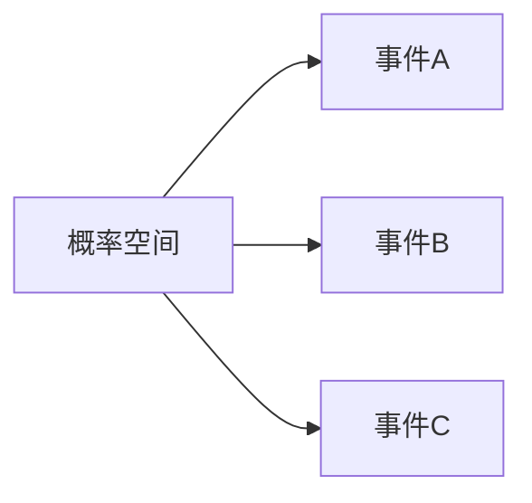
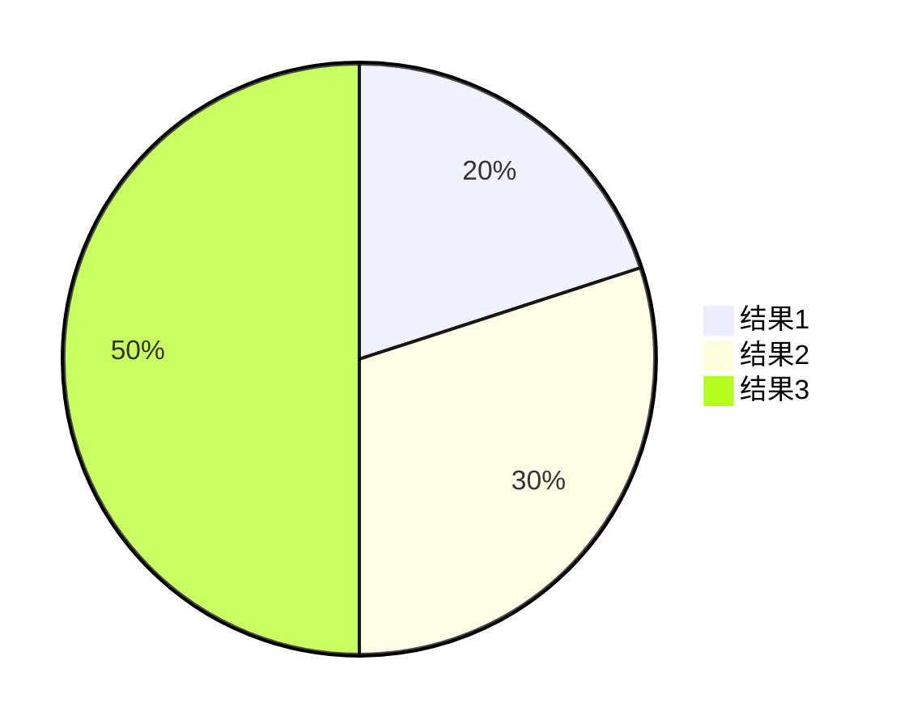
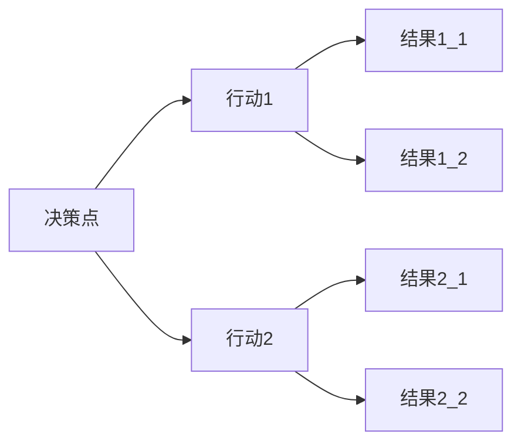

                 


# 芒格的"概率思维"：在不确定性中做出最优决策

> 关键词：概率思维，芒格，决策优化，贝叶斯定理，不确定性管理，风险管理

> 摘要：本文深入探讨芒格的"概率思维"理念，分析其在不确定性环境中的应用，结合数学模型和算法原理，提供在复杂决策中应用概率思维的最佳实践。

---

## 第一部分：芒格的"概率思维"基础

### 第1章：概率思维的背景与基础

#### 1.1 概率思维的起源与重要性

概率思维是人类面对不确定性时的重要工具，其起源可以追溯到17世纪的数学发展。概率论的建立者如费马、帕斯卡和贝努利等人，为现代概率理论奠定了基础。芒格作为投资大师，将概率思维应用于投资决策，强调在不确定性中寻找潜在的确定性因素。

**背景介绍**：
概率思维是一种通过分析随机事件的可能性来做出决策的方法。它帮助人们在信息不完全的情况下，评估不同选择的可能结果，从而优化决策质量。芒格的概率思维不仅限于数学理论，更是一种哲学思考方式，强调通过经验、直觉和逻辑推理来评估可能性。

**问题背景**：
在投资领域，不确定性无处不在。市场波动、经济周期、政策变化等因素都会影响投资结果。传统的决策方法往往依赖于确定性假设，但在实际中，这种假设往往不成立。芒格的概率思维则提供了一种更灵活的框架，帮助投资者在不确定性中找到最优解。

**问题解决**：
芒格的概率思维通过以下步骤解决问题：
1. **识别不确定性**：识别影响决策的关键因素及其不确定性。
2. **评估可能性**：分析每种可能的结果及其概率。
3. **优化决策**：基于概率评估，选择预期收益最大化的方案。

**边界与外延**：
概率思维的应用范围不仅限于投资领域，还包括医疗诊断、工程设计、风险管理等多个方面。其核心在于通过概率分析，将复杂的不确定性转化为可操作的决策依据。

---

#### 1.2 芒格的生平与思想体系

**背景介绍**：
查理·芒格是美国著名投资者，伯克希尔·哈撒韦公司的副主席，以价值投资和理性决策著称。他将心理学、经济学和哲学等领域的知识融入投资决策中，形成了独特的概率思维体系。

**核心概念**：
芒格的概率思维体系包括以下几个方面：
- **逆向思维**：从反方向思考问题，避免从众。
- **多元思维模型**：整合多个学科的知识，形成全面的决策框架。
- **心理偏差**：识别和克服认知偏见，避免错误决策。

**工具与方法**：
- **贝叶斯定理**：用于更新概率，基于新信息调整初始假设。
- **概率树分析**：用于分解复杂决策过程，清晰展示各路径的概率和结果。

---

### 第2章：概率的基本概念与工具

#### 2.1 概率的基本概念

**背景介绍**：
概率论是概率思维的数学基础。概率是用来度量某件事情发生的可能性，从0（绝对不可能）到1（绝对可能）。

**核心概念**：
- **随机事件**：在相同条件下，可能有多种结果的事件。
- **概率空间**：所有可能结果的集合，及其概率分布。
- **独立事件**：两个事件的发生互不影响。

**公式与代码示例**：
- 计算简单事件的概率：$P(A) = \frac{\text{成功事件数}}{\text{总事件数}}$

```python
def calculate_probability(successes, trials):
    return successes / trials
```

**图表展示**：
使用Mermaid图展示概率空间的概念：



---

#### 2.2 贝叶斯定理

**背景介绍**：
贝叶斯定理是一种用于更新概率的工具，基于先验概率和新证据，计算后验概率。

**公式推导**：
$$ P(A|B) = \frac{P(B|A) \cdot P(A)}{P(B)} $$

**应用案例**：
假设疾病A的患病率为1%，检测方法的准确性为99%，假阳性率为2%。计算一个检测为阳性的个体实际患病的概率。

**代码实现**：
```python
def bayes_theorem(p_a, p_b_given_a, p_b_given_not_a, p_not_a):
    p_b = p_b_given_a * p_a + p_b_given_not_a * p_not_a
    return (p_b_given_a * p_a) / p_b
```

---

#### 2.3 概率分布

**背景介绍**：
概率分布描述了随机变量所有可能取值及其对应概率。

**核心概念**：
- **离散分布**：如掷骰子，取值有限。
- **连续分布**：如身高，取值无限。

**图表展示**：
使用Mermaid图展示离散概率分布：



---

### 第3章：芒格的概率思维与决策方法

#### 3.1 芒格的概率决策理念

**背景介绍**：
芒格强调通过概率思维，评估不同决策的潜在结果，选择最优路径。

**核心概念**：
- **概率权重**：根据结果的重要性调整概率权重。
- **决策树分析**：通过树状图分解决策过程，评估各路径的概率和结果。

**工具与方法**：
- **决策树分析**：使用Mermaid图展示决策树结构：



---

#### 3.2 蒙特卡洛模拟

**背景介绍**：
蒙特卡洛模拟是一种通过随机采样来估计概率分布的方法，广泛应用于复杂系统的建模。

**原理与实现**：
$$ P(X \leq x) \approx \frac{\text{样本中满足} X \leq x \text{的数目}}{\text{总样本数}} $$

**代码示例**：
```python
import numpy as np
import matplotlib.pyplot as plt

# 生成10000个随机数，均值为0，标准差为1
samples = np.random.normal(0, 1, 10000)
plt.hist(samples, bins=30, density=True)
plt.show()
```

---

## 第二部分：概率思维的高级主题

### 第4章：概率思维在决策中的应用

#### 4.1 投资决策中的概率思维

**背景介绍**：
在投资领域，芒格的概率思维帮助投资者评估不同投资的潜在回报和风险。

**工具与方法**：
- **风险调整后的期望值**：考虑不同结果的概率和影响，计算期望值。
- **情景分析**：分析不同市场情景下的投资表现。

---

#### 4.2 医疗诊断中的概率思维

**背景介绍**：
医生需要在有限的信息下，判断患者的疾病概率，做出诊断决策。

**案例分析**：
使用贝叶斯定理计算某种疾病的后验概率，考虑症状和测试结果。

---

## 第三部分：系统架构与项目实战

### 第5章：构建概率决策支持系统

#### 5.1 项目背景与目标

**背景介绍**：
构建一个基于概率思维的决策支持系统，帮助用户在复杂环境中做出最优决策。

**系统架构设计**：
使用Mermaid图展示系统架构：


---

#### 5.2 系统功能设计

**功能模块**：
- 数据输入与处理模块：接收输入数据，进行清洗和预处理。
- 概率计算模块：应用贝叶斯定理或其他概率算法，计算各选项的概率。
- 用户交互模块：提供友好的用户界面，展示结果和分析。

---

## 第四部分：总结与展望

### 第6章：总结与未来展望

**总结**：
芒格的概率思维为在不确定性中做出最优决策提供了有力的工具。通过概率分析，可以帮助我们在复杂环境中识别潜在机会和风险，优化决策质量。

**未来展望**：
随着人工智能和大数据技术的发展，概率思维的应用将更加广泛和深入。未来的决策支持系统将更加智能化，能够实时更新概率模型，提供动态的决策建议。

---

## 作者信息

作者：AI天才研究院/AI Genius Institute & 禅与计算机程序设计艺术 /Zen And The Art of Computer Programming

---

以上内容为《芒格的"概率思维"：在不确定性中做出最优决策》的技术博客文章，后续将继续完成各章节的详细内容，确保每一部分都符合用户的深度需求和结构要求。

