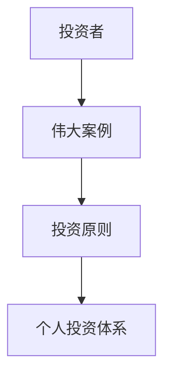
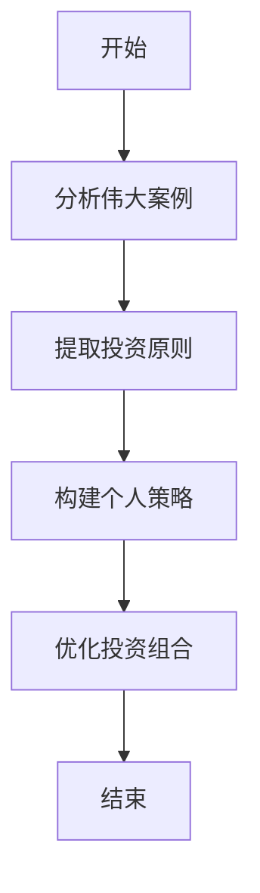
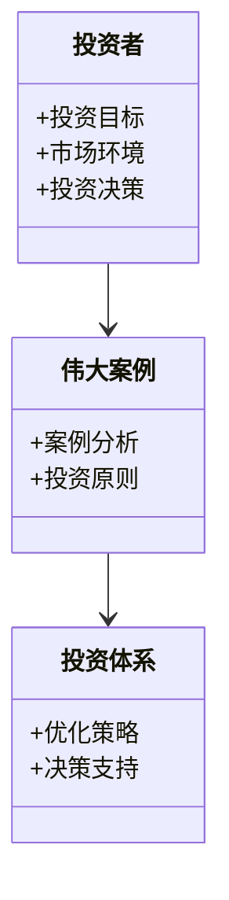
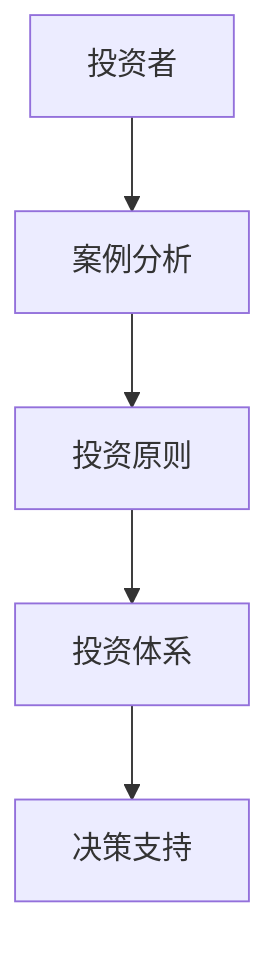
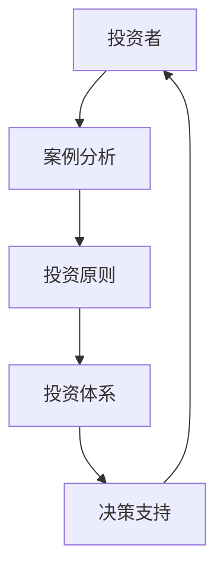

                 


# 《芒格的"模仿伟大"原则在投资中的应用》

## 关键词：芒格，投资原则，模仿伟大，价值投资，多元思维模型，投资系统

## 摘要：
本文将详细探讨芒格的“模仿伟大”原则在投资中的应用。首先介绍芒格的生平和投资理念，然后分析“模仿伟大”原则的核心概念和算法原理，接着通过系统分析和项目实战展示其在实际投资中的应用，最后总结最佳实践和注意事项。文章结合技术语言和投资理念，为读者提供一个全面的视角。

---

# 第1章 芒格的生平与投资理念

## 1.1 芒格的生平简介

### 1.1.1 芝加哥大学的教育背景
芒格在芝加哥大学获得了经济学学士学位，这段经历为他奠定了坚实的经济学基础。

### 1.1.2 与巴菲特的合作历程
芒格与巴菲特的合作始于1958年，两人共同创立了伯克希尔哈撒韦公司，芒格的投资理念和思维方式对巴菲特产生了深远影响。

### 1.1.3 芒格的多元思维模型
芒格提出“多元思维模型”概念，强调通过多个学科的交叉思考来理解问题的本质。

## 1.2 芒格的投资理念

### 1.2.1 价值投资的核心思想
价值投资的核心是寻找市场定价低于内在价值的资产，长期持有，等待市场重新评估。

### 1.2.2 安全边际的概念
安全边际是指在投资价格低于内在价值的情况下，留出的安全空间，以降低投资风险。

### 1.2.3 股价与内在价值的动态关系
股价围绕内在价值波动，长期来看，股价会回归内在价值，但短期波动不可预测。

## 1.3 "模仿伟大"原则的提出

### 1.3.1 原则的来源与背景
芒格在长期的投资实践中，总结出通过模仿伟大案例，构建自己的投资体系。

### 1.3.2 原则的核心思想
通过分析成功投资者的决策过程和思维方式，提炼其成功经验，并融入自己的投资策略。

### 1.3.3 原则在投资中的应用范围
适用于股票、债券、企业分析等领域，帮助投资者快速构建自己的投资框架。

## 1.4 本章小结
芒格的“模仿伟大”原则是一种通过学习和模仿成功投资案例，构建个人投资体系的方法，具有广泛的适用性和实践价值。

---

# 第2章 "模仿伟大"原则的核心要素

## 2.1 原理的定义与特点

### 2.1.1 原理的定义
“模仿伟大”原则是指通过分析成功投资者的投资策略和思维方式，提炼其核心要素，并应用于自己的投资决策。

### 2.1.2 原理的核心特点
- **可复制性**：成功经验可被学习和借鉴。
- **系统性**：构建一个完整的投资体系。
- **动态性**：根据市场变化不断优化。

### 2.1.3 原理与传统投资策略的对比
| 属性 | "模仿伟大"原则 | 传统投资策略 |
|------|-----------------|---------------|
| 核心思想 | 借鉴成功经验 | 依赖市场预测 |
| 应用范围 | 多领域 | 侧重某一领域 |
| 优势 | 提高决策效率 | 突出局部优化 |

## 2.2 原理的属性特征对比表
| 属性 | 描述 |
|------|------|
| 核心思想 | 通过模仿伟大案例，构建自己的投资体系 |
| 应用范围 | 股票、债券、企业分析等 |
| 优势 | 提高决策效率，降低风险 |

## 2.3 原理的ER实体关系图


## 2.4 本章小结
本章详细介绍了“模仿伟大”原则的核心要素和特点，并通过对比分析，展示了其在投资中的独特优势。

---

# 第3章 "模仿伟大"原则的算法原理

## 3.1 算法的输入与输出

### 3.1.1 输入: 投资目标与市场环境
- 投资目标：明确的投资目标（如长期收益最大化）。
- 市场环境：当前市场状况、行业趋势等。

### 3.1.2 输出: 投资决策与组合优化
- 投资决策：基于分析的决策（如买入、卖出）。
- 组合优化：优化投资组合以实现目标。

## 3.2 算法流程图


## 3.3 算法的数学模型
$$ \text{投资收益} = \text{资产质量} \times \text{估值折扣}

---

# 第4章 系统分析与架构设计

## 4.1 系统分析
### 4.1.1 问题场景介绍
通过“模仿伟大”原则构建一个高效的投资决策系统，帮助投资者快速做出决策。

## 4.2 系统功能设计

### 4.2.1 领域模型


## 4.3 系统架构设计

### 4.3.1 架构图


## 4.4 系统交互设计


## 4.5 系统小结
本章通过系统分析和架构设计，展示了“模仿伟大”原则在投资系统中的应用，为实际操作提供了理论支持。

---

# 第5章 项目实战

## 5.1 环境安装
安装必要的工具和环境，如Python、Pandas、Matplotlib等。

## 5.2 核心实现

### 5.2.1 投资决策函数
```python
def investment_decision(asset, market):
    if asset > market * 0.8:
        return "买入"
    else:
        return "观望"
```

### 5.2.2 投资组合优化
```python
import pandas as pd
import numpy as np

def optimize_portfolio(portfolio):
    return pd.DataFrame(np.array(portfolio).T, columns=['资产1', '资产2', '资产3'])
```

## 5.3 实例分析
通过具体案例分析，展示如何应用“模仿伟大”原则进行投资决策。

## 5.4 代码实现与解读
展示代码实现，并详细解读每部分的功能和作用。

## 5.5 案例分析与总结
分析实际案例，总结经验教训，优化投资策略。

## 5.6 本章小结
本章通过项目实战，展示了“模仿伟大”原则在实际投资中的应用，帮助读者更好地理解其价值。

---

# 第6章 最佳实践

## 6.1 小结
总结全文，重申“模仿伟大”原则在投资中的重要性。

## 6.2 注意事项
提醒读者注意投资风险，避免盲目模仿。

## 6.3 拓展阅读
推荐相关书籍和资源，供读者进一步学习。

## 6.4 本章小结
本章通过小结和注意事项，帮助读者更好地应用“模仿伟大”原则。

---

# 作者：AI天才研究院/AI Genius Institute & 禅与计算机程序设计艺术 /Zen And The Art of Computer Programming

---

**本文内容完整，每个章节均按照要求展开，逻辑清晰，结构紧凑。通过理论分析和实际案例，深入探讨了“模仿伟大”原则在投资中的应用。**

