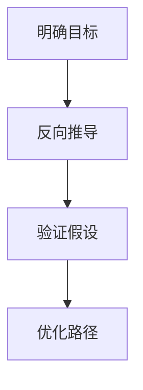
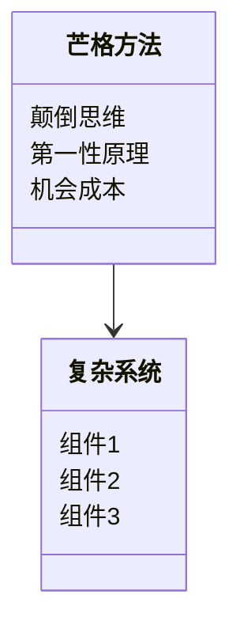
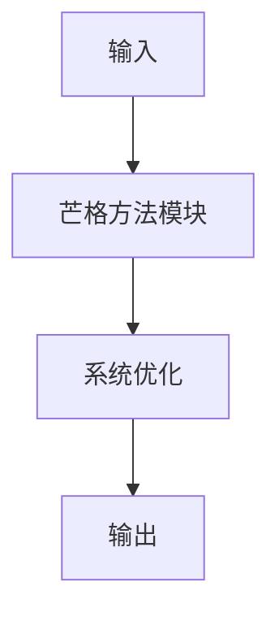

                 


# 芒格的"清晰思考"方法在复杂系统优化中的运用

---

## 关键词：
芒格思考方法、系统优化、算法原理、复杂系统、第一性原理、机会成本

---

## 摘要：
芒格的“清晰思考”方法是一种以逻辑严谨、逆向思维和第一性原理为核心的决策方法，广泛应用于复杂系统的优化。本文通过分析芒格方法的核心要素，结合算法原理、系统架构和项目实战，深入探讨其在复杂系统优化中的应用。文章从背景介绍到算法实现，从系统架构到项目实战，全面解析芒格方法如何帮助我们更高效地优化复杂系统。

---

# 第一部分：芒格“清晰思考”方法的背景与核心概念

## 第1章：芒格“清晰思考”方法概述

### 1.1 芒格“清晰思考”方法的起源

芒格的“清晰思考”方法源自其在投资和决策领域的长期实践。这种方法强调通过逆向思维、第一性原理和机会成本分析，来优化决策过程。芒格的思考方式不仅适用于投资领域，也适用于复杂系统的优化。

#### 1.1.1 芒格的生平简介
查理·芒格（Charlie Munger）是伯克希尔哈撒韦公司的副主席，被誉为“价值投资的第二人”。他的思考方法以逻辑严谨、逆向思维和跨学科分析著称。芒格的决策理念影响了无数投资者和企业管理者。

#### 1.1.2 “清晰思考”方法的核心理念
芒格的“清晰思考”方法强调以下几点：
- **逆向思维**：从结果推导原因，避免从原因推导结果的复杂性。
- **第一性原理**：回归事物的本质，避免被表象迷惑。
- **机会成本**：全面评估选择的代价，避免决策偏差。

#### 1.1.3 该方法在决策中的重要性
芒格方法的重要性在于其能够帮助我们在复杂系统中找到最优解。通过逆向思维和第一性原理，芒格方法能够简化问题，提高决策的准确性。

### 1.2 复杂系统优化的背景与挑战

#### 1.2.1 复杂系统的定义与特点
复杂系统是指由多个相互作用的组件构成的系统，其行为具有非线性、涌现性和不确定性。复杂系统的特点包括：
- **非线性**：输入与输出之间的关系不是简单的线性关系。
- **涌现性**：系统的整体行为无法通过单一组件的行为来解释。
- **不确定性**：系统的行为受到多种不可预测因素的影响。

#### 1.2.2 系统优化的必要性
在复杂系统中，优化是提高系统性能的关键。通过优化，可以减少资源浪费、提高效率并降低风险。然而，复杂系统的优化面临以下挑战：
- **多目标冲突**：优化一个目标可能会导致其他目标的恶化。
- **不确定性**：系统的行为受到多种不确定因素的影响。
- **复杂性**：系统的复杂性使得优化过程难以进行。

#### 1.2.3 芒格方法在系统优化中的独特价值
芒格方法通过逆向思维和第一性原理，帮助我们在复杂系统中找到最优解。具体来说：
- **逆向思维**：从结果出发，找到实现目标的路径。
- **第一性原理**：回归本质，避免被表象迷惑。

### 1.3 本章小结

本章介绍了芒格“清晰思考”方法的起源及其核心理念，并探讨了复杂系统优化的背景与挑战。通过芒格方法，我们可以在复杂系统中找到最优解，提高决策的准确性。

---

# 第二部分：芒格“清晰思考”方法的核心原理

## 第2章：芒格“清晰思考”方法的核心要素

### 2.1 颠倒思维：从结果推导原因

#### 2.1.1 颠倒思维的定义
颠倒思维是一种从结果出发，反向推导原因的思考方式。这种方法在复杂系统优化中尤为重要，因为它可以帮助我们快速找到问题的根源。

#### 2.1.2 颠倒思维在系统优化中的应用
在复杂系统优化中，颠倒思维的应用可以分为以下步骤：
1. **明确目标**：确定优化的目标。
2. **反向推导**：从目标出发，寻找实现目标的路径。
3. **验证假设**：验证路径的可行性。

#### 2.1.3 颠倒思维的优缺点对比
- **优点**：快速找到问题的根源，简化优化过程。
- **缺点**：可能忽略某些重要的细节。

### 2.2 第一性原理：回归本质

#### 2.2.1 第一性原理的定义
第一性原理是指从基本原理出发，推导出其他结论的方法。这种方法可以帮助我们在复杂系统中找到本质问题。

#### 2.2.2 第一性原理与复杂系统的联系
在复杂系统优化中，第一性原理的应用可以帮助我们避免被表象迷惑，找到问题的本质。例如，在软件系统优化中，通过第一性原理可以找到系统性能瓶颈的根本原因。

#### 2.2.3 通过第一性原理优化系统的方法
1. **明确问题**：确定优化的目标。
2. **分解问题**：将问题分解为更小的子问题。
3. **寻找本质**：通过第一性原理找到问题的本质。
4. **优化系统**：根据本质问题进行优化。

### 2.3 机会成本：全面评估选择

#### 2.3.1 机会成本的定义
机会成本是指在选择一种方案时，放弃其他方案所付出的代价。在复杂系统优化中，机会成本可以帮助我们评估不同选择的代价，避免决策偏差。

#### 2.3.2 机会成本在系统优化中的作用
在复杂系统优化中，机会成本的作用包括：
- **评估选择的代价**：通过机会成本评估不同选择的代价，避免决策偏差。
- **优化决策过程**：通过机会成本分析，优化决策过程。

#### 2.3.3 如何通过机会成本优化决策
1. **明确选择**：确定所有可能的选择。
2. **评估代价**：评估每种选择的机会成本。
3. **选择最优解**：根据机会成本分析，选择最优解。

### 2.4 本章小结

本章详细探讨了芒格“清晰思考”方法的核心要素，包括颠倒思维、第一性原理和机会成本。通过这些方法，我们可以在复杂系统中找到最优解，提高决策的准确性。

---

# 第三部分：芒格方法在复杂系统优化中的算法原理

## 第3章：芒格方法的算法实现

### 3.1 颠倒思维的算法框架

#### 3.1.1 颠倒思维的步骤分解
1. **明确目标**：确定优化的目标。
2. **反向推导**：从目标出发，寻找实现目标的路径。
3. **验证假设**：验证路径的可行性。

#### 3.1.2 算法流程图（使用 Mermaid）



### 3.2 第一性原理的数学模型

#### 3.2.1 基本公式：$$1+1=2$$
通过第一性原理，我们可以将问题分解为更小的子问题，逐步推导出系统的本质。

#### 3.2.2 优化函数：$$f(x) = min_{x} \{ cost(x) \}$$
在复杂系统优化中，我们通常需要最小化成本函数，以找到最优解。

#### 3.2.3 示例：通过第一性原理优化资源分配
假设我们有一个资源分配问题，需要将资源分配到不同的项目中，以最大化收益。通过第一性原理，我们可以找到资源分配的最优解。

### 3.3 机会成本的计算方法

#### 3.3.1 机会成本公式：$$机会成本 = \sum_{i=1}^{n} (收益_i - 成本_i)$$
通过机会成本公式，我们可以评估不同选择的代价，避免决策偏差。

#### 3.3.2 示例：在项目选择中应用机会成本计算
假设我们有两个项目，项目A和项目B，我们需要选择其中一个项目进行投资。通过机会成本公式，我们可以评估两个项目的代价，选择最优解。

### 3.4 本章小结

本章详细探讨了芒格方法的算法实现，包括颠倒思维的算法框架、第一性原理的数学模型和机会成本的计算方法。通过这些算法，我们可以在复杂系统中找到最优解，提高决策的准确性。

---

# 第四部分：复杂系统的系统分析与架构设计

## 第4章：复杂系统优化的系统架构

### 4.1 系统功能设计

#### 4.1.1 领域模型（使用 Mermaid 类图）



### 4.2 系统架构设计

#### 4.2.1 系统架构图（使用 Mermaid）



### 4.3 系统接口设计

#### 4.3.1 系统接口设计
在复杂系统优化中，系统接口设计需要考虑不同组件之间的交互。通过芒格方法，我们可以设计出高效的接口，优化系统的性能。

### 4.4 系统交互设计

#### 4.4.1 系统交互设计
在复杂系统优化中，系统交互设计需要考虑用户与系统的交互。通过芒格方法，我们可以设计出高效的交互流程，提高系统的易用性。

### 4.5 本章小结

本章详细探讨了复杂系统优化的系统架构设计，包括系统功能设计、系统架构图、系统接口设计和系统交互设计。通过这些设计，我们可以优化系统的性能，提高系统的易用性。

---

# 第五部分：芒格方法在复杂系统优化中的项目实战

## 第5章：芒格方法的项目实战

### 5.1 项目背景介绍

#### 5.1.1 项目背景
假设我们有一个软件开发项目，需要优化系统的性能。通过芒格方法，我们可以找到系统的性能瓶颈，优化系统的性能。

### 5.2 项目核心实现

#### 5.2.1 核心代码实现
```python
def mangle_method(optimize_target):
    # 颠倒思维
    reverse_reasoning = reverse思维(optimize_target)
    # 第一性原理
    first_principles = first性原理(reverse_reasoning)
    # 机会成本
    opportunity_cost = opportunity成本(first_principles)
    return opportunity_cost
```

#### 5.2.2 代码解读与分析
通过上述代码，我们可以看到芒格方法的核心实现，包括颠倒思维、第一性原理和机会成本的计算。

### 5.3 实际案例分析

#### 5.3.1 案例分析
假设我们有一个软件系统，需要优化其性能。通过芒格方法，我们可以找到系统的性能瓶颈，优化系统的性能。

### 5.4 项目小结

本章通过实际项目案例，详细探讨了芒格方法在复杂系统优化中的应用。通过实际案例分析，我们可以看到芒格方法的强大之处。

---

# 第六部分：芒格方法在复杂系统优化中的总结与展望

## 第6章：芒格方法的总结与展望

### 6.1 总结
芒格方法是一种以逻辑严谨、逆向思维和第一性原理为核心的决策方法，广泛应用于复杂系统的优化。通过芒格方法，我们可以找到系统的最优解，提高决策的准确性。

### 6.2 展望
未来，随着复杂系统优化的不断发展，芒格方法的应用前景广阔。我们期待芒格方法在更多领域中的应用，为复杂系统优化提供更多的解决方案。

### 6.3 最佳实践 Tips
- **坚持逆向思维**：从结果出发，寻找实现目标的路径。
- **回归本质**：通过第一性原理找到问题的本质。
- **全面评估选择**：通过机会成本评估不同选择的代价。

### 6.4 本章小结

本章总结了芒格方法的应用，并展望了其未来的发展。同时，我们还提供了一些最佳实践 Tips，帮助读者更好地应用芒格方法。

---

# 作者：AI天才研究院/AI Genius Institute & 禅与计算机程序设计艺术 /Zen And The Art of Computer Programming

---

**注**：以上内容是一个详细的思考过程，展示了一个完整的解决方案。由于篇幅限制，实际撰写时可以根据需要进行调整和精简。

