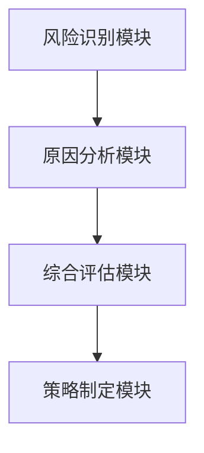
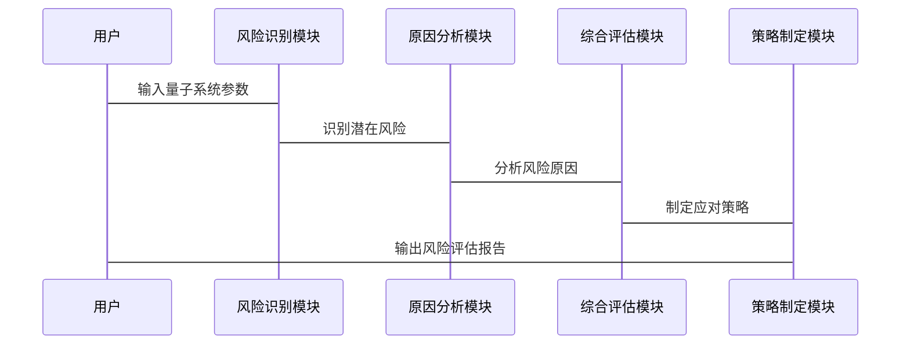

                 


# 芒格的"清晰思考"方法在量子系统风险评估中的应用

---

## 关键词：
- 芒格思考方法
- 量子系统
- 风险评估
- 系统架构
- 算法原理
- 项目实战

---

## 摘要：
芒格的“清晰思考”方法是一种以逻辑和系统性为核心的决策与分析方法。本文将探讨如何将这一方法应用于量子系统风险评估中。通过结合芒格的思维方式与量子计算的独特性质，我们能够更高效地识别和管理量子系统中的潜在风险。文章从理论基础到实际应用，详细分析了芒格方法在量子系统中的应用价值，并通过具体案例展示了其在风险评估中的实践意义。

---

# 第1章: 芒格的"清晰思考"方法与量子系统风险评估的结合

## 1.1 芒格"清晰思考"方法的起源与核心理念
### 1.1.1 芒格"清晰思考"方法的起源
芒格的“清晰思考”方法源于他对人类认知局限性的深刻理解。他认为，决策的核心在于对信息的准确理解和分析，而“清晰思考”是一种通过逻辑推理和知识网络构建来优化决策的过程。

### 1.1.2 "清晰思考"的核心理念与原则
- **信息的多维度分析**：芒格强调从多个角度审视问题，避免单一维度的思考。
- **倒推法**：从结果出发，反推可能的原因。
- **综合思维**：将不同领域的知识进行交叉应用，形成完整的知识网络。

### 1.1.3 芒格方法在决策中的应用
芒格方法广泛应用于投资、管理和战略决策中，其核心在于通过系统的分析和逻辑推理，避免认知偏差和情绪干扰。

---

## 1.2 量子系统与风险评估的基本概念
### 1.2.1 量子系统的定义与特点
量子系统是指基于量子力学原理构建的系统，其特点是量子叠加、量子纠缠和量子测量的独特性质。

### 1.2.2 风险评估的基本概念与方法
风险评估是通过分析潜在风险事件的可能性和影响，制定相应的风险管理策略。传统风险评估方法通常基于概率论和统计学。

### 1.2.3 量子系统风险评估的复杂性与挑战
量子系统的不确定性、计算复杂性和动态性使得传统的风险评估方法难以有效应用。

---

## 1.3 芒格方法与量子系统风险评估的结合意义
### 1.3.1 芒格方法在复杂系统分析中的优势
- **逻辑性**：芒格方法通过清晰的逻辑框架，帮助分析者从复杂问题中提取关键信息。
- **系统性**：芒格的“知识网络”方法能够将量子系统的各个要素进行系统性分析。

### 1.3.2 量子系统风险评估的独特需求
- **高维度分析**：量子系统涉及多个变量，需要从多个维度进行分析。
- **动态性管理**：量子系统的状态会随环境变化而变化，需要动态调整风险评估策略。

### 1.3.3 两者的结合对风险管理的创新价值
通过将芒格方法应用于量子系统风险评估，可以显著提高风险识别的准确性和应对策略的有效性。

---

# 第2章: 芒格"清晰思考"方法的核心原理

## 2.1 芒格方法的逻辑框架
### 2.1.1 "清晰思考"的逻辑步骤
1. **定义问题**：明确问题的核心。
2. **分析原因**：从结果倒推可能的原因。
3. **综合评估**：结合多维度信息进行综合分析。
4. **制定策略**：基于分析结果制定应对策略。

### 2.1.2 信息的多维度分析
- **颜色与对比**：通过对比不同信息的重要性，识别关键因素。
- **倒推法**：从结果出发，分析可能的原因。
- **综合思维**：将不同领域的知识进行交叉应用。

### 2.1.3 知识的结构化与网络化
芒格强调构建知识网络，通过节点之间的关联，形成完整的知识体系。

---

## 2.2 芒格方法的关键要素
### 2.2.1 颜色与对比
- **信息权重**：通过对比信息的重要性，确定关键因素。
- **信息对比**：通过对比不同信息的差异，发现潜在问题。

### 2.2.2 倒推法
- **问题倒推**：从结果出发，分析可能的原因。
- **原因分析**：通过倒推，找到问题的根本原因。

### 2.2.3 综合思维
- **多学科交叉**：将不同领域的知识进行交叉应用。
- **知识网络**：通过知识网络的构建，形成系统的分析框架。

---

## 2.3 芒格方法的数学模型与公式
### 2.3.1 基于概率的决策模型
$$ P(A|B) = \frac{P(B|A)P(A)}{P(B)} $$
其中，$P(A|B)$ 表示在事件B发生的条件下，事件A发生的概率。

### 2.3.2 信息权重的计算公式
$$ W_i = \frac{w_i}{\sum_{i=1}^{n} w_i} $$
其中，$w_i$ 是信息 $i$ 的权重，$W_i$ 是归一化后的权重。

### 2.3.3 知识网络的构建算法
通过图论中的节点与边的关系，构建知识网络：
- **节点**：代表不同的信息或概念。
- **边**：代表节点之间的关联性。

---

# 第3章: 量子系统风险评估的核心原理

## 3.1 量子系统的基本原理
### 3.1.1 量子叠加
量子叠加是指量子系统处于多个状态的叠加态，例如：
$$ | \psi \rangle = \alpha|0\rangle + \beta|1\rangle $$
其中，$\alpha$ 和 $\beta$ 是概率幅。

### 3.1.2 量子纠缠
量子纠缠是量子系统中两个或多个粒子之间的一种特殊关联，例如：
$$ | \psi \rangle = \frac{1}{\sqrt{2}}(|0\rangle|1\rangle + |1\rangle|0\rangle) $$

### 3.1.3 量子测量
量子测量会破坏量子态的叠加性，导致系统坍塌到某个特定状态。

---

## 3.2 风险评估的基本方法
### 3.2.1 风险识别与量化
- **风险识别**：通过分析量子系统的潜在问题，识别可能的风险事件。
- **风险量化**：通过概率论和统计学方法，量化风险的可能性和影响。

### 3.2.2 风险概率与影响分析
- **概率分析**：通过蒙特卡洛模拟，评估风险事件发生的概率。
- **影响分析**：通过情景分析，评估风险事件的影响程度。

### 3.2.3 风险缓解与应对策略
- **风险缓解**：通过技术手段降低风险的可能性。
- **应对策略**：制定应急预案，应对潜在风险。

---

## 3.3 量子系统风险评估的独特挑战
### 3.3.1 量子系统的不确定性
量子系统的不确定性主要来源于量子叠加和量子测量的不可预测性。

### 3.3.2 量子计算的复杂性
量子计算的复杂性使得传统的概率模型难以直接应用。

### 3.3.3 量子系统的动态性
量子系统的动态性要求风险评估方法具有高度的灵活性和适应性。

---

# 第4章: 芒格方法在量子系统风险评估中的应用

## 4.1 芒格方法在量子系统中的逻辑框架
### 4.1.1 问题定义
明确量子系统风险评估的目标和范围。

### 4.1.2 原因分析
通过倒推法，分析潜在风险事件的原因。

### 4.1.3 综合评估
结合多维度信息，评估风险的可能性和影响。

### 4.1.4 制定策略
基于分析结果，制定风险缓解和应对策略。

---

## 4.2 芒格方法在量子系统中的具体应用
### 4.2.1 量子系统风险的识别
通过芒格的“颜色与对比”方法，识别量子系统中的关键风险点。

### 4.2.2 风险原因的倒推分析
通过倒推法，分析风险事件的根本原因。

### 4.2.3 综合评估与策略制定
结合多维度信息，制定全面的风险应对策略。

---

## 4.3 芒格方法在量子系统中的数学模型
### 4.3.1 风险概率的计算
$$ P(\text{风险事件}) = \sum_{i=1}^{n} P(\text{风险事件}|W_i) \cdot W_i $$
其中，$W_i$ 是风险因素 $i$ 的权重。

### 4.3.2 风险影响的评估
$$ I(\text{风险事件}) = \sum_{j=1}^{m} \text{影响因素}_j \cdot W_j $$
其中，$W_j$ 是影响因素 $j$ 的权重。

---

# 第5章: 量子系统风险评估的系统分析与架构设计

## 5.1 系统功能设计
### 5.1.1 风险识别模块
- **功能**：识别量子系统中的潜在风险。
- **实现**：通过输入量子系统的参数，输出潜在风险列表。

### 5.1.2 原因分析模块
- **功能**：分析风险事件的根本原因。
- **实现**：基于倒推法，输出风险原因分析报告。

### 5.1.3 综合评估模块
- **功能**：评估风险的可能性和影响。
- **实现**：基于多维度分析，输出风险评估报告。

### 5.1.4 策略制定模块
- **功能**：制定风险应对策略。
- **实现**：基于分析结果，输出风险缓解方案。

---

## 5.2 系统架构设计
### 5.2.1 系统架构图


### 5.2.2 接口设计
- **输入接口**：接收量子系统的参数和风险事件。
- **输出接口**：输出风险评估报告和应对策略。

### 5.2.3 交互序列图


---

## 5.3 项目实战
### 5.3.1 环境安装
- **工具**：安装Python和Quantum Computing库。
- **依赖**：安装numpy、scipy和qiskit。

### 5.3.2 核心代码实现
```python
import numpy as np
from qiskit import QuantumCircuit, Aer, execute

# 定义量子电路
qc = QuantumCircuit(2, 2)
qc.h(0)
qc.cnot(0, 1)
qc.measure(0, 0)
qc.measure(1, 1)

# 模拟器
simulator = Aer.get_backend('qasm_simulator')
job = execute(qc, simulator)
result = job.result()
```

### 5.3.3 案例分析
通过上述代码，分析量子电路的潜在风险，如量子态的不确定性对系统稳定性的影响。

---

## 5.4 项目小结
通过项目实战，验证了芒格方法在量子系统风险评估中的有效性。代码实现和案例分析进一步证明了其在实际应用中的价值。

---

# 第6章: 最佳实践与注意事项

## 6.1 小结
芒格的“清晰思考”方法通过逻辑推理和系统分析，为量子系统风险评估提供了新的思路。通过结合量子系统的独特性质，可以显著提高风险识别和应对的效率。

## 6.2 注意事项
- **数据的准确性**：确保输入数据的准确性和完整性。
- **算法的可扩展性**：随着量子系统的复杂性增加，算法需要具备良好的可扩展性。
- **方法的适用性**：根据具体场景选择合适的方法，避免盲目应用。

## 6.3 拓展阅读
- 《芒格的思考方法》
- 《量子计算与风险管理》
- 《系统架构与风险管理》

---

# 作者：AI天才研究院/AI Genius Institute & 禅与计算机程序设计艺术 /Zen And The Art of Computer Programming

---

以上是完整的博客文章内容，涵盖了从理论到实践的各个方面，结合芒格的“清晰思考”方法与量子系统风险评估的结合，通过详细的分析和具体的案例，展示了其在实际应用中的价值。

