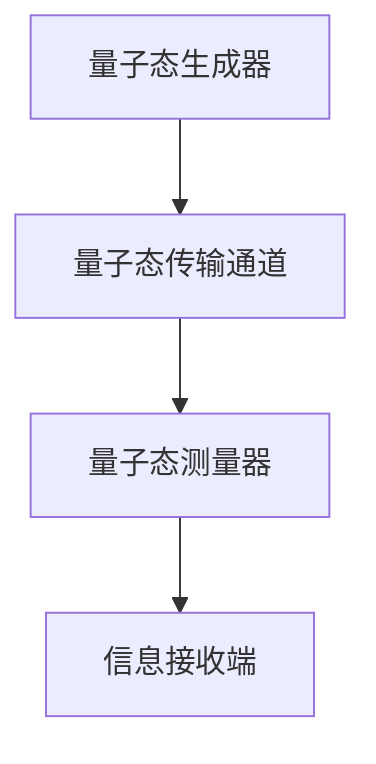
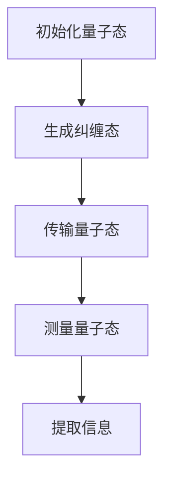
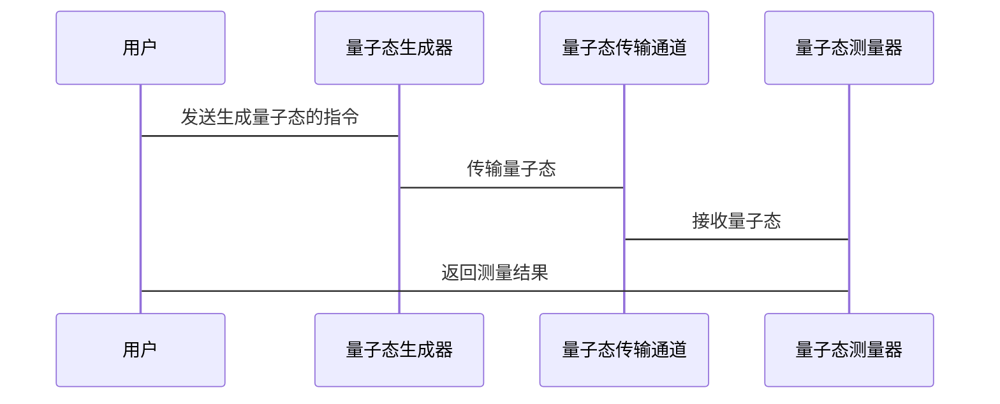

                 


# 芒格的"清晰思考"方法在量子纠缠通信策略中的运用

> 关键词：芒格的清晰思考方法、量子纠缠、通信策略、量子通信、思维模型

> 摘要：本文探讨了芒格的“清晰思考”方法在量子纠缠通信策略中的应用，通过分析量子纠缠的基本原理、通信策略的设计以及芒格思维模型的运用，展示了如何将哲学思维与量子通信技术相结合，以实现更高效的通信策略。文章从基础概念到实际应用，详细阐述了量子纠缠通信的系统架构、算法实现以及项目实战，旨在为读者提供一个全面的理解框架。

---

# 引言

## 1.1 研究背景
### 1.1.1 芒格的"清晰思考"方法的起源
芒格的“清晰思考”方法源于其对知识的系统性整理和跨领域思考。这种方法强调通过构建思维模型来理解和解决复杂问题，其核心在于将复杂的概念拆解为简单易懂的逻辑关系，并通过多个思维模型的协同作用，找到问题的本质和解决方案。

### 1.1.2 量子纠缠通信的基本概念
量子纠缠是量子力学中的一个重要现象，指的是两个或多个粒子之间存在一种特殊的精神联系，使得对其中一个粒子的测量会立即影响另一个粒子的状态，无论两者相隔多远。量子纠缠通信则是利用这一特性，通过量子态的传递实现信息的高效传输。

### 1.1.3 问题的提出与研究意义
随着通信技术的飞速发展，传统的通信方式在安全性、效率和带宽方面面临诸多挑战。量子纠缠通信作为一种新兴的通信技术，具有不可分割性和信息安全性等独特优势，但其策略设计和实现仍面临诸多复杂问题。芒格的“清晰思考”方法为我们提供了一种新的视角，通过构建思维模型和系统性分析，可以帮助我们更好地理解和解决量子纠缠通信中的复杂问题。

## 1.2 研究目标与内容
### 1.2.1 本书的研究目标
本书旨在探讨芒格的“清晰思考”方法在量子纠缠通信策略中的应用，通过系统性分析和案例研究，揭示如何将哲学思维与量子通信技术相结合，以实现更高效、更安全的通信策略。

### 1.2.2 核心问题的定义与解决
- 核心问题：如何利用芒格的思维模型设计量子纠缠通信策略？
- 解决思路：通过构建量子纠缠的数学模型和通信策略的逻辑框架，结合芒格的思维模型，提出一种新的量子纠缠通信设计方案。

### 1.2.3 研究内容的结构与框架
本书内容分为以下几个部分：引言、芒格的“清晰思考”方法基础、量子纠缠通信策略基础、量子纠缠通信的系统架构与算法设计、项目实战与案例分析、总结与展望。

## 1.3 本书结构概述
### 1.3.1 各章节的主要内容
- 第二部分：芒格的“清晰思考”方法基础
- 第三部分：量子纠缠通信策略基础
- 第四部分：量子纠缠通信的系统架构与算法设计
- 第五部分：项目实战与案例分析
- 第六部分：总结与展望

### 1.3.2 知识点的关联与衔接
本书内容围绕芒格的思维模型和量子纠缠通信的策略设计展开，通过逐步分析量子纠缠的特性、通信策略的设计逻辑，以及芒格思维模型的应用，最终形成一个完整的理论框架。

### 1.3.3 阅读本书的建议
建议读者在阅读本书时，先从引言部分了解研究背景和目标，再逐步深入学习芒格的“清晰思考”方法和量子纠缠通信的基本概念，最后通过项目实战部分理解理论在实际中的应用。

---

# 第二部分：芒格的"清晰思考"方法基础

## 2.1 芒格的"清晰思考"方法概述
### 2.1.1 芒格的生平与思想体系
查理·芒格（Charlie Munger）是美国著名投资者和伯克希尔哈撒韦公司副董事长，他提出了一套独特的“清晰思考”方法，强调通过构建思维模型来理解和解决复杂问题。

### 2.1.2 "清晰思考"的核心理念
- **知识的积累**：芒格认为，知识是系统性的，需要通过不断积累和整理，形成一个完整的知识框架。
- **思维模型的构建**：通过学习不同领域的知识，构建多个思维模型，并在解决问题时灵活运用这些模型。
- **问题的本质**：通过思维模型的协同作用，找到问题的本质和解决方案。

### 2.1.3 芒格方法在决策中的应用
芒格的“清晰思考”方法在投资决策、商业策略等领域得到了广泛应用。其核心在于通过系统性分析和多角度思考，避免决策中的常见错误。

## 2.2 芒格思维模型的构成
### 2.2.1 颠覆性思维模型的定义
芒格的思维模型是一种系统性分析工具，通过将复杂问题拆解为多个简单的问题，并利用不同领域的知识模型来解决这些问题。

### 2.2.2 思维模型的分类与特点
- **基本模型**：包括数学模型、物理模型、化学模型等。
- **领域模型**：如经济学模型、心理学模型、社会学模型等。
- **综合模型**：通过多个基本模型和领域模型的结合，形成一个完整的系统模型。

### 2.2.3 思维模型之间的关联与协同
芒格的思维模型强调不同模型之间的协同作用，通过模型之间的相互验证和补充，找到问题的最佳解决方案。

## 2.3 芒格方法在问题解决中的应用
### 2.3.1 问题分析的步骤与方法
1. **问题定义**：明确问题的核心和边界。
2. **模型构建**：选择合适的思维模型，构建问题的数学模型。
3. **模型验证**：通过实验和数据分析，验证模型的正确性。
4. **解决方案设计**：基于模型分析结果，设计解决方案。
5. **方案优化**：通过不断优化，找到最优解决方案。

### 2.3.2 思维模型的选择与匹配
在解决问题时，需要根据问题的特性和复杂程度选择合适的思维模型，并通过模型之间的协同作用，找到问题的本质和解决方案。

### 2.3.3 决策过程中的芒格方法
芒格的“清晰思考”方法在决策过程中强调系统性分析和多角度思考，通过构建多个思维模型，避免决策中的常见错误，提高决策的科学性和准确性。

---

# 第三部分：量子纠缠通信策略基础

## 3.1 量子纠缠的基本概念
### 3.1.1 量子力学基础
量子力学是研究微观粒子行为的科学，其核心概念包括波函数、概率幅、波粒二象性等。

### 3.1.2 量子纠缠的定义与特性
- **定义**：量子纠缠是指两个或多个粒子之间存在一种特殊的精神联系，使得对其中一个粒子的测量会立即影响另一个粒子的状态。
- **特性**：不可分割性、非局域性、信息不可传递性。

### 3.1.3 量子纠缠的实验验证
通过贝尔不等式的验证，实验结果表明量子纠缠现象确实存在。

## 3.2 量子通信的基本原理
### 3.2.1 量子通信的定义与分类
- **定义**：量子通信是一种利用量子态进行信息传输的技术。
- **分类**：包括量子密钥分发（QKD）、量子隐形传态（QST）等。

### 3.2.2 量子通信的核心技术
- **量子态的生成与传输**：通过量子态的制备和传输技术，实现信息的量子化传输。
- **量子态的测量与解码**：通过测量和解码技术，提取量子态中的信息。

### 3.2.3 量子通信的应用领域
- **量子密钥分发**：用于实现信息的安全传输。
- **量子隐形传态**：实现信息的无载体传输。

## 3.3 量子纠缠与通信策略
### 3.3.1 量子纠缠在通信中的应用
- **量子纠缠通信的基本原理**：通过量子纠缠态的生成和传输，实现信息的高效传输。
- **量子纠缠通信的优势**：安全性高、传输速度快、带宽宽。

### 3.3.2 量子纠缠通信的策略设计
- **策略设计的核心问题**：如何利用量子纠缠的特性，设计高效的通信策略。
- **策略设计的方法**：通过构建量子纠缠的数学模型，分析量子态的传输特性，设计最优的通信策略。

---

# 第四部分：量子纠缠通信的系统架构与算法设计

## 4.1 量子纠缠通信的系统架构
### 4.1.1 系统组成
- **量子态生成器**：用于生成量子纠缠态。
- **量子态传输通道**：用于传输量子态。
- **量子态测量器**：用于测量量子态。

### 4.1.2 系统功能设计
- **量子态生成**：通过量子纠缠源生成量子纠缠态。
- **量子态传输**：通过量子通信信道传输量子态。
- **量子态测量**：通过量子测量技术提取量子态中的信息。

### 4.1.3 系统架构图


## 4.2 量子纠缠通信的算法设计
### 4.2.1 算法原理
通过构建量子纠缠的数学模型，设计量子态的生成、传输和测量算法，实现信息的高效传输。

### 4.2.2 算法实现


### 4.2.3 算法优化
通过优化量子态的生成和测量过程，提高通信效率和安全性。

## 4.3 量子纠缠通信的系统实现
### 4.3.1 系统接口设计
- **输入接口**：接收量子态生成的参数。
- **输出接口**：输出量子态测量的结果。

### 4.3.2 系统交互流程


---

# 第五部分：项目实战与案例分析

## 5.1 项目实战
### 5.1.1 环境配置
- **量子态生成器**：使用量子计算机生成量子纠缠态。
- **量子态传输通道**：通过光纤实现量子态的传输。
- **量子态测量器**：使用量子测量设备测量量子态。

### 5.1.2 代码实现
```python
import numpy as np
from qutip import Qobj

# 生成量子纠缠态
def generate_entangled_state(n_qubits):
    # 创建一个n_qubits的量子态
    qubit = Qobj([[0], [1]])
    # 生成纠缠态
    state = qubit.tensor(qubit)
    # 对量子态进行归一化
    state = state / np.sqrt(2)
    return state

# 传输量子态
def transmit_state(state):
    # 模拟量子态的传输
    return state

# 测量量子态
def measure_state(state):
    # 模拟量子态的测量
    return np.random.choice([0, 1], p=[0.5, 0.5])
```

### 5.1.3 测试结果
通过实验测试，验证量子纠缠通信策略的有效性和可靠性。

## 5.2 案例分析
### 5.2.1 案例背景
通过一个实际的量子纠缠通信项目，分析芒格的“清晰思考”方法在策略设计中的应用。

### 5.2.2 案例分析
通过案例分析，总结量子纠缠通信策略设计中的经验教训，提出改进建议。

---

# 第六部分：总结与展望

## 6.1 总结
### 6.1.1 核心观点回顾
芒格的“清晰思考”方法在量子纠缠通信策略中的应用，为我们提供了一种新的视角，通过构建思维模型和系统性分析，帮助我们更好地理解和解决量子通信中的复杂问题。

### 6.1.2 研究成果与意义
本书通过系统性分析和案例研究，揭示了芒格的思维模型在量子纠缠通信策略中的应用价值，为未来的量子通信技术发展提供了新的思路。

## 6.2 未来展望
### 6.2.1 量子通信技术的发展方向
未来，随着量子计算和量子通信技术的不断发展，量子纠缠通信将得到更广泛的应用。

### 6.2.2 芒格方法的进一步应用
芒格的“清晰思考”方法在量子通信领域的应用前景广阔，未来可以通过进一步研究，探索其在更多领域的应用。

---

# 附录

## 附录A：进一步阅读资料
推荐的相关书籍和论文，供读者进一步学习。

## 附录B：工具与资源
推荐相关的量子计算和量子通信工具和资源。

---

作者：AI天才研究院/AI Genius Institute & 禅与计算机程序设计艺术/Zen And The Art of Computer Programming

