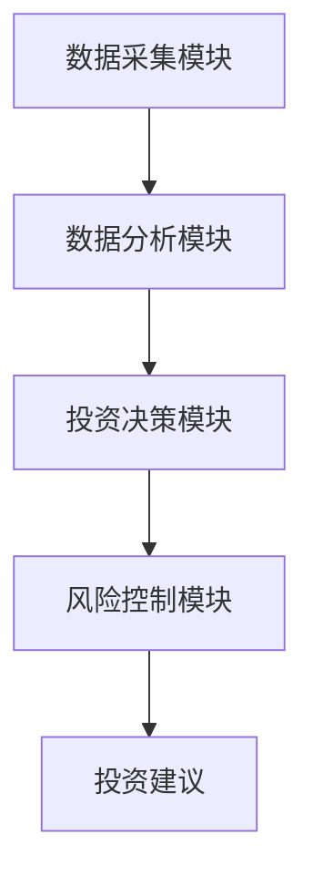

                 


# 芒格的"清晰思考"方法：提高投资决策的质量

> 关键词：芒格、清晰思考、投资决策、思维模型、系统分析、项目实战、风险控制

> 摘要：本文系统地介绍芒格的“清晰思考”方法，并探讨其在提高投资决策质量中的应用。通过逻辑推理、逆向思维和概率论等核心要素的分析，结合实际案例和系统架构设计，详细阐述如何利用“清晰思考”方法优化投资决策过程。文章最后结合项目实战，提供基于“清晰思考”的投资决策系统的实现方案。

---

## 第一部分: 引言

### 第1章: 芒格的“清晰思考”方法概述

#### 1.1 芒格的“清晰思考”方法的背景与重要性
##### 1.1.1 投资决策中的思维误区
在投资领域，许多投资者容易陷入情绪化决策、过度自信或忽略关键信息的误区。这些误区往往导致错误的投资决策，进而影响投资收益。芒格的“清晰思考”方法提供了一种系统化的思维方式，帮助投资者避免这些误区。

##### 1.1.2 “清晰思考”的核心理念
芒格强调，投资决策的质量取决于思考的清晰度。他提出的“清晰思考”方法包括逻辑推理、事实为基础的分析、逆向思维和概率论等核心要素，旨在帮助投资者更理性地看待问题。

##### 1.1.3 “清晰思考”在现代投资中的价值
在信息爆炸的时代，投资者需要一种高效的方法来处理海量信息。“清晰思考”方法通过简化问题、提炼关键因素，帮助投资者快速做出高质量的决策。

---

### 第2章: “清晰思考”方法的核心要素

#### 2.1 逻辑推理与事实基础
##### 2.1.1 逻辑推理的基本原则
逻辑推理是“清晰思考”的基石。芒格强调，思考必须基于事实，并遵循逻辑规律。例如，在分析一家公司的财务状况时，投资者需要通过逻辑推理，从财务报表中提取关键数据，分析其盈利能力和风险。

##### 2.1.2 基于事实的思考方式
事实是决策的基础。芒格提醒投资者，避免被情绪或市场炒作所左右，而是要基于企业的基本面进行分析。例如，在投资科技公司时，需要关注其研发投入、技术壁垒和市场前景等事实。

##### 2.1.3 逻辑推理在投资决策中的应用
通过逻辑推理，投资者可以识别潜在的风险和机会。例如，在分析一家公司的财务状况时，可以通过逻辑推理识别财务报表中的异常数据，进而判断公司是否存在财务造假的风险。

---

#### 2.2 逆向思维与第二层思维
##### 2.2.1 逆向思维的定义与特点
逆向思维是芒格提出的一种独特思维方式，即从结果出发，逆向推导可能的原因。例如，在投资股票时，可以从市场的未来价格走势出发，分析当前市场的估值是否合理。

##### 2.2.2 第二层思维的内涵
第二层思维是指在分析问题时，不仅要考虑表面现象，还要深入分析背后的原因。例如，在分析一家公司的盈利能力时，不仅要看其利润表，还要分析其收入来源和成本结构。

##### 2.2.3 逆向思维与第二层思维在投资中的应用
通过逆向思维和第二层思维，投资者可以更深入地理解市场的运作机制。例如，在分析行业趋势时，可以从行业的未来发展方向出发，反推当前的市场格局和竞争态势。

---

#### 2.3 概率论与风险控制
##### 2.3.1 概率论的基本原理
概率论是芒格思考中的另一个重要工具。他认为，任何投资决策都存在不确定性，而概率论可以帮助投资者量化这些不确定性。

##### 2.3.2 投资中的概率思维
在投资中，概率思维可以帮助投资者评估不同投资标的的风险和收益。例如，在分析一只股票时，可以通过概率论估算其未来价格波动的范围。

##### 2.3.3 风险控制与决策质量的关系
通过概率论，投资者可以制定更科学的风险控制策略。例如，在进行股票投资时，可以通过设定止损点来控制潜在的损失。

---

## 第二部分: 系统分析

### 第3章: 投资决策的系统架构

#### 3.1 问题场景介绍
投资决策是一个复杂的系统工程，涉及多个因素，如市场环境、企业基本面、宏观经济指标等。为了提高决策质量，需要构建一个系统的分析框架。

#### 3.2 系统功能设计
##### 3.2.1 领域模型
通过构建领域模型，可以将投资决策过程中的关键因素进行分类和整理。例如，可以将投资决策分为市场分析、企业分析和风险评估三个模块。

##### 3.2.2 实体关系图（ER图）
以下是投资决策系统中实体关系图的示例：

```mermaid
er
    actor 投资者
    actor 市场环境
    actor 企业基本面
    actor 风险评估
    
    投资者 --> 市场环境: 分析市场趋势
    投资者 --> 企业基本面: 分析企业财务状况
    投资者 --> 风险评估: 评估投资风险
```

#### 3.3 系统架构设计
##### 3.3.1 模块划分
投资决策系统可以划分为以下几个模块：
- 数据采集模块：收集市场数据、企业财务数据等。
- 数据分析模块：对数据进行清洗、整理和分析。
- 投资决策模块：基于分析结果，生成投资建议。
- 风险控制模块：评估投资方案的风险，并制定相应的控制策略。

##### 3.3.2 系统架构图
以下是投资决策系统的架构图：



---

### 第4章: 项目实战——基于“清晰思考”的投资决策系统

#### 4.1 环境安装与配置
##### 4.1.1 系统运行环境要求
建议在Python 3.8及以上版本环境中运行。

##### 4.1.2 开发工具安装与配置
需要安装以下工具：
- Python
- Jupyter Notebook
- Pandas
- NumPy
- Matplotlib

---

#### 4.2 系统核心实现源代码
##### 4.2.1 逻辑推理模块代码
```python
def logical_reasoning(data):
    # 逻辑推理过程
    result = data['revenue'] / data['cost'] > 0.5
    return result
```

##### 4.2.2 逆向思维与第二层思维模块代码
```python
def reverse_thinking(target):
    # 逆向思维过程
    cause = [x for x in data if x['result'] == target]
    return cause
```

##### 4.2.3 概率论与风险控制模块代码
```python
def probability_analysis(data):
    import numpy as np
    import pandas as pd
    # 计算概率分布
    probabilities = {}
    for outcome in data:
        probabilities[outcome] = probabilities.get(outcome, 0) + 1
    probabilities = {k: v/len(data) for k, v in probabilities.items()}
    return probabilities
```

---

#### 4.3 代码应用解读与分析
##### 4.3.1 代码功能分析
通过上述代码，可以实现逻辑推理、逆向思维和概率分析功能，帮助投资者做出更科学的投资决策。

##### 4.3.2 代码实现细节解读
- 逻辑推理模块：通过数据分析，判断企业的盈利能力是否超过行业平均水平。
- 逆向思维模块：从目标出发，寻找可能导致该结果的原因。
- 概率分析模块：计算不同投资标的概率分布，评估投资风险。

##### 4.3.3 代码优化与改进
可以根据具体需求，进一步优化代码性能，例如通过并行计算加速数据处理过程。

---

## 第三部分: 实际案例分析与详细讲解剖析

### 第5章: 案例分析与详细讲解

#### 5.1 案例背景介绍
假设我们有一个科技公司，其财务数据如下：
- 营业收入：100万元
- 成本：50万元
- 净利润：30万元

#### 5.2 案例分析与讲解
##### 5.2.1 逻辑推理与事实分析
通过逻辑推理，我们可以判断该公司的盈利能力较强，净利润率为30%。

##### 5.2.2 逆向思维与第二层思维
通过逆向思维，我们可以发现，该公司的高净利润可能得益于其高效的管理或较高的毛利率。

##### 5.2.3 概率论与风险控制
通过概率分析，我们可以估算该公司的股票价格波动范围，并制定相应的投资策略。

---

## 第四部分: 总结与展望

### 第6章: 总结与小结
通过本文的分析，我们可以看到，芒格的“清晰思考”方法为投资决策提供了一种系统化的思维方式。通过逻辑推理、逆向思维和概率论等工具，投资者可以更理性地看待问题，做出更高质量的决策。

### 第7章: 最佳实践 tips
- 始终基于事实进行思考，避免情绪化决策。
- 运用逆向思维和第二层思维，深入分析问题的本质。
- 利用概率论量化投资风险，制定科学的风险控制策略。

---

## 作者信息

作者：AI天才研究院/AI Genius Institute & 禅与计算机程序设计艺术 /Zen And The Art of Computer Programming

---

通过本文的系统分析和实际案例，我们展示了如何利用芒格的“清晰思考”方法优化投资决策过程。希望读者能够通过本文的指导，掌握这一方法，并在实际投资中取得更好的效果。

