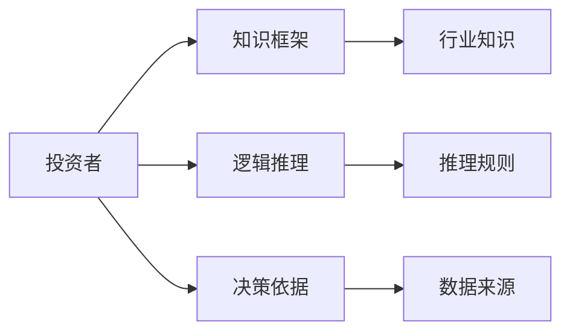
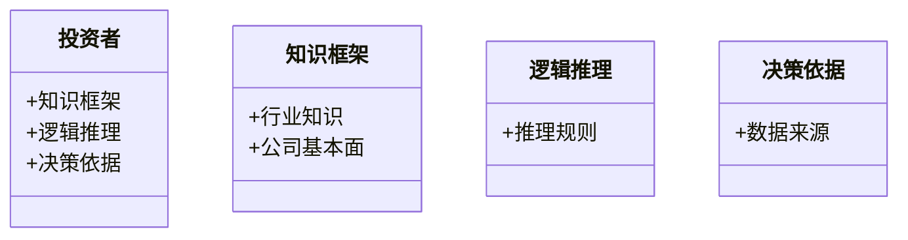
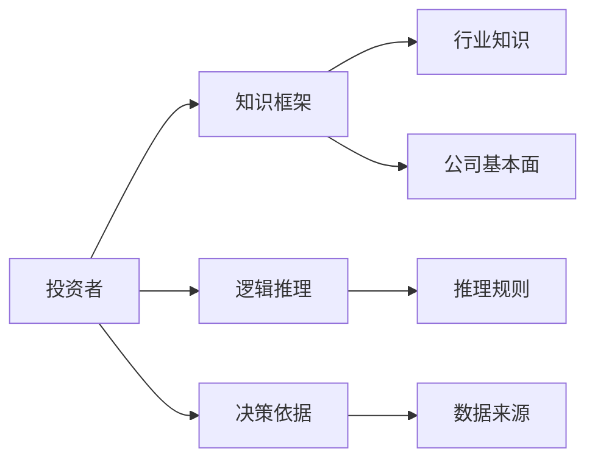
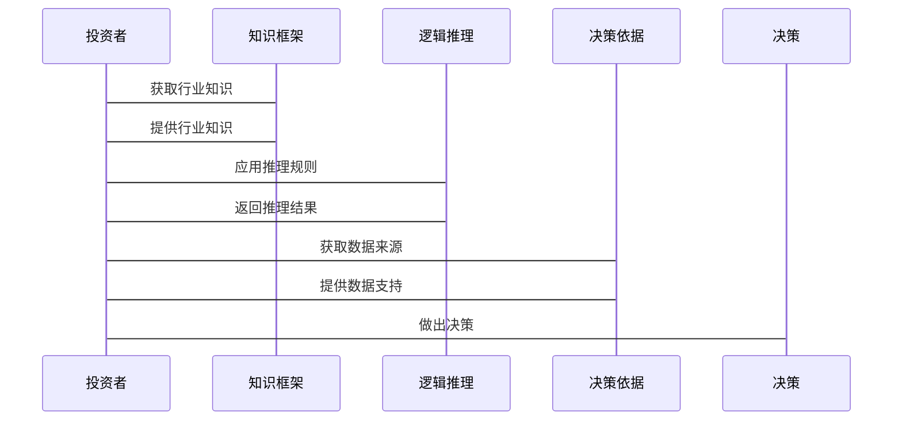

                 


# 芒格的"清晰思考"方法：提高投资决策的质量和速度

## 关键词：芒格，清晰思考，投资决策，逻辑推理，系统分析，决策框架

## 摘要：本文深入探讨了芒格的“清晰思考”方法，分析其如何帮助投资者提升决策质量与速度。通过构建知识框架、优化逻辑推理和强化决策依据，芒格的方法为投资决策提供了系统化的解决方案。

---

# 第1章: 芒格的"清晰思考"方法概述

## 1.1 芒格的生平与成就

### 1.1.1 芒格的早年经历
查理·芒格是投资界的一位传奇人物，他不仅是伯克希尔·哈撒韦公司的副主席，还是芒格投资理念的创始人。芒格早年毕业于哈佛大学，后来转向法律和投资领域，逐步发展出一套独特的投资哲学。

### 1.1.2 芒格与伯克希尔哈撒韦的成就
芒格与沃伦·巴菲特共同打造了伯克希尔·哈撒韦，使其成为全球最大的投资公司之一。芒格的“格栅理论”和“逆向思维”深刻影响了全球投资者。

### 1.1.3 芒格的哲学与投资理念
芒格的投资理念强调长期价值、安全边际和分散投资。他提倡通过构建知识框架来理解投资的本质，并通过清晰的逻辑推理做出决策。

## 1.2 "清晰思考"的核心理念

### 1.2.1 清晰思考的定义
清晰思考是指通过系统化的方法，构建知识框架，优化逻辑推理，并基于充分的证据做出决策。

### 1.2.2 清晰思考的关键要素
清晰思考的核心要素包括知识框架、逻辑推理和决策依据。

### 1.2.3 清晰思考与投资决策的关系
清晰思考是投资决策的基础，它帮助投资者避免常见错误，提高决策的准确性和速度。

## 1.3 为什么清晰思考对投资决策至关重要

### 1.3.1 投资决策中的常见问题
投资者常面临的问题包括信息过载、认知偏差和逻辑错误。

### 1.3.2 清晰思考如何解决这些问题
通过构建知识框架、优化逻辑推理和强化决策依据，清晰思考帮助投资者克服这些挑战。

### 1.3.3 清晰思考对投资结果的影响
清晰思考能够显著提高投资决策的质量和速度，从而提升投资回报率。

---

# 第2章: 清晰思考的核心要素

## 2.1 核心概念原理

### 2.1.1 知识框架的构建
知识框架是清晰思考的基础，它帮助投资者整合零散的信息，形成系统的认知。

### 2.1.2 逻辑推理的准确性
逻辑推理是清晰思考的关键，它确保投资者的决策基于严密的推理过程。

### 2.1.3 决策依据的全面性
决策依据是清晰思考的核心，它确保投资者的决策基于充分和全面的证据。

## 2.2 核心概念属性对比表格

| 属性       | 描述                                             |
|------------|--------------------------------------------------|
| 知识深度   | 深入理解相关领域知识                             |
| 逻辑严密性 | 推理过程的严密性                                 |
| 决策依据   | 数据和事实的全面性                               |

## 2.3 ER实体关系图


---

# 第3章: 清晰思考的逻辑框架

## 3.1 问题场景介绍

### 3.1.1 投资决策中的常见逻辑误区
投资者常犯的逻辑错误包括过度自信、忽略反证和片面思维。

### 3.1.2 逻辑框架的必要性
通过逻辑框架，投资者可以避免这些误区，确保决策的严谨性。

## 3.2 系统分析与架构设计

### 3.2.1 知识框架构建的步骤
1. 确定投资目标。
2. 收集相关知识。
3. 整合知识，形成框架。

### 3.2.2 逻辑推理的规则
1. 确保推理的每一步都有充分的证据支持。
2. 避免逻辑漏洞。

### 3.2.3 决策依据的验证方法
1. 多角度验证。
2. 使用反证法检验。

## 3.3 算法原理讲解


## 3.4 算法实现代码

```python
def clear_thinking(problem):
    knowledge_framework = build_knowledge_frame(problem)
    logical_inference = apply_logic(knowledge_framework)
    decision = make_decision(logical_inference)
    return decision
```

## 3.5 数学模型与公式

### 3.5.1 逻辑推理的数学模型
$$ P(A|B) = \frac{P(B|A)P(A)}{P(B)} $$

### 3.5.2 决策依据的权重计算
$$ W_i = \frac{\sum_{j} w_{ij}}{\sum_{j} \sum_{i} w_{ij}}} $$

---

# 第4章: 投资决策的系统分析

## 4.1 问题场景介绍

### 4.1.1 投资决策的复杂性
投资决策涉及多个因素，如市场变化、公司基本面等。

### 4.1.2 系统分析的必要性
通过系统分析，投资者可以更好地应对复杂决策。

## 4.2 系统功能设计

### 4.2.1 领域模型mermaid类图


### 4.2.2 系统架构设计mermaid架构图


### 4.2.3 系统交互mermaid序列图


---

# 第5章: 项目实战

## 5.1 环境安装

### 5.1.1 安装Python
```bash
python --version
pip install mermaid
```

## 5.2 系统核心实现源代码

```python
def build_knowledge_frame(problem):
    # 构建知识框架
    return "Knowledge Framework Built"

def apply_logic(knowledge_framework):
    # 应用逻辑推理
    return "Logical Inference Applied"

def make_decision(logical_inference):
    # 做出决策
    return "Decision Made"
```

## 5.3 代码应用解读与分析

### 5.3.1 知识框架的构建
通过`build_knowledge_frame`函数，投资者可以构建与问题相关的知识框架。

### 5.3.2 逻辑推理的应用
`apply_logic`函数将知识框架中的信息进行逻辑推理，确保决策的严密性。

### 5.3.3 决策的制定
`make_decision`函数基于逻辑推理的结果，做出最终的决策。

## 5.4 实际案例分析

### 5.4.1 案例介绍
假设我们正在评估一家科技公司的投资价值。

### 5.4.2 投资决策分析
1. 构建知识框架：分析公司的财务状况、行业地位和技术实力。
2. 逻辑推理：评估公司的竞争优势和潜在风险。
3. 决策制定：基于以上分析，决定是否投资。

## 5.5 详细讲解剖析

### 5.5.1 知识框架的构建过程
投资者需要系统地收集和整理与投资相关的知识，形成完整的知识框架。

### 5.5.2 逻辑推理的关键步骤
确保每一步推理都有充分的证据支持，并避免逻辑漏洞。

### 5.5.3 决策依据的验证方法
通过多角度验证和反证法，确保决策依据的全面性和准确性。

## 5.6 项目小结

### 5.6.1 项目总结
通过芒格的“清晰思考”方法，投资者可以系统化地做出高质量的投资决策。

### 5.6.2 经验与教训
在实际操作中，投资者需要不断优化知识框架和逻辑推理过程，以应对复杂的市场环境。

---

# 第6章: 最佳实践 tips

## 6.1 清晰思考的关键点

### 6.1.1 知识框架的持续优化
投资者需要不断更新和优化知识框架，以适应市场变化。

### 6.1.2 逻辑推理的严密性
确保每一步推理都有充分的证据支持。

### 6.1.3 决策依据的全面性
基于充分和全面的证据做出决策。

## 6.2 小结

### 6.2.1 决策过程中的注意事项
1. 避免过度自信。
2. 保持开放心态，接受反证。
3. 不断优化知识框架。

## 6.3 注意事项

### 6.3.1 风险提示
投资有风险，决策需谨慎。

### 6.3.2 其他注意事项
投资者需要结合市场实际情况，灵活调整决策策略。

## 6.4 拓展阅读

### 6.4.1 推荐书籍
1. 《穷查理宝典》
2. 《投资最重要的事》

### 6.4.2 推荐博客
1.芒格投资理念博客
2.技术分析博客

---

# 作者：AI天才研究院/AI Genius Institute & 禅与计算机程序设计艺术 /Zen And The Art of Computer Programming

---

通过系统化的方法，芒格的“清晰思考”方法为投资者提供了提升决策质量和速度的有效工具。本文详细介绍了清晰思考的核心要素、逻辑框架和系统分析，并通过实际案例展示了其在投资决策中的应用。希望读者能够通过本文，掌握芒格的思考方法，并在实际投资中取得优异成绩。

