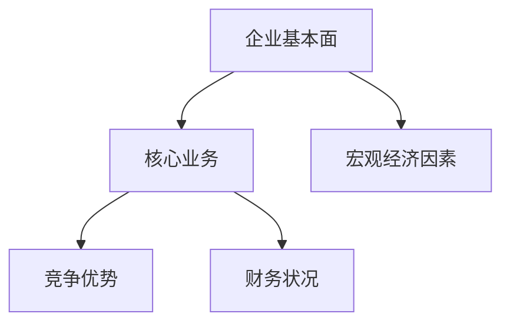
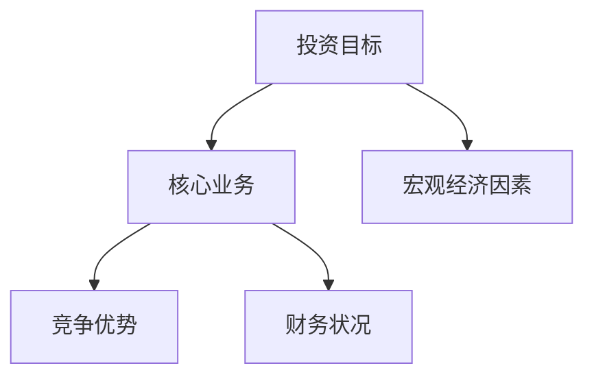
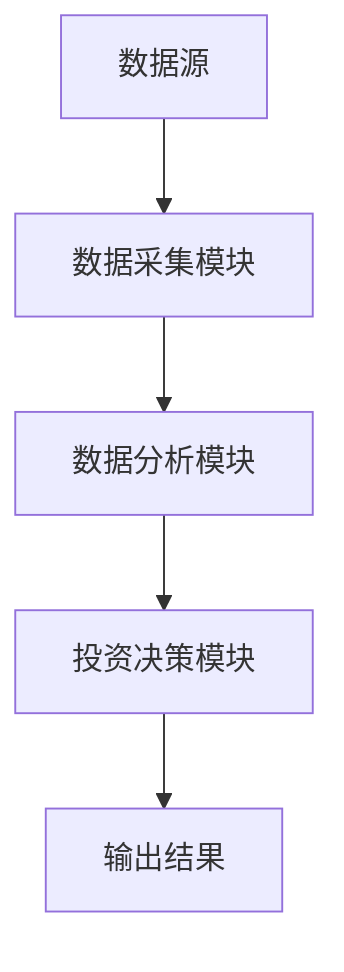

                 


# 芒格的"第一原理"思维在投资分析中的应用

> 关键词：芒格，第一原理，投资分析，价值投资，系统架构

> 摘要：本文深入探讨了芒格的"第一原理"思维在投资分析中的应用。通过从哲学基础到数学模型的系统分析，结合实际案例，展示了如何运用"第一原理"思维进行投资决策、系统架构设计和项目实战。本文旨在为投资者提供一种基于基本原理的分析框架，帮助其在复杂的投资环境中做出更明智的决策。

---

## # 第1章: 芒格"第一原理"思维的背景与基础

### ## 1.1 "第一原理"思维的哲学基础

#### ### 1.1.1 希腊哲学中的"第一原理"
希腊哲学中的"第一原理"（Prime）是指构成某一领域知识的基本前提或基础概念。例如，亚里士多德在《物理学》中将"第一原理"定义为构成一门科学的基础概念和原则，这些概念是不可再分解的，且是该领域知识的起点。

#### ### 1.1.2 芒格对"第一原理"思维的继承与发展
芒格在投资分析中继承了哲学中的"第一原理"思维，并将其应用于具体的金融领域。他强调从最基本的原则出发，而不是依赖现有的假设或框架。例如，芒格认为，价值投资的核心在于理解企业的基本面，而不是市场的短期波动。

#### ### 1.1.3 "第一原理"思维在投资分析中的重要性
在投资分析中，"第一原理"思维的重要性在于它可以帮助投资者避免被市场噪声和短期趋势所迷惑，而是从企业的基本面出发，找到其内在价值。这种方法特别适合长期投资和价值发现。

---

### ## 1.2 "第一原理"思维的物理学方法

#### ### 1.2.1 芒格的"物理学思维"概述
芒格强调，投资分析应该像物理学一样严谨。他将投资分析视为一门科学，认为投资者应该像物理学家一样，从最基本的原则出发，推导出投资决策的结论。

#### ### 1.2.2 "第一原理"思维在投资分析中的应用
在投资分析中，"第一原理"思维的具体应用包括：将企业的价值分解为其核心业务、竞争优势和财务状况等基本要素，然后逐一分析这些要素，以确定企业的内在价值。

#### ### 1.2.3 "第一原理"思维的核心要素
"第一原理"思维的核心要素包括：
1. 问题拆解：将复杂的问题分解为基本要素。
2. 假设检验：检验每个要素的基本假设。
3. 解决方案设计：基于基本要素和假设，设计出最优解决方案。

---

## # 第2章: "第一原理"思维在投资分析中的核心概念

### ## 2.1 投资分析中的基本问题

#### ### 2.1.1 价值投资的核心问题
价值投资的核心问题在于如何确定企业的内在价值。芒格认为，内在价值是企业的未来现金流的现值，而这个现值可以通过对企业基本面的分析来确定。

#### ### 2.1.2 "第一原理"思维在投资决策中的作用
在投资决策中，"第一原理"思维的作用在于帮助投资者从企业的基本面出发，而不是被市场的短期波动所迷惑。通过分析企业的核心业务、竞争优势和财务状况，投资者可以找到其内在价值。

#### ### 2.1.3 投资分析中的边界与外延
投资分析的边界包括企业的财务状况、行业竞争环境和宏观经济因素。外延则包括企业的未来增长潜力和市场地位。

---

### ## 2.2 "第一原理"思维的核心要素

#### ### 2.2.1 投资目标的分解
投资目标的分解包括将企业的价值分解为其核心业务、竞争优势和财务状况等基本要素。

#### ### 2.2.2 投资假设的检验
投资假设的检验包括验证企业的财务状况、行业竞争环境和宏观经济因素等假设的合理性。

#### ### 2.2.3 投资方案的设计
投资方案的设计包括基于基本要素和假设，设计出最优投资方案。

---

### ## 2.3 投资分析中的概念结构与核心要素

#### ### 2.3.1 投资分析的领域模型


#### ### 2.3.2 投资分析的核心要素对比表格
| 核心要素 | 定义 | 属性 |
|---------|------|------|
| 核心业务 | 企业的主要业务 | 收入来源、成本结构、竞争优势 |
| 竞争优势 | 企业在行业中的优势 | 核心竞争力、市场地位、品牌影响力 |
| 财务状况 | 企业的财务健康状况 | 资产负债表、利润表、现金流量表 |

#### ### 2.3.3 投资分析的ER实体关系图
```mermaid
erd
    A[企业] --(拥有)-- B[核心业务]
    B --(包含)-- C[竞争优势]
    A --(影响)-- D[财务状况]
```

---

## # 第3章: "第一原理"思维的算法原理与数学模型

### ## 3.1 "第一原理"思维的算法流程

#### ### 3.1.1 问题拆解与假设检验的算法步骤
1. 将问题分解为基本要素。
2. 验证每个要素的假设。
3. 确定假设的合理性和可行性。

#### ### 3.1.2 解决方案设计的算法逻辑
1. 基于基本要素和假设，设计解决方案。
2. 对解决方案进行优化和调整。
3. 验证解决方案的有效性。

---

### ## 3.2 "第一原理"思维的数学模型

#### ### 3.2.1 投资价值的数学公式
$$ V = \sum_{t=1}^{\infty} \frac{CF_t}{(1 + r)^t} $$
其中，$V$ 表示企业的内在价值，$CF_t$ 表示第 $t$ 年的现金流，$r$ 表示折现率。

#### ### 3.2.2 投资风险的数学模型
$$ R = \sigma \times \sqrt{250} $$
其中，$R$ 表示年化波动率，$\sigma$ 表示收益率的标准差。

#### ### 3.2.3 投资回报率计算公式
$$ ROI = \frac{\text{净利润}}{\text{投入成本}} \times 100\% $$

---

### ## 3.3 投资分析中的数学公式与案例

#### ### 3.3.1 投资价值计算公式
$$ V = \frac{CF_1}{r} + \frac{CF_2}{(1 + r)^2} + \cdots + \frac{CF_n}{(1 + r)^n} $$
其中，$CF_i$ 表示第 $i$ 年的现金流，$r$ 表示折现率。

---

## # 第4章: 投资分析中的系统架构设计

### ## 4.1 投资分析系统的功能设计

#### ### 4.1.1 投资分析系统的领域模型


#### ### 4.1.2 投资分析系统的功能模块
1. 数据采集模块：收集企业的财务数据、行业数据和宏观经济数据。
2. 数据分析模块：对数据进行清洗、分析和建模。
3. 投资决策模块：基于分析结果，生成投资建议。

---

### ## 4.2 投资分析系统的架构设计

#### ### 4.2.1 系统架构的模块划分


#### ### 4.2.2 系统架构的流程图


---

## # 第5章: 项目实战

### ## 5.1 项目介绍

#### ### 5.1.1 投资案例的选择
选择苹果和亚马逊作为投资案例，分析其核心业务、竞争优势和财务状况。

---

### ## 5.2 项目环境与安装

#### ### 5.2.1 环境安装
1. 安装Python和相关库（Pandas、NumPy、Matplotlib）。
2. 下载企业财务数据和行业数据。

---

### ## 5.3 项目核心实现

#### ### 5.3.1 核心代码实现
```python
import pandas as pd
import numpy as np

# 加载数据
df = pd.read_csv('financial_data.csv')

# 计算财务指标
def calculate_financial_metrics(df):
    metrics = {}
    metrics['ROE'] = df['净利润'] / df['股东权益'] * 100
    metrics['ROA'] = df['净利润'] / df['总资产'] * 100
    metrics['ROI'] = df['净利润'] / df['投入成本'] * 100
    return metrics

# 示例计算
metrics = calculate_financial_metrics(df)
print(metrics)
```

#### ### 5.3.2 代码解读与分析
上述代码展示了如何计算企业的财务指标，包括ROE、ROA和ROI。这些指标是投资分析中的重要参考。

---

### ## 5.4 实际案例分析

#### ### 5.4.1 苹果公司的分析
通过计算苹果公司的ROE、ROA和ROI，可以确定其财务状况的健康性。

#### ### 5.4.2 亚马逊的分析
通过计算亚马逊的核心业务和竞争优势，可以确定其未来增长潜力。

---

## # 第6章: 总结与展望

### ## 6.1 总结
通过本文的分析，我们可以看到，芒格的"第一原理"思维在投资分析中具有重要的应用价值。通过从基本原理出发，投资者可以更准确地评估企业的内在价值。

### ## 6.2 展望
未来的研究可以进一步探讨"第一原理"思维在其他领域的应用，例如风险管理、企业战略和宏观经济分析。

---

## 作者：AI天才研究院/AI Genius Institute & 禅与计算机程序设计艺术 /Zen And The Art of Computer Programming

---

以上是完整的文章目录结构，每章内容需要进一步展开详细撰写。

