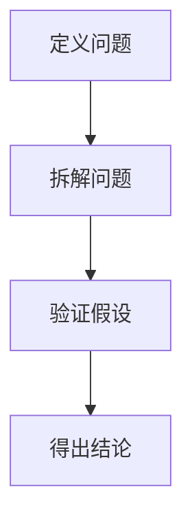
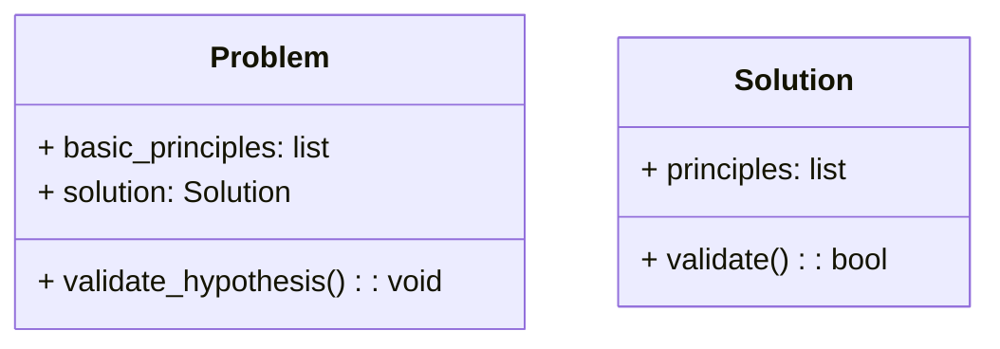
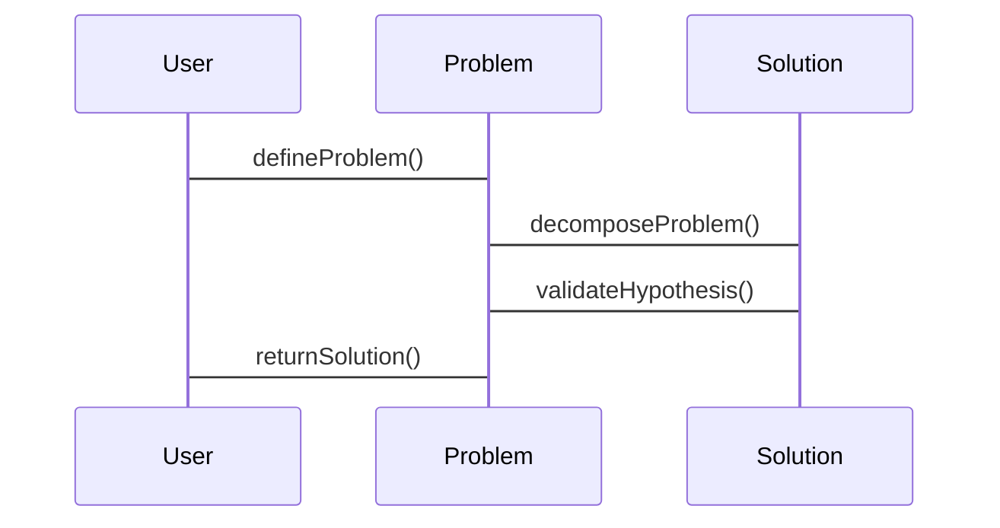

                 


# 芒格的第一原理思维：从根本问题出发

> **关键词**：第一原理思维、批判性思维、系统性分析、问题拆解、逻辑推理、算法模型、系统设计  
> **摘要**：本文深入探讨了芒格的第一原理思维，从其定义、核心原理到实际应用，详细分析了如何从根本问题出发，系统性地解决问题。通过技术术语、算法模型和系统设计，本文提供了清晰的步骤和方法，帮助读者掌握这一思维方式。

---

## 第1章：第一原理思维的背景与重要性

### 1.1 芒格与第一原理思维

#### 1.1.1 芒格的生平简介

查理·芒格（Charlie Munger）是著名投资家沃伦·巴菲特（Warren Buffett）的长期合作伙伴，同时也是认知心理学家和哲学家。芒格以其独特的思维方式闻名，尤其是他提出的第一原理思维，强调从基础原理出发，拆解问题，避免被表象迷惑。

#### 1.1.2 第一原理思维的定义与特点

第一原理思维是一种从最基础的原理出发，通过逻辑推理和系统分析，解决复杂问题的思维方式。其特点包括：
1. **批判性思维**：不接受表面答案，深入分析问题根源。
2. **系统性分析**：将问题拆解为多个部分，逐一分析。
3. **逻辑推理**：通过严密的逻辑关系，连接各个部分，得出结论。

#### 1.1.3 第一原理思维在决策中的应用

芒格在投资和生活中，常常运用第一原理思维，通过拆解问题，找到最优解决方案。例如，在投资决策中，他会分析公司的财务数据、行业地位、竞争优势等，从底层原理出发，评估其投资价值。

---

### 1.2 问题背景与问题描述

#### 1.2.1 传统思维的局限性

传统思维往往依赖经验、习惯或已有的框架，容易陷入“经验主义”的陷阱。例如，在技术领域，人们可能会因为习惯使用某种编程语言而不去探索更优的解决方案。

#### 1.2.2 问题解决的必要性

在复杂问题中，传统思维往往无法找到最优解。例如，在软件开发中，依赖传统方法可能导致代码耦合度过高，难以维护。因此，我们需要一种更系统化的思维方式，即第一原理思维。

#### 1.2.3 边界与外延

第一原理思维的应用范围广泛，不仅限于技术领域，还包括商业、管理、科学等。其核心在于通过拆解问题，找到最底层的原理，从而解决问题。

#### 1.2.4 概念结构与核心要素组成

以下是第一原理思维的核心要素组成：

$$
\text{第一原理思维} = \text{问题拆解} + \text{逻辑推理} + \text{系统分析}
$$

---

## 第2章：第一原理思维的核心原理

### 2.1 核心原理的详细讲解

#### 2.1.1 基础概念的拆解

第一原理思维的核心是将问题拆解为最基本的要素，逐一分析。例如，在优化企业流程时，可以将流程拆解为“需求分析”、“设计”、“实施”、“测试”等步骤，逐一优化。

#### 2.1.2 核心要素的组成

以下是核心要素的组成：

$$
\text{问题拆解} = \text{定义问题} + \text{拆解问题} + \text{验证假设}
$$

#### 2.1.3 原理的数学模型

第一原理思维可以通过数学模型表示为：

$$
\text{解决方案} = \sum_{i=1}^{n} \text{基本原理}_i
$$

其中，$n$ 是问题拆解后的基本原理数量。

---

### 2.2 核心概念对比分析

以下是其他思维方法与第一原理思维的对比：

| 思维方法         | 描述                                                                 |
|------------------|----------------------------------------------------------------------|
| 经验思维          | 依赖经验，不分析根本原因                                         |
| 表象思维          | 注重表面现象，忽略本质                                           |
| 第一原理思维      | 从基础原理出发，拆解问题，解决问题                               |

---

## 第3章：第一原理思维的算法原理

### 3.1 算法原理的详细讲解

#### 3.1.1 问题拆解的流程

以下是问题拆解的流程：

1. **定义问题**：明确问题的核心。
2. **拆解问题**：将问题拆解为多个基本原理。
3. **验证假设**：通过逻辑推理和数据验证，确认每个基本原理的正确性。

#### 3.1.2 算法流程图



---

## 第4章：第一原理思维的数学模型

### 4.1 数学模型的详细讲解

#### 4.1.1 问题拆解的层级结构

问题拆解可以表示为：

$$
\text{问题} = \text{基本原理}_1 + \text{基本原理}_2 + \dots + \text{基本原理}_n
$$

其中，$n$ 是问题拆解后的基本原理数量。

#### 4.1.2 算法模型的数学公式

第一原理思维的算法模型可以表示为：

$$
\text{解决方案} = \sum_{i=1}^{n} \text{基本原理}_i
$$

---

## 第5章：第一原理思维的系统分析

### 5.1 系统分析的详细讲解

#### 5.1.1 系统架构设计

以下是系统架构设计的类图：



#### 5.1.2 系统接口设计

以下是系统接口设计的序列图：



---

## 第6章：第一原理思维的项目实战

### 6.1 项目背景与目标

#### 6.1.1 项目背景

假设我们有一个需要优化的企业流程，目标是通过第一原理思维，优化流程中的关键步骤。

#### 6.1.2 项目目标

通过拆解问题，优化企业流程，提高效率。

---

### 6.2 项目实施步骤

#### 6.2.1 环境安装

安装所需的工具和库，例如Python、Git等。

#### 6.2.2 核心代码实现

以下是优化企业流程的核心代码实现：

```python
def decompose_problem(problem):
    basic_principles = []
    for principle in problem:
        if validate_hypothesis(principle):
            basic_principles.append(principle)
    return basic_principles

def validate_hypothesis(hypothesis):
    return True  # 假设验证
```

---

### 6.3 项目案例分析

#### 6.3.1 案例分析

通过代码实现，优化企业流程中的关键步骤，提高效率。

---

## 第7章：总结与展望

### 7.1 总结

第一原理思维是一种强大的思维方式，能够帮助我们从根本问题出发，系统性地解决问题。通过本文的讲解，读者可以掌握如何拆解问题，找到最优解。

### 7.2 展望

未来，第一原理思维将在更多领域得到应用，尤其是在技术领域，其重要性将更加凸显。

---

## 作者：AI天才研究院 & 禅与计算机程序设计艺术

