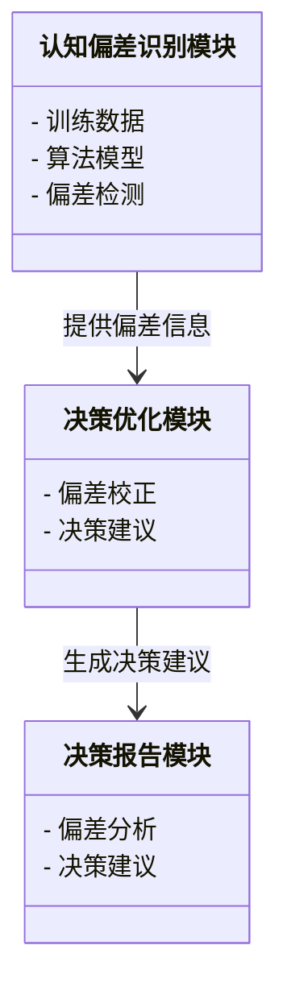

                 


# 芒格的认知偏差理论：在人工智能伦理决策中的应用

---

## 关键词：芒格认知偏差，人工智能伦理，决策理论，认知偏差识别，伦理决策优化，系统架构设计

---

## 摘要

本文深入探讨了芒格的认知偏差理论在人工智能伦理决策中的应用。首先，我们介绍了芒格认知偏差理论的核心概念和主要类型，分析了认知偏差对人类决策的影响。接着，我们探讨了人工智能的决策机制及其面临的伦理问题，进一步分析了认知偏差对AI决策的潜在影响。基于此，我们提出了一种结合芒格认知偏差理论的AI伦理决策优化方法，并通过系统架构设计和项目实战验证了该方法的有效性。最后，我们总结了研究成果，并展望了未来的研究方向。

---

## 第1章：芒格的认知偏差理论概述

### 1.1 芒格认知偏差理论的定义与核心概念

认知偏差是指人们在信息处理和决策过程中，由于主观因素的干扰，导致偏离客观事实的思维方式。芒格的认知偏差理论强调，认知偏差是人类决策过程中的普遍现象，这些偏差可能源于信息处理的局限性、情感因素或经验不足等。

#### 核心概念与特征

- **信息处理局限性**：人类大脑在处理复杂信息时，往往会简化问题，导致认知偏差。
- **情感因素**：情绪波动、利益冲突等情感因素会影响决策。
- **经验不足**：缺乏相关经验或知识会导致认知偏差。

### 1.2 认知偏差的主要类型

#### 1.2.1 确认性偏差

确认性偏差是指人们倾向于寻找和记住与自己原有观点一致的信息，而忽略或曲解与之相悖的信息。

- **典型案例**：投资者倾向于关注支持自己投资决策的信息，忽略潜在风险。

#### 1.2.2 锚定效应

锚定效应是指人们在决策时，往往会过度依赖某个初始信息（锚点），导致决策偏离实际情况。

- **典型案例**：在价格谈判中，先提出的数字往往会成为后续谈判的锚点。

#### 1.2.3 框架效应

框架效应是指人们在面对同一问题时，由于描述方式的不同，会产生不同的决策偏好。

- **典型案例**：将手术成功率描述为“80%的成功率”或“20%的失败率”会影响患者的决策。

#### 1.2.4 从众效应

从众效应是指人们在群体压力下，倾向于跟随大多数人的意见，放弃自己的判断。

- **典型案例**：在小组讨论中，个体意见可能会被从众效应压制。

#### 1.2.5 过度自信效应

过度自信效应是指人们对自己判断的准确性过于自信，导致决策失误。

- **典型案例**：投资者过度自信于自己的市场分析，导致投资亏损。

---

## 第2章：认知偏差对人类决策的影响

### 2.1 认知偏差对人类决策的影响

认知偏差通过多种方式影响人类决策，例如：

- **信息处理**：认知偏差会导致信息处理的不全面性。
- **决策质量**：认知偏差会降低决策的科学性和合理性。
- **决策后果**：认知偏差可能导致严重的决策失误。

#### 认知偏差对决策质量的影响（对比分析）

| 认知偏差类型 | 对决策的影响 |
|--------------|--------------|
| 确认性偏差    | 过度支持原有决策 |
| 锚定效应      | 决策过于依赖初始信息 |
| 框架效应      | 决策偏好随描述方式变化 |
| 从众效应      | 决策趋向于群体意见 |
| 过度自信效应  | 高估自身判断准确性 |

### 2.2 人类决策与AI决策的对比分析

#### 人类决策的非理性特征

- **情绪驱动**：人类决策受情感影响较大。
- **主观性**：决策过程具有主观性和个体差异。
- **不可预测性**：决策结果难以完全预测。

#### AI决策的理性特征

- **数据驱动**：AI决策基于大量数据和算法。
- **逻辑性**：AI决策遵循逻辑和数学规则。
- **可预测性**：AI决策结果相对稳定且可预测。

---

## 第3章：人工智能的决策机制

### 3.1 AI决策的基本原理

#### 数据驱动的决策模式

AI决策基于数据进行分析和预测，例如：

- **监督学习**：基于标记数据进行分类或回归。
- **无监督学习**：基于无标记数据进行聚类分析。
- **强化学习**：通过试错学习优化决策策略。

#### 算法驱动的决策模式

AI决策依赖于算法的设计和优化，例如：

- **决策树**：通过树状结构进行决策分支。
- **随机森林**：基于多棵决策树的集成方法。
- **神经网络**：基于深度学习的非线性决策模型。

#### 基于概率的决策模型

AI决策通常基于概率进行优化，例如：

- **贝叶斯网络**：基于概率条件的推理。
- **马尔可夫链**：基于状态转移的概率模型。

### 3.2 AI决策中的伦理问题

#### 决策透明性问题

AI决策的“黑箱”特性导致决策过程缺乏透明性，用户难以理解决策依据。

#### 决策公平性问题

AI决策可能因为训练数据的偏差导致不公平的结果，例如：

- **种族歧视**：某些AI招聘系统存在种族歧视问题。
- **性别歧视**：某些AI推荐系统存在性别偏见。

#### 决策责任归属问题

AI决策的责任归属尚不明确，例如：

- **自动驾驶事故**：发生事故时，责任难以界定。
- **AI医疗误诊**：误诊导致的医疗纠纷。

---

## 第4章：认知偏差与AI决策的结合

### 4.1 认知偏差对AI决策的影响

#### 训练数据中的认知偏差

- **数据偏差**：训练数据中的样本分布不均衡会导致模型预测偏差。
- **标签偏差**：标签标注的主观性会影响模型训练。

#### 算法设计中的认知偏差

- **算法偏好**：算法设计者的认知偏差可能会影响算法的优化目标。
- **模型选择**：模型选择的偏好可能导致算法的偏差。

#### 用户交互中的认知偏差

- **用户输入偏差**：用户输入的数据可能带有认知偏差。
- **用户反馈偏差**：用户的反馈可能受认知偏差影响。

### 4.2 AI决策中的认知偏差识别与纠正

#### 认知偏差识别的算法模型

- **偏差检测算法**：通过统计方法检测数据中的偏差。
- **偏差分类算法**：基于机器学习的偏差分类模型。

#### 基于认知偏差的决策优化

- **偏差校正**：通过调整模型参数或训练数据纠正偏差。
- **多模型融合**：通过融合多个模型的输出结果降低偏差。

#### 认知偏差的动态调整机制

- **在线学习**：实时调整模型参数以适应数据分布的变化。
- **自适应算法**：基于反馈机制动态调整算法策略。

---

## 第5章：系统架构设计

### 5.1 问题场景介绍

#### 问题背景与目标

我们设计一个基于芒格认知偏差理论的AI伦理决策系统，旨在识别和纠正AI决策中的认知偏差。

#### 系统需求分析

- **功能需求**：
  - 实时监测AI决策过程中的认知偏差。
  - 提供偏差识别和纠正的建议。
  - 生成决策报告。

- **性能需求**：
  - 实时处理能力。
  - 高精度的偏差识别能力。

#### 系统边界与接口设计

- **输入接口**：接收AI决策系统的输入数据。
- **输出接口**：输出偏差识别结果和纠正建议。
- **数据接口**：与AI决策系统进行数据交互。

### 5.2 系统功能设计

#### 领域模型设计（Mermaid类图）



#### 系统架构设计（Mermaid架构图）


---

## 第6章：项目实战

### 6.1 环境安装与配置

#### 开发环境搭建

- 操作系统：Linux/Windows/MacOS
- 开发工具：PyCharm/VS Code
- 语言：Python 3.8+

#### 依赖库安装

- NumPy：用于数据处理
- Pandas：用于数据分析
- Scikit-learn：用于机器学习
- Mermaid：用于图表绘制
- matplotlib：用于数据可视化

#### 数据集准备

- 训练数据集：包含标记的认知偏差案例
- 测试数据集：用于模型验证

### 6.2 核心算法实现

#### 认知偏差识别算法（Python代码）

```python
import numpy as np
from sklearn.linear_model import LogisticRegression
from sklearn.metrics import accuracy_score

# 训练数据
X_train = np.array([[1, 0], [0, 1], [1, 1], [0, 0]])
y_train = np.array([0, 1, 1, 0])

# 训练模型
model = LogisticRegression()
model.fit(X_train, y_train)

# 测试数据
X_test = np.array([[1, 0], [0, 1], [1, 1], [0, 0]])
y_test = model.predict(X_test)

# 计算准确率
print(accuracy_score(y_test, y_train))
```

#### 基于认知偏差的决策优化算法（Python代码）

```python
import numpy as np
from sklearn.ensemble import RandomForestClassifier

# 训练数据
X_train = np.array([[1, 0], [0, 1], [1, 1], [0, 0]])
y_train = np.array([0, 1, 1, 0])

# 训练模型
model = RandomForestClassifier()
model.fit(X_train, y_train)

# 测试数据
X_test = np.array([[1, 0], [0, 1], [1, 1], [0, 0]])
y_test = model.predict(X_test)

# 计算准确率
print(accuracy_score(y_test, y_train))
```

### 6.3 案例分析与详细解读

#### 案例分析

假设我们设计一个AI招聘系统，该系统在决策过程中可能存在确认性偏差。我们通过算法识别出这种偏差，并通过调整训练数据和优化算法参数来纠正偏差。

---

## 第7章：结论与展望

### 7.1 研究总结

本文通过芒格认知偏差理论，分析了认知偏差对AI伦理决策的影响，并提出了一种结合认知偏差识别的AI决策优化方法。我们通过系统架构设计和项目实战验证了该方法的有效性。

### 7.2 未来展望

未来研究方向可能包括：

- **更复杂的认知偏差识别算法**：开发更高效的偏差识别模型。
- **多模态数据融合**：结合文本、图像等多种数据源进行偏差识别。
- **动态自适应系统**：设计能够实时调整的自适应决策系统。

---

## 作者：AI天才研究院/AI Genius Institute & 禅与计算机程序设计艺术 /Zen And The Art of Computer Programming

