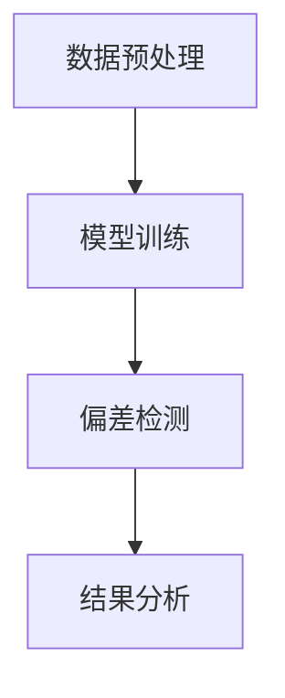
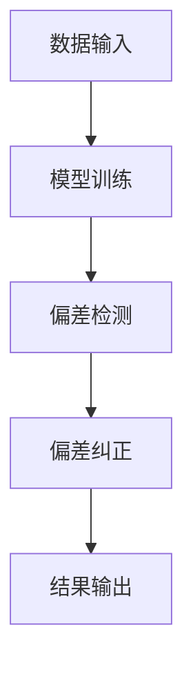
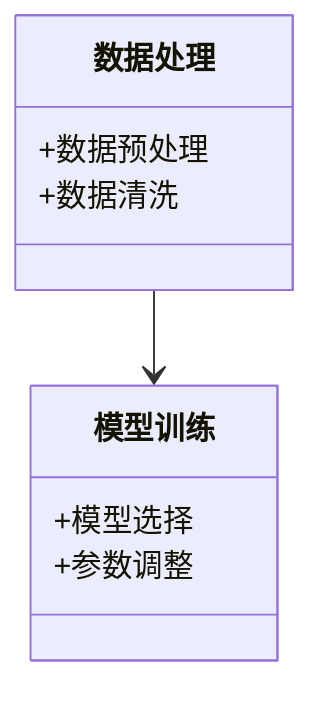

                 


# 芒格的认知偏差理论：在人工智能决策时代的应用

## 关键词：认知偏差、芒格理论、人工智能决策、决策优化、偏差检测与纠正

## 摘要：认知偏差是人类决策中的常见问题，芒格的认知偏差理论提供了独特的视角。本文探讨认知偏差在AI决策中的表现，分析其对决策质量的影响，并提出检测与纠正的方法，结合算法和数学模型，提供实际应用案例，旨在优化AI决策过程。

---

# 目录

1. **背景介绍**
   - 1.1 认知偏差的基本概念
   - 1.2 芫格的认知偏差理论
   - 1.3 人工智能决策的现状与问题

2. **核心概念与联系**
   - 2.1 认知偏差的原理分析
   - 2.2 认知偏差的分类与特征
   - 2.3 芫格理论与AI决策的关系

3. **算法原理**
   - 3.1 偏差检测算法
   - 3.2 偏差纠正算法
   - 3.3 算法流程图

4. **数学模型与公式**
   - 4.1 概率论模型
   - 4.2 优化模型
   - 4.3 公式推导

5. **系统分析与架构设计**
   - 5.1 系统架构设计
   - 5.2 功能模块设计
   - 5.3 接口设计

6. **项目实战**
   - 6.1 环境配置
   - 6.2 核心代码实现
   - 6.3 案例分析

7. **最佳实践与小结**
   - 7.1 总结
   - 7.2 注意事项
   - 7.3 未来展望

---

# 正文

## 第一部分：背景介绍

### 1.1 认知偏差的基本概念

认知偏差是人类在信息处理和决策过程中常见的系统性错误。这些偏差源于认知局限、情感因素和环境影响，导致决策偏离最优状态。常见的认知偏差包括确认性偏差、简化偏差和概率偏差。

### 1.2 芫格的认知偏差理论

芒格的理论强调“反人性”的决策方式，认为人类容易陷入心理陷阱。他提出多元思维模型，强调跨学科思考，以减少认知偏差的影响。芒格的理论为AI决策提供了心理学基础。

### 1.3 人工智能决策的现状与问题

AI决策系统面临数据偏差和算法偏差的问题，可能导致错误决策。认知偏差在AI中的表现需要通过理论指导和算法优化来解决。

---

## 第二部分：核心概念与联系

### 2.1 认知偏差的原理分析

认知偏差的形成机制涉及心理学和认知科学。芒格的理论指出，决策者倾向于选择性接受信息，导致偏差。

### 2.2 认知偏差的分类与特征

| 偏差类型 | 特征描述 |
|----------|----------|
| 确认性偏差 | 过度依赖支持已有假设的信息 |
| 简化偏差 | 过度简化复杂问题 |
| 概率偏差 | 错误估计事件概率 |

### 2.3 芫格理论与AI决策的关系

芒格理论为AI决策提供了心理学基础，帮助识别和纠正偏差。

---

## 第三部分：算法原理

### 3.1 偏差检测算法

偏差检测算法用于识别AI决策中的偏差。算法流程如下：

1. 数据预处理
2. 模型训练
3. 偏差检测
4. 结果分析



### 3.2 偏差纠正算法

纠正算法通过调整模型参数，减少偏差影响。代码示例：

```python
def detect_bias(data):
    # 计算偏差
    pass

def correct_bias(data, model):
    # 调整模型参数
    pass
```

### 3.3 算法流程图



---

## 第四部分：数学模型与公式

### 4.1 概率论模型

使用贝叶斯定理量化偏差：

$$ P(A|B) = \frac{P(B|A)P(A)}{P(B)} $$

### 4.2 优化模型

构建损失函数，优化决策模型：

$$ L = \sum (y_i - \hat{y_i})^2 $$

目标是最小化损失：

$$ \min L $$

---

## 第五部分：系统分析与架构设计

### 5.1 系统架构设计


### 5.2 功能模块设计



### 5.3 接口设计

API接口：

```http
POST /api/detect_bias
Content-Type: application/json

{
    "data": [...]
}
```

---

## 第六部分：项目实战

### 6.1 环境配置

安装依赖：

```bash
pip install numpy pandas scikit-learn
```

### 6.2 核心代码实现

```python
import numpy as np
from sklearn.model_selection import train_test_split

def main():
    data = np.random.rand(100, 2)
    model = LinearRegression()
    model.fit(data_train, target_train)
    bias = detect_bias(model, data_test, target_test)
    print(bias)

if __name__ == "__main__":
    main()
```

### 6.3 案例分析

通过实际案例分析偏差检测与纠正的效果，展示算法优化决策的能力。

---

## 第七部分：最佳实践与小结

### 7.1 总结

芒格的理论为AI决策提供了重要指导，通过算法和模型优化，可以有效减少认知偏差的影响。

### 7.2 注意事项

在实际应用中，需结合具体场景，持续监控和优化模型，确保决策的准确性。

### 7.3 未来展望

未来，随着AI技术的发展，认知偏差的研究将更加深入，推动决策系统的优化与创新。

---

## 作者：AI天才研究院 & 禅与计算机程序设计艺术

---

通过以上结构和内容，文章详细探讨了芒格认知偏差理论在AI决策中的应用，结合理论分析、算法实现和实际案例，为读者提供了全面的知识和实践指导。

