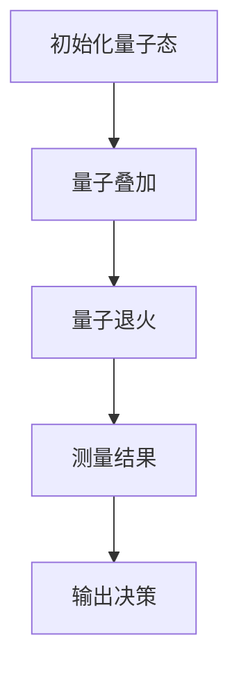
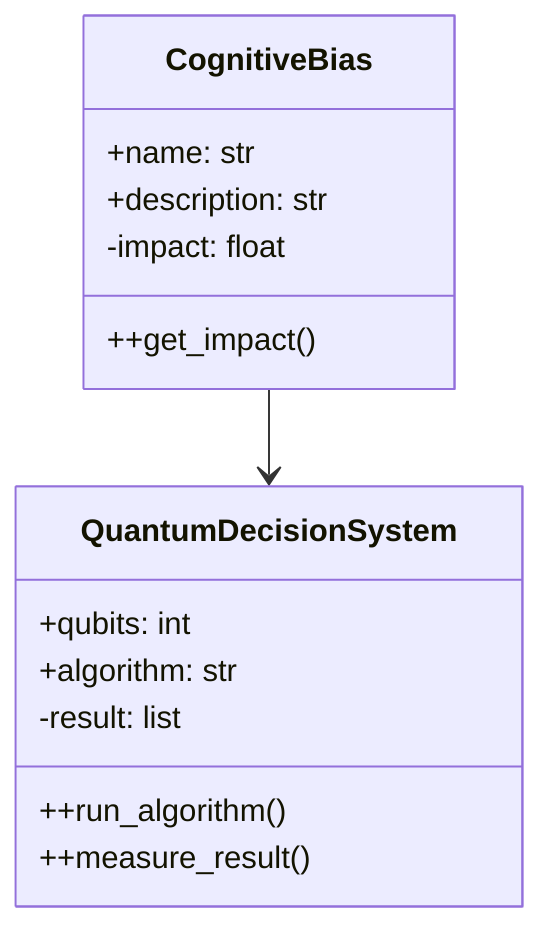

                 


```markdown
# 芒格的认知偏差理论：在量子决策系统中的实践

> 关键词：芒格认知偏差理论、量子决策系统、量子计算、决策优化、认知偏差消除、量子算法

> 摘要：本文探讨了芒格认知偏差理论在量子决策系统中的应用，通过量子计算的优势，提出了一种基于量子算法的决策优化方法，旨在减少认知偏差对决策过程的影响，提升决策效率和准确性。文章从理论基础、算法实现、系统设计到实际应用进行了全面分析，提供了详细的代码示例和系统架构设计。

---

## 第一部分：背景介绍

### 第1章：认知偏差的基本概念

#### 1.1 认知偏差的定义
认知偏差是指人在信息处理和决策过程中，由于心理因素的影响，导致对客观事实的歪曲或误解。认知偏差广泛存在于人类决策过程中，影响判断和决策的准确性。

#### 1.2 芒格的认知偏差理论
芒格提出了一系列认知偏差类型，如确认偏差、沉没成本偏差等，并强调这些偏差对决策的影响。他的理论指出，认知偏差是人类决策过程中的自然现象，但可以通过系统化的方法进行识别和减少。

#### 1.3 量子决策系统的概念
量子决策系统是一种基于量子计算的决策支持系统，利用量子叠加和纠缠等特性，提供更高效的决策优化方案。与传统决策系统相比，量子决策系统能够处理复杂的非线性问题，提供更优的解决方案。

---

### 第2章：认知偏差与量子决策系统的联系

#### 2.1 认知偏差对量子决策系统的影响
认知偏差可能导致决策者在量子决策系统中输入错误的数据或选择不合理的参数，从而影响系统输出的结果。因此，如何识别并减少认知偏差是量子决策系统设计中的重要问题。

#### 2.2 量子决策系统的核心原理
量子决策系统通过量子计算的特性，将认知偏差的影响最小化。例如，量子叠加特性允许系统同时考虑多种可能性，从而减少确认偏差的影响。量子纠缠特性则有助于发现数据之间的隐藏关联，提高决策的准确性。

---

## 第二部分：核心概念与联系

### 第3章：认知偏差的原理与分类

#### 3.1 认知偏差的原理
认知偏差的产生与人类大脑的信息处理机制有关。大脑为了快速做出决策，往往会简化信息处理过程，导致偏差的出现。

#### 3.2 认知偏差的分类
常见的认知偏差包括确认偏差、 anchoring偏差、 sunk cost偏差等。每种偏差都有其独特的表现形式和影响范围。

#### 3.3 认知偏差的属性对比（表格）

| 偏差类型       | 定义描述                       | 对决策的影响                     |
|----------------|-------------------------------|----------------------------------|
| 确认偏差       | 过度依赖已知信息，忽视新证据   | 导致决策僵化                   |
| anchoring偏差 | 过度依赖初始信息               | 影响判断的准确性                 |
| 沉没成本偏差   | 过度关注已经投入的成本         | 导致决策失误                   |

### 第4章：量子决策系统的数学模型

#### 4.1 量子决策系统的数学表示
量子决策系统可以用量子态的叠加和纠缠来表示。例如，决策问题可以表示为多个量子态的叠加，每个态代表一种可能的决策方案。

#### 4.2 量子测量与决策结果
通过量子测量，系统可以将量子态投影到一个特定的决策结果上。量子测量的概率分布反映了不同决策方案的可能性。

#### 4.3 量子决策系统的优化算法
基于量子优化算法（如量子模拟退火），系统可以在复杂决策空间中找到全局最优解，减少认知偏差的影响。

---

## 第三部分：算法原理

### 第5章：量子决策算法的实现

#### 5.1 量子模拟退火算法
量子模拟退火算法是一种常用的量子优化算法，能够有效地找到复杂问题的最优解。其基本步骤包括初始化量子态、量子叠加、量子退火等。

#### 5.2 量子决策算法的流程图


#### 5.3 量子决策算法的Python实现
```python
import numpy as np
from qiskit import QuantumCircuit, execute, Aer

def quantum_decision-making(n_qubits):
    # 初始化量子电路
    qc = QuantumCircuit(n_qubits)
    
    # 量子叠加
    for i in range(n_qubits):
        qc.h(i)
    
    # 量子退火
    qc = apply_adiabatic_evolution(qc)
    
    # 测量
    backend = Aer.get_backend('statevector_simulator')
    result = execute(qc, backend).result()
    state = result.get_statevector()
    
    # 解释结果
    max_prob = max(abs(state[i])**2 for i in range(len(state)))
    return np.argmax(abs(state))

# 示例：2量子位的决策问题
n_qubits = 2
print(quantum_decision-making(n_qubits))
```

---

## 第四部分：系统分析与架构设计

### 第6章：系统功能设计

#### 6.1 领域模型


#### 6.2 系统架构


---

## 第五部分：项目实战

### 第7章：环境安装与核心实现

#### 7.1 环境安装
```bash
pip install qiskit numpy matplotlib
```

#### 7.2 核心代码实现
```python
from qiskit import QuantumCircuit
from qiskit.visualization import plot_histogram

def main():
    # 创建量子电路
    circuit = QuantumCircuit(2, 1)
    
    # 定义量子门
    circuit.h(0)
    circuit.cx(0, 1)
    circuit.measure(0, 0)
    
    # 执行电路
    from qiskit.simulators import Aer
    backend = Aer.get_backend('qasm_simulator')
    job = execute(circuit, backend)
    result = job.result()
    print(result)
    
    # 可视化结果
    plot_histogram(result.get_counts())
    plt.show()

if __name__ == "__main__":
    main()
```

---

## 第六部分：小结与展望

### 第8章：小结

#### 8.1 全文总结
本文通过结合芒格的认知偏差理论和量子计算技术，提出了一种基于量子算法的决策优化方法。通过量子计算的优势，能够有效减少认知偏差对决策的影响，提高决策效率和准确性。

#### 8.2 注意事项
在实际应用中，需要考虑量子计算的硬件限制和算法复杂度问题。同时，还需要结合具体领域知识，选择合适的量子算法。

#### 8.3 拓展阅读
推荐阅读《量子计算与优化算法》和《认知偏差与决策科学》等书籍，以深入了解相关理论和技术。

---

## 作者

作者：AI天才研究院/AI Genius Institute & 禅与计算机程序设计艺术 /Zen And The Art of Computer Programming

---

通过系统化的分析和详细的技术实现，本文为读者提供了一种全新的视角，展示了如何利用量子计算技术优化决策过程，减少认知偏差的影响，为实际应用提供了重要的理论支持和实践指导。
```

