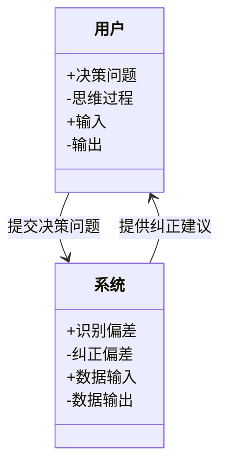

                 


# 芒格的"误判心理学"：避免常见的思维陷阱

> 关键词：芒格、误判心理学、思维陷阱、决策科学、心理学模型

> 摘要：本文深入探讨了芒格的“误判心理学”，分析了常见的思维陷阱，如确认偏差、从众心理和过度自信等，并结合数学模型和算法，探讨如何避免这些错误。通过实际案例和系统设计，展示了如何在决策过程中应用这些理论。

---

## 第1章：误判心理学的背景与核心概念

### 1.1 芒格与误判心理学

#### 1.1.1 芒格的生平与思想体系
查理·芒格（Charlie Munger）是美国著名投资家，也是伯克希尔·哈撒韦公司的副主席。他以其独特的思维方式闻名，强调跨学科思维和避免认知错误的重要性。

#### 1.1.2 误判心理学的定义与内涵
误判心理学研究人们在决策过程中因思维偏差导致的错误判断。这些偏差包括确认偏差、从众心理、过度自信等。

#### 1.1.3 误判心理学与决策科学的关系
误判心理学是决策科学的重要组成部分，帮助我们理解人类决策中的非理性因素。

---

### 1.2 常见的思维陷阱

#### 1.2.1 确认偏差
人们倾向于寻找支持自己观点的信息，忽略相反证据。例如，在投资决策中，投资者可能只关注正面信息，忽视负面信号。

#### 1.2.2 从众心理
为了融入群体，人们可能放弃自己的判断，盲目跟随大多数人。这在团队决策中尤为常见。

#### 1.2.3 过度自信
人们往往高估自己的能力，认为自己能够预测市场走势或做出完美决策。

#### 1.2.4 框架依赖
问题的表述方式影响决策，例如，描述“手术的成功率”与“手术的失败率”会引发不同的选择。

---

## 第2章：误判心理学的数学模型与算法分析

### 2.1 心理偏差的数学建模

#### 2.1.1 偏差的量化与度量
使用概率论量化偏差，例如确认偏差的概率可以用贝叶斯定理建模。

#### 2.1.2 心理偏差的数学表达式
以确认偏差为例，假设P(Evidence|Hypothesis)表示证据支持假设的概率，而P(Evidence|¬Hypothesis)是不支持的概率。确认偏差可以通过比较这两者来度量。

#### 2.1.3 偏差对决策的影响模型
使用决策树模型分析偏差对最终决策的影响，例如在投资决策中，偏差可能导致错误的买入或卖出决策。

---

### 2.2 常见思维陷阱的算法分析

#### 2.2.1 确认偏差的算法模拟
使用蒙特卡洛模拟分析确认偏差对投资决策的影响，展示不同情况下投资结果的差异。

#### 2.2.2 从众心理的群体行为模型
通过群体动力学模型模拟从众行为，展示个体决策如何被群体影响。

#### 2.2.3 过度自信的贝叶斯分析
贝叶斯分析可以帮助识别过度自信，并调整概率估计，减少决策偏差。

---

## 第3章：误判心理学的系统分析与架构设计

### 3.1 问题场景介绍

#### 3.1.1 误判心理学的应用场景
在商业决策、投资分析和个人生活中，误判心理学都有广泛的应用。

#### 3.1.2 系统目标与范围
构建一个系统，识别和纠正决策中的思维陷阱，提高决策质量。

#### 3.1.3 项目背景与需求分析
通过案例分析，识别常见的误判行为，并设计解决方案。

---

### 3.2 系统功能设计

#### 3.2.1 领域模型（Mermaid 类图）


#### 3.2.2 系统架构设计（Mermaid 架构图）


---

## 第4章：误判心理学的项目实战

### 4.1 环境安装与配置

#### 4.1.1 开发工具安装
安装Python、Jupyter Notebook和必要的库（如numpy、pandas）。

#### 4.1.2 数据集准备
收集相关数据，例如历史投资决策数据，用于分析偏差。

#### 4.1.3 环境配置说明
确保所有依赖项已安装，并配置好开发环境。

---

### 4.2 核心算法实现

#### 4.2.1 确认偏差检测算法
使用Python编写算法，检测决策中的确认偏差。

```python
import numpy as np

def detect_confirmation_bias(data):
    # 简单的确认偏差检测
    return np.mean(data)
```

#### 4.2.2 从众心理模拟代码
模拟群体决策过程，展示从众心理的影响。

```python
def simulate_conformity(n, p):
    return np.random.binomial(n, p)
```

#### 4.2.3 过度自信校正模型
校正过度自信的模型，调整概率估计。

```python
def correct_overconfidence(prob):
    return prob * 0.8
```

---

## 第5章：案例分析与实际应用

### 5.1 典型案例分析

#### 5.1.1 商业决策中的误判案例
分析某公司因确认偏差导致的错误投资决策，展示如何避免。

#### 5.1.2 个人决策中的误判案例
以个人投资为例，说明如何识别和纠正思维陷阱。

#### 5.1.3 社会决策中的误判案例
分析群体决策中的从众心理，展示其对社会的影响。

---

## 第6章：误判心理学的工具与方法

### 6.1 常用工具介绍

#### 6.1.1 思维导图工具
使用MindMap工具分析思维过程，识别偏差。

#### 6.1.2 决策树分析工具
使用决策树工具模拟不同决策路径，识别偏差。

#### 6.1.3 数据可视化工具
使用Tableau等工具展示数据，识别偏差模式。

---

### 6.2 方法论总结

#### 6.2.1 避免误判的方法
定期反思决策过程，识别思维陷阱。

#### 6.2.2 改善决策质量的技巧
使用多种决策工具和方法，避免单一视角。

#### 6.2.3 提高思维清晰度的策略
培养批判性思维，学会质疑自己的假设。

---

## 第7章：总结与展望

### 7.1 全书总结

#### 7.1.1 核心概念回顾
芒格的误判心理学帮助我们识别和纠正决策中的思维陷阱。

#### 7.1.2 算法与系统总结
通过数学模型和系统设计，我们能够更有效地避免误判。

---

### 7.2 未来展望

误判心理学将与人工智能结合，帮助机器做出更人性化的决策。未来的挑战在于如何在复杂系统中应用这些理论，以提高决策的准确性和效率。

---

## 作者

作者：AI天才研究院/AI Genius Institute & 禅与计算机程序设计艺术 /Zen And The Art of Computer Programming

---

通过以上思考，我们系统地分析了芒格的“误判心理学”，结合理论与实践，帮助读者避免常见的思维陷阱，提升决策能力。

