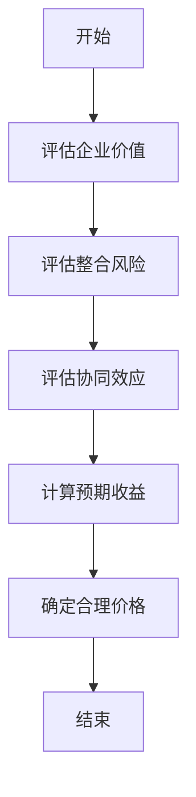
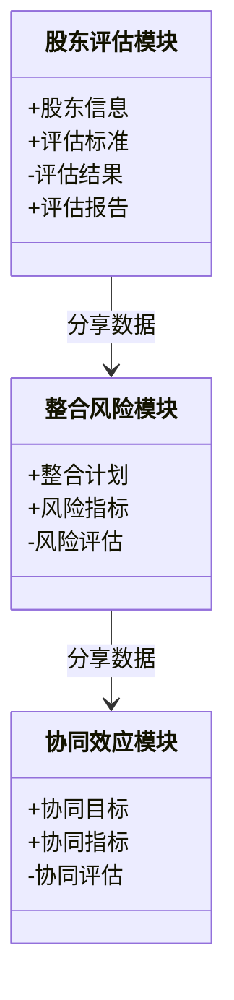
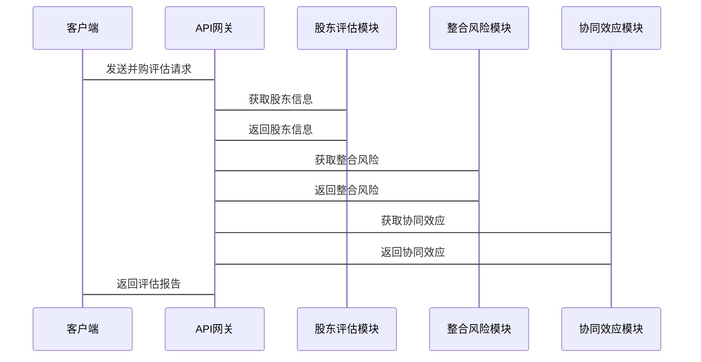

                 


# 芒格的"赢家的诅咒"提醒在高科技并购中的应用

## 关键词：芒格, 赢家的诅咒, 高科技并购, 并购评估模型, 系统设计, 项目实战

## 摘要：本文探讨了芒格的“赢家的诅咒”在高科技并购中的应用。通过分析并购中的常见问题，结合算法模型和系统设计，提出了一种新的并购评估方法，帮助企业在并购中避免“赢家的诅咒”的陷阱，实现成功整合和协同发展。

---

## 第一部分：背景介绍

### 第1章：芒格的“赢家的诅咒”概述

#### 1.1 芒格及其投资理念

- **1.1.1 芒格的生平简介**
  查理·芒格（Charlie Munger）是美国著名投资者和伯克希尔哈撒韦公司的重要人物。他不仅是巴菲特的长期合作伙伴，还以深刻的投资哲学和决策智慧闻名。

- **1.1.2 芒格的主要投资哲学**
  芒格强调“逆向思维”，即从反面思考问题。他认为，投资者应避免从众，寻找市场中的非共识机会。他的投资理念还包括分散投资、安全边际和长期价值。

- **1.1.3 “赢家的诅咒”概念的提出**
  “赢家的诅咒”是指在并购过程中，胜利的一方往往因为过于自信或支付过高的代价，导致并购失败或带来负面后果。芒格提醒人们，在并购时要保持谨慎，避免陷入这种陷阱。

#### 1.2 高科技并购的背景与现状

- **1.2.1 高科技行业的并购趋势**
  高科技行业竞争激烈，企业通过并购快速扩张、获取新技术和市场。近年来，科技巨头之间的并购活动频繁，如微软收购GitHub、 Facebook收购WhatsApp等。

- **1.2.2 并购在高科技企业发展中的作用**
  并购是高科技企业快速发展的关键策略。通过并购，企业可以迅速获得新技术、人才和市场，缩短研发周期，提升竞争力。

- **1.2.3 并购中的常见问题与挑战**
  并购后的整合困难、协同效应未达预期、文化冲突以及管理层的不稳定是常见的问题。这些问题在高科技并购中尤为突出，因为技术团队的整合和文化融合更具挑战性。

---

## 第二部分：核心概念与联系

### 第2章：“赢家的诅咒”在高科技并购中的应用

#### 2.1 核心概念原理

- **2.1.1 赢家的诅咒的定义**
  赢家的诅咒是指并购中的赢家（通常是收购方）因为过于乐观或支付过高的代价，导致并购后未能实现预期的协同效应，反而陷入困境。

- **2.1.2 赢家的诅咒的特征**
  - 过高的收购价格
  - 对整合的低估
  - 文化冲突和团队不稳定
  - 未达预期的协同效应

- **2.1.3 赢家的诅咒与高科技并购的关系**
  高科技并购中，技术的快速变化和市场的不确定性使得并购后的整合更加复杂。收购方容易因为对被收购方的技术优势或市场地位过于依赖，而忽视潜在的风险。

#### 2.2 核心概念属性对比表格

| 属性            | 赢家的诅咒                | 传统并购风险             |
|-----------------|--------------------------|--------------------------|
| 主要原因        | 过高的收购价格、整合困难  | 竞争、经济周期            |
| 表现形式        | 协同效应未达预期、文化冲突| 财务风险、法律风险        |
| 解决方法        | 精心规划整合、合理定价    | 风险评估、法律顾问        |

#### 2.3 ER实体关系图

以下是一个简单的ER图，展示并购中的相关实体及其关系：

```mermaid
erd
    企业A --> 股东：拥有
    企业B --> 股东：拥有
    企业A --> 并购交易：参与
    企业B --> 并购交易：参与
    并购交易 --> 并购风险：存在
```

---

## 第三部分：算法原理讲解

### 第3章：并购评估模型的构建

#### 3.1 算法原理

以下是一个并购评估模型的流程图：



#### 3.2 数学模型与公式

并购评估模型可以表示为：

$$
E = \sum_{i=1}^{n} w_i x_i
$$

其中：
- \( E \) 是评估结果
- \( w_i \) 是第 \( i \) 个因素的权重
- \( x_i \) 是第 \( i \) 个因素的值

例如，假设并购评估涉及技术优势、市场潜力和财务状况三个因素，权重分别为0.4、0.3和0.3，对应的值分别为0.8、0.7和0.6，则：

$$
E = 0.4 \times 0.8 + 0.3 \times 0.7 + 0.3 \times 0.6 = 0.32 + 0.21 + 0.18 = 0.71
$$

#### 3.3 举例说明

假设某高科技企业收购一家初创公司，评估模型显示协同效应低于预期，说明存在“赢家的诅咒”的风险，建议调整收购价格或增加整合资源。

---

## 第四部分：系统分析与架构设计

### 第4章：高科技并购评估系统设计

#### 4.1 问题场景介绍

在高科技并购中，收购方需要评估技术团队的稳定性、技术的可转移性和市场需求的匹配度。常见的问题包括技术整合困难、文化冲突和管理层不稳定。

#### 4.2 系统功能设计

以下是一个系统功能设计的类图：



#### 4.3 系统架构设计

以下是系统架构设计图：


#### 4.4 系统接口设计

系统接口设计如下：

- 输入接口：并购方信息、被并购方信息
- 输出接口：评估结果、风险报告、协同效应报告

#### 4.5 系统交互序列图

以下是系统交互序列图：



---

## 第五部分：项目实战

### 第5章：案例分析与实践

#### 5.1 环境安装

为了运行并购评估系统，需要以下环境：

- Python 3.8+
- Mermaid图编辑工具
- Jupyter Notebook（可选）

#### 5.2 核心实现源代码

以下是一个并购评估模型的Python代码示例：

```python
def calculate_assessment(factors):
    weights = [0.4, 0.3, 0.3]
    total = 0
    for weight, factor in zip(weights, factors):
        total += weight * factor
    return total

# 示例输入
factors = [0.8, 0.7, 0.6]
result = calculate_assessment(factors)
print(f"评估结果为：{result}")
```

#### 5.3 案例分析

以微软收购GitHub为例：

- 并购背景：微软在2018年以75亿美元收购GitHub，希望通过GitHub平台加强开发者社区，推动Azure和GitHub的协同发展。
- 问题分析：收购后，GitHub的社区文化和微软的企业文化存在冲突，导致部分开发者不满，影响了GitHub的独立性和创新能力。
- 解决方案：微软调整战略，保持GitHub的独立性，同时加强与Azure的整合，最终实现协同发展。

#### 5.4 项目小结

通过案例分析，可以看出，“赢家的诅咒”在高科技并购中表现明显。企业需要在并购前进行详细的评估，制定合理的整合计划，避免盲目追求并购而忽视潜在风险。

---

## 第六部分：总结与最佳实践

### 第6章：总结与注意事项

#### 6.1 小结

本文通过分析芒格的“赢家的诅咒”在高科技并购中的应用，提出了一个基于算法和系统设计的并购评估模型。该模型可以帮助企业在并购过程中识别潜在风险，制定合理的整合策略，避免“赢家的诅咒”的陷阱。

#### 6.2 注意事项

- 在并购前，进行全面的尽职调查，评估被收购方的团队稳定性、技术可行性和市场潜力。
- 制定详细的整合计划，包括文化融合、团队整合和战略协同。
- 确保并购后的监控和评估机制，及时发现和解决整合中的问题。

#### 6.3 拓展阅读

- 《穷查理宝典》：深入理解芒格的投资哲学和决策智慧。
- 《并购的艺术》：学习并购的基本原理和实战技巧。
- 《高科技企业的并购策略》：探讨高科技行业并购的特殊性及应对策略。

---

## 作者：AI天才研究院 & 禅与计算机程序设计艺术

---

以上是整篇文章的详细结构和内容，涵盖了从背景介绍到实际应用的各个方面，结合了理论分析和实际案例，提供了深入的技术见解和实用的解决方案。

