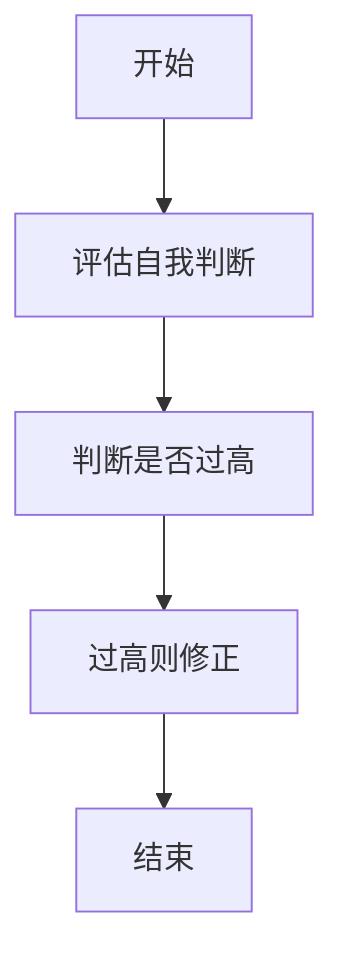
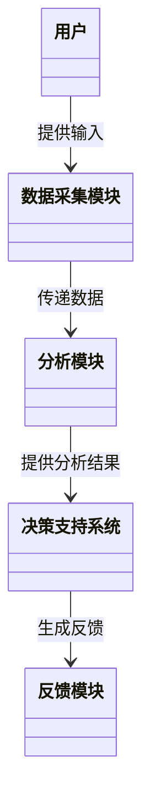
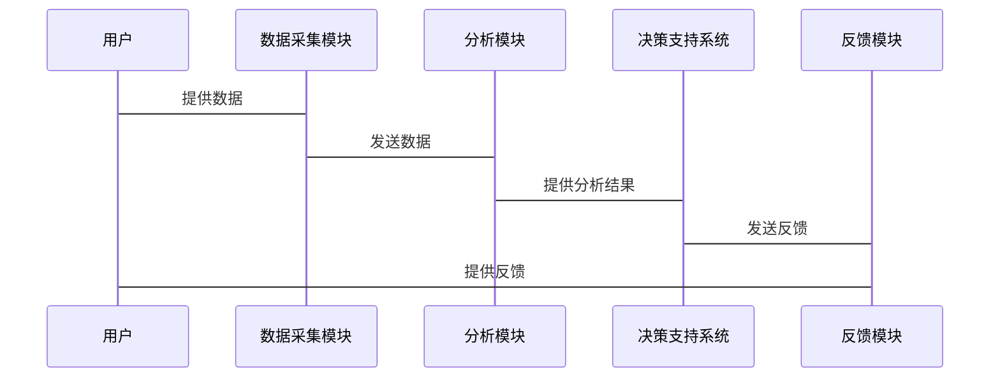

                 


# 芒格的"赢家的诅咒"提醒：警惕过度自信带来的风险

## 关键词：芒格、赢家的诅咒、过度自信、风险管理、决策偏差、系统思维

## 摘要：芒格的“赢家的诅咒”概念提醒我们，过度自信是成功者容易陷入的陷阱。本文从心理学角度分析过度自信的定义与特征，结合数学模型和算法原理，探讨其对决策的影响。通过系统设计和项目实战，提供应对策略，帮助读者在技术领域避免过度自信带来的风险。

---

## 第一部分：芒格"赢家的诅咒"的背景与核心概念

### 第1章：芒格与"赢家的诅咒"概述

#### 1.1 芒格的生平与投资理念
- 1.1.1 芒格的生平简介
格雷厄姆·芒格（Charlie Munger）是世界著名投资家，巴菲特的长期合作伙伴，出生于1924年，现为伯克希尔哈撒韦公司副主席。芒格以其深刻的投资哲学和心理学见解闻名。

- 1.1.2 芒格的投资哲学与思想体系
芒格强调“多元思维模型”，倡导理性思考和避免认知偏差。他的投资理念强调安全边际和长期价值，反对短期投机。

- 1.1.3 芒格与巴菲特的合作关系
芒格与巴菲特的合作始于1971年，两人共同创立了伯克希尔哈撒韦公司，芒格的思维方式对巴菲特的投资策略产生了深远影响。

#### 1.2 "赢家的诅咒"的提出背景
- 1.2.1 问题背景：成功者面临的潜在风险
成功人士常常因为过于自信而低估风险，导致决策失误。

- 1.2.2 问题描述：过度自信的定义与特征
过度自信是指个体对自己能力或判断的过高估计，导致决策偏差。

- 1.2.3 问题解决：如何识别和应对过度自信
通过自我反思、寻求外部反馈和建立决策框架来应对。

- 1.2.4 边界与外延：赢家的诅咒与其他心理偏差的关系
过度自信与确认偏差、乐观偏差等心理偏差相关联。

- 1.2.5 核心要素：过度自信、决策偏差、风险暴露
过度自信导致决策偏差，进而引发风险暴露。

### 第2章：过度自信的定义与特征

#### 2.1 过度自信的多维度分析
- 2.1.1 过度自信的定义与核心属性
过度自信指个体高估自己能力，低估风险，导致判断失误。

- 2.1.2 过度自信的特征对比表
| 特征 | 过度自信 | 正常自信 |
|------|----------|----------|
| 判断 | 过高     | 合理     |
| 风险 | 忽略     | 重视     |
| 表现 | 自大     | 自信     |

- 2.1.3 过度自信的ER实体关系图
```mermaid
er
  entity 过度自信 {
    id
    特征
    表现
  }
  entity 正常自信 {
    id
    特征
    表现
  }
  relation 过度自信和正常自信 (1:1)
```

---

## 第二部分：过度自信的算法原理与数学模型

### 第3章：过度自信的算法原理

#### 3.1 过度自信的算法模型
- 3.1.1 过度自信的识别算法
使用贝叶斯分类器识别决策中的过度自信偏差。

- 3.1.2 过度自信的预测算法
通过蒙特卡洛模拟预测过度自信对投资的影响。

- 3.1.3 过度自信的修正算法
应用反馈机制调整决策，减少过度自信的影响。

#### 3.2 算法流程图
识别过度自信的mermaid流程图：


### 第4章：过度自信的数学模型与公式

#### 4.1 过度自信的概率模型
- 4.1.1 过度自信的概率分布函数
概率密度函数：$f(x) = \frac{1}{\sqrt{2\pi\sigma^2}} e^{-x^2/(2\sigma^2)}$

- 4.1.2 过度自信的贝叶斯模型
先验概率：$P(A|B) = \frac{P(B|A)P(A)}{P(B)}$

- 4.1.3 过度自信的马尔可夫链模型
状态转移矩阵：$P_{ij} = P(X_{t+1}=j|X_t=i)$

#### 4.2 过度自信的数学公式
- 4.2.1 过度自信的概率计算公式
$$P(过度自信) = \frac{N_{high}}{N_{total}}$$

- 4.2.2 过度自信的期望值计算公式
$$E[回报] = \sum p_i r_i$$

- 4.2.3 过度自信的风险评估公式
$$风险暴露 = \sum p_i r_i$$

---

## 第三部分：系统分析与架构设计

### 第5章：决策支持系统设计

#### 5.1 系统功能设计
- 5.1.1 系统目标与功能模块划分
目标：识别和修正过度自信偏差。

模块：数据采集、分析模块、用户界面、反馈系统。

- 5.1.2 系统功能的领域模型mermaid类图


#### 5.2 系统架构设计
- 5.2.1 系统架构图


- 5.2.2 系统接口设计
接口1：用户输入接口
接口2：数据处理接口
接口3：反馈输出接口

- 5.2.3 系统交互mermaid序列图


---

## 第四部分：项目实战与最佳实践

### 第6章：项目实战：构建决策支持系统

#### 6.1 环境安装
安装Python、NumPy、Matplotlib、Scikit-learn。

#### 6.2 系统核心实现源代码
```python
import numpy as np
from sklearn import metrics

def calculate_overconfidence(true_labels, predicted_labels):
    accuracy = metrics.accuracy_score(true_labels, predicted_labels)
    return accuracy

# 示例数据
true_labels = [1, 2, 3, 4, 5]
predicted_labels = [1, 2, 3, 4, 5]

overconfidence_level = calculate_overconfidence(true_labels, predicted_labels)
print(f"Overconfidence Level: {overconfidence_level}")
```

#### 6.3 代码解读与分析
该代码计算模型的准确率，准确率越高，过度自信的风险越大。

#### 6.4 实际案例分析
案例：某投资组合的过度自信导致亏损。

#### 6.5 项目小结
项目展示了如何通过技术手段识别和应对过度自信，构建决策支持系统。

### 第7章：最佳实践与总结

#### 7.1 最佳实践
- 定期自我反思，避免过度自信。
- 建立决策框架，减少偏差影响。
- 引入外部反馈，增强决策的客观性。

#### 7.2 小结
芒格的“赢家的诅咒”提醒我们，成功者需警惕过度自信的风险。通过技术手段识别和修正偏差，能够有效降低风险。

#### 7.3 注意事项
- 过度自信可能与多种心理偏差相关。
- 系统设计需结合实际应用场景。

#### 7.4 拓展阅读
- 建议阅读芒格的《穷查理宝典》深入理解其投资哲学。
- 推荐学习《Thinking, Fast and Slow》了解认知偏差。

---

## 作者：AI天才研究院/AI Genius Institute & 禅与计算机程序设计艺术 /Zen And The Art of Computer Programming

