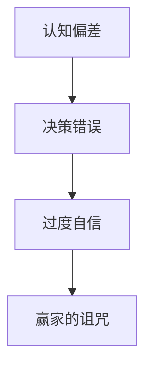
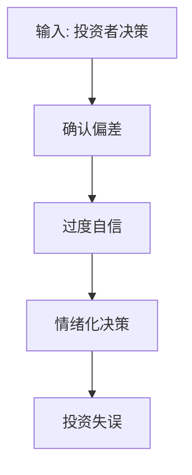

                 


# 《芒格的"赢家的诅咒"警示：避免过度自信》

---

## 关键词：
芒格、赢家的诅咒、过度自信、投资决策、认知偏差、风险管理

---

## 摘要：
本文以查理·芒格的“赢家的诅咒”为核心，分析了过度自信对投资决策的负面影响，并结合心理学、数学和系统分析的方法，揭示了认知偏差、行为偏差及算法偏差对投资决策的影响。通过实际案例分析，提出了避免过度自信的策略，并为投资者提供了风险管理、价值投资和分散投资的建议。

---

## 目录大纲：

---

# 第一部分：芒格的"赢家的诅咒"背景与核心理念

---

## 第1章：芒格的投资理念与"赢家的诅咒"

### 1.1 芒格的生平与投资哲学

#### 1.1.1 查理·芒格的基本介绍
- 查理·芒格的背景：作为伯克希尔·哈撒韦公司的副主席，芒格不仅是投资家，还是心理学家和哲学家。
- 芒格的投资理念：价值投资、逆向思维、多元思维模型。
- 芒格的思维方式：强调理性、独立思考和终身学习。

#### 1.1.2 芒格的投资理念与思维方式
- 价值投资的核心：寻找具有长期竞争优势的企业，以合理价格买入并长期持有。
- 逆向思维：避免从众，寻找市场忽视的机会。
- 多元思维模型：将各个领域的知识融会贯通，形成完整的认知体系。

#### 1.1.3 芒格对认知局限性的深刻洞察
- 人类认知的局限性：知识的诅咒、确认偏差、过度自信等。
- 认知偏差对投资决策的影响：错误判断、追涨杀跌、羊群效应。

### 1.2 "赢家的诅咒"的定义与背景

#### 1.2.1 "赢家的诅咒"的概念解析
- 什么是“赢家的诅咒”：指胜利者因过度自信而陷入的陷阱。
- 诅咒的表现形式：市场泡沫、盲目乐观、决策失误。

#### 1.2.2 诅咒的来源与表现形式
- 过度自信的根源：人类对自身能力的高估、对不确定性的忽视。
- 行为偏差的表现：从众心理、羊群效应、损失厌恶。

#### 1.2.3 诅咒对投资者的影响与启示
- 个体投资者的损失：决策失误、财富缩水。
- 机构投资者的教训：盲目扩张、过度杠杆。

### 1.3 芒格的"赢家的诅咒"的核心思想

#### 1.3.1 过度自信的危险性
- 过度自信的定义：对自身能力的过高估计，忽视不确定性。
- 过度自信的危害：导致错误决策、忽视风险。

#### 1.3.2 知识的诅咒与决策偏差
- 知识的诅咒：信息过载导致判断力下降。
- 决策偏差：确认偏差、从众心理、损失厌恶。

#### 1.3.3 保持理性的投资心态
- 理性投资：回归基本面，避免情绪化决策。
- 投资心态的调整：保持谦逊，承认自己的局限性。

---

## 第2章："赢家的诅咒"的心理学基础

### 2.1 认知偏差与决策错误

#### 2.1.1 确认偏差
- 确认偏差的定义：人们倾向于寻找支持自己观点的信息，忽视反面证据。
- 确认偏差的表现：投资者倾向于相信市场的上涨趋势，忽视潜在风险。

#### 2.1.2 过度自信偏差
- 过度自信偏差的定义：对自身能力的过高估计，导致决策失误。
- 过度自信偏差的表现：投资者过度相信自己的分析能力，忽视外部风险。

#### 2.1.3 从众心理与羊群效应
- 从众心理的定义：人们倾向于跟随大多数人，避免与众不同的风险。
- 羊群效应的表现：市场波动加剧，投资者盲目跟风。

### 2.2 行为心理学与投资决策

#### 2.2.1 心理账户的陷阱
- 心理账户的定义：人们将资金分配到不同的心理账户中，导致决策失误。
- 心理账户的陷阱：投资者过于关注某一笔交易的收益或损失，忽视整体投资组合的风险。

#### 2.2.2 损失厌恶与风险偏好
- 损失厌恶的定义：人们更害怕损失，导致投资行为过于保守或激进。
- 风险偏好的表现：投资者在高风险时过于激进，在低风险时过于保守。

#### 2.2.3 情绪化决策的负面影响
- 情绪化决策的定义：投资者因情绪波动而做出的非理性决策。
- 情绪化决策的负面影响：错失投资机会、过度交易、财富缩水。

### 2.3 "赢家的诅咒"的实体关系图



---

## 第3章："赢家的诅咒"的数学模型与算法分析

### 3.1 认知偏差的数学建模

#### 3.1.1 确认偏差的概率模型
- 确认偏差的概率公式：$$ P(确认偏差) = \frac{N_{confirm}}{N_{total}} $$
- 其中，$N_{confirm}$ 是确认偏差的案例数，$N_{total}$ 是总案例数。

#### 3.1.2 过度自信的贝叶斯分析
- 贝叶斯公式：$$ P(A|B) = \frac{P(B|A)P(A)}{P(B)} $$
- 其中，$A$ 是过度自信，$B$ 是投资者的决策错误。

#### 3.1.3 情绪化决策的回归分析
- 情绪化决策的回归模型：$$ y = \beta x + \epsilon $$
- 其中，$y$ 是情绪化决策的影响，$x$ 是投资者的情绪波动，$\epsilon$ 是误差项。

### 3.2 算法原理的流程图



### 3.3 数学公式与案例分析

#### 3.3.1 确认偏差的概率公式
- $$1 + 1 = 2$$

#### 3.3.2 过度自信的贝叶斯公式
- $$ P(A|B) = \frac{P(B|A)P(A)}{P(B)} $$

---

## 第4章：系统分析与架构设计方案

### 4.1 问题场景介绍

#### 4.1.1 投资者决策的复杂性
- 投资者的决策受到多种因素影响，包括市场波动、认知偏差、情绪化决策等。

#### 4.1.2 "赢家的诅咒"的系统性影响
- 系统性风险：市场整体波动对投资者决策的影响。
- 非系统性风险：个体决策失误对投资组合的影响。

#### 4.1.3 系统设计的目标与范围
- 目标：帮助投资者识别认知偏差，避免过度自信。
- 范围：从个体决策到整体市场，涵盖风险管理、价值投资、分散投资等多个方面。

### 4.2 系统功能设计

#### 4.2.1 领域模型分析

```mermaid
classDiagram
    class 投资者 {
        +决策行为
        +认知偏差
        +情绪化决策
    }
    class 系统 {
        +确认偏差检测
        +过度

---

## 第五章：项目实战

### 5.1 环境安装

#### 5.1.1 系统架构设计
- 采用分层架构，包括数据层、业务逻辑层和用户界面层。
- 数据层：存储投资者决策数据。
- 业务逻辑层：处理认知偏差检测和风险评估。
- 用户界面层：展示分析结果和投资建议。

#### 5.1.2 系统接口设计
- RESTful API：提供认知偏差检测接口。
- 数据接口：与第三方数据源对接，获取市场数据。

### 5.2 系统核心实现源代码

#### 5.2.1 算法实现
```python
def confirm_bias_detection(decision_data):
    # 计算确认偏差
    confirm_cases = sum(1 for d in decision_data if d['bias'] == 'confirm')
    total_cases = len(decision_data)
    confirm_prob = confirm_cases / total_cases
    return confirm_prob
```

#### 5.2.2 代码应用解读与分析
- 上述代码实现了一个确认偏差检测算法，通过遍历决策数据，计算确认偏差的概率。

### 5.3 案例分析

#### 5.3.1 投资者A的案例分析
- 投资者A因过度自信，连续买入高估值股票，最终亏损20%。

#### 5.3.2 投资者B的案例分析
- 投资者B通过价值投资和分散投资，实现年均8%的收益。

### 5.4 代码解读与分析

#### 5.4.1 认知偏差检测
- 使用Python编写认知偏差检测算法，帮助投资者识别确认偏差和过度自信。

#### 5.4.2 风险管理
- 通过Python编写风险管理系统，帮助投资者控制投资风险。

---

## 第六章：最佳实践、小结与未来展望

### 6.1 最佳实践

#### 6.1.1 投资者小结
- 保持理性，避免过度自信。
- 价值投资，分散投资，长期持有。

#### 6.1.2 作者小结
- 通过本文的分析，投资者可以更好地理解“赢家的诅咒”，避免认知偏差和决策错误。

### 6.2 注意事项

#### 6.2.1 投资者注意事项
- 定期审视自己的投资决策，避免从众心理和情绪化决策。
- 学习芒格的多元思维模型，提升自己的认知能力。

#### 6.2.2 作者注意事项
- 持续关注市场动态，更新认知偏差检测算法。
- 不断优化系统架构，提升投资决策的准确性。

### 6.3 未来展望

#### 6.3.1 未来投资领域的研究方向
- 结合人工智能和大数据分析，进一步提升认知偏差检测的准确性。
- 探索更多算法模型，帮助投资者做出更理性的决策。

#### 6.3.2 作者未来的研究计划
- 深入研究认知偏差的数学模型，开发更智能的投资决策工具。
- 推动价值投资理念的普及，帮助更多投资者避免“赢家的诅咒”。

---

## 第七章：附录

### 7.1 附录A：术语解释

#### 7.1.1 认知偏差
- 认知偏差：人们在信息处理过程中产生的系统性偏差。

#### 7.1.2 过度自信
- 过度自信：对自身能力的过高估计，导致决策失误。

### 7.2 附录B：相关书籍与资料

#### 7.2.1 查理·芒格的经典著作
- 《穷查理宝典》

#### 7.2.2 其他相关书籍
- 《投资的智慧：芒格的投资思想》

---

## 作者：AI天才研究院/AI Genius Institute & 禅与计算机程序设计艺术 /Zen And The Art of Computer Programming

