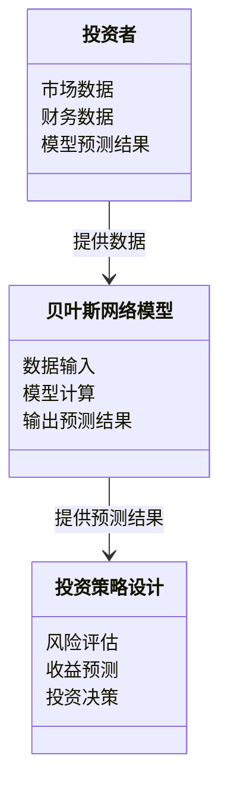
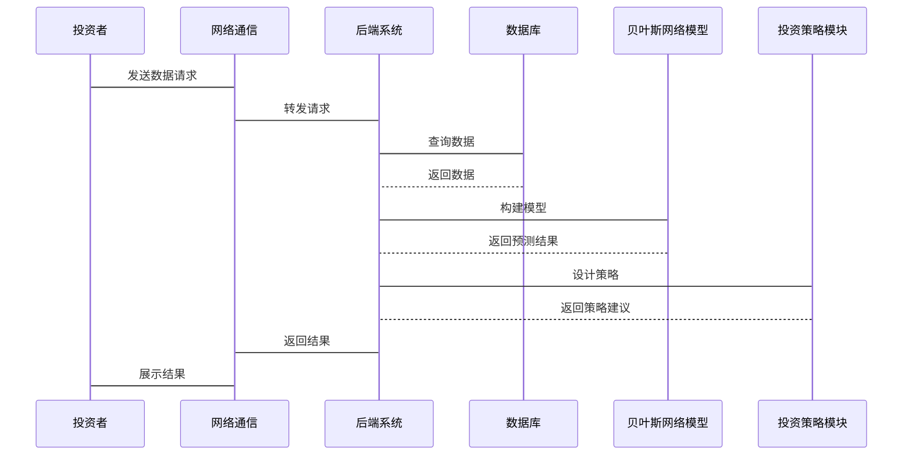

                 


# 芒格的"跨学科学习"在投资视野拓展中的应用

> **关键词**: 芒格, 跨学科学習, 投资视野, 决策模型, 贝叶斯网络, 系統架構, 投資策略

> **摘要**: 本文深入探讨了芒格的跨学科学习方法在投资视野拓展中的应用。通过结合心理学、经济学、决策科学等多学科的知识，分析了如何利用跨学科学习优化投资决策。文章详细介绍了跨学科学习的核心概念、数学模型、算法原理，并通过实际案例分析和系统设计展示了如何将跨学科学习应用于投资实践。最后，本文总结了跨学科学习在投资中的最佳实践和未来研究方向。

---

## 第一部分: 芒格的跨学科学习概述

### 第1章: 芒格的跨学科学习方法概述

#### 1.1 芒格的跨学科学习方法

**1.1.1 芒格的“知识的圆圈”理论**

芒格提出的“知识的圆圈”理论是跨学科学习的核心思想。他认为，投资者需要构建一个由多个学科组成的知识框架，通过交叉融合形成一个完整的认知系统。这个系统能够帮助投资者在面对复杂问题时，能够从多个角度进行分析和判断。

**1.1.2 跨学科学習的核心要素**

跨学科学习的核心要素包括以下几个方面：

1. **多学科知识的整合**: 将心理学、经济学、决策科学等学科的知识整合到投资决策中。
2. **知识的深度与广度**: 在每个学科中深入学习核心概念，同时扩展知识的广度，形成全局视角。
3. **实践应用**: 将跨学科学习的成果应用到实际投资中，验证理论的有效性。

**1.1.3 跨学科学習在投資中的重要性**

跨学科学习在投资中的重要性体现在以下几个方面：

1. **解决复杂问题**: 投资中的决策往往涉及多个因素，跨学科学习能够帮助投资者全面分析问题。
2. **优化决策质量**: 通过整合不同学科的知识，投资者能够做出更明智的投资决策。
3. **降低认知偏差**: 跨学科学習能够帮助投资者识别和克服认知偏差，减少决策失误。

#### 1.2 投资视野拓展的背景与问题

**1.2.1 当前投资环境的复杂性**

当前的投资环境日益复杂，市场参与者的行为、宏观经济的变化、技术的进步等因素交织在一起，给投资者带来了巨大的挑战。投资者需要具备更广阔的投资视野，才能在复杂的环境中找到投资机会。

**1.2.2 投资者面临的常见问题**

投资者在实际操作中常常面临以下问题：

1. **认知偏差**: 过度自信、确认偏差等认知偏差会影响投资者的决策。
2. **信息过载**: 过多的信息使得投资者难以快速做出决策。
3. **风险与收益的平衡**: 如何在风险与收益之间找到平衡点是投资者面临的难题。

**1.2.3 跨学科学習如何解决这些问题**

跨学科学习通过整合多个学科的知识，帮助投资者克服认知偏差、快速筛选信息，并在风险与收益之间找到平衡点。具体来说：

1. **克服认知偏差**: 通过心理学知识了解认知偏差的成因，并采取相应的策略来减少其影响。
2. **信息筛选**: 通过经济学和决策科学的方法，快速筛选有用信息。
3. **风险与收益平衡**: 通过金融学和统计学的知识，构建风险与收益平衡的投资组合。

---

## 第二部分: 跨学科学習的核心概念与联系

### 第2章: 跨学科学習的核心概念

#### 2.1 心理学在投资中的应用

**2.1.1 认知偏差与决策失误**

认知偏差是心理学中的一个重要概念，指的是人们在感知和判断时，由于主观因素的影响，导致的逻辑推理错误。常见的认知偏差包括：

1. **过度自信**: 过度自信会导致投资者高估自己的判断能力，从而做出错误的决策。
2. **确认偏差**: 确认偏差是指人们倾向于寻找和关注与自己已有观点一致的信息，而忽视相反的信息。
3. **锚定效应**: 锚定效应是指人们在决策时，过于依赖某个初始信息，导致判断失误。

**2.1.2 行为决策理论**

行为决策理论是心理学与经济学的交叉学科，研究人类在决策过程中的行为特征。与传统经济学的理性决策模型不同，行为决策理论更关注实际决策中的非理性行为。例如，损失厌恶、风险偏好等。

**2.1.3 心理账户与投资行为**

心理账户是指人们在实际生活中，将资金按照不同的用途进行分类管理的一种心理现象。在投资中，心理账户会影响投资者的决策行为。例如，投资者可能会将短期资金和长期资金分开管理，从而影响投资决策。

#### 2.2 经济学基础

**2.2.1 微观经济学与宏观经济学**

微观经济学研究个体经济单位（如家庭、企业）的经济行为，而宏观经济学研究整个经济系统的运行。在投资中，微观经济学可以帮助投资者理解企业的经营状况，而宏观经济学可以帮助投资者把握宏观经济环境对投资的影响。

**2.2.2 市场行为与价格形成**

市场行为与价格形成是经济学中的重要概念。在投资中，理解市场行为可以帮助投资者预测价格走势。例如，通过分析市场参与者的心理预期，可以预测价格的变化趋势。

**2.2.3 经济周期与投资策略**

经济周期是指经济活动的波动，通常分为繁荣、衰退、萧条和复苏四个阶段。在不同经济周期下，投资策略也会有所不同。例如，在经济衰退时期，防御性资产（如债券）可能更受欢迎。

#### 2.3 决策科学

**2.3.1 决策树模型**

决策树模型是一种用于支持决策的工具，通过树状图的形式展示决策的可能结果。在投资中，决策树模型可以用于分析不同投资策略的可能结果，从而帮助投资者做出最优决策。

**2.3.2 风险评估与管理**

风险评估与管理是决策科学中的重要组成部分。在投资中，风险评估可以帮助投资者识别潜在风险，并制定相应的风险管理策略。例如，通过计算风险价值（VaR）等指标，可以量化投资组合的风险。

**2.3.3 多标准决策分析**

多标准决策分析是一种用于复杂决策的工具，可以帮助投资者在多个标准下进行权衡。例如，在选择投资项目时，投资者需要考虑收益、风险、流动性等多个因素。

#### 2.4 财务与会计学

**2.4.1 财务报表分析**

财务报表分析是投资决策中的重要环节。通过分析企业的财务报表，投资者可以了解企业的财务状况、盈利能力等信息。例如，通过分析利润表，可以了解企业的收入和利润情况。

**2.4.2 估值方法（DCF模型）**

DCF模型是一种常用的估值方法，通过预测企业未来现金流的现值来评估企业价值。在投资中，DCF模型可以帮助投资者评估企业的内在价值，从而做出投资决策。

**2.4.3 财务比率分析**

财务比率分析是通过对企业财务报表中的各项指标进行比率计算，来评估企业的财务状况。例如，通过计算市盈率、市净率等指标，可以评估企业的估值是否合理。

---

## 第三部分: 投资视野的拓展与模型构建

### 第3章: 跨学科模型在投资中的应用

#### 3.1 贝叶斯网络模型

**3.1.1 贝叶斯网络的基本原理**

贝叶斯网络是一种基于概率论的图形化模型，用于表示变量之间的关系。在投资中，贝叶斯网络可以用于风险评估和预测。例如，通过分析市场趋势、企业基本面等因素，构建贝叶斯网络模型，预测企业的未来表现。

**3.1.2 贝叶斯网络在风险评估中的应用**

贝叶斯网络可以用于风险评估，通过分析不同风险因素之间的关系，预测风险发生的概率。例如，在投资组合管理中，可以通过贝叶斯网络模型，评估不同资产之间的相互影响，从而优化投资组合的风险。

**3.1.3 实例分析：如何利用贝叶斯网络进行投资决策**

假设我们想要评估某家科技公司的投资价值。首先，我们需要收集与该公司相关的各种信息，包括市场需求、技术优势、财务状况等。然后，通过贝叶斯网络模型，将这些信息进行整合，预测该公司未来的表现，并根据预测结果做出投资决策。

---

## 第四部分: 系統架構与投资策略设计

### 第4章: 系統架構与投资策略设计

#### 4.1 问题场景介绍

在投资中，我们需要构建一个能够整合多学科知识的系统，以支持投资决策。这个系统需要具备以下功能：

1. 数据采集与处理: 收集市场数据、财务数据等。
2. 模型构建: 构建贝叶斯网络等模型，进行风险评估和预测。
3. 投资策略设计: 根据模型预测结果，制定投资策略。

#### 4.2 系统功能设计

**4.2.1 领域模型（Mermaid 类图）**



**4.2.2 系统架构设计（Mermaid 架构图）**


**4.2.3 系统接口设计**

1. **数据接口**: 提供数据采集和处理的接口，支持多种数据源。
2. **模型接口**: 提供贝叶斯网络模型的调用接口，支持多种输入格式。
3. **策略接口**: 提供投资策略设计的接口，支持多种策略模板。

**4.2.4 系统交互（Mermaid 序列图）**



---

## 第五部分: 项目实战与案例分析

### 第5章: 项目实战

#### 5.1 环境配置

在进行项目实战之前，需要配置开发环境。以下是所需的工具和库：

1. **Python**: 用于数据分析和建模。
2. **Pandas**: 数据处理库。
3. **NetworkX**: 图形化库，用于构建贝叶斯网络。
4. **Scikit-learn**: 机器学习库，用于模型训练。

#### 5.2 核心实现源代码

以下是贝叶斯网络模型的核心实现代码：

```python
import networkx as nx
from sklearn.naive_bayes import GaussianNB

# 数据预处理
X = df.drop('target', axis=1).values
y = df['target'].values

# 训练贝叶斯网络模型
model = GaussianNB()
model.fit(X, y)

# 可视化贝叶斯网络
def visualize_model(model, feature_names):
    graph = nx.DiGraph()
    graph.add_nodes_from(feature_names)
    # 添加边（根据模型的依赖关系）
    for i in range(len(feature_names)):
        for j in range(len(feature_names)):
            if i != j and model._get_coef(i, j) != 0:
                graph.add_edge(feature_names[i], feature_names[j])
    nx.draw(graph, with_labels=True, node_color='white')
    plt.show()

visualize_model(model, feature_names)
```

#### 5.3 案例分析

**案例分析：股票投资**

假设我们想要分析某家科技公司的股票投资价值。首先，我们需要收集与该公司相关的数据，包括市场需求、技术优势、财务状况等。然后，通过贝叶斯网络模型，分析这些因素之间的关系，预测公司的未来表现。最后，根据预测结果制定投资策略。

---

## 第六部分: 总结与展望

### 第6章: 总结与展望

#### 6.1 最佳实践 tips

1. **持续学习**: 投资者需要不断学习新知识，扩展自己的知识框架。
2. **多学科应用**: 在实际投资中，结合多个学科的知识，优化投资决策。
3. **模型验证**: 在实际应用中，需要不断验证模型的有效性，并根据实际情况进行调整。

#### 6.2 小结

本文深入探讨了芒格的跨学科学习方法在投资视野拓展中的应用。通过结合心理学、经济学、决策科学等多学科的知识，分析了如何利用跨学科学习优化投资决策。文章详细介绍了跨学科学习的核心概念、数学模型、算法原理，并通过实际案例分析和系统设计展示了如何将跨学科学习应用于投资实践。

#### 6.3 注意事项

1. **数据质量**: 数据质量对模型的准确性有重要影响，投资者需要确保数据的准确性和完整性。
2. **模型局限性**: 模型的预测结果是基于历史数据和假设条件的，实际投资中需要考虑模型的局限性。
3. **风险管理**: 投资者需要制定有效的风险管理策略，以应对市场的不确定性。

#### 6.4 拓展阅读

1. **《富爸爸 贫爸爸》**: 通过案例分析，帮助投资者理解财务知识。
2. **《投资最重要的事情》**: 提供投资中的重要原则和策略。
3. **《思考，快与慢》**: 通过心理学的角度，分析人类的决策过程。

---

## 作者

**作者：AI天才研究院/AI Genius Institute & 禅与计算机程序设计艺术 /Zen And The Art of Computer Programming**

---

以上是完整的目录大纲和文章内容，涵盖了从理论到实践的各个方面，详细介绍了芒格的跨学科学习方法在投资中的应用。

