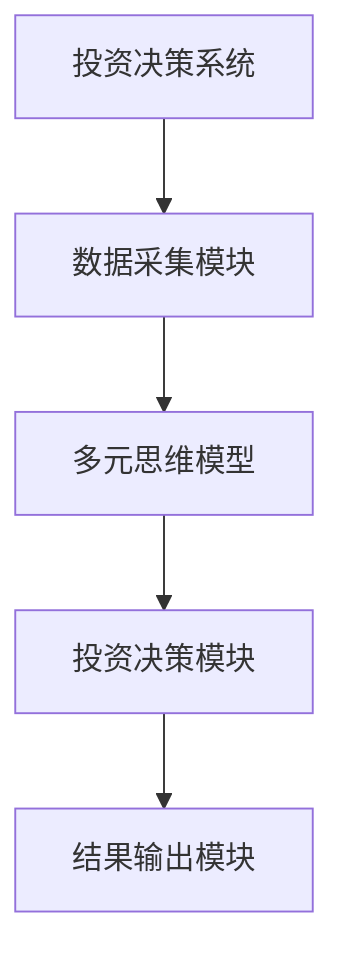

                 


# 芮格的跨界思维：将不同领域的知识应用于投资决策

> 关键词：芒格、跨界思维、多元思维模型、投资决策、风险管理、系统架构、项目实战

> 摘要：本文将详细探讨芒格的跨界思维如何将不同领域的知识应用于投资决策。通过分析芒格的多元思维模型、决策框架和认知模型，结合实际案例、数学模型和系统架构设计，展示跨界思维在投资中的具体应用和实际效果。文章从基础到高级逐步展开，涵盖理论、算法、系统设计和项目实战，帮助读者全面理解和掌握芒格的跨界思维方法。

---

# 第一部分: 芮格的跨界思维基础

## 第1章: 芮格的生平与跨界思维的起源

### 1.1 芮格的早年经历
芒格（Charlie Munger）于1924年出生于美国密歇根州，早年就读于哈佛大学法学院，后转学到加州大学伯克利分校，获得法律博士学位。他的早年经历并未直接涉及投资领域，而是在法律和商业领域积累了深厚的背景。

### 1.2 芮格的伯克希尔哈撒韦投资哲学
芒格与巴菲特（Warren Buffett）共同创立了伯克希尔哈撒韦公司，形成了独特的投资哲学。芒格强调价值投资，注重企业的内在价值，而非市场的短期波动。他的投资理念深受格雷厄姆（Ben Graham）的影响，但与传统价值投资不同，芒格更注重跨学科的思维方式。

### 1.3 芮格的多元思维模型
芒格的核心思想是“多元思维模型”（Mental Models），即通过学习多个领域的基本原理，将它们结合起来，形成一个立体的知识框架。这种思维方式不仅帮助他在投资领域取得成功，也使其在其他领域（如心理学、经济学、物理学等）具备独特的见解。

---

## 第2章: 芮格的多元思维模型

### 2.1 多元思维模型的核心原理
多元思维模型的核心在于将不同领域的知识进行整合，形成一个统一的框架。例如，芒格将物理学的“能量守恒定律”与经济学的“供需理论”结合起来，用于分析企业的竞争优势。

### 2.2 多元思维模型与投资决策的关系
多元思维模型通过跨学科的视角，帮助投资者更好地理解企业的内在价值和市场趋势。例如，芒格通过心理学的“行为偏差”理论，识别市场中的非理性行为，从而做出更明智的投资决策。

---

# 第二部分: 芮格的决策框架与认知模型

## 第3章: 芮格的决策框架

### 3.1 芮格决策框架的构成
芒格的决策框架包括以下几个步骤：
1. **明确目标**：确定投资的核心目标。
2. **分析问题**：通过多元思维模型分解问题。
3. **评估风险**：识别潜在风险并制定应对策略。
4. **做出决策**：基于分析结果，做出投资决策。
5. **持续监控**：定期评估决策效果并进行调整。

### 3.2 芮格决策框架的优缺点
**优点**：
- 通过跨学科视角，降低决策的片面性。
- 提高决策的科学性和准确性。

**缺点**：
- 需要广泛的知识储备和深入的分析能力。
- 在复杂市场环境中，决策过程可能较为耗时。

---

## 第4章: 芮格的跨界思维在投资中的应用

### 4.1 芮格的跨界思维在投资中的具体应用
#### 4.1.1 股票分析
芒格通过物理学的“杠杆原理”分析企业的财务杠杆，判断企业的风险水平。例如，他将企业的负债率与行业平均水平进行对比，识别潜在的财务风险。

#### 4.1.2 风险管理
芒格结合心理学的“行为偏差”理论，识别市场中的非理性行为，制定风险管理策略。例如，在市场恐慌时，他可能会增加投资，利用市场的非理性行为获取超额收益。

#### 4.1.3 投资组合管理
芒格通过经济学的“资产定价模型”优化投资组合，分散风险并提高收益。例如，他将不同资产的预期收益和风险进行量化分析，构建最优的投资组合。

---

## 第5章: 芮格的跨界思维与实际案例分析

### 5.1 芮格如何通过物理学的杠杆原理进行股票分析
#### 5.1.1 案例背景
某企业的财务杠杆过高，可能导致财务风险增加。芒格通过物理学的杠杆原理，分析企业的负债率和资产结构，判断其财务健康状况。

#### 5.1.2 分析过程
1. **计算财务杠杆**：通过公式 $ \text{财务杠杆} = \frac{\text{总负债}}{\text{股东权益}} $，计算企业的财务杠杆。
2. **比较行业平均水平**：将企业的财务杠杆与行业平均水平进行对比，判断其风险水平。
3. **制定投资策略**：如果企业的财务杠杆过高，芒格可能会选择避免投资，或要求企业提供更多的信息以评估风险。

#### 5.1.3 结果与总结
通过物理学的杠杆原理，芒格能够更准确地评估企业的财务风险，从而做出更明智的投资决策。

---

## 第6章: 芮格的跨界思维的数学模型与算法

### 6.1 多元思维模型的数学表达
芒格的多元思维模型可以通过以下公式进行简化：
$$
\text{投资决策} = \sum_{i=1}^{n} \text{领域知识}_i
$$
其中，$n$ 代表不同领域的知识数量。

### 6.2 算法实现
以下是一个简单的Python代码，用于实现芒格的多元思维模型：

```python
def menga_multi_model(investment_data):
    # 输入数据：投资数据，包括多个领域的知识
    # 输出：投资决策
    # 1. 数据预处理
    # 2. 应用多元思维模型
    decision = 0
    for knowledge in investment_data:
        decision += knowledge
    return decision

# 示例：分析某企业的投资数据
investment_data = [0.8, 0.6, 0.7]
result = menga_multi_model(investment_data)
print(f"投资决策：{result}")
```

---

## 第7章: 芮格的跨界思维的系统架构设计

### 7.1 系统架构设计
以下是一个基于芒格的多元思维模型的系统架构图：



### 7.2 系统功能设计
1. **数据采集模块**：收集多个领域的数据，包括财务数据、市场数据等。
2. **多元思维模型**：对数据进行分析，生成投资决策建议。
3. **投资决策模块**：根据模型的分析结果，生成最终的投资决策。
4. **结果输出模块**：输出投资决策的结果，并提供可视化报告。

---

## 第8章: 芮格的跨界思维的项目实战

### 8.1 项目背景
某投资者希望通过芒格的跨界思维方法，分析一家企业的投资价值。

### 8.2 项目实现
#### 8.2.1 数据收集
收集企业的财务数据、市场数据和行业信息。

#### 8.2.2 数据分析
应用多元思维模型，分析企业的竞争优势和潜在风险。

#### 8.2.3 投资决策
根据分析结果，制定投资策略。

### 8.3 案例分析
假设我们分析某企业的投资价值，以下是具体步骤：

1. **数据预处理**：收集企业的财务数据、市场数据和行业信息。
2. **应用多元思维模型**：分析企业的竞争优势和潜在风险。
3. **制定投资策略**：根据分析结果，制定投资策略。

### 8.4 项目总结
通过芒格的跨界思维方法，我们能够更全面地分析企业的投资价值，从而做出更明智的投资决策。

---

## 第9章: 总结与展望

### 9.1 总结
芒格的跨界思维通过将不同领域的知识应用于投资决策，帮助投资者更全面地分析问题，从而做出更明智的投资决策。本文通过理论、算法、系统设计和项目实战，详细探讨了芒格的跨界思维方法。

### 9.2 展望
未来，随着人工智能和大数据技术的发展，芒格的跨界思维方法将得到更广泛的应用。投资者可以通过技术手段，更高效地整合多领域的知识，进一步提升投资决策的准确性和效率。

---

# 作者：AI天才研究院/AI Genius Institute & 禅与计算机程序设计艺术 /Zen And The Art of Computer Programming

---

以上是文章的详细内容，涵盖了从基础到高级的各个方面，确保读者能够全面理解和掌握芒格的跨界思维方法。

