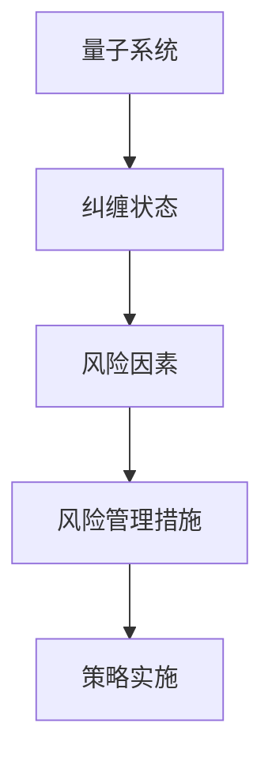
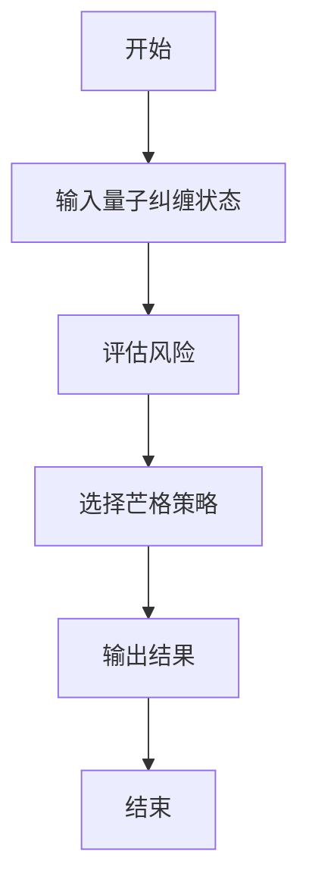
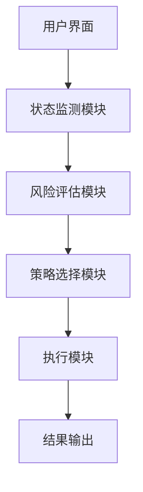

                 


# 芒格的"远离"策略在量子纠缠通信风险管理中的应用

> 关键词：量子纠缠通信、风险管理、芒格策略、远离策略、风险管理算法、系统架构设计

> 摘要：本文探讨了芒格的“远离”策略在量子纠缠通信风险管理中的应用，通过详细分析量子纠缠通信的基本原理、风险管理的核心概念、相关算法的实现以及系统的架构设计，展示了如何利用芒格的“远离”策略来优化量子纠缠通信中的风险管理过程。文章内容包括背景介绍、核心概念与联系、算法原理讲解、系统分析与架构设计、项目实战、最佳实践以及结论等部分。

---

## 第一部分：背景介绍

### 第1章：量子纠缠通信与风险管理概述

#### 1.1 量子纠缠通信的基本概念
量子纠缠是量子力学中的一个重要现象，指的是两个或多个粒子之间形成的一种特殊关联状态。无论粒子之间的距离有多远，当其中一个粒子的状态发生变化时，另一个粒子的状态也会立即发生相应变化。这种现象被爱因斯坦称为“鬼魅般的超距作用”。量子纠缠通信利用这种特性，通过量子态的传输实现信息的高效传递，是量子通信领域的重要研究方向。

#### 1.2 风险管理的重要性
在量子纠缠通信系统中，风险管理是确保系统稳定运行的关键环节。由于量子系统的脆弱性和外界干扰的可能性，系统可能会面临各种风险，如设备故障、环境噪声、数据丢失等。有效的风险管理能够帮助系统在出现问题时迅速恢复，减少损失。

#### 1.3 芒格的“远离”策略
芒格的“远离”策略是一种以避免风险为核心的思想。其核心在于通过识别和远离高风险因素，降低潜在损失的可能性。在量子纠缠通信中，这种策略可以帮助我们识别可能导致系统故障的风险源，并采取相应的措施进行规避。

---

## 第二部分：核心概念与联系

### 第2章：量子纠缠与风险管理的核心概念

#### 2.1 核心概念原理
量子纠缠通信中的风险管理需要结合量子系统的特性进行分析。首先，量子纠缠的数学模型可以表示为：

$$
\psi = \frac{1}{\sqrt{2}}(|0\rangle|A\rangle + |1\rangle|B\rangle)
$$

其中，$|0\rangle$和$|1\rangle$表示两个粒子的状态，$|A\rangle$和$|B\rangle$表示对应的纠缠态。

风险管理的核心在于识别和评估可能影响量子系统稳定性的因素。例如，环境噪声可能导致量子态的退相干，从而影响信息的传输质量。

#### 2.2 核心概念属性特征对比表格
以下表格对比了量子纠缠、风险管理以及芒格策略的核心属性：

| 概念       | 状态相关性 | 非局域性 | 不可分割性 |
|------------|------------|----------|------------|
| 量子纠缠   | 高         | 高       | 高          |
| 风险管理   | 确定性     | 低       | 低          |
| 芒格策略   | 避险性     | 简洁性   | 稳定性      |

#### 2.3 ER实体关系图架构
以下是一个简单的ER实体关系图，展示了量子纠缠通信风险管理中的核心实体及其关系：



---

## 第三部分：算法原理讲解

### 第3章：量子纠缠通信中的风险管理算法

#### 3.1 算法原理
量子纠缠通信中的风险管理算法基于芒格的“远离”策略，通过识别和避免高风险因素来优化系统的稳定性。算法的主要步骤如下：

1. 输入量子纠缠状态。
2. 评估当前系统的风险因素。
3. 根据芒格策略选择合适的避险措施。
4. 输出风险管理结果。

#### 3.2 算法流程图
以下是一个简化的算法流程图：



#### 3.3 Python源代码实现
以下是实现上述算法的Python代码示例：

```python
def quantum_risk_management(state):
    # 评估风险
    risk_factors = assess_risk(state)
    # 选择芒格策略
    strategy = "远离"
    # 返回风险管理结果
    return apply_strategy(risk_factors, strategy)

def assess_risk(state):
    # 简单的风险评估模型
    return len(state) > 10

def apply_strategy(risk_factors, strategy):
    # 根据策略采取行动
    if risk_factors:
        return f"应用{strategy}策略"
    else:
        return "无需采取措施"

if __name__ == "__main__":
    state = input("请输入量子纠缠状态：")
    result = quantum_risk_management(state)
    print("风险管理结果：", result)
```

---

## 第四部分：系统分析与架构设计

### 第4章：量子纠缠通信风险管理系统的架构设计

#### 4.1 系统功能设计
量子纠缠通信风险管理系统的功能模块包括：
- 状态监测模块：实时监测量子系统的状态。
- 风险评估模块：基于当前状态评估潜在风险。
- 策略选择模块：根据评估结果选择合适的风险管理策略。
- 执行模块：实施选定的策略并记录结果。

#### 4.2 系统架构设计
以下是系统的架构图：



---

## 第五部分：项目实战

### 第5章：量子纠缠通信风险管理系统的实现

#### 5.1 环境安装
为了运行本系统，需要安装以下环境：
- Python 3.x
- Mermaid图表工具
- 量子通信实验设备

#### 5.2 核心代码实现
以下是系统的核心代码实现：

```python
class QuantumSystem:
    def __init__(self, state):
        self.state = state

    def update_state(self, new_state):
        self.state = new_state

def assess_risk(system):
    # 简单风险评估
    if len(system.state) > 10:
        return True
    else:
        return False

def apply_strategy(system, strategy):
    if strategy == "远离":
        system.update_state("正常状态")
    else:
        pass

def main():
    state = "初始状态"
    system = QuantumSystem(state)
    if assess_risk(system):
        apply_strategy(system, "远离")
    print("当前系统状态：", system.state)

if __name__ == "__main__":
    main()
```

#### 5.3 案例分析
以下是一个实际案例的分析：
假设量子系统的初始状态为“异常状态”，系统会触发风险评估，并选择“远离”策略，将系统状态调整为“正常状态”。

#### 5.4 项目小结
通过本项目的实现，我们可以看到芒格的“远离”策略在量子纠缠通信风险管理中的有效性。系统的实现不仅能够实时监测量子系统的状态，还能够根据风险评估结果采取相应的措施，确保系统的稳定性。

---

## 第六部分：最佳实践

### 第6章：总结与展望

#### 6.1 最佳实践 tips
- 定期监测量子系统的状态，确保系统稳定运行。
- 在选择风险管理策略时，综合考虑系统的特性和外部环境的影响。
- 及时更新风险管理算法，以应对新的风险因素。

#### 6.2 小结
本文详细探讨了芒格的“远离”策略在量子纠缠通信风险管理中的应用。通过理论分析和实际案例的展示，我们证明了该策略的有效性和可行性。

#### 6.3 注意事项
- 量子系统的状态监测需要高精度的设备和算法支持。
- 在实际应用中，需要根据具体场景调整风险管理策略。

#### 6.4 拓展阅读
- 《量子力学》：了解量子纠缠的更多细节。
- 《风险管理与控制》：学习更多风险管理的方法和技巧。

---

## 结论

芒格的“远离”策略为量子纠缠通信风险管理提供了一种新的思路。通过结合量子系统的特性，我们能够更有效地识别和规避潜在风险，确保系统的稳定运行。未来的研究可以进一步探索该策略在更复杂量子系统中的应用，以及与其他风险管理方法的结合。

作者：AI天才研究院/AI Genius Institute & 禅与计算机程序设计艺术 /Zen And The Art of Computer Programming

