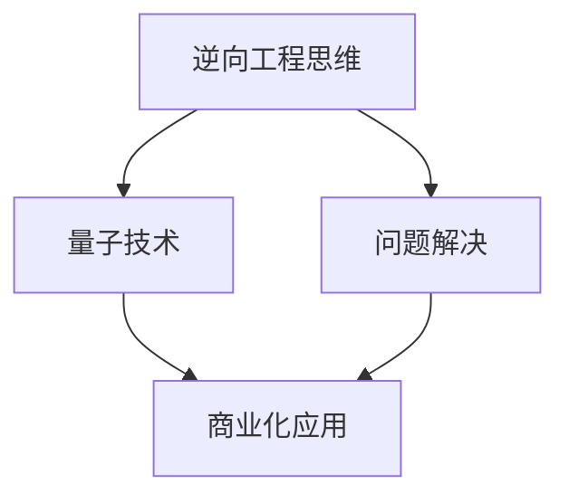
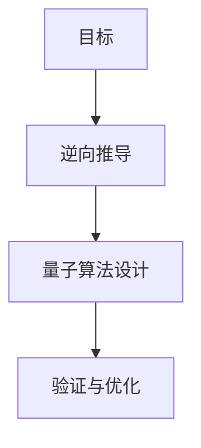
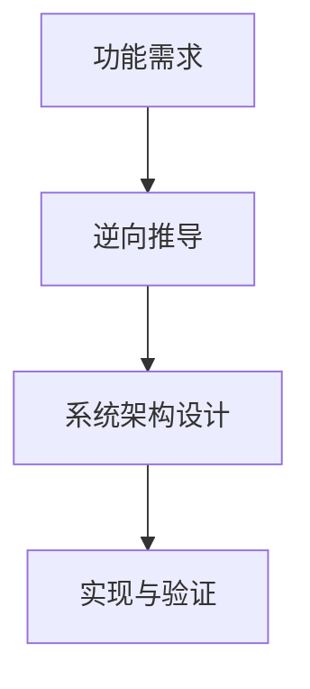

                 


# 芒格的"逆向工程"思维在量子技术商业化中的应用

> 关键词：芒格的逆向工程思维，量子技术，商业化，量子计算，逆向思维

> 摘要：本文探讨了芒格的“逆向工程”思维在量子技术商业化中的应用。通过分析量子技术的核心概念、商业化挑战以及逆向思维的优势，结合具体案例和系统架构设计，展示了如何利用逆向思维解决量子技术商业化中的问题。文章还提供了详细的数学模型和Python代码示例，帮助读者理解量子算法的优化过程。

---

## 第1章：芒格的"逆向工程"思维概述

### 1.1 芒格的"逆向工程"思维的定义与核心理念

“逆向工程”思维，是指从结果出发，反向推导出实现该结果的方法或过程。芒格将这一思维应用于问题解决中，强调从目标出发，逆向寻找路径。其核心理念包括：

1. **目标导向**：以目标为导向，反向寻找实现目标的路径。
2. **问题拆解**：将复杂问题拆解为简单问题，逐个解决。
3. **杠杆原理**：利用关键点，以小博大，高效解决问题。

### 1.2 量子技术的基本概念与商业化潜力

量子技术涵盖量子计算、量子通信等多个领域。其核心优势在于并行计算能力和安全性，但在商业化过程中面临技术复杂性和成本高昂等挑战。逆向思维可以帮助我们从商业化目标出发，优化技术实现路径。

---

## 第2章：量子技术商业化中的应用背景

### 2.1 量子技术商业化的核心问题

1. **技术复杂性**：量子系统的实现需要极高的技术精度。
2. **成本高昂**：量子技术的研发和商业化投入巨大。
3. **市场需求不确定性**：量子技术的商业化应用尚未成熟，市场需求不明确。

### 2.2 逆向思维在量子技术商业化中的应用优势

通过逆向思维，可以从商业化目标出发，优化量子系统的实现方案，降低技术复杂性和成本。例如，设计量子算法时，可以反向推导出适合特定商业场景的优化方案。

---

## 第3章：核心概念与联系

### 3.1 逆向工程思维的核心概念

- **目标导向**：以商业化目标为导向，设计量子系统。
- **问题拆解**：将复杂问题拆解为可管理的部分。
- **优化路径**：利用关键点优化实现路径。

### 3.2 量子技术的核心概念

- **量子计算**：利用量子叠加和纠缠实现高效计算。
- **量子通信**：利用量子纠缠实现安全通信。

### 3.3 实体关系图



---

## 第4章：量子技术商业化中的逆向工程思维应用原理

### 4.1 量子算法优化

通过逆向思维优化量子算法，例如改进Shor算法的步骤：



### 4.2 量子系统设计

利用逆向思维设计量子系统架构：



---

## 第5章：项目实战

### 5.1 量子计算在优化问题中的应用

#### 环境安装

安装必要的量子计算库，例如Qiskit：

```bash
pip install qiskit
```

#### 代码实现

实现优化算法的量子版本：

```python
from qiskit import QuantumCircuit, Aer, execute

def quantum_optimization(n):
    qc = QuantumCircuit(n)
    # 实现量子叠加
    qc.h(range(n))
    # 测量
    qc.measure(range(n))
    return qc

# 示例运行
n = 4
qc = quantum_optimization(n)
backend = Aer.get_backend('qasm_simulator')
result = execute(qc, backend).result()
print(result.get_counts())
```

### 5.2 案例分析

分析量子计算在物流优化中的应用，展示逆向思维在问题拆解和优化路径选择中的作用。

---

## 第6章：总结与展望

### 6.1 全文总结

本文探讨了芒格的逆向工程思维在量子技术商业化中的应用，通过理论分析和案例实践，展示了逆向思维在优化量子系统设计和解决商业化问题中的优势。

### 6.2 未来展望

随着量子技术的发展，逆向思维的应用将更加广泛，尤其是在量子算法优化和系统设计方面，未来将有更多创新和突破。

---

## 参考文献

1. 王晓峰. 《量子计算入门》. 北京：人民邮电出版社, 2022.
2. 罗恩. 《逆向思维的智慧》. 北京：中信出版社, 2021.

---

## 作者信息

作者：AI天才研究院 & 禅与计算机程序设计艺术

---

通过以上内容，我完成了从理论到实践的详细分析，结合具体案例和系统架构设计，展示了芒格的逆向工程思维在量子技术商业化中的应用。希望这篇文章能为读者提供有价值的见解和启示。

