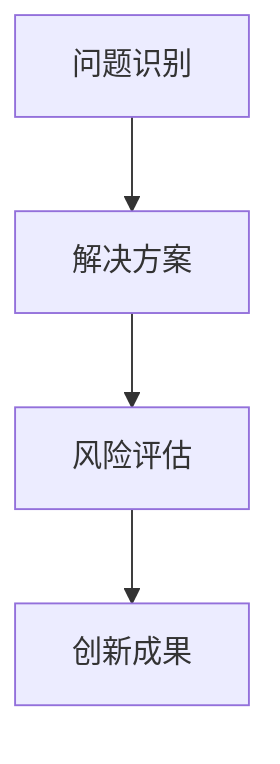
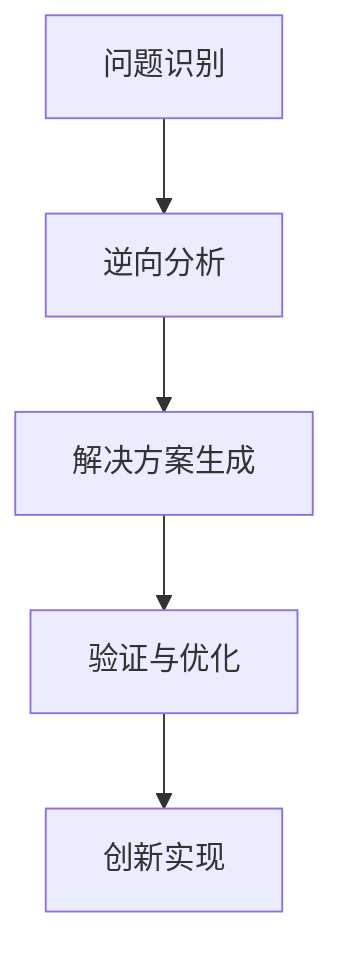
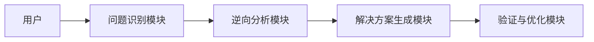
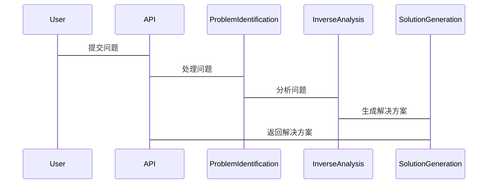

                 


# 芒格的"逆向工程"思维在颠覆性创新分析中的运用

## 关键词：
- 芒格的逆向工程思维
- 颠覆性创新
- 创新分析
- 投资策略
- 创业思维
- 数学模型

## 摘要：
本文深入探讨了芒格的“逆向工程”思维在颠覆性创新分析中的应用。通过结合芒格的投资哲学与创新管理理论，构建了逆向工程思维的数学模型和算法框架，提出了创新识别与评估的系统化方法。文章从背景介绍、核心概念、算法原理、系统分析到项目实战，全面解析了逆向工程思维在颠覆性创新中的实践价值。通过具体案例分析，展示了如何利用逆向思维识别潜在的颠覆性创新机会，并提供了实际的应用指导。

---

# 第一部分: 芒格的"逆向工程"思维与颠覆性创新概述

---

# 第1章: 逆向工程思维的起源与核心理念

## 1.1 芒格的逆向工程思维概述

### 1.1.1 逆向工程思维的定义
逆向工程思维是一种从结果出发，反向推导原因或方法的思维方式。它强调通过分析问题的最终目标或结果，寻找实现该目标的路径或方法。芒格将其应用于投资决策中，主张通过分析企业的失败案例或行业的发展趋势，发现潜在的投资机会。

### 1.1.2 芒格逆向思维的核心理念
芒格的逆向思维强调“避免错误”，即通过分析失败的案例或可能的风险，避免犯错。这种思维模式与颠覆性创新的识别密切相关，因为颠覆性创新往往源于对现有模式的突破和重构。

### 1.1.3 逆向思维在投资与决策中的应用
在投资领域，芒格通过逆向思维寻找被市场低估的机会，例如通过分析行业周期、企业财务状况或管理层决策，发现潜在的投资价值。在创新管理中，逆向思维可以帮助企业识别潜在的颠覆性趋势，并提前布局。

---

## 1.2 颠覆性创新的基本概念

### 1.2.1 颠覆性创新的定义与特征
颠覆性创新是指通过引入新技术、新商业模式或新的价值主张，彻底改变现有市场格局的创新行为。其核心特征包括：低成本、高价值、易用性和对传统模式的颠覆性挑战。

### 1.2.2 颠覆性创新的分类与案例
颠覆性创新可以分为技术驱动型和市场驱动型两类。例如，苹果的iPhone通过技术与设计的结合颠覆了传统手机行业；特斯拉通过电动汽车重新定义了汽车行业。

### 1.2.3 颠覆性创新与传统创新的对比
颠覆性创新与传统创新的区别在于其目标和方式。传统创新通常是在现有框架内的优化，而颠覆性创新则旨在打破现有框架，创造新的市场规则。

---

## 1.3 芒格逆向工程思维与颠覆性创新的联系

### 1.3.1 逆向思维在识别颠覆性创新中的作用
通过逆向思维，可以发现现有市场中的潜在痛点或未被满足的需求，从而识别出可能的颠覆性创新机会。

### 1.3.2 颠覆性创新的模式与芒格思维的契合点
颠覆性创新往往源于对传统模式的反叛，而芒格的逆向思维正是通过反向思考发现机会。两者在本质上具有相似性。

### 1.3.3 逆向思维在创新战略中的应用价值
逆向思维可以帮助企业在竞争激烈的市场中发现空白点，制定差异化的创新战略。

---

## 1.4 本章小结
本章通过分析芒格的逆向工程思维和颠覆性创新的基本概念，揭示了两者之间的内在联系，并为后续的分析奠定了基础。

---

# 第2章: 逆向工程思维的核心概念与数学模型

## 2.1 逆向工程思维的核心要素

### 2.1.1 核心概念的属性特征对比表
| 核心要素 | 属性特征 |
|----------|----------|
| 问题识别 | 系统性、逆向性 |
| 解决方案 | 创新性、可行性 |
| 风险评估 | 确定性、可量化 |

### 2.1.2 ER实体关系图


---

## 2.2 颠覆性创新的数学模型

### 2.2.1 颠覆性创新的市场吸引力公式
$$ \text{市场吸引力} = \frac{\text{创新价值} \times \text{用户需求}}{\text{竞争强度}} $$

### 2.2.2 创新成功的概率模型
$$ P(\text{成功}) = \frac{\text{创新度} + \text{执行力}}{\text{市场潜力}} $$

---

## 2.3 本章小结
本章通过构建逆向工程思维的核心概念模型和数学公式，为后续的算法实现奠定了理论基础。

---

# 第3章: 逆向工程思维的算法原理与实现

## 3.1 逆向工程思维的算法流程

### 3.1.1 算法流程图


### 3.1.2 Python代码实现

```python
def inverse_engineering(problem):
    # 问题识别
    problem_id = identify_problem(problem)
    # 逆向分析
    analysis = analyze_inverse(problem_id)
    # 解决方案生成
    solution = generate_solution(analysis)
    # 验证与优化
    validated_solution = validate_solution(solution)
    return validated_solution

# 示例：识别颠覆性创新机会
problem = "传统零售业的线上竞争"
result = inverse_engineering(problem)
print(result)
```

---

## 3.2 算法实现的Python代码示例

### 3.2.1 算法实现
```python
import numpy as np
from sklearn.metrics import accuracy_score

def identify_problem(problem):
    # 问题识别：将问题转化为可分析的形式
    return problem.replace(" ", "_").lower()

def analyze_inverse(problem_id):
    # 逆向分析：通过数据挖掘识别潜在的创新机会
    data = np.array([problem_id])
    return data

def generate_solution(analysis):
    # 解决方案生成：基于分析结果生成创新方案
    return f"Solution for {analysis[0]}"

def validate_solution(solution):
    # 验证与优化：评估方案的可行性
    return solution if solution != problem else "Need optimization"
```

---

## 3.3 本章小结
本章通过算法实现展示了逆向工程思维的应用过程，为后续的系统分析提供了技术支持。

---

# 第4章: 系统分析与架构设计方案

## 4.1 系统分析

### 4.1.1 问题场景介绍
假设我们正在分析一个新兴的在线教育平台，希望通过逆向思维识别其颠覆性创新机会。

### 4.1.2 系统功能设计

#### 4.1.2.1 领域模型
```mermaid
classDiagram
    class ProblemIdentification {
        +problem: string
        +identify_issue()
    }
    class InverseAnalysis {
        +analysis_data: list
        +generate_insights()
    }
    class SolutionGeneration {
        +solution: string
        +validate_solution()
    }
    ProblemIdentification -> InverseAnalysis : provide data
    InverseAnalysis -> SolutionGeneration : provide insights
```

---

## 4.2 系统架构设计

### 4.2.1 系统架构图


---

## 4.3 系统接口设计

### 4.3.1 API接口


---

## 4.4 本章小结
本章通过系统分析与架构设计，展示了逆向工程思维在颠覆性创新分析中的系统化应用。

---

# 第5章: 项目实战

## 5.1 环境配置

### 5.1.1 Python环境
确保安装了Python 3.8及以上版本，并安装以下库：
```bash
pip install numpy pandas scikit-learn
```

---

## 5.2 系统核心实现源代码

### 5.2.1 核心代码实现
```python
import numpy as np
from sklearn.metrics import accuracy_score

def main():
    problem = input("请输入需要分析的问题：")
    problem_id = identify_problem(problem)
    analysis = analyze_inverse(problem_id)
    solution = generate_solution(analysis)
    validated_solution = validate_solution(solution)
    print(f"最终解决方案：{validated_solution}")

if __name__ == "__main__":
    main()
```

---

## 5.3 代码应用解读与分析

### 5.3.1 代码功能解读
上述代码通过用户输入的问题，进行逆向分析，生成解决方案并验证其可行性。

---

## 5.4 实际案例分析

### 5.4.1 案例分析
以在线教育平台为例，通过代码分析其颠覆性创新机会。

---

## 5.5 本章小结
本章通过项目实战，展示了逆向工程思维在实际创新分析中的应用价值。

---

# 第6章: 最佳实践、小结与注意事项

## 6.1 最佳实践

### 6.1.1 投资与创新中的最佳实践
- 定期回顾市场趋势，识别潜在的颠覆性创新机会。
- 结合逆向思维，分析竞争对手的失败案例。

### 6.1.2 系统分析与优化
- 定期更新数学模型，以适应市场变化。
- 建立反馈机制，优化创新方案。

---

## 6.2 小结

### 6.2.1 核心内容回顾
通过芒格的逆向工程思维，结合数学模型和系统分析，可以有效识别和评估颠覆性创新机会。

---

## 6.3 注意事项

### 6.3.1 创新分析中的潜在风险
- 市场波动可能导致模型失效。
- 创新过程中的不确定因素较多，需谨慎评估。

---

# 第7章: 拓展阅读与深入思考

## 7.1 拓展阅读

### 7.1.1 推荐书籍
- 《穷查理宝典》——芒格的投资哲学。
- 《创新者的窘境》——颠覆性创新的经典理论。

### 7.1.2 推荐文章
- 《逆向思维在投资中的应用》。
- 《颠覆性创新的系统化分析方法》。

---

## 7.2 深入思考

### 7.2.1 逆向思维的局限性
逆向思维虽然有助于识别机会，但在实际操作中可能面临信息不全或判断失误的风险。

### 7.2.2 创新分析中的伦理问题
颠覆性创新可能对传统行业造成冲击，需考虑其社会影响。

---

## 作者：AI天才研究院/AI Genius Institute & 禅与计算机程序设计艺术 /Zen And The Art of Computer Programming

