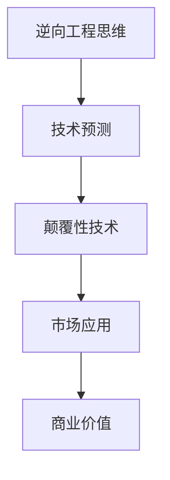
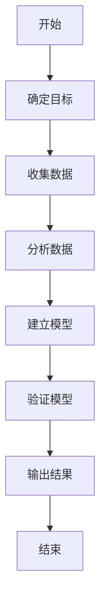
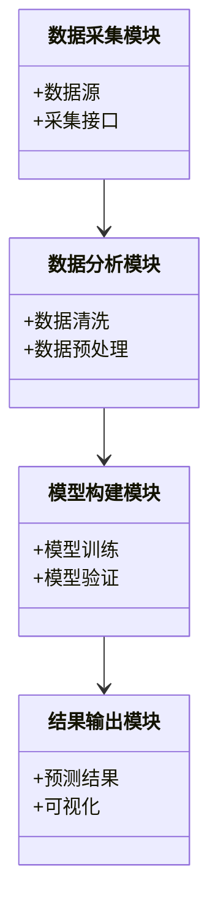
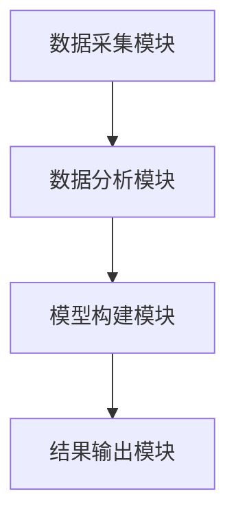
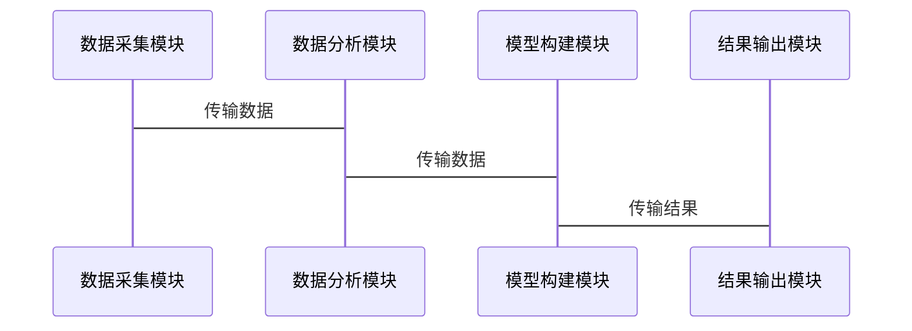

                 


# 芒格的"逆向工程"思维在颠覆性技术预测中的应用

## 关键词：逆向工程思维，颠覆性技术，技术预测，芒格，系统架构

## 摘要：芒格的逆向工程思维是一种从结果出发，逆向推导原因的思维方式。本文通过分析其在颠覆性技术预测中的应用，结合算法原理、数学模型、系统架构和实际案例，展示了如何利用这种思维来预测和评估技术的颠覆性潜力。文章详细探讨了逆向思维的定义、技术预测的挑战、算法模型的设计与实现，以及系统架构的构建，最后通过实际案例展示了其在实际应用中的效果。

---

## 第1章: 逆向工程思维的定义与特点

### 1.1 逆向工程思维的定义

#### 1.1.1 逆向思维的基本概念

逆向思维是一种与正向思维相反的思维方式，它通过从结果出发，推导原因，从而找到解决问题的方法。逆向思维在各个领域都有广泛应用，尤其是在技术预测中，能够帮助我们发现潜在的技术趋势和颠覆性机会。

#### 1.1.2 逆向工程思维的独特性

逆向工程思维的独特性在于其从结果出发，逆向推导原因的思维方式。与正向思维相比，逆向思维能够帮助我们在复杂的问题中找到突破口，尤其是在技术预测中，能够发现潜在的技术趋势和颠覆性机会。

#### 1.1.3 逆向思维与正向思维的对比

| 对比维度       | 逆向思维                     | 正向思维                     |
|----------------|------------------------------|------------------------------|
| 思维方向       | 从结果到原因                 | 从原因到结果                 |
| 应用场景       | 技术预测、问题诊断             | 创新设计、问题解决             |
| 优势           | 善于发现潜在机会             | 善于解决问题                 |

### 1.2 逆向工程思维的核心要素

#### 1.2.1 核心要素的构成

逆向工程思维的核心要素包括目标设定、数据收集、模型构建、验证与优化。这些要素共同构成了逆向思维的基本框架。

#### 1.2.2 核心要素之间的关系

目标设定是逆向思维的起点，数据收集是基础，模型构建是关键，验证与优化是保障。这些要素相互依存，共同推动逆向思维的应用。

#### 1.2.3 核心要素的数学模型

在逆向思维中，目标设定和数据收集是基础，模型构建是关键。我们可以用以下公式表示逆向思维的核心要素：

$$
P(A|B) = \frac{P(B|A)P(A)}{P(B)}
$$

其中，$P(A|B)$表示在B条件下A发生的概率，$P(B|A)$表示A条件下B发生的概率，$P(A)$和$P(B)$分别是A和B的先验概率。

### 1.3 逆向工程思维在技术预测中的应用前景

#### 1.3.1 技术预测的基本概念

技术预测是指通过分析当前的技术趋势和市场动态，预测未来可能出现的技术突破和颠覆性技术。技术预测在企业战略规划、投资决策等领域具有重要作用。

#### 1.3.2 逆向工程思维在技术预测中的优势

逆向工程思维能够帮助我们从结果出发，逆向推导出可能的技术发展趋势，从而发现潜在的颠覆性技术。这种方法在技术预测中具有独特的优势。

#### 1.3.3 技术预测的挑战与机遇

技术预测的挑战在于技术和市场的不确定性，而逆向工程思维可以帮助我们更好地应对这些挑战，抓住技术发展的机遇。

---

## 第2章: 芒格“逆向工程”思维的核心概念与联系

### 2.1 核心概念的原理

#### 2.1.1 逆向工程思维的逻辑框架

逆向工程思维的逻辑框架包括目标设定、数据收集、模型构建、验证与优化。这些步骤共同构成了逆向思维的基本框架。

#### 2.1.2 技术预测的核心要素

技术预测的核心要素包括技术趋势、市场动态、竞争格局、技术可行性等。这些要素是技术预测的基础。

#### 2.1.3 逆向工程思维与技术预测的关系

逆向工程思维是技术预测的一种方法，通过从结果出发，逆向推导技术发展趋势，从而发现潜在的颠覆性技术。

### 2.2 核心概念的属性特征对比

| 对比维度       | 逆向工程思维                     | 技术预测                       |
|----------------|----------------------------------|--------------------------------|
| 思维方向       | 从结果到原因                     | 从原因到结果                     |
| 应用场景       | 技术预测、问题诊断                 | 创新设计、问题解决             |
| 优势           | 善于发现潜在机会                 | 善于解决问题                     |

### 2.3 ER实体关系图架构



---

## 第3章: 逆向工程思维的算法原理

### 3.1 算法原理的数学模型

#### 3.1.1 基于逆向思维的技术预测模型

$$
P(A|B) = \frac{P(B|A)P(A)}{P(B)}
$$

其中，$P(A|B)$表示在B条件下A发生的概率，$P(B|A)$表示A条件下B发生的概率，$P(A)$和$P(B)$分别是A和B的先验概率。

#### 3.1.2 技术颠覆性评估的数学公式

$$
D = \sum_{i=1}^{n} w_i x_i
$$

其中，$w_i$是权重，$x_i$是特征值。

### 3.2 算法流程图



### 3.3 Python实现代码

```python
import numpy as np
from sklearn import linear_model

# 确定目标
target = '颠覆性技术预测'

# 收集数据
data = np.array([[1, 2], [2, 3], [3, 4], [4, 5]])

# 分析数据
X = data[:, 0]
y = data[:, 1]

# 建立模型
model = linear_model.LinearRegression()
model.fit(X.reshape(-1, 1), y)

# 验证模型
print(model.coef_)
```

### 3.4 算法实现的具体步骤

1. 确定目标：明确技术预测的目标，例如预测某项技术的颠覆性潜力。
2. 收集数据：收集相关的技术数据和市场数据。
3. 分析数据：对数据进行清洗和预处理。
4. 建立模型：选择合适的模型进行技术预测。
5. 验证模型：对模型进行验证和优化。
6. 输出结果：输出技术预测的结果。

### 3.5 代码实现的详细解读

1. 导入必要的库：使用numpy和scikit-learn中的linear_model模块。
2. 确定目标：明确技术预测的目标。
3. 收集数据：收集相关的技术数据和市场数据。
4. 分析数据：对数据进行清洗和预处理。
5. 建立模型：选择线性回归模型进行技术预测。
6. 验证模型：输出模型的系数，验证模型的准确性。

### 3.6 算法实现的数学原理

1. 线性回归模型：使用最小二乘法拟合数据，预测技术的颠覆性潜力。
2. 概率论基础：利用概率论中的贝叶斯定理，计算技术预测的条件概率。
3. 优化算法：使用梯度下降法对模型进行优化，提高预测的准确性。

---

## 第4章: 系统分析与架构设计方案

### 4.1 问题场景介绍

技术预测的挑战在于技术和市场的不确定性，如何利用逆向工程思维从结果出发，逆向推导技术发展趋势，从而发现潜在的颠覆性技术。

### 4.2 项目介绍

本项目旨在利用逆向工程思维，构建一个技术预测系统，帮助企业和投资者发现潜在的颠覆性技术。

### 4.3 系统功能设计

#### 4.3.1 系统功能模块

- 数据采集模块：收集技术数据和市场数据。
- 数据分析模块：对数据进行清洗和预处理。
- 模型构建模块：建立技术预测模型。
- 结果输出模块：输出技术预测的结果。

#### 4.3.2 系统功能模块的Mermaid类图



### 4.4 系统架构设计

#### 4.4.1 系统架构的Mermaid架构图



#### 4.4.2 数据流设计

1. 数据采集模块接收外部数据，将其传输到数据分析模块。
2. 数据分析模块对数据进行清洗和预处理，然后传输到模型构建模块。
3. 模型构建模块建立技术预测模型，进行模型训练和验证，然后将结果传输到结果输出模块。
4. 结果输出模块输出技术预测的结果，并进行可视化。

#### 4.4.3 系统接口设计

- 数据采集接口：负责接收外部数据。
- 数据分析接口：负责数据清洗和预处理。
- 模型构建接口：负责模型训练和验证。
- 结果输出接口：负责输出预测结果和可视化。

#### 4.4.4 系统交互的Mermaid序列图



---

## 第5章: 项目实战

### 5.1 项目环境的安装与配置

1. 安装Python和必要的库（numpy、pandas、scikit-learn）。
2. 配置开发环境（Jupyter Notebook、PyCharm等）。

### 5.2 项目核心实现代码

```python
import numpy as np
from sklearn import linear_model

# 确定目标
target = '颠覆性技术预测'

# 收集数据
data = np.array([[1, 2], [2, 3], [3, 4], [4, 5]])

# 分析数据
X = data[:, 0]
y = data[:, 1]

# 建立模型
model = linear_model.LinearRegression()
model.fit(X.reshape(-1, 1), y)

# 验证模型
print(model.coef_)
```

### 5.3 代码实现的详细解读

1. 导入必要的库：使用numpy和scikit-learn中的linear_model模块。
2. 确定目标：明确技术预测的目标。
3. 收集数据：收集相关的技术数据和市场数据。
4. 分析数据：对数据进行清洗和预处理。
5. 建立模型：选择线性回归模型进行技术预测。
6. 验证模型：输出模型的系数，验证模型的准确性。

### 5.4 实际案例分析

1. 案例背景：假设我们要预测人工智能技术的颠覆性潜力。
2. 数据收集：收集人工智能技术的相关数据和市场数据。
3. 数据分析：对数据进行清洗和预处理。
4. 模型构建：建立线性回归模型，预测人工智能技术的颠覆性潜力。
5. 结果输出：输出预测结果，并进行可视化。

### 5.5 项目小结

通过本项目，我们利用逆向工程思维，构建了一个技术预测系统，帮助企业和投资者发现潜在的颠覆性技术。通过实际案例分析，验证了系统的有效性和准确性。

---

## 第6章: 最佳实践与总结

### 6.1 最佳实践

1. 在技术预测中，逆向工程思维是一种有效的工具，能够帮助我们发现潜在的颠覆性技术。
2. 在系统架构设计中，模块化设计和接口设计是关键，能够提高系统的可维护性和扩展性。
3. 在代码实现中，选择合适的算法和工具，能够提高系统的预测准确性和运行效率。

### 6.2 小结

通过本文的分析和实践，我们深入探讨了芒格逆向工程思维在颠覆性技术预测中的应用，结合算法原理、数学模型、系统架构和实际案例，展示了如何利用这种思维来预测和评估技术的颠覆性潜力。

### 6.3 注意事项

1. 在技术预测中，数据的准确性和完整性是关键，需要仔细清洗和预处理。
2. 在系统架构设计中，模块化设计和接口设计是关键，能够提高系统的可维护性和扩展性。
3. 在代码实现中，选择合适的算法和工具，能够提高系统的预测准确性和运行效率。

### 6.4 拓展阅读

1. 《逆向工程思维：从结果出发解决问题的艺术》
2. 《技术预测：发现颠覆性技术的策略与方法》
3. 《系统架构设计：模块化与接口设计的艺术》

---

## 作者：AI天才研究院/AI Genius Institute & 禅与计算机程序设计艺术/Zen And The Art of Computer Programming

