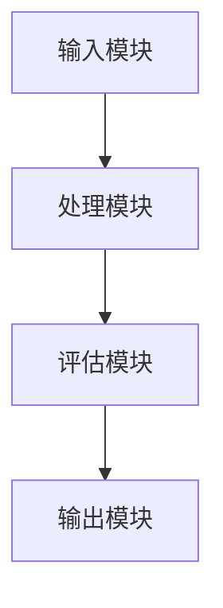

                 


# 芒格的"逆向思维"在反物质能源商业化评估中的应用

## 关键词：逆向思维，反物质能源，商业化评估，芒格，能源技术，投资决策，系统架构

## 摘要：  
本文探讨了芒格的“逆向思维”在反物质能源商业化评估中的应用。通过分析反物质能源的基本概念、商业化评估的核心要素，结合逆向思维的独特优势，提出了一套基于逆向思维的评估框架，并通过数学模型和系统架构设计，展示了如何在实际项目中应用这些方法。文章最后通过一个具体案例，验证了逆向思维在反物质能源商业化评估中的有效性，并提出了未来研究的方向。

---

## 第一部分：芒格的“逆向思维”与反物质能源概述

### 第1章：芒格的“逆向思维”与反物质能源概述

#### 1.1 芒格的“逆向思维”概述

##### 1.1.1 芒格“逆向思维”的定义  
芒格的“逆向思维”是一种从反方向思考问题的方法，即通过分析问题的对立面或失败案例，找到解决问题的新思路。这种思维模式的核心在于“反着想”，即通过否定错误选项来缩小可行解的范围。

##### 1.1.2 “逆向思维”的核心原则与特点  
- **原则**：  
  - 从失败中学习：通过分析失败案例，找出问题的根源。  
  - 从对立面思考：通过分析问题的反面，找到新的解决方案。  
  - 系统性分析：逆向思维不仅仅是孤立地思考问题，而是从系统角度出发，综合考虑各因素之间的关系。  

- **特点**：  
  - 非线性：逆向思维往往跳出常规思维的框架。  
  - 颠覆性：通过否定传统假设，找到新的突破口。  
  - 实用性：在商业决策中，逆向思维能够快速缩小可行解的范围，提高决策效率。  

##### 1.1.3 “逆向思维”在商业决策中的应用价值  
逆向思维在商业决策中的价值主要体现在以下几个方面：  
- **快速聚焦**：通过否定不可能的选项，缩小问题的范围，快速找到关键问题。  
- **发现新机会**：通过分析失败案例，发现传统思维中忽视的机会。  
- **提高决策质量**：通过系统性分析，避免决策中的认知偏差。  

---

#### 1.2 反物质能源的基本概念

##### 1.2.1 反物质能源的定义与基本原理  
反物质能源是指通过反物质与物质的湮灭过程释放能量的能源形式。反物质与物质湮灭时，会释放出巨大的能量，其能量密度远高于传统能源。反物质能源的核心原理是利用反物质的湮灭过程，将其转化为可用的能源。

##### 1.2.2 反物质能源的潜在应用领域  
反物质能源的潜在应用领域包括：  
- **航天领域**：反物质能源的能量密度极高，适合用于深空探测任务。  
- **医疗领域**：反物质能源可用于癌症治疗中的粒子束 therapy。  
- **工业领域**：反物质能源可用于高能粒子加速器和核废料处理。  

##### 1.2.3 反物质能源与传统能源的对比分析  
| 属性             | 反物质能源                  | 传统能源（如化石能源）       |
|------------------|-----------------------------|-----------------------------|
| 能量密度         | 极高                        | 较低                        |
| 可持续性         | 可能无限                   | 有限                        |
| 环境影响         | 几乎为零                   | 高                          |
| 技术成熟度       | 当前仍处于实验阶段         | 较为成熟                   |

---

#### 1.3 芒格“逆向思维”与反物质能源评估的结合

##### 1.3.1 逆向思维在反物质能源评估中的独特优势  
- **快速聚焦**：通过逆向思维，可以快速识别反物质能源评估中的关键问题。  
- **发现新机会**：通过分析失败案例，发现反物质能源技术中的潜在突破点。  
- **提高评估效率**：通过系统性分析，避免传统评估中的认知偏差。  

##### 1.3.2 逆向思维与反物质能源商业化的关系  
逆向思维可以帮助我们从反物质能源商业化失败的案例中吸取教训，从而更好地规划商业化路径。通过逆向思维，我们可以更清晰地认识到反物质能源商业化中的关键挑战，从而制定更有针对性的解决方案。

##### 1.3.3 本文的核心目标与研究框架  
本文的核心目标是探讨芒格的逆向思维在反物质能源商业化评估中的应用价值，并通过数学模型和系统架构设计，提出一套基于逆向思维的评估框架。研究框架包括以下几个方面：  
1. 反物质能源的基本概念与商业化潜力分析。  
2. 逆向思维在反物质能源评估中的具体应用。  
3. 数学模型与算法设计。  
4. 系统架构与项目实战。  

---

## 第二部分：反物质能源商业化评估的核心要素

### 第2章：反物质能源商业化评估的核心要素

#### 2.1 反物质能源商业化的基本流程

##### 2.1.1 反物质能源的生产与储存技术  
反物质能源的生产与储存是商业化的核心技术。目前，反物质的生产主要依赖于粒子加速器，而储存技术则需要依赖超导磁铁等先进设备。  

##### 2.1.2 反物质能源的市场需求与供给分析  
反物质能源的市场需求主要集中在航天、医疗和工业领域。然而，由于技术难度高、成本昂贵，供给能力尚未成熟。  

##### 2.1.3 反物质能源的成本与收益评估  
反物质能源的成本主要包括生产成本、储存成本和运输成本。由于技术不成熟，当前的成本远高于传统能源，但随着技术进步，成本有望逐步降低。  

#### 2.2 逆向思维在反物质能源评估中的具体应用

##### 2.2.1 从结果反推需求：反物质能源的市场定位  
通过逆向思维，我们可以从市场需求反推反物质能源的潜在市场定位。例如，假设反物质能源在深空探测领域有巨大需求，我们可以从这个需求反推技术发展的方向。  

##### 2.2.2 从失败案例中学习：反物质能源的技术瓶颈  
通过分析反物质能源技术失败的案例，我们可以找出技术瓶颈，并提出改进方案。例如，某反物质能源项目失败的原因可能是储存技术不稳定，我们可以通过逆向思维找到改进的方向。  

##### 2.2.3 从风险中寻找机会：反物质能源的投资价值  
通过逆向思维，我们可以从反物质能源商业化中的风险中寻找投资机会。例如，某项目因技术瓶颈失败，我们可以从失败中找到技术突破点，从而发现投资价值。  

---

### 第3章：反物质能源商业化评估的数学模型与算法

#### 3.1 反物质能源评估的核心数学模型

##### 3.1.1 反物质能源的成本-收益分析模型  
成本-收益分析模型用于评估反物质能源的投资价值。其基本公式为：  
$$ \text{净现值} = \sum_{t=1}^{n} \frac{\text{净现金流}}{(1 + r)^t} $$  
其中，$r$ 是折现率，$n$ 是项目周期。  

##### 3.1.2 反物质能源的技术可行性评估模型  
技术可行性评估模型用于评估反物质能源技术的成熟度。其基本公式为：  
$$ \text{技术可行性指数} = \frac{\text{已解决的技术问题数量}}{\text{总技术问题数量}} \times 100\% $$  

##### 3.1.3 反物质能源的市场潜力预测模型  
市场潜力预测模型用于预测反物质能源的市场需求。其基本公式为：  
$$ \text{市场需求} = \text{潜在用户数量} \times \text{用户需求强度} $$  

#### 3.2 逆向思维驱动的评估算法

##### 3.2.1 逆向思维算法的基本原理  
逆向思维算法的基本原理是通过否定不可能的选项，逐步缩小可行解的范围。例如，在反物质能源商业化评估中，我们可以通过否定技术不可行的方案，逐步缩小可行的商业化路径。  

##### 3.2.2 逆向思维算法在反物质能源评估中的应用  
通过逆向思维算法，我们可以从反物质能源商业化失败的案例中，反推成功的商业化路径。例如，某反物质能源项目失败的原因可能是市场需求不足，我们可以通过逆向思维找到市场需求充足的领域。  

##### 3.2.3 算法的实现步骤与代码示例  
```python
def inverse思维算法(问题):
    可行解 = []
    for 选项 in 所有可能的选项:
        if 选项不符合假设:
            可行解.append(选项)
    return 可行解

# 示例：反物质能源商业化路径评估
问题 = "反物质能源的商业化路径"
假设 = "技术不成熟"
可行解 = inverse_思维算法(问题, 假设)
print(可行解)
```

---

### 第4章：反物质能源商业化评估的系统架构设计

#### 4.1 系统功能设计

##### 4.1.1 系统模块划分与功能描述  
- **输入模块**：接收反物质能源评估的相关数据。  
- **处理模块**：对数据进行预处理和分析。  
- **评估模块**：基于逆向思维算法，生成评估结果。  
- **输出模块**：展示评估结果。  

##### 4.1.2 系统输入与输出的定义  
- **输入**：反物质能源的技术参数、市场需求、成本数据。  
- **输出**：反物质能源的投资价值、技术可行性、市场潜力评估结果。  

##### 4.1.3 系统的核心算法与数据流  
- 核心算法：逆向思维算法。  
- 数据流：输入数据 -> 数据预处理 -> 算法评估 -> 输出结果。  

#### 4.2 系统架构图  



---

### 第5章：反物质能源商业化评估的项目实战

#### 5.1 项目背景与目标

##### 5.1.1 项目背景介绍  
本项目旨在评估反物质能源在深空探测领域的商业化潜力。  

##### 5.1.2 项目目标与范围  
- 目标：评估反物质能源在深空探测中的投资价值。  
- 范围：包括技术可行性分析、市场需求预测、成本收益分析。  

##### 5.1.3 项目团队与资源分配  
- 团队：技术专家、市场分析师、数据工程师。  
- 资源：粒子加速器数据、市场调研报告、成本模型。  

#### 5.2 项目实施过程

##### 5.2.1 数据收集与处理  
- 数据来源：公开文献、实验数据、市场调研。  
- 数据预处理：清洗、归一化。  

##### 5.2.2 模型建立与参数调优  
- 建立成本-收益分析模型。  
- 调整参数，优化模型性能。  

##### 5.2.3 算法实现与结果分析  
- 实现逆向思维算法。  
- 分析结果，得出结论。  

---

## 总结

通过芒格的逆向思维，我们可以在反物质能源商业化评估中快速聚焦问题，发现新机会，并提高评估效率。本文通过数学模型、系统架构设计和项目实战，展示了逆向思维在反物质能源评估中的具体应用。未来的研究可以进一步优化算法，拓展应用场景，为反物质能源的商业化提供更有力的支持。

---

## 作者：AI天才研究院 & 禅与计算机程序设计艺术

