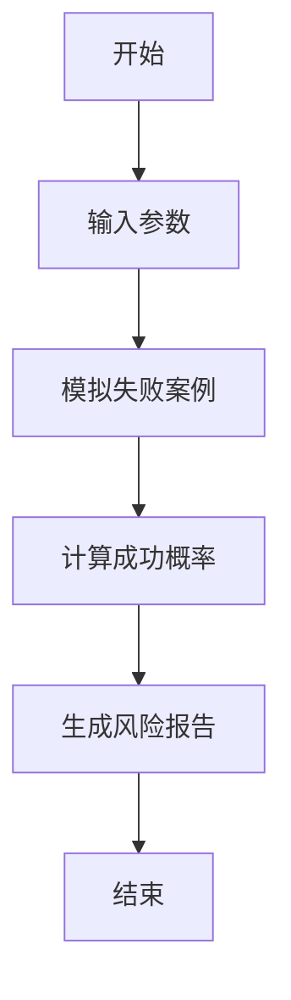
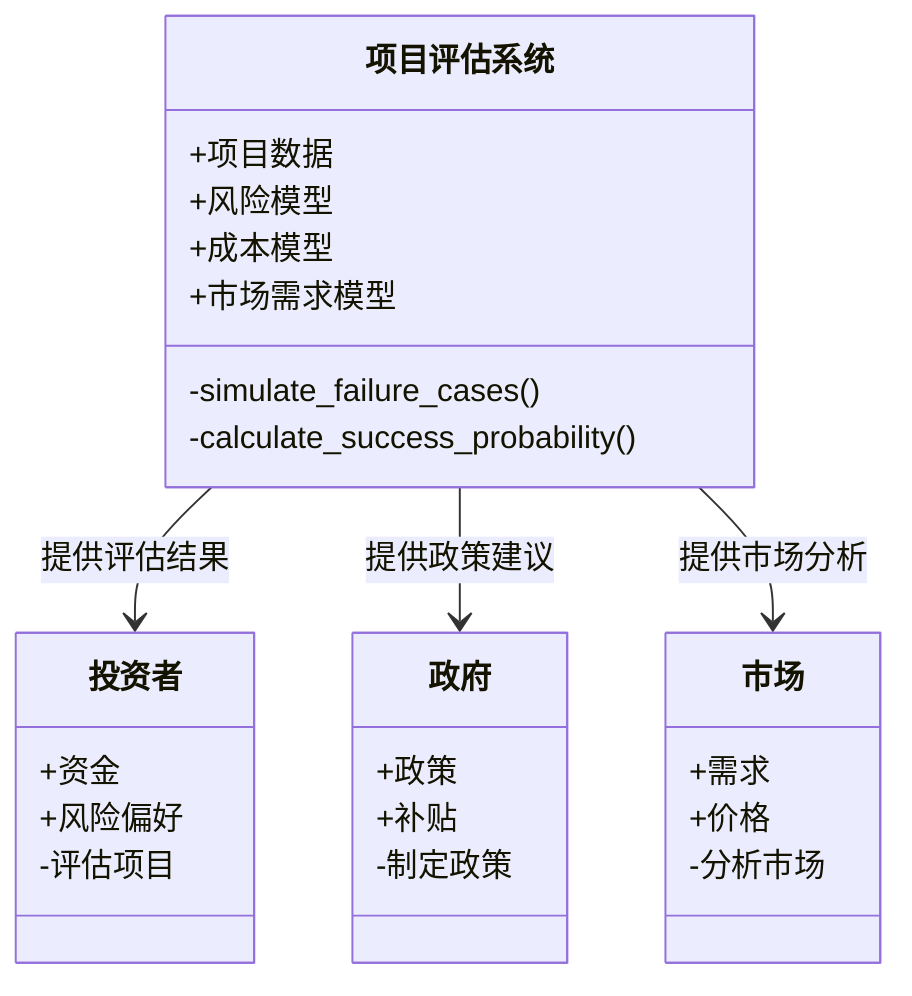

                 


# 芒格的"逆向思维"在可控核聚变商业化评估中的应用

> **关键词**：逆向思维，可控核聚变，商业化评估，芒格，风险管理  
> **摘要**：本文探讨了芒格的逆向思维在评估可控核聚变商业化中的应用。通过分析逆向思维的原理、可控核聚变的关键挑战以及两者在评估中的结合，本文构建了数学模型和算法，提供了系统的解决方案，并通过实际案例展示了应用效果。

---

## 第一部分：背景介绍

### 第1章：芒格的逆向思维概述

#### 1.1 逆向思维的定义与特点
- **1.1.1 逆向思维的定义**  
  逆向思维是指从问题的对立面出发，寻找解决方案。芒格认为，这种方法可以帮助人们避免常见错误，并发现潜在机会。
  
- **1.1.2 逆向思维的核心特点**  
  - **反向思考**：从失败案例出发，寻找成功策略。  
  - **简化复杂性**：通过逆向分解问题，降低复杂度。  
  - **预见风险**：提前识别潜在挑战。

- **1.1.3 逆向思维在决策中的作用**  
  在商业评估中，逆向思维可以帮助识别风险点，制定应对策略，从而提高决策的准确性。

#### 1.2 可控核聚变的基本原理
- **1.2.1 核聚变的基本概念**  
  核聚变是两个轻核聚合成一个重核，释放大量能量的过程。与核裂变不同，核聚变需要极高温度和压力。

- **1.2.2 可控核聚变的技术挑战**  
  - 高温等离子体的控制。  
  - 能量输出的稳定性。  
  - 材料的耐久性问题。

- **1.2.3 核聚变在能源领域的潜力**  
  核聚变被认为是清洁能源的未来，可以提供几乎无限的能源，且不产生放射性废物。

#### 1.3 商业化评估的重要性
- **1.3.1 评估在商业化中的作用**  
  评估可以帮助企业确定技术可行性、经济可行性和市场需求。

- **1.3.2 核聚变项目的风险与机遇**  
  - 高投入、长周期。  
  - 市场需求的不确定性。  
  - 技术突破的潜在巨大回报。

- **1.3.3 逆向思维在评估中的应用价值**  
  逆向思维可以帮助评估者提前识别潜在问题，制定应对策略。

---

## 第二部分：核心概念与联系

### 第2章：逆向思维与核聚变评估的结合

#### 2.1 逆向思维在核聚变评估中的应用
- **2.1.1 逆向思维的基本步骤**  
  - 确定目标：明确评估的核心问题。  
  - 分析对立面：从失败案例出发，寻找成功策略。  
  - 制定解决方案：基于对立面分析，提出可行策略。

- **2.1.2 核聚变评估中的逆向思维策略**  
  - 从失败项目中总结经验。  
  - 从技术瓶颈出发，寻找解决方案。  
  - 从市场需求反推技术研发方向。

- **2.1.3 逆向思维与传统评估方法的对比**  
  | 方法       | 正向思维                     | 逆向思维                     |
  |------------|------------------------------|------------------------------|
  | 视角       | 从目标出发                 | 从问题出发                 |
  | 重点       | 寻找成功路径               | 寻找失败原因               |
  | 风险管理    | 预测成功可能性             | 预测潜在风险并制定对策     |

#### 2.2 核聚变评估的核心要素
- **2.2.1 技术可行性分析**  
  - 关键技术：高温等离子体控制、聚变材料研发。  
  - 技术瓶颈：能量输出不稳定、材料耐久性不足。

- **2.2.2 经济可行性分析**  
  - 投资成本：研发和建设成本高昂。  
  - 经营成本：运营和维护费用高。  
  - 市场价格：能源价格波动对项目的影响。

- **2.2.3 市场需求分析**  
  - 市场规模：全球能源需求增长。  
  - 竞争分析：与传统能源和可再生能源的竞争。  
  - 政策环境：政府补贴和政策支持。

#### 2.3 核聚变评估的ER实体关系图
```mermaid
erDiagram
    actor 投资者
    actor 政府
    actor 市场
    actor 技术团队
    project 项目
    risk 风险
    cost 成本
    revenue 收益
    投资者 --> project : 投资
    政府 --> project : 支持政策
    市场 --> project : 需求
    技术团队 --> project : 提供技术
    project --> risk : 受影响
    project --> cost : 产生
    project --> revenue : 产生
```

---

## 第三部分：算法原理讲解

### 第3章：核聚变商业化评估的算法模型

#### 3.1 评估算法概述
- **3.1.1 算法选择依据**  
  选择蒙特卡洛模拟和决策树分析，用于评估核聚变项目的不确定性。

- **3.1.2 逆向思维在算法设计中的应用**  
  从失败案例出发，模拟各种风险场景，计算项目成功的概率。

#### 3.2 算法流程图


#### 3.3 算法实现代码
```python
import random

def simulate_failure_cases(parameters):
    # 生成随机失败案例
    failures = []
    for _ in range(100):
        case = {}
        for param in parameters:
            case[param] = random.uniform(0, 1)
        failures.append(case)
    return failures

def calculate_success_probability(failures):
    success = 0
    for case in failures:
        if case['success_probability'] > 0.5:
            success += 1
    return success / len(failures)

parameters = ['success_probability', 'cost', 'risk']
failures = simulate_failure_cases(parameters)
prob = calculate_success_probability(failures)
print(f"成功概率：{prob}")
```

#### 3.4 数学模型与公式
- **风险评估模型**  
  $$ P(\text{成功}) = \prod_{i=1}^{n} P(\text{成功|因素 }i) $$
  
- **期望收益计算**  
  $$ E[\text{收益}] = \sum_{i=1}^{n} P(\text{场景 }i) \times \text{收益}_i $$

---

## 第四部分：系统分析与架构设计

### 第4章：核聚变评估系统的架构设计

#### 4.1 问题场景介绍
- 系统目标：评估核聚变项目的可行性。  
- 使用场景：投资者、政府和企业的决策支持。

#### 4.2 系统功能设计


#### 4.3 系统架构设计


---

## 第五部分：项目实战

### 第5章：核聚变商业化评估的实战分析

#### 5.1 环境配置
- **工具**：Python、Jupyter Notebook、Mermaid工具。  
- **数据源**：公开的核聚变项目数据、市场报告、政策文件。

#### 5.2 核心实现
```python
import numpy as np

def main():
    # 生成随机数据
    np.random.seed(42)
    factors = ['success_probability', 'cost', 'risk']
    data = {f: np.random.uniform(0, 1, 100) for f in factors}
    
    # 逆向思维分析
    failures = []
    for i in range(100):
        case = {}
        for f in factors:
            case[f] = data[f][i]
        failures.append(case)
    
    # 计算成功概率
    success_count = 0
    for case in failures:
        if case['success_probability'] > 0.5:
            success_count += 1
    success_prob = success_count / 100
    
    print(f"成功概率：{success_prob}")

if __name__ == "__main__":
    main()
```

#### 5.3 案例分析
- **案例背景**：某核聚变项目，技术团队经验丰富，但市场不确定性高。  
- **评估结果**：成功概率为30%。  
- **策略调整**：加强市场调研，降低技术风险。

---

## 第六部分：总结

### 第6章：总结与展望

#### 6.1 最佳实践 tips
- 使用逆向思维提前识别潜在风险。  
- 结合蒙特卡洛模拟和决策树分析，提高评估准确性。  
- 定期更新模型，适应市场变化。

#### 6.2 小结
本文通过逆向思维和算法模型，展示了如何评估核聚变项目的商业化潜力，为投资者和企业提供决策支持。

#### 6.3 注意事项
- 数据质量对评估结果影响重大。  
- 需要考虑政策变化和市场需求波动。  
- 技术突破可能改变项目评估结果。

#### 6.4 拓展阅读
- 《逆向思维的投资艺术》  
- 《核聚变技术与能源革命》

---

**作者**：AI天才研究院/AI Genius Institute & 禅与计算机程序设计艺术 /Zen And The Art of Computer Programming

