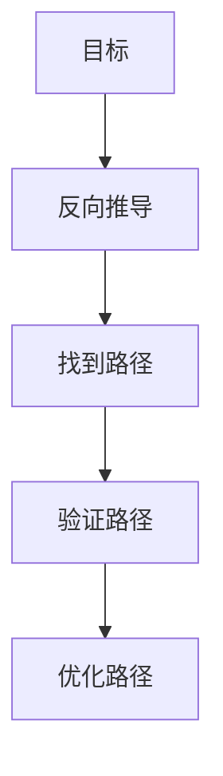

                 


# 芒格的逆向思考法：挑战常规思维模式

> 关键词：逆向思考法、思维模式、芒格、问题解决、系统分析、技术创新、项目实战

> 摘要：芒格的逆向思考法是一种挑战常规思维模式的方法，通过反向思考和系统分析，帮助我们在商业、科技和日常生活中做出更明智的决策。本文将详细介绍逆向思考的核心概念、应用场景、系统架构设计以及项目实战，帮助读者掌握这一思维方式，并在实际问题中加以应用。

---

## 第1章：逆向思考的重要性

### 1.1 传统思维的局限性

在传统的思维方式中，我们习惯于从正面解决问题，即从已知的起点出发，逐步推导出解决方案。然而，这种方法往往受限于我们对问题的固有认知，难以突破思维定式。例如，在商业决策中，我们常常关注如何扩大市场份额，而不是先分析市场萎缩的可能性。这种思维方式可能导致我们在面对复杂问题时缺乏创新性解决方案。

### 1.2 逆向思考的定义与特点

逆向思考是一种从反方向入手的思维方式，即从目标或结果出发，反向推导出实现该目标的路径或原因。其特点在于能够突破常规思维的限制，发现隐藏在问题背后的本质规律。例如，在技术开发中，我们可以通过分析用户需求的反面，发现未被满足的潜在需求。

### 1.3 逆向思考在问题解决中的作用

逆向思考能够帮助我们在解决问题时，避免陷入“直觉陷阱”，从而发现更多可能性。例如，在项目管理中，我们可以通过逆向思考，提前识别项目可能的风险点，从而制定更完善的应对策略。

---

## 第2章：芒格的逆向思考法概述

### 2.1 芒格的生平与思想

查理·芒格是投资界的大师，他提出的“逆向思考法”不仅在投资领域取得了巨大成功，也在其他领域产生了深远影响。他的思维方式强调独立思考和逆向思维，认为这能够帮助人们避免从众思维的陷阱。

### 2.2 逆向思考法的核心理念

芒格的逆向思考法强调从反方向入手，寻找问题的根源。他认为，大多数人都会从正面思考问题，而真正聪明的人则会从反面思考，从而发现机会。例如，在商业竞争中，芒格会思考“为什么竞争对手会失败”，从而找到自己的竞争优势。

### 2.3 逆向思考法与其他思维方法的对比

与正向思考法相比，逆向思考法更注重从结果出发，寻找实现目标的路径。与批判性思考相比，逆向思考法更强调从反方向寻找解决方案，而不是单纯地质疑现有方法。

---

## 第3章：逆向思考的核心概念

### 3.1 核心概念的背景介绍

逆向思考的核心概念在于从目标或结果出发，反向推导实现路径。这一过程需要我们具备对问题的深刻理解和分析能力。

### 3.2 核心概念的原理与特征

逆向思考的原理可以简单概括为：从结果出发，寻找原因或路径。其主要特征包括：目标导向性、反向思维、系统性等。

### 3.3 核心概念的ER实体关系图

为了更好地理解逆向思考的核心概念，我们可以将其与正向思考进行对比。以下是两者的对比表格：

| **对比维度** | **正向思考** | **逆向思考** |
|--------------|---------------|---------------|
| 思维起点     | 从起点出发     | 从目标出发     |
| 解决方式     | 正向推导       | 反向推导       |
| 创新性       | 较低           | 较高           |

---

## 第4章：逆向思考在商业中的应用

### 4.1 商业战略的逆向思考

在商业战略中，逆向思考可以帮助我们制定更具前瞻性的计划。例如，我们可以思考“如果竞争对手失败，原因可能是什么”，从而找到自己的竞争优势。

### 4.2 市场分析的逆向思考

通过逆向思考，我们可以更好地理解市场趋势。例如，我们可以通过分析市场需求的反面，发现潜在的市场机会。

### 4.3 商业决策的逆向思考

在商业决策中，逆向思考可以帮助我们避免常见的决策错误。例如，在制定产品定价策略时，我们可以思考“如果产品价格过高，用户为什么会流失”，从而找到更合理的定价区间。

---

## 第5章：逆向思考在个人成长中的应用

### 5.1 个人目标的逆向思考

通过逆向思考，我们可以更好地规划个人成长路径。例如，我们可以通过思考“如何实现目标”，从而制定更具体的行动计划。

### 5.2 问题解决的逆向思考

在面对个人问题时，逆向思考可以帮助我们发现更有效的解决方案。例如，当我们遇到职业瓶颈时，我们可以思考“如果我能够突破瓶颈，原因可能是什么”，从而找到解决方法。

### 5.3 个人决策的逆向思考

在个人决策中，逆向思考可以帮助我们做出更明智的选择。例如，在选择职业发展方向时，我们可以思考“如果我选择错误的发展方向，原因可能是什么”，从而做出更合适的选择。

---

## 第6章：逆向思考在科技与创新中的应用

### 6.1 技术创新的逆向思考

在技术创新中，逆向思考可以帮助我们发现新的技术方向。例如，我们可以通过思考“如果某种技术失败，原因可能是什么”，从而找到改进的方向。

### 6.2 科技发展的逆向思考

通过逆向思考，我们可以更好地理解科技发展的趋势。例如，我们可以通过分析科技发展的反面，发现潜在的技术瓶颈。

### 6.3 创新项目的逆向思考

在创新项目中，逆向思考可以帮助我们制定更合理的项目计划。例如，我们可以通过思考“如果项目失败，原因可能是什么”，从而提前制定应对策略。

---

## 第7章：逆向思考的系统分析

### 7.1 问题场景的介绍

在系统分析中，逆向思考可以帮助我们更好地理解问题的本质。例如，我们可以从目标出发，分析实现目标所需的各个条件。

### 7.2 系统功能设计

通过逆向思考，我们可以设计出更合理的系统功能。例如，在设计一个在线教育平台时，我们可以思考“用户需要什么样的功能才能更好地学习”，从而设计出更符合用户需求的功能。

### 7.3 系统架构设计

在系统架构设计中，逆向思考可以帮助我们制定更合理的架构方案。例如，我们可以通过思考“系统崩溃的可能原因”，从而设计出更稳定的系统架构。

### 7.4 系统接口设计

通过逆向思考，我们可以设计出更高效的系统接口。例如，我们可以通过分析用户需求的反面，设计出更符合用户习惯的界面。

### 7.5 系统交互设计

在系统交互设计中，逆向思考可以帮助我们设计出更流畅的用户体验。例如，我们可以通过思考“用户在使用系统时会遇到哪些问题”，从而优化系统交互流程。

---

## 第8章：逆向思考的项目实战

### 8.1 环境安装与配置

在项目实战中，我们需要首先完成环境的安装与配置。例如，在开发一个逆向思考的应用程序时，我们需要安装Python和相关开发工具。

### 8.2 核心实现源代码

以下是实现逆向思考的Python代码示例：

```python
def reverse_thinking(target):
    # 从目标出发，反向推导实现路径
    path = []
    current = target
    while current != start:
        path.append(current)
        current = previous[current]
    return path[::-1]

# 示例用法
start = '起点'
target = '终点'
previous = {
    'a': 'b',
    'b': 'c',
    'c': 'd',
    'd': '终点'
}
print(reverse_thinking('终点'))
```

### 8.3 代码应用解读与分析

上述代码通过逆向思考的方法，从目标出发，反向推导出实现路径。我们可以将其应用于实际问题中，例如在路径规划或问题解决中。

### 8.4 实际案例分析与详细讲解

以路径规划为例，我们可以通过逆向思考的方法，从终点出发，反向推导出实现路径。这种方法可以帮助我们找到最短路径或最优路径。

---

## 第9章：总结与展望

### 9.1 全书总结

芒格的逆向思考法是一种突破常规思维模式的重要方法。通过从反方向入手，我们可以发现更多可能性，制定更有效的解决方案。

### 9.2 最佳实践 tips

在实际应用中，我们可以结合正向思考和逆向思考，制定更全面的解决方案。例如，在面对复杂问题时，我们可以通过逆向思考发现潜在的风险点，然后通过正向思考制定应对策略。

### 9.3 注意事项与拓展阅读

在应用逆向思考法时，我们需要注意其局限性，例如可能需要结合具体情境进行调整。此外，我们还可以进一步阅读相关书籍，深入了解逆向思考法的更多应用。

---

## 附录：芒格的经典案例与名言

### 附录A：芒格的经典案例

例如，芒格在投资中，常常通过逆向思考法寻找被低估的股票。他思考“为什么这只股票会被市场低估”，从而找到投资机会。

### 附录B：芒格的名言精选

- “反向思考是人类最强大的工具之一。”
- “如果你总是跟随大多数人，你将永远是普通人。”

---

## 图表与流程图

### 核心概念对比表格

| **对比维度** | **正向思考** | **逆向思考** |
|--------------|---------------|---------------|
| 思维起点     | 从起点出发     | 从目标出发     |
| 解决方式     | 正向推导       | 反向推导       |
| 创新性       | 较低           | 较高           |

### ER实体关系图

```mermaid
erDiagram
    customer[客户] {
        id : integer
        name : string
    }
    order[订单] {
        id : integer
        customer_id : integer
        order_date : date
    }
    product[产品] {
        id : integer
        name : string
        price : float
    }
    supplier[供应商] {
        id : integer
        name : string
    }
    order_line[订单详情] {
        id : integer
        order_id : integer
        product_id : integer
        quantity : integer
    }
```

### 算法原理的Mermaid流程图



### 系统架构设计的Mermaid架构图


---

## 作者

作者：AI天才研究院/AI Genius Institute & 禅与计算机程序设计艺术 /Zen And The Art of Computer Programming

---

通过本文，我们深入探讨了芒格的逆向思考法，并通过多个实际案例展示了其在商业、个人成长和科技领域的广泛应用。希望读者能够通过本文掌握这一思维方式，并在实际问题中加以应用，从而取得更大的成功。

