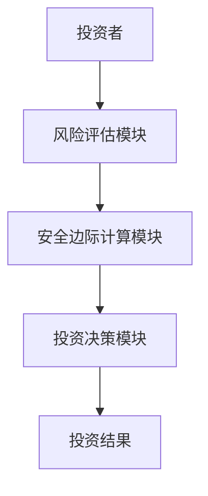
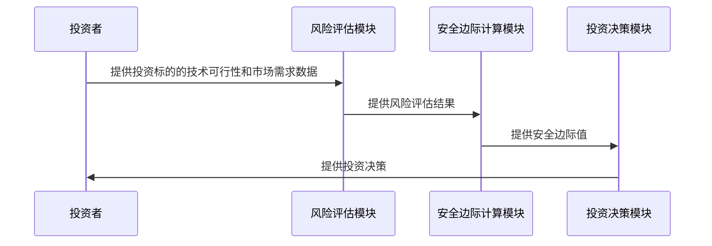

                 

# 芒格的"避免失败"原则在前沿科技投资中的重要性

> 关键词：芒格，避免失败，前沿科技投资，安全边际，逆向思维，能力圈，风险管理

> 摘要：本文深入探讨了芒格的“避免失败”原则在前沿科技投资中的重要性。通过分析安全边际、逆向思维和能力圈等核心概念，结合实际案例，详细阐述了如何在高风险的前沿科技领域应用这些原则以降低投资风险，确保投资成功。文章还从系统架构设计的角度，提出了基于“避免失败”原则的前沿科技投资框架，并通过具体项目实战，展示了如何在实际投资中应用这些原则。

---

# 第1章：芒格“避免失败”原则的核心理念

## 1.1 芒格“避免失败”原则的背景与起源

### 1.1.1 芒格投资理念的形成与发展

查理·芒格是价值投资的倡导者，他的投资理念深受老师本杰明·格雷厄姆的影响。芒格强调“避免犯大错”，而不是追求高回报。这种理念在科技投资中尤为重要，因为科技领域的高风险和不确定性使得传统的价值投资方法难以直接应用。

### 1.1.2 “避免失败”原则的核心思想

芒格的“避免失败”原则强调在投资中避免犯大错，而不是追求超额收益。他认为，投资者应该专注于构建“安全边际”，即在投资中留有足够余地，以应对不可预见的风险。

### 1.1.3 前沿科技投资的特殊性与挑战

前沿科技领域（如人工智能、量子计算、区块链等）的投资风险极高，技术不确定性大，市场波动剧烈。在这种环境下，芒格的“避免失败”原则可以帮助投资者降低风险，确保投资的安全性。

---

## 1.2 “避免失败”原则的定义与特点

### 1.2.1 安全边际的概念

安全边际是芒格投资理念的核心。它指的是投资标的的实际价值与市场价格之间的差距。通过构建安全边际，投资者可以在市场波动中保持投资的稳定性。

### 1.2.2 逆向思维的运用

芒格倡导逆向思维，即在市场低迷时寻找机会，而不是在市场高点追逐热点。这种思维方式可以帮助投资者在科技投资中避免追高，降低风险。

### 1.2.3 能力圈的构建与扩展

芒格强调投资者应专注于自己熟悉的能力圈。在科技投资中，投资者需要不断扩展自己的知识边界，以应对快速变化的技术和市场环境。

---

## 1.3 传统投资与“避免失败”原则的对比

### 1.3.1 传统投资的核心策略

传统投资注重寻找高增长的公司和市场趋势，追求超额回报。这种方式在稳定市场中表现良好，但在高风险的科技领域可能面临更大的风险。

### 1.3.2 “避免失败”原则的独特优势

与传统投资相比，“避免失败”原则更加注重风险控制和安全性。通过构建安全边际和逆向思维，投资者可以在高风险环境中降低损失，确保投资的稳定性。

### 1.3.3 两者的异同点分析

| 方面         | 传统投资             | “避免失败”原则       |
|--------------|----------------------|-----------------------|
| 核心目标     | 追求高回报           | 避免重大损失          |
| 风险控制     | 较为宽松            | 强调严格控制          |
| 适用场景     | 稳定市场             | 高风险市场（如科技）  |

---

## 1.4 本章小结

芒格的“避免失败”原则通过构建安全边际、运用逆向思维和专注于能力圈，为投资者提供了一种稳健的投资方法。在前沿科技投资中，这种方法可以帮助投资者降低风险，确保投资的安全性。

---

# 第2章：前沿科技投资的核心要素

## 2.1 前沿科技的定义与分类

### 2.1.1 人工智能

人工智能（AI）是当前科技领域的热点，涵盖了机器学习、自然语言处理等领域。AI技术的应用范围广泛，但在投资时需要关注技术的可行性和市场需求。

### 2.1.2 量子计算

量子计算在理论上可以解决传统计算机难以处理的问题，但技术实现难度大，投资风险高。

### 2.1.3 区块链

区块链技术在金融、物流等领域有广泛应用潜力，但目前仍处于发展初期，市场波动较大。

### 2.1.4 生物技术

生物技术在医疗、农业等领域有巨大潜力，但研发周期长，投资风险高。

---

## 2.2 前沿科技投资的高风险与高回报

### 2.2.1 高风险的来源

前沿科技领域的技术和市场不确定性大，可能导致投资失败。

### 2.2.2 高回报的可能性

成功的技术突破可能带来巨大的经济回报。

### 2.2.3 风险与回报的平衡

通过“避免失败”原则，投资者可以在高风险中寻找高回报的机会。

---

## 2.3 前沿科技投资的关键因素

### 2.3.1 技术可行性

投资者需要评估技术的可行性，确保投资的技术能够在未来实现商业化。

### 2.3.2 市场需求

市场需求是投资成功的关键，投资者需要关注目标市场的潜力和需求。

### 2.3.3 团队能力

优秀的团队是技术成功的关键，投资者需要评估团队的能力和经验。

### 2.3.4 商业模式

清晰的商业模式是投资成功的保障，投资者需要关注企业的盈利能力和市场定位。

---

## 2.4 本章小结

前沿科技投资的高风险和高回报特性要求投资者具备高度的专业性和谨慎性。通过“避免失败”原则，投资者可以在高风险中寻找高回报的机会。

---

# 第3章：“避免失败”原则在前沿科技投资中的应用

## 3.1 安全边际的构建

### 3.1.1 安全边际的计算方法

安全边际 = 实际价值 - 市场价格

### 3.1.2 如何在前沿科技中应用安全边际

投资者需要评估技术的可行性和市场需求，确保投资标的的实际价值高于市场价格。

### 3.1.3 安全边际与投资回报的关系

较高的安全边际可以降低投资风险，但可能牺牲部分潜在回报。

---

## 3.2 逆向思维的实践

### 3.2.1 逆向思维的定义与特点

逆向思维是指在市场低迷时寻找机会，而不是在市场高点追逐热点。

### 3.2.2 逆向思维在前沿科技投资中的具体应用

在科技领域，逆向思维可以帮助投资者在市场低谷时发现潜在机会。

### 3.2.3 逆向思维与传统投资思维的对比

| 方面         | 逆向思维             | 传统思维           |
|--------------|----------------------|-------------------|
| 投资时机     | 市场低迷时            | 市场高点时          |
| 风险控制     | 强调风险管理          | 更关注收益         |

---

## 3.3 能力圈的扩展与优化

### 3.3.1 如何识别自己的能力圈

投资者需要评估自己的知识和经验，找到自己熟悉的领域。

### 3.3.2 如何扩展能力圈

通过学习和实践，不断扩展自己的知识和经验。

### 3.3.3 能力圈与投资决策的关系

能力圈是投资决策的基础，投资者应该专注于自己熟悉的能力圈。

---

## 3.4 本章小结

通过构建安全边际、运用逆向思维和专注于能力圈，投资者可以在高风险的前沿科技领域中降低风险，确保投资的成功。

---

# 第4章：前沿科技投资中的风险管理

## 4.1 风险管理的核心理念

### 4.1.1 风险的定义与分类

风险是投资中不可预见的事件可能导致的损失。

### 4.1.2 风险管理的目标与方法

风险管理的目标是降低投资损失，方法包括分散投资、构建安全边际等。

---

## 4.2 风险管理的具体实践

### 4.2.1 分散投资

通过投资多个项目，降低单一项目的风险。

### 4.2.2 定期评估

定期评估投资标的的风险和价值变化。

### 4.2.3 灵活调整

根据市场变化，及时调整投资策略。

---

## 4.3 本章小结

有效的风险管理是前沿科技投资成功的关键。通过分散投资、定期评估和灵活调整，投资者可以降低投资风险，确保投资的安全性。

---

# 第5章：项目实战——基于“避免失败”原则的前沿科技投资案例

## 5.1 案例分析：投资特斯拉

### 5.1.1 投资背景

特斯拉是电动汽车领域的领导者，但市场波动大，技术风险高。

### 5.1.2 “避免失败”原则的应用

通过构建安全边际，投资者可以在特斯拉股价低迷时介入，降低投资风险。

### 5.1.3 投资结果

特斯拉股价长期上涨，投资者获得了高额回报。

---

## 5.2 案例分析：投资SpaceX

### 5.2.1 投资背景

SpaceX是航天领域的创新者，技术难度大，市场前景广阔。

### 5.2.2 “避免失败”原则的应用

通过逆向思维，投资者在市场低谷时介入，降低投资风险。

### 5.2.3 投资结果

SpaceX成功发射多颗卫星，投资者获得了丰厚的回报。

---

## 5.3 本章小结

通过“避免失败”原则，投资者可以在高风险的前沿科技领域中找到成功的投资机会。

---

# 第6章：系统架构设计——基于“避免失败”原则的前沿科技投资框架

## 6.1 问题场景介绍

前沿科技投资的高风险和高回报特性要求投资者构建一个稳健的投资框架。

## 6.2 系统功能设计

### 6.2.1 风险评估模块

通过分析技术可行性和市场需求，评估投资风险。

### 6.2.2 安全边际计算模块

计算投资标的的安全边际，确保投资的稳健性。

### 6.2.3 投资决策模块

根据风险评估和安全边际计算，做出投资决策。

---

## 6.3 系统架构设计

### 6.3.1 系统架构图

### 6.3.2 接口设计

- 风险评估模块接口：接收投资标的的技术可行性和市场需求数据，输出风险评估结果。
- 安全边际计算模块接口：接收投资标的的实际价值和市场价格数据，输出安全边际值。
- 投资决策模块接口：接收风险评估结果和安全边际值，输出投资决策。

---

## 6.4 系统交互设计

### 6.4.1 序列图

---

## 6.5 本章小结

通过构建基于“避免失败”原则的系统架构，投资者可以在高风险的前沿科技领域中实现稳健投资。

---

# 第7章：总结与展望

## 7.1 本章总结

芒格的“避免失败”原则通过构建安全边际、运用逆向思维和专注于能力圈，为投资者提供了一种稳健的投资方法。在前沿科技投资中，这种方法可以帮助投资者降低风险，确保投资的成功。

## 7.2 未来展望

随着科技的快速发展，前沿科技投资的复杂性将不断增加。未来，投资者需要更加注重风险管理，结合“避免失败”原则，构建更加稳健的投资框架。

---

# 作者：AI天才研究院 & 禅与计算机程序设计艺术

---

**本文完**

