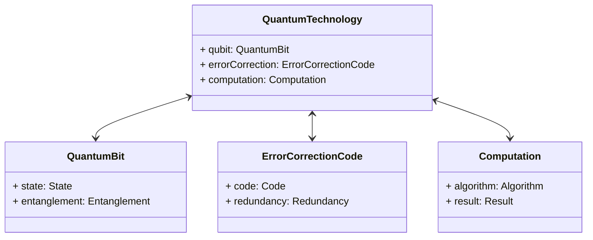
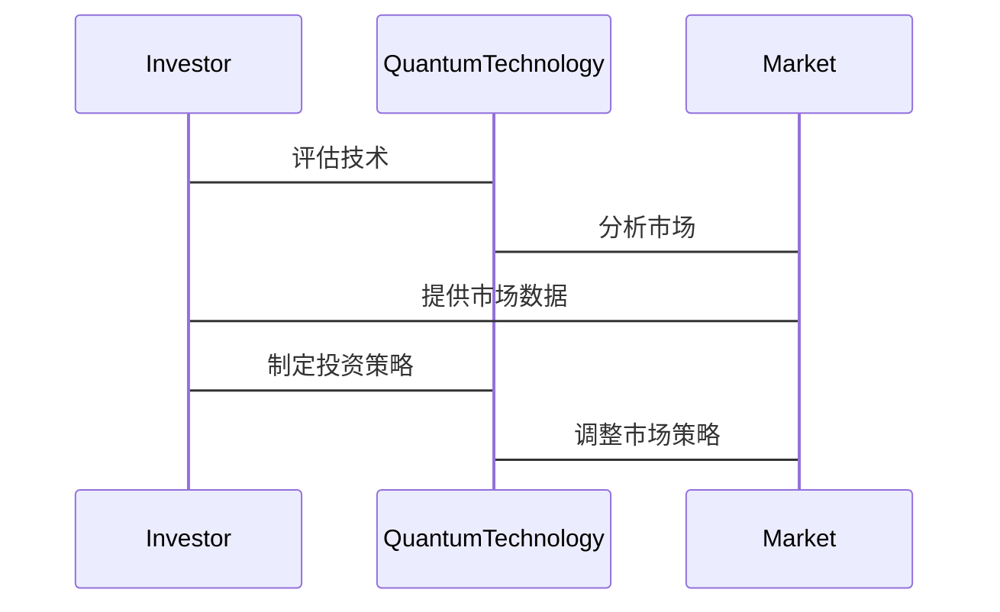

                 

<think>
好，我现在需要根据用户的要求，撰写一篇关于“芒格的‘避免失败’原则在量子纠错技术投资中的应用”的技术博客文章。我需要按照用户提供的目录大纲进行内容创作，并确保每个部分都详细且符合逻辑。首先，我会从引言开始，然后逐步展开每一章的内容。

---

# 芒格的"避免失败"原则在量子纠错技术投资中的应用

> 关键词：芒格原则，量子纠错技术，投资策略，风险管理，系统架构

> 摘要：本文探讨了芒格的“避免失败”原则在量子纠错技术投资中的应用，分析了量子纠错技术的核心概念、投资策略、风险管理以及系统架构设计。通过理论与实际案例的结合，本文为投资者提供了在量子技术领域避免失败的策略和方法。

---

# 第一部分：芒格的“避免失败”原则与量子纠错技术投资的背景

## 引言

量子技术作为21世纪最具革命性的技术之一，正在改变多个行业。然而，量子技术的投资充满了不确定性，尤其是在量子纠错技术领域。本文将结合芒格的“避免失败”原则，探讨如何在量子纠错技术投资中避免重大风险，确保投资的稳健性。

---

# 第二部分：芒格原则与量子纠错技术的核心概念

## 第1章：芒格的“避免失败”原则概述

### 1.1 芒格的“避免失败”原则

芒格的“避免失败”原则强调在投资前先识别和避免潜在的失败因素，而不是一味追求成功。这种方法的核心在于通过逆向思维，减少投资中的重大风险。

#### 1.1.1 芒格的生平与投资哲学

查理·芒格是一位著名投资者和作家，他的投资哲学以“避免失败”为核心，强调理性思考和风险控制。他认为，成功的投资不在于追求高收益，而在于避免重大损失。

#### 1.1.2 “避免失败”原则的核心思想

芒格的“避免失败”原则包括以下几点：

1. **识别潜在风险**：在投资前，分析可能的风险因素。
2. **避免重大损失**：通过分散投资和风险控制，减少重大损失的可能性。
3. **长期稳健**：追求长期稳健的投资回报，而不是短期高收益。

#### 1.1.3 该原则在投资中的应用

芒格的“避免失败”原则在传统投资中已经被广泛应用于股票、基金等领域的投资决策。本文将探讨其在量子纠错技术投资中的应用。

---

### 1.2 量子纠错技术的基本概念

#### 1.2.1 量子技术的基本原理

量子技术基于量子力学原理，利用量子叠加和量子纠缠效应进行信息处理。与经典计算机不同，量子计算机能够在某些领域（如密码学、优化问题）提供远超传统计算机的计算能力。

#### 1.2.2 量子纠错技术的定义与特点

量子纠错技术是量子计算中的关键组成部分，用于检测和纠正量子态中的错误。其主要特点包括：

1. **抗干扰性**：能够在噪声环境中保持量子态的稳定性。
2. **容错性**：通过冗余编码，减少错误对计算结果的影响。
3. **复杂性**：量子纠错码的设计和实现具有较高的技术门槛。

#### 1.2.3 量子纠错技术在投资中的潜在价值

量子纠错技术的投资价值体现在以下几个方面：

1. **技术领先性**：掌握量子纠错技术的企业可能在未来的量子计算市场中占据优势。
2. **风险控制**：通过量子纠错技术，可以减少量子计算中的错误，提高计算的可靠性。
3. **市场潜力**：随着量子计算的商业化，量子纠错技术将成为关键的技术支撑。

---

## 第2章：芒格原则与量子纠错技术的内在联系

### 2.1 芒格原则的系统化分析

芒格的“避免失败”原则在量子纠错技术投资中的应用可以分为以下几个步骤：

1. **识别潜在风险**：分析量子纠错技术中的潜在风险，如技术不成熟、市场需求不足等。
2. **评估风险影响**：量化这些风险对投资的影响程度。
3. **制定规避策略**：通过分散投资、选择可靠的技术路线等方式，降低风险。
4. **监控与调整**：定期评估投资组合的表现，及时调整策略。

#### 2.1.1 芒格原则的逻辑框架

以下是芒格原则的逻辑框架：

$$
\text{成功投资} = \text{避免重大失败} + \text{稳健增长}
$$

---

### 2.2 量子纠错技术的数学基础

#### 2.2.1 量子位与纠错码的基本概念

量子位（qubit）是量子计算的基本单位，与经典计算机中的二进制位（bit）不同，量子位可以处于叠加态。量子纠错码用于检测和纠正量子态中的错误。

#### 2.2.2 量子纠错码的分类与特点

常见的量子纠错码包括：

1. **Steane码**：用于纠正单个量子位的错误。
2. **Shor码**：用于纠正单个量子位的错误，并能够检测多个错误。
3. **表面码**：一种适用于分布式量子计算的纠错码。

#### 2.2.3 量子纠错技术的数学模型

量子纠错码的数学模型可以通过以下公式表示：

$$
\text{纠错码} = \text{编码} \oplus \text{纠错}
$$

其中，$\oplus$ 表示异或运算。

---

## 第3章：量子纠错技术的投资策略分析

### 3.1 芒格原则在量子技术投资中的应用

#### 3.1.1 投资前的“避免失败”分析

在投资量子纠错技术之前，投资者需要进行以下分析：

1. **技术可行性**：评估量子纠错技术的成熟度。
2. **市场需求**：分析量子计算市场的潜在需求。
3. **竞争环境**：了解竞争对手的技术水平和市场地位。

#### 3.1.2 量子技术企业的评估标准

评估量子技术企业时，可以参考以下标准：

1. **技术团队**：评估企业的技术实力和研发能力。
2. **技术路线**：分析企业的量子纠错技术路线是否具有前瞻性。
3. **市场前景**：评估量子技术的市场潜力。

#### 3.1.3 投资组合的优化策略

为了降低投资风险，投资者可以通过分散投资、选择不同技术路线的企业等方式优化投资组合。

---

### 3.2 量子纠错技术的市场分析

#### 3.2.1 当前量子技术市场的现状

当前，量子技术市场仍处于起步阶段，但增长潜力巨大。根据市场研究机构的预测，全球量子计算市场规模将在未来几年内快速增长。

#### 3.2.2 量子纠错技术的未来发展趋势

随着量子计算的商业化，量子纠错技术将成为关键的技术支撑。未来，量子纠错技术将在以下几个方面得到广泛应用：

1. **量子密码学**：用于保护量子通信的安全性。
2. **量子计算**：用于提高量子计算机的计算精度。
3. **量子传感器**：用于提高量子传感器的灵敏度。

---

## 第4章：量子纠错技术的投资风险与管理

### 4.1 量子纠错技术的投资风险

#### 4.1.1 技术风险

量子纠错技术尚处于发展阶段，技术不成熟可能导致投资失败。

#### 4.1.2 市场风险

量子计算市场的不确定性可能导致投资失败。

#### 4.1.3 竞争风险

竞争对手的技术突破可能影响企业的市场地位。

---

### 4.2 风险管理策略

#### 4.2.1 技术风险管理

通过选择技术领先的企业和分散投资，降低技术风险。

#### 4.2.2 市场风险管理

通过关注市场动态和选择有潜力的市场，降低市场风险。

#### 4.2.3 竞争风险管理

通过分析竞争对手的技术路线和市场策略，制定相应的应对策略。

---

## 第5章：量子纠错技术的系统架构设计

### 5.1 系统功能设计

#### 5.1.1 领域模型（Mermaid 类图）



---

### 5.2 系统架构设计（Mermaid 架构图）

```mermaid
archimate
title QuantumTechnology Architecture

process QuantumTechnology
process ErrorCorrectionCode
process Computation
process QuantumBit

QuantumTechnology --> ErrorCorrectionCode
QuantumTechnology --> Computation
QuantumTechnology --> QuantumBit
```

---

### 5.3 系统交互设计（Mermaid 序列图）



---

## 第6章：量子纠错技术的项目实战

### 6.1 项目背景与目标

#### 6.1.1 项目背景

假设我们计划投资一家专注于量子纠错技术的公司，目标是通过芒格的“避免失败”原则，确保投资的成功。

---

### 6.2 环境安装与配置

#### 6.2.1 安装必要的工具与库

为了进行量子纠错技术的分析，我们需要安装以下工具：

1. **Qiskit**： IBM 的量子计算开发工具包。
2. **Cirq**： Google 的量子计算开发框架。
3. **Python**：用于编写量子计算代码。

安装命令：

```bash
pip install qiskit cirq python
```

---

### 6.3 核心实现源代码

#### 6.3.1 量子纠错码的实现

以下是量子纠错码的简单实现示例：

```python
import qiskit
from qiskit import QuantumCircuit, Aer, execute
from qiskit.circuit import Gate, InstructionSet

def create_steane_code():
    qc = QuantumCircuit(5, 1)
    # 定义 Steane 码的编码过程
    qc.h(0)
    qc.h(1)
    qc.h(2)
    qc.h(3)
    qc.cnot(0, 4)
    qc.cnot(1, 4)
    qc.cnot(2, 4)
    qc.cnot(3, 4)
    return qc

# 创建 Steane 码电路
steane_circuit = create_steane_code()
# 执行电路
simulator = Aer.get_backend('statevector_simulator')
job = execute(steane_circuit, simulator)
result = job.result()
# 输出结果
print(result.get_statevector())
```

---

### 6.4 代码解读与分析

#### 6.4.1 代码功能分析

上述代码实现了Steane码的编码过程，展示了量子纠错码的基本原理。通过量子叠加和量子门操作，我们可以看到量子纠错码是如何工作的。

---

### 6.5 案例分析

#### 6.5.1 投资案例

假设我们选择了一家专注于量子纠错码开发的公司，通过芒格的“避免失败”原则，我们进行了以下步骤：

1. **识别风险**：评估了公司的技术实力和市场需求。
2. **评估影响**：分析了技术风险和市场风险。
3. **制定策略**：选择了该公司作为投资目标，并制定了风险规避策略。
4. **监控调整**：定期评估投资表现，及时调整策略。

---

## 第7章：量子纠错技术投资的未来展望

### 7.1 量子纠错技术的未来发展趋势

随着量子计算的商业化，量子纠错技术将成为关键的技术支撑。未来，量子纠错技术将在以下几个方面得到广泛应用：

1. **量子密码学**：用于保护量子通信的安全性。
2. **量子计算**：用于提高量子计算机的计算精度。
3. **量子传感器**：用于提高量子传感器的灵敏度。

---

### 7.2 芒格原则的长期应用

芒格的“避免失败”原则不仅适用于当前的量子纠错技术投资，也将适用于未来的量子技术投资。通过不断优化投资策略，我们可以更好地应对未来的挑战。

---

## 结论

芒格的“避免失败”原则为我们提供了在量子纠错技术投资中避免失败的策略。通过系统化的分析和风险管理，我们可以确保投资的稳健性。未来，随着量子技术的不断发展，芒格原则的应用将更加广泛，帮助投资者在量子技术领域取得成功。

---

## 作者

作者：AI天才研究院/AI Genius Institute & 禅与计算机程序设计艺术/Zen And The Art of Computer Programming

---

本文通过详细分析芒格的“避免失败”原则与量子纠错技术的结合，为投资者提供了在量子技术领域避免失败的策略和方法。希望本文能为量子技术的投资提供有价值的参考。

