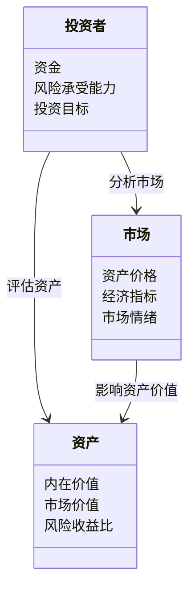
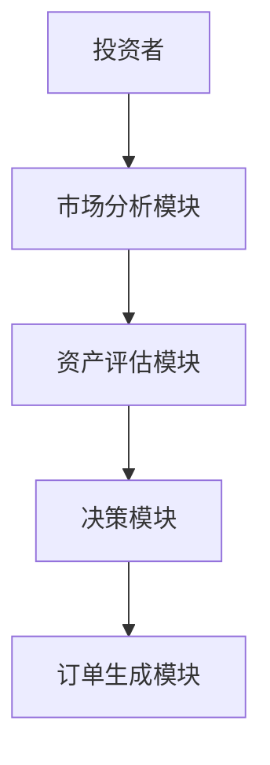
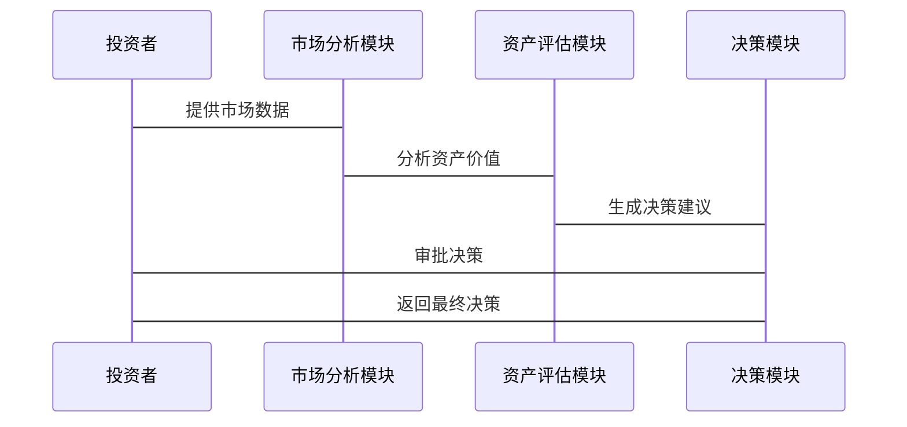
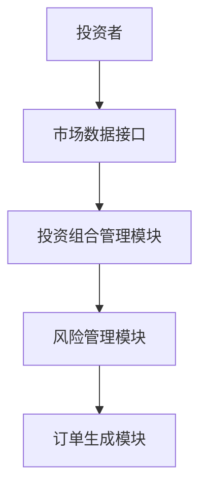

                 


# 《芒格的"避免失败"原则：投资成功的另一面》

> 关键词：芒格，避免失败，投资原则，风险管理，价值投资，决策框架，系统架构

> 摘要：本文深入探讨了芒格的“避免失败”投资原则，分析其背后的哲学和实际应用。通过详细分析投资中的风险管理、决策框架和系统架构，结合实际案例，展示了如何将这些原则融入投资策略中，以实现长期稳健的投资回报。

---

# 第一部分: 芒格的"避免失败"原则概述

## 第1章: 芒格投资理念的背景与核心思想

### 1.1 芒格的生平与投资哲学
- 芒格的早年经历与职业发展
- 芒格与巴菲特的合作关系
- 芒格投资哲学的核心理念：寻找“护城河”和“能力圈”

### 1.2 "避免失败"原则的提出背景
- 投资领域中的常见失败模式：过度杠杆、盲目跟风、情绪化决策
- 芒格为何强调“避免失败”：从“安全边际”到“心理检查清单”
- "避免失败"原则与传统投资理念的对比：主动防御 vs. 被动进攻

### 1.3 "避免失败"原则的核心要素
- 风险控制的重要性：本金保护优先于收益追求
- 投资决策中的心理因素：克服认知偏差与情绪干扰
- 长期投资与价值投资的结合：寻找市场先生的弱点

## 1.4 本章小结
- 芒格的“避免失败”原则是一种以风险管理为核心的投资哲学
- 通过避免重大损失，投资者可以在长期获得更稳健的回报

---

# 第二部分: 投资中的风险管理策略

## 第2章: 投资中的“避免失败”策略

### 2.1 避免失败的三大原则
- 原则一：避免过度杠杆：解读资产负债表的奥秘
- 原则二：避免投资看不懂的领域：坚守能力圈的边界
- 原则三：避免情绪化决策：应对市场的波动性

### 2.2 投资中的风险管理策略
- 风险的分类与识别：系统性风险 vs. 非系统性风险
- 风险评估与量化：使用概率论和统计学方法进行风险分析
- 风险控制的具体措施：建立多层次的风险防火墙

### 2.3 芒格的“安全边际”概念
- 安全边际的定义与作用：买入价格低于内在价值
- 安全边际的计算方法：市盈率、市净率与内在价值的对比
- 安全边际在实际投资中的应用：寻找“烟屁股”和“ cigar butt”投资机会

### 2.4 本章小结
- 风险管理是实现长期投资目标的关键
- 芒格的“安全边际”理念为投资者提供了有效的风险管理工具

---

# 第三部分: 投资决策中的心理因素

## 第3章: 心理偏差对投资决策的影响

### 3.1 常见的心理偏差及其表现
- 过度自信偏差：投资者对自身能力的过高估计
- 拉姆齐效应：市场的非理性波动与投资者心理
- 沉没成本谬误：对过去决策的不合理坚持

### 3.2 心理偏差对投资决策的具体影响
- 心理偏差导致的错误决策：追涨杀跌的误区
- 心理偏差对投资组合的影响：过度集中与分散投资的平衡
- 如何识别和避免心理偏差：芒格的“心理检查清单”方法

### 3.3 芒格对心理因素的独到见解
- 芒格如何应对心理偏差：通过逆向思维和理性分析
- 芒格的“心理检查清单”方法：避免常见错误决策的实用工具
- 心理因素在投资中的重要性：从“认知”到“行动”的一致性

### 3.4 本章小结
- 心理因素是投资决策中不可忽视的重要变量
- 通过自我反思和工具辅助，投资者可以有效克服心理偏差

---

# 第四部分: 投资决策的系统架构与算法原理

## 第4章: 决策框架的系统分析

### 4.1 问题场景介绍
- 投资决策的复杂性：多因素影响下的决策过程
- 投资者如何构建有效的决策框架

### 4.2 系统功能设计
- 领域模型：投资者、市场、资产之间的关系
- 使用 mermaid 绘制领域模型类图：


### 4.3 系统架构设计
- 使用 mermaid 绘制系统架构图：


### 4.4 系统接口设计
- 输入：市场数据、资产信息、投资者偏好
- 输出：投资决策、交易指令

### 4.5 系统交互设计
- 使用 mermaid 绘制序列图：


### 4.6 本章小结
- 系统化的决策框架有助于投资者避免失败
- 使用工具和技术辅助投资决策，可以提高决策的科学性和准确性

---

# 第五部分: 投资组合管理与实战案例

## 第5章: 投资组合管理的系统实现

### 5.1 项目实战：构建稳健的投资组合
- 环境安装：选择合适的金融分析工具（如Excel、Python）
- 核心实现：使用Python进行资产配置优化
  ```python
  import numpy as np
  import pandas as pd
  # 示例代码：计算投资组合的夏普比率
  def calculate_sharpe_ratio(returns, risk_free_rate):
      portfolio_return = np.mean(returns)
      portfolio_volatility = np.std(returns)
      sharpe_ratio = (portfolio_return - risk_free_rate) / portfolio_volatility
      return sharpe_ratio
  ```
- 代码应用解读：优化投资组合的夏普比率
- 实际案例分析：如何通过芒格的“避免失败”原则构建投资组合

### 5.2 投资组合的系统架构设计
- 使用 mermaid 绘制投资组合管理系统的架构图：


### 5.3 案例分析：芒格风格的投资组合
- 选择具有“护城河”的企业进行投资
- 分析企业的财务状况、竞争优势和管理层质量
- 构建分散化的投资组合以降低风险

### 5.4 本章小结
- 投资组合管理是实现长期投资目标的关键
- 通过系统化的方法和工具，投资者可以更好地应用芒格的“避免失败”原则

---

# 第六部分: 最佳实践与小结

## 第6章: 投资决策中的注意事项与最佳实践

### 6.1 注意事项
- 避免过度自信，保持谦逊
- 时刻关注市场的变化，及时调整投资策略
- 长期投资需要耐心和纪律

### 6.2 最佳实践 tips
- 定期回顾和调整投资组合
- 使用工具辅助投资决策
- 保持对市场的敬畏之心

### 6.3 本章小结
- 芒格的“避免失败”原则是一种长期有效的投资策略
- 通过系统化的管理和持续的学习，投资者可以在复杂的市场环境中获得稳健的回报

---

# 作者：AI天才研究院/AI Genius Institute & 禅与计算机程序设计艺术 /Zen And The Art of Computer Programming

