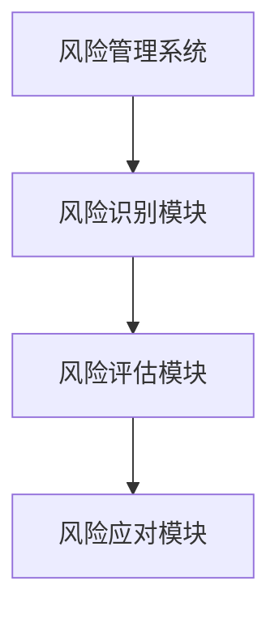

                 


# 芒格的"避免愚蠢"原则在风险管理中的应用

---

## 关键词：芒格、避免愚蠢、风险管理、决策框架、心理偏见、多元思维模型

---

## 摘要：

本文深入探讨了芒格的"避免愚蠢"原则在风险管理中的应用。通过分析芒格的核心理念，结合风险管理的基本概念和方法，本文详细阐述了如何利用芒格的多元思维模型和心理偏见分析来优化风险管理过程。文章还通过实际案例和系统设计，展示了如何构建防御性决策框架，以降低决策错误和风险损失。本文适合风险管理从业者、企业决策者以及对芒格思想感兴趣的读者阅读。

---

## 第1章：芒格的"避免愚蠢"原则的核心理念

### 1.1 芒格的"避免愚蠢"原则的背景与起源

芒格的"避免愚蠢"原则是其投资哲学和决策框架的核心思想之一。该原则强调通过识别和避免心理偏见来减少决策错误，从而在投资和生活中做出更明智的决策。芒格认为，愚蠢的决策往往源于心理偏见和认知误差，而通过系统性的思考和多元思维模型，可以有效减少这些错误。

#### 1.1.1 芒格的"避免愚蠢"原则的提出背景

芒格的"避免愚蠢"原则起源于他对心理学、经济学和决策科学的深刻理解。他通过研究人类的决策过程，发现许多错误决策是由于心理偏见（如确认偏见、过度自信偏见等）导致的。因此，他提出了一套基于多元思维模型的决策框架，以帮助人们避免这些错误。

#### 1.1.2 原理的核心思想与目标

芒格的核心思想是：通过识别和避免心理偏见，优化决策过程，从而减少愚蠢的决策。其目标是帮助人们在复杂决策中保持理性和客观。

#### 1.1.3 原理的外延与边界

芒格的"避免愚蠢"原则不仅适用于投资领域，还可以应用于生活中的各种决策。其外延包括心理偏见分析、多元思维模型构建以及防御性决策框架的设计。其边界在于，它主要关注个体或组织的决策优化，而非宏观系统性风险的管理。

### 1.2 芒格"避免愚蠢"原则的核心要素

芒格的"避免愚蠢"原则包含三个核心要素：心理偏见的识别与分析、多元思维模型的构建与应用，以及防御性决策框架的优化。

#### 1.2.1 心理偏见的识别与分析

芒格认为，心理偏见是导致决策错误的主要原因。常见的心理偏见包括：

- **确认偏见**：倾向于寻找支持已有假设的信息，忽略反面证据。
- **过度自信偏见**：高估自己对某一领域的理解，导致决策过于自信。
- **沉没成本偏见**：在已经投入资源的情况下，继续投入以避免损失。

#### 1.2.2 多元思维模型的构建与应用

芒格强调，多元思维模型是避免愚蠢的关键工具。通过将多个学科的知识整合到一个框架中，可以更全面地分析问题。例如，结合心理学、经济学和风险管理的知识，可以更好地识别潜在风险。

#### 1.2.3 防御性决策框架的优化

芒格提出，防御性决策框架的核心是通过降低决策错误的概率，而非追求完美决策。这包括：

- 建立多个决策层，避免单一决策导致重大风险。
- 使用逆向思维，从最坏情况出发，设计防御机制。

---

## 第2章：风险管理的基本概念

### 2.1 风险的定义与分类

#### 2.1.1 风险的定义

风险是指未来结果的不确定性，通常表现为可能对目标产生负面影响的事件或行为。

#### 2.1.2 风险的分类与特点

风险可以分为以下几类：

- **系统性风险**：影响整个市场的风险，如经济衰退。
- **非系统性风险**：影响特定资产或个体的风险，如公司破产。
- **可量化风险**：可以通过数学模型评估的风险。
- **不可量化风险**：难以用具体数值评估的风险。

#### 2.1.3 风险的量化与评估

风险量化通常涉及概率论和统计学方法。例如，可以通过概率分布模型评估某项投资的风险。

### 2.2 风险管理的基本流程

风险管理的基本流程包括：

1. **风险识别**：识别潜在风险源。
2. **风险评估**：评估风险的概率和影响。
3. **风险应对策略**：制定应对措施，如分散投资、购买保险等。

---

## 第3章：芒格"避免愚蠢"原则在风险管理中的应用

### 3.1 心理偏见对风险管理的影响

#### 3.1.1 常见心理偏见及其对风险管理的影响

心理偏见可能导致以下风险管理错误：

- **确认偏见**：导致投资者只关注支持自己决策的信息，忽略反面证据。
- **过度自信偏见**：导致投资者低估风险，过度集中投资。

#### 3.1.2 心理偏见对风险决策的具体影响

心理偏见可能导致以下问题：

- **决策失误**：因偏见而做出错误的投资决策。
- **风险管理失效**：因偏见而忽略潜在风险。

### 3.2 多元思维模型在风险管理中的应用

#### 3.2.1 多元思维模型的构建

构建多元思维模型需要结合多个学科的知识。例如，结合心理学、经济学和风险管理的知识，可以更全面地分析投资风险。

#### 3.2.2 多元思维模型在风险管理中的具体应用

通过多元思维模型，可以识别潜在风险，并制定更有效的应对策略。例如，通过结合心理学和经济学知识，可以预测市场波动并制定相应的风险管理措施。

---

## 第4章：构建防御性决策框架

### 4.1 防御性决策框架的设计

#### 4.1.1 多层防御机制的构建

防御性决策框架通常包括以下层次：

1. **第一层防御**：识别潜在风险。
2. **第二层防御**：评估风险影响。
3. **第三层防御**：制定应对策略。

#### 4.1.2 逆向思维在风险管理中的应用

逆向思维可以帮助我们从最坏情况出发，设计防御机制。例如，假设市场崩盘，制定相应的风险管理策略。

### 4.2 防御性决策框架的优化

#### 4.2.1 防御性框架的优化策略

防御性决策框架可以通过以下方式优化：

- 定期评估和更新风险管理策略。
- 引入新的风险管理工具和技术。

---

## 第5章：风险管理的系统架构设计

### 5.1 系统设计与功能模块

#### 5.1.1 系统功能设计（领域模型）

风险管理系统的领域模型包括以下模块：

- **风险识别模块**：识别潜在风险。
- **风险评估模块**：评估风险影响。
- **风险应对模块**：制定应对策略。

#### 5.1.2 系统架构设计（架构图）

以下是风险管理系统的架构图：



---

## 第6章：项目实战：风险管理系统的实现

### 6.1 环境安装

风险管理系统的实现需要以下环境：

- **编程语言**：Python
- **工具**：Jupyter Notebook
- **库**：pandas、numpy、scipy

### 6.2 核心代码实现

以下是风险管理系统的实现代码：

```python
import numpy as np
import pandas as pd
from scipy.stats import norm

# 定义风险评估函数
def risk_assessment(returns, confidence_level=0.95):
    mu = np.mean(returns)
    sigma = np.std(returns)
   VaR = mu - norm.ppf(confidence_level) * sigma
    return VaR

# 示例数据
returns = np.random.normal(0.05, 0.1, 1000)

# 计算VaR
VaR = risk_assessment(returns)
print(f"VaR at {int(confidence_level*100)}% confidence level: {VaR:.2f}")
```

### 6.3 案例分析与解读

通过上述代码，我们可以计算投资组合的VaR（在险价值），从而评估潜在风险。

---

## 第7章：总结与展望

### 7.1 总结

芒格的"避免愚蠢"原则在风险管理中的应用，可以帮助我们识别和避免心理偏见，优化决策过程，从而降低风险损失。通过结合多元思维模型和防御性决策框架，我们可以更有效地管理风险。

### 7.2 未来展望

未来，随着人工智能和大数据技术的发展，风险管理将更加依赖于智能化工具和算法。芒格的"避免愚蠢"原则将继续为风险管理提供理论指导，帮助我们应对更复杂的挑战。

---

## 作者：AI天才研究院/AI Genius Institute & 禅与计算机程序设计艺术 /Zen And The Art of Computer Programming

