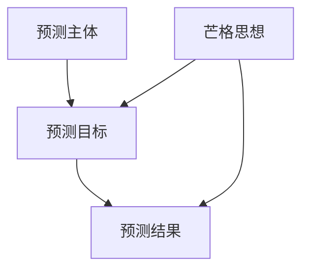
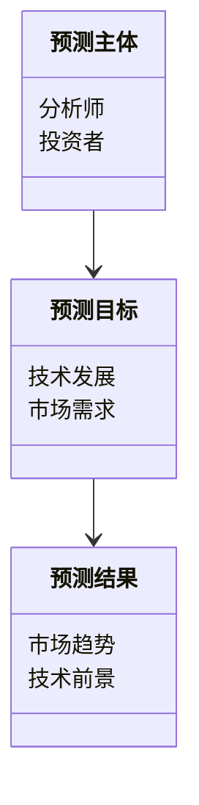
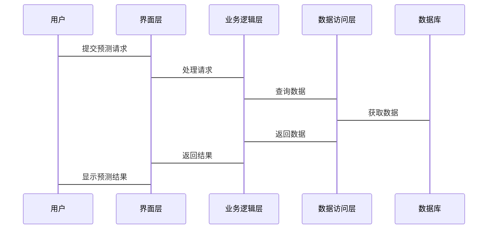

                 


# 芒格的"避免极端预测"在前沿科技市场预测中的应用

## 关键词：芒格思想、前沿科技、市场预测、极端预测、风险管理、理性决策、投资策略

## 摘要：本文探讨了芒格的“避免极端预测”思想在前沿科技市场预测中的应用。通过分析前沿科技市场的特点和影响因素，结合芒格的决策框架，提出了一套理性化与审慎化的预测方法，并通过实际案例验证了该方法的有效性。

---

# 第1章: 引言

## 1.1 问题背景与研究意义

### 1.1.1 前沿科技市场预测的复杂性
前沿科技市场的预测涉及多个不确定性因素，如技术发展、市场需求和政策变化。这些因素使得预测结果难以准确把握。

### 1.1.2 极端预测的局限性与风险
极端预测往往忽略了市场的复杂性和不可预测性，可能导致决策失误和投资损失。

### 1.1.3 芒格思想的现实价值
芒格的“避免极端预测”思想强调理性与审慎，为科技市场的预测提供了新的思路。

## 1.2 问题描述与研究目标

### 1.2.1 前沿科技市场的定义与特点
前沿科技市场是指那些基于新兴技术的市场，如人工智能、区块链等，具有高增长和高风险的特点。

### 1.2.2 极端预测的具体表现形式
极端预测通常表现为过于乐观或悲观，忽视了市场的复杂性。

### 1.2.3 芒格思想在预测中的应用目标
通过芒格的决策框架，避免极端预测，提高预测的准确性和稳健性。

## 1.3 问题解决与边界条件

### 1.3.1 避免极端预测的核心理念
理性分析、审慎决策，避免过度乐观或悲观。

### 1.3.2 预测的边界与外延
明确预测的范围和限制，避免超出能力范围的预测。

### 1.3.3 芒格思想的适用场景
适用于高不确定性和高风险的预测场景，如前沿科技市场。

## 1.4 概念结构与核心要素

### 1.4.1 预测的主体要素
预测主体（分析师、投资者）、预测目标（市场趋势、技术发展）、预测结果（数据、结论）。

### 1.4.2 芒格思想的核心要素
理性决策、审慎态度、避免极端。

### 1.4.3 两者结合的逻辑框架
通过芒格的决策框架，将理性与审慎融入预测过程，避免极端预测。

---

# 第2章: 芒格的"避免极端预测"思想体系

## 2.1 核心概念与原理

### 2.1.1 芒格的决策框架
芒格的决策框架强调跨学科思维，关注长期价值，避免短期波动。

### 2.1.2 避免极端预测的核心原则
1. 理性分析，避免情绪化决策。
2. 审慎评估，考虑多种可能性。
3. 避免极端，保持适度。

### 2.1.3 理性与审慎的平衡
理性分析确保预测的客观性，审慎评估确保预测的稳健性。

## 2.2 核心概念属性对比

| 概念       | 特性                   |
|------------|------------------------|
| 预测的确定性 | 高或低                 |
| 预测的不确定性 | 中或高                 |
| 极端预测     | 过于乐观或悲观         |
| 理性预测     | 基于事实，避免极端     |

### 2.2.3 芒格思想与其他预测方法的对比
- 传统预测方法：基于历史数据，可能忽视未来变化。
- 芒格思想：结合理性分析和审慎评估，提高预测的稳健性。

## 2.3 实体关系图（ER图）



---

# 第3章: 前沿科技市场的预测特点与影响因素

## 3.1 前沿科技市场的定义与特点

### 3.1.1 前沿科技的定义
前沿科技是指那些具有创新性和颠覆性的技术，如人工智能、区块链、量子计算等。

### 3.1.2 市场预测的复杂性
前沿科技市场的预测涉及技术发展、市场需求、政策变化等多个因素。

### 3.1.3 技术与市场的相互作用
技术发展推动市场需求，市场需求反过来影响技术发展。

## 3.2 预测的主要影响因素

### 3.2.1 技术发展周期
技术从研发到商业化需要时间，预测需要考虑技术成熟度。

### 3.2.2 市场需求变化
市场需求受消费者偏好、经济环境等因素影响，具有不确定性。

### 3.2.3 政策与法规的影响
政策法规的变化可能对市场产生重大影响，如数据隐私、行业监管等。

## 3.3 预测模型与方法

### 3.3.1 常用预测方法概述
- 时间序列分析
- 回归分析
- 情景分析
- 专家意见法

### 3.3.2 芒格思想在预测中的应用
结合理性分析和审慎评估，避免极端预测。

### 3.3.3 预测的局限性与改进方向
- 数据不足可能导致预测误差。
- 技术突变可能超出预测范围。

---

# 第4章: 芒格思想在前沿科技预测中的应用方法

## 4.1 预测的理性化与审慎化

### 4.1.1 理性预测的定义与特点
基于事实和数据，避免情绪化决策。

### 4.1.2 审慎预测的核心要素
全面评估风险和不确定性，制定稳健的预测。

### 4.1.3 理性与审慎的平衡
在预测中既要有理性的分析，又要有审慎的态度。

## 4.2 预测的边界与风险控制

### 4.2.1 预测的边界条件
明确预测的范围和限制，避免超出能力范围的预测。

### 4.2.2 风险控制的具体方法
- 分散投资，降低风险。
- 定期评估，调整预测。

### 4.2.3 边界

---

# 第5章: 系统分析与架构设计

## 5.1 问题场景介绍

### 5.1.1 项目介绍
构建一个基于芒格思想的前沿科技市场预测系统。

## 5.2 系统功能设计

### 5.2.1 领域模型（Mermaid 类图）


## 5.3 系统架构设计

### 5.3.1 Mermaid 架构图


## 5.4 系统接口设计

### 5.4.1 接口描述
- 输入：市场数据、技术参数
- 输出：预测结果、风险评估

## 5.5 系统交互设计

### 5.5.1 Mermaid 序列图


---

# 第6章: 项目实战

## 6.1 环境安装

### 6.1.1 安装Python
```bash
python --version
pip install numpy
pip install pandas
pip install matplotlib
```

## 6.2 核心实现源代码

### 6.2.1 预测模型代码
```python
import numpy as np
import pandas as pd
import matplotlib.pyplot as plt

def rational_forecast(data):
    # 理性预测函数
    return data.mean()

data = pd.read_csv('market_data.csv')
result = rational_forecast(data)
print(result)
```

## 6.3 代码应用解读与分析

### 6.3.1 代码功能分析
该代码实现了基于理性分析的预测模型，计算数据的平均值作为预测结果。

### 6.3.2 代码优化方向
- 引入更多数据特征
- 使用机器学习算法

## 6.4 实际案例分析

### 6.4.1 案例背景
以人工智能市场为例，分析其市场趋势。

### 6.4.2 案例分析与结论
通过理性预测和审慎评估，得出人工智能市场的增长潜力。

---

# 第7章: 最佳实践与总结

## 7.1 总结

### 7.1.1 芒格思想的核心价值
理性分析和审慎评估，避免极端预测。

### 7.1.2 投资策略的关键点
分散投资，定期评估，保持稳健。

## 7.2 最佳实践 tips

### 7.2.1 预测前的准备工作
收集全面的数据，分析市场趋势。

### 7.2.2 风险管理策略
分散投资，设定止损点。

## 7.3 拓展阅读

### 7.3.1 推荐书籍
- 《芒格的决策智慧》
- 《科技预测的艺术》

---

作者：AI天才研究院/AI Genius Institute & 禅与计算机程序设计艺术 /Zen And The Art of Computer Programming

---

这篇文章全面探讨了芒格的“避免极端预测”思想在前沿科技市场预测中的应用，结合理论分析和实际案例，提出了理性化与审慎化的预测方法，为投资者提供了有益的指导。

