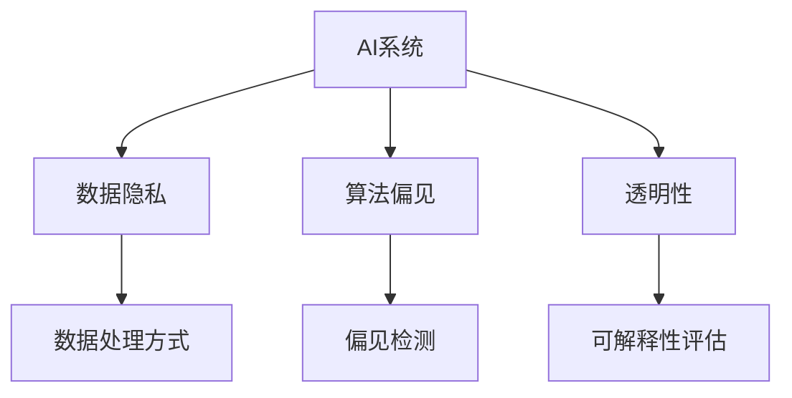
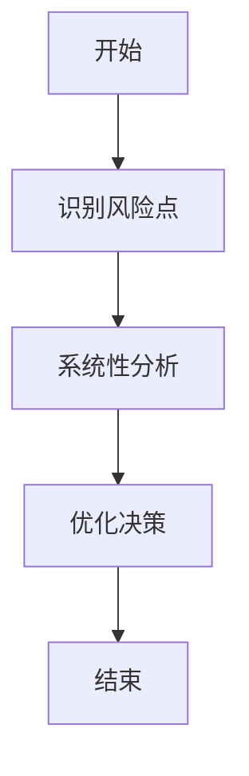

                 


# 芒格的"避免首要否认"在前沿科技风险评估中的重要性

---

## 关键词
芒格、避免首要否认、科技风险评估、系统思维、认知偏差、风险管理

---

## 摘要
本文探讨了芒格的“避免首要否认”思想在前沿科技风险评估中的重要性。通过分析芒格的思维方式，结合前沿科技领域的实际案例，我们展示了如何通过避免首要否认来降低科技风险，提升决策的准确性。文章从理论基础、系统架构、项目实战等多个维度展开，详细阐述了芒格思想在科技风险管理中的应用，为科技从业者提供了实践指导。

---

## 第1章 芒格的"避免首要否认"核心概念

### 1.1 芒格的"避免首要否认"定义
芒格的“避免首要否认”是指在面对新事物或问题时，首先保持开放态度，避免立即否定，而是通过系统性分析来验证其价值或风险。这种方法强调在决策前充分理解问题的本质，而不是基于直觉或偏见做出判断。

#### 核心概念与联系
- **首要否认**：指在面对新信息或观点时，先入为主地拒绝或否定。
- **避免首要否认**：通过开放心态和系统分析，降低首要否认带来的决策偏差。

**ER实体关系图**：
```mermaid
entity AvoidPrimaryDenial {
  has Attribute {
    id,
    description,
    application领域,
    associated心理偏差
  }
}
```

---

## 第2章 前沿科技风险评估的背景与挑战

### 2.1 前沿科技的发展现状
前沿科技如人工智能、区块链、生物技术等领域的发展速度极快，但同时也伴随着高风险。这些技术的不确定性和复杂性使得传统的风险评估方法难以应对。

#### 技术不确定性与风险
前沿科技的不确定性主要体现在：
1. 技术的成熟度不足。
2. 市场接受度的不确定性。
3. 伦理与法律问题。

---

## 第3章 芒格"避免首要否认"的理论基础

### 3.1 认知偏差与决策错误
认知偏差是人类决策中的常见问题，其中首要否认是一种典型的认知偏差，可能导致错误的决策。

#### 认知偏差对决策的影响
- **确认偏差**：倾向于接受支持已有观点的信息。
- **选择性忽视**：忽视与已有观点不符的信息。

**表格对比：认知偏差对决策的影响**
| 认知偏差类型 | 影响 |
|--------------|------|
| 确认偏差     | 过度依赖已有信息，忽略新证据 |
| 选择性忽视   | 忽略反面证据，导致片面决策 |

---

## 第4章 芒格"避免首要否认"在前沿科技中的具体应用

### 4.1 人工智能领域的应用
在人工智能领域，避免首要否认尤为重要。例如，在AI伦理评估中，需要避免对新技术的过度否定，而是通过系统分析来评估其潜在风险。

#### AI伦理评估的系统性分析
- **数据隐私**：评估AI系统对用户数据的处理方式。
- **算法偏见**：分析AI算法是否存在不公平的偏见。
- **透明性**：评估AI系统的可解释性。

**系统架构图：AI伦理评估框架**


---

## 第5章 项目实战：基于芒格思想的科技风险评估

### 5.1 项目背景
假设我们正在评估一种新型区块链技术的风险。传统方法可能因为对新技术的否定而错过潜在机会。

#### 系统功能设计
- **需求分析**：识别区块链技术的关键风险点。
- **风险评估**：使用芒格的思想进行系统性分析。
- **决策优化**：基于分析结果优化决策。

**区块链技术风险评估流程**


---

## 第6章 数学模型与算法分析

### 6.1 风险评估的数学模型
我们可以通过概率论和统计学方法来量化风险。例如，计算某项技术的系统性风险：

$$ P(\text{系统性风险}) = \sum_{i=1}^{n} P(\text{风险点 } i) $$

---

## 第7章 总结与展望

### 7.1 总结
芒格的“避免首要否认”思想为前沿科技风险评估提供了新的视角。通过系统性分析和开放心态，我们可以更准确地评估技术风险，做出更明智的决策。

### 7.2 展望
未来，随着科技的不断发展，芒格思想在风险评估中的应用将更加广泛。我们建议科技从业者深入学习芒格的思想，并结合实际案例不断优化风险评估方法。

---

## 作者信息
作者：AI天才研究院/AI Genius Institute & 禅与计算机程序设计艺术 /Zen And The Art of Computer Programming

---

通过以上结构，我们可以系统地分析和阐述芒格的“避免首要否认”思想在前沿科技风险评估中的重要性。

