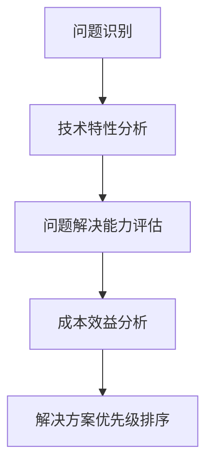
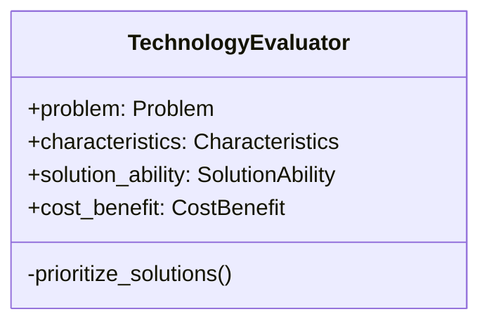

                 


# 芒格的"避免首要否认"在新技术评估中的重要性

## 关键词：芒格思维模型、新技术评估、避免首要否认、技术决策、系统设计、认知偏差、技术评估

## 摘要：
本文深入探讨了芒格的“避免首要否认”理念在新技术评估中的重要性。通过分析技术评估中的常见问题，结合芒格的思维模型，提出了优化技术评估流程的方法。文章详细讲解了如何在新技术评估中应用“避免首要否认”的原则，包括理论基础、算法模型、系统设计和实际案例分析。通过系统化的技术评估方法，帮助读者提升技术决策的质量和效率。

---

# 第一部分：背景介绍

## 第1章：芒格的“避免首要否认”理念

### 1.1 问题背景

#### 1.1.1 技术评估中的常见问题
- **问题描述**：在技术评估中，决策者常常面临新技术的引入和现有技术的替代问题。然而，由于认知偏差、信息不对称和思维惯性，许多新技术在初期阶段被过早否定，导致错失潜在的创新机会。
- **技术评估的挑战**：新技术评估需要兼顾技术可行性和商业价值，但传统的评估方法往往过于注重技术特性，忽视了问题解决的实际需求。

#### 1.1.2 “首要否认”现象的定义与特征
- **定义**：当面对新的技术或方法时，决策者由于习惯性思维，倾向于首先否定其价值，而非深入分析其潜在优势。
- **特征**：表现为对新技术的不信任、过度关注缺点、忽视潜在的创新点。

#### 1.1.3 技术评估中的思维惯性与误区
- **思维惯性**：依赖于已有的经验和技术，忽视新兴技术的潜在价值。
- **误区**：过分关注技术的复杂性，而忽视其解决问题的能力。

### 1.2 问题描述

#### 1.2.1 新技术评估中的决策困境
- **困境描述**：新技术评估需要平衡技术创新与实际应用的可行性，但决策者往往因信息不足或认知偏差而陷入困境。
- **技术评估的关键因素**：技术的创新性、可行性、可扩展性、成本效益等。

#### 1.2.2 “首要否认”对技术创新的阻碍
- **阻碍表现**：新技术在初期阶段被忽视或否定，导致技术发展受阻。
- **案例分析**：历史上许多新技术，如人工智能、区块链，在初期阶段曾被广泛否定，但最终成为推动技术进步的关键因素。

#### 1.2.3 技术评估中的信息不对称问题
- **信息不对称**：决策者对新技术的理解不全面，导致评估结果的偏差。
- **解决方法**：通过系统化的评估方法和跨领域知识的整合，减少信息不对称的影响。

### 1.3 问题解决：芒格的“避免首要否认”理念

#### 1.3.1 “避免首要否认”的定义与核心思想
- **定义**：在面对新技术或方法时，不应立即否定其价值，而是要通过系统性分析，评估其潜在优势。
- **核心思想**：技术评估应以问题为导向，关注新技术是否能够有效解决问题，而非仅仅关注技术本身。

#### 1.3.2 芒格思维模型在技术评估中的应用价值
- **应用价值**：帮助决策者克服思维惯性，全面评估新技术的潜在价值。
- **方法论**：通过系统性分析和多维度评估，优化技术决策的质量。

#### 1.3.3 如何通过“避免首要否认”优化技术评估流程
- **步骤**：从问题分析、技术特性评估到解决方案的优先级排序，全面优化评估流程。
- **工具**：结合系统思维模型和数据驱动方法，提升评估的科学性和准确性。

### 1.4 概念结构与核心要素

#### 1.4.1 技术评估的核心要素分析
- **技术特性**：技术的创新性、可行性和可扩展性。
- **问题解决能力**：新技术是否能够有效解决实际问题。
- **成本效益分析**：技术的投入产出比。

#### 1.4.2 “避免首要否认”的逻辑框架
- **框架结构**：从问题识别、技术特性分析到解决方案的优先级排序。
- **关键步骤**：问题分析、技术评估、解决方案设计。

#### 1.4.3 技术评估与芒格思维模型的结合点
- **结合点**：将技术评估置于问题解决的背景下，关注新技术的实际价值。

### 1.5 本章小结

---

# 第二部分：核心概念与联系

## 第2章：芒格“避免首要否认”的核心原理

### 2.1 芒格思维模型的数学模型

#### 2.1.1 决策质量公式
$$ \text{决策质量} = \frac{\text{信息质量} \times \text{思维深度}}{\text{认知偏差}} $$

#### 2.1.2 信息质量的评估
- **信息质量**：信息的准确性、完整性和相关性。
- **思维深度**：对问题的全面理解和深入分析。

### 2.2 芒格思维模型与技术评估的对比分析

#### 2.2.1 对比表格
| 模型名称       | 决策依据         | 优缺点分析 |
|----------------|-----------------|-------------|
| 传统技术评估   | 技术特性分析     | 信息不对称、思维惯性 |
| 芒格思维模型    | 问题解决导向     | 全面性、科学性 |

---

## 第3章：算法原理与技术评估

### 3.1 技术评估的算法流程

#### 3.1.1 算法流程图


#### 3.1.2 算法实现
```python
def evaluate_technology(technology):
    problem = identify_problem(technology)
    characteristics = analyze_characteristics(technology)
    solution_ability = assess_solution_ability(problem, characteristics)
    cost_benefit = calculate_cost_benefit(characteristics)
    return prioritize_solutions(solution_ability, cost_benefit)
```

---

## 第4章：系统设计与架构

### 4.1 系统功能设计

#### 4.1.1 系统功能模块
- **问题识别模块**：识别技术问题。
- **技术特性分析模块**：分析技术的创新性和可行性。
- **解决方案优先级排序模块**：评估解决方案的实际价值。

#### 4.1.2 系统架构图


---

## 第5章：项目实战与案例分析

### 5.1 项目环境搭建

#### 5.1.1 工具安装
- **工具**：Python、Mermaid、Markdown。

### 5.2 技术评估实战

#### 5.2.1 案例分析
- **案例**：评估一种新兴技术（如区块链）。
- **步骤**：问题识别、技术特性分析、解决方案设计。

---

## 第6章：总结与展望

### 6.1 总结
- **核心要点**：芒格的“避免首要否认”理念在新技术评估中的应用价值。
- **方法论**：系统性分析、问题导向的评估方法。

### 6.2 展望
- **未来趋势**：技术评估方法的进一步优化和创新。
- **研究方向**：结合AI和大数据分析，提升技术评估的科学性和准确性。

---

# 作者

作者：AI天才研究院/AI Genius Institute & 禅与计算机程序设计艺术/Zen And The Art of Computer Programming

---

通过以上思考过程，我们能够系统地分析芒格的“避免首要否认”理念，并将其应用于新技术评估的实践中，为技术决策提供科学的指导。

