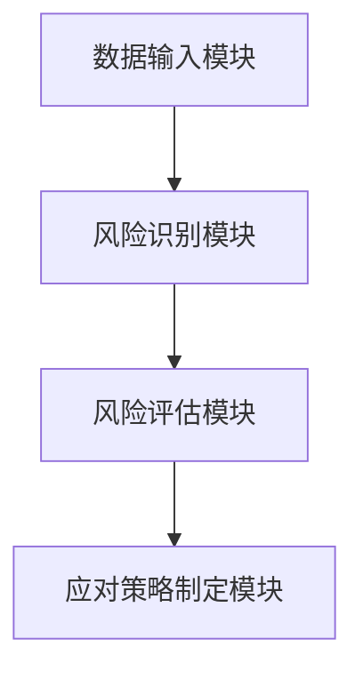

                 

# 芒格的"避免首要否认"在量子科技风险评估中的重要性

## 关键词：芒格，避免首要否认，量子科技，风险评估，投资原则，量子计算，风险管理

## 摘要：本文探讨了芒格的“避免首要否认”原则在量子科技风险评估中的应用。通过分析量子科技的特性和潜在风险，结合芒格的决策框架，提出了一套系统化的风险评估方法，旨在帮助企业和投资者更好地识别和管理量子科技项目中的潜在风险，避免因盲目乐观或忽视潜在问题而导致的重大决策失误。

---

# 引言

## 第1章：芒格的“避免首要否认”概述

### 1.1 芒格的“避免首要否认”原则

#### 1.1.1 原则的定义与背景
芒格的“避免首要否认”原则是一种投资哲学，强调在决策过程中，首先要考虑的是可能的风险和失败因素，而不是先假设事情是可行的。这种思维方式可以帮助投资者避免因为过于乐观或忽视潜在问题而导致的重大决策失误。

#### 1.1.2 原则的核心思想
芒格认为，人类的决策过程往往容易受到心理偏差的影响，例如确认偏见和乐观偏见。为了避免这些偏差，芒格建议在决策前，首先要识别和评估可能的风险和障碍，然后再考虑可行的解决方案。这种方法可以帮助投资者更全面地评估项目，避免因忽视风险而导致的损失。

#### 1.1.3 原则在投资中的应用
芒格的“避免首要否认”原则在投资领域得到了广泛应用。例如，在评估投资项目时，投资者首先应该考虑项目的潜在风险，如市场风险、技术风险和政策风险等。只有在充分评估并制定应对策略后，才能考虑投资。

### 1.2 量子科技的概述

#### 1.2.1 量子科技的基本概念
量子科技是指利用量子力学原理进行科学研究和技术创新的领域，主要包括量子计算、量子通信和量子测量等技术。与经典技术相比，量子技术在计算速度、通信安全和测量精度等方面具有显著优势。

#### 1.2.2 量子科技的主要领域
- **量子计算**：利用量子比特（qubit）进行计算，能够在某些领域（如密码学、优化问题）实现远超经典计算机的计算能力。
- **量子通信**：利用量子纠缠和量子密钥分发（QKD）实现绝对安全的通信。
- **量子测量**：利用量子干涉等原理实现高精度测量，例如在传感器和计量设备中的应用。

#### 1.2.3 量子科技的发展现状
目前，量子科技正处于快速发展阶段，各国纷纷投入大量资源进行研究和开发。然而，量子技术的实现和应用还面临许多技术和工程上的挑战，例如量子比特的稳定性、系统的可扩展性等。

---

# 第二部分：量子科技的风险评估基础

## 第2章：风险评估的基本理论

### 2.1 风险评估的定义与分类

#### 2.1.1 风险的定义
风险是指在特定情境下，某种事件发生的可能性及其可能带来的负面影响。在量子科技中，风险可能包括技术失败、市场接受度低、政策变化等。

#### 2.1.2 风险的分类
- **技术风险**：技术实现的难度和不确定性。
- **市场风险**：市场需求的不确定性。
- **政策风险**：政策变化对项目的影响。
- **伦理风险**：量子技术可能引发的伦理问题，例如隐私问题。

#### 2.1.3 风险评估的重要性
在量子科技项目中，风险评估是决策过程中的关键环节。通过评估潜在风险，可以制定相应的风险管理策略，降低项目失败的可能性。

### 2.2 量子科技风险的特殊性

#### 2.2.1 量子科技的不确定性
量子科技的实现和应用具有高度的不确定性。例如，量子计算的商业化应用可能需要更长的时间，而量子通信的技术实现也面临许多挑战。

#### 2.2.2 技术风险与市场风险
量子科技的风险不仅包括技术实现的不确定性，还包括市场需求的不确定性。例如，某些量子技术可能因为市场接受度低而导致项目失败。

#### 2.2.3 政策与伦理风险
政策变化和伦理问题也可能对量子科技项目产生重大影响。例如，某些国家可能出台限制量子技术发展的政策，或者量子技术可能引发隐私和安全问题。

---

# 第三部分：芒格原则在风险评估中的应用

## 第3章：芒格原则与风险识别

### 3.1 避免首要否认与风险识别

#### 3.1.1 风险识别的必要性
在量子科技项目中，风险识别是风险管理的第一步。通过识别潜在风险，可以制定相应的应对策略。

#### 3.1.2 避免首要否认在识别中的作用
芒格的“避免首要否认”原则强调在决策过程中首先要识别和评估潜在风险。在量子科技风险评估中，这可以帮助投资者和项目管理者更好地识别技术、市场和政策等潜在风险。

#### 3.1.3 具体应用案例分析
以量子计算项目为例，首先需要识别技术实现的难度、市场需求的不确定性以及政策变化的可能性。只有在充分评估这些风险后，才能决定是否投资该项目。

### 3.2 风险评估中的决策框架

#### 3.2.1 决策框架的构建
在量子科技风险评估中，可以构建一个基于芒格原则的决策框架。该框架包括以下几个步骤：
1. **识别潜在风险**：列出所有可能影响项目的潜在风险。
2. **评估风险的严重性和可能性**：对每个风险进行评估，确定其严重性和发生可能性。
3. **制定应对策略**：根据风险评估结果，制定相应的应对策略，例如规避风险、降低风险或接受风险。

#### 3.2.2 芒格原则在决策中的应用
通过芒格的“避免首要否认”原则，投资者可以在决策过程中首先考虑潜在风险，避免因过于乐观而导致的重大决策失误。

#### 3.2.3 案例分析：量子计算项目的风险评估
假设某公司计划投资一个量子计算项目，首先需要识别潜在风险，例如技术实现的难度、市场需求的不确定性以及政策变化的可能性。通过对这些风险的评估，公司可以制定相应的应对策略，例如加强技术研发、拓展市场渠道或关注政策变化。

---

# 第四部分：系统架构与方法论

## 第4章：量子科技风险评估系统的构建

### 4.1 系统构建的背景与目标

#### 4.1.1 系统构建的必要性
随着量子科技的快速发展，建立一个系统化的风险评估系统对于企业和投资者来说至关重要。通过系统化的风险评估，可以更高效地识别和管理潜在风险。

#### 4.1.2 系统的目标与功能
量子科技风险评估系统的功能包括：
- **风险识别**：自动识别潜在风险。
- **风险评估**：对每个风险进行严重性和可能性评估。
- **应对策略制定**：根据评估结果，制定相应的应对策略。

### 4.2 系统架构设计

#### 4.2.1 系统模块划分
量子科技风险评估系统可以划分为以下几个模块：
- **数据输入模块**：用户输入项目相关信息。
- **风险识别模块**：自动识别潜在风险。
- **风险评估模块**：对每个风险进行评估。
- **应对策略制定模块**：根据评估结果，制定应对策略。

#### 4.2.2 模块之间的关系
数据输入模块提供项目信息，风险识别模块基于项目信息识别潜在风险，风险评估模块对每个风险进行评估，最后应对策略制定模块根据评估结果制定应对策略。

#### 4.2.3 系统架构图（Mermaid）

---

# 第五部分：项目实战

## 第5章：案例分析与实践

### 5.1 案例背景介绍

#### 5.1.1 案例的选择与背景
选择一个量子计算项目作为案例，分析如何应用芒格的“避免首要否认”原则进行风险评估。

#### 5.1.2 案例的目标与意义
通过案例分析，展示如何在实际项目中应用芒格的原则进行风险评估，帮助读者更好地理解和应用这些概念。

### 5.2 实践步骤与结果

#### 5.2.1 数据收集

---

### 作者：AI天才研究院 & 禅与计算机程序设计艺术

