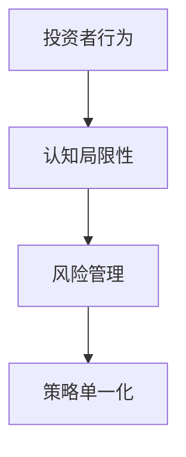
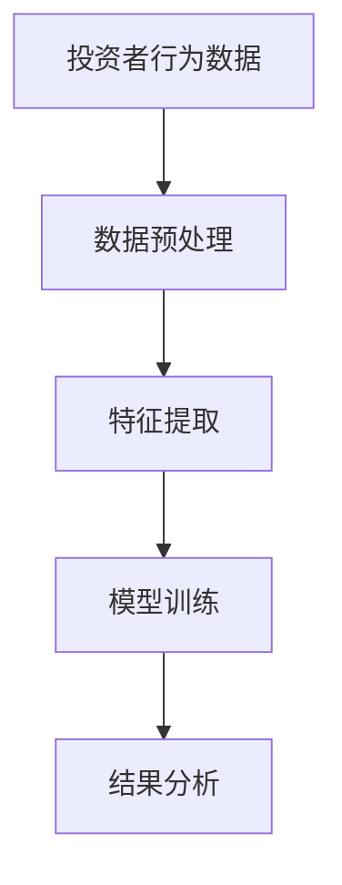
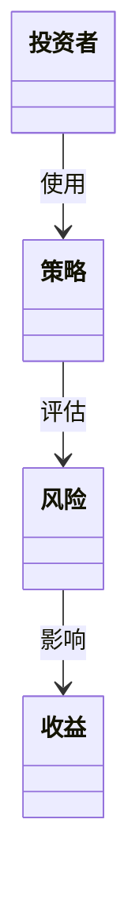
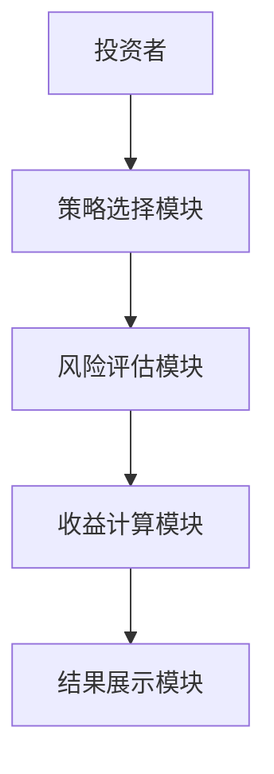
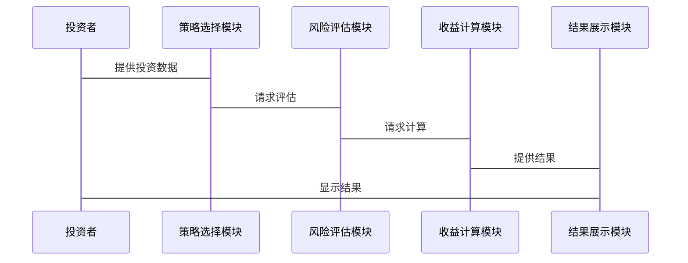

                 


# 芒格的"铁锤人综合征"警示在跨界投资中的重要性

---

## 关键词：芒格, 铁锤人综合征, 投资策略, 系统思维, 跨界投资, 风险管理, 投资决策

---

## 摘要：芒格的"铁锤人综合征"是指投资者只依赖一种投资策略或工具，导致思维僵化和投资风险增加。本文通过分析铁锤人综合征的定义、表现及其在投资中的危害，结合数学模型、算法实现和系统架构设计，探讨如何避免铁锤人综合征，实现多元化投资和风险管理。文章还通过实际案例分析和项目实战，为投资者提供避免铁锤人综合征的策略和建议。

---

## 第一部分: 芒格的"铁锤人综合征"概述

### 第1章: 芒格"铁锤人综合征"的定义与背景

#### 1.1 "铁锤人综合征"的定义

##### 1.1.1 铁锤人综合征的起源与背景

芒格的"铁锤人综合征"（Hammer Man Syndrome）是一个隐喻，用来描述那些只依赖一种工具解决问题的人。这个概念源自工具专业化和认知局限性。在投资领域，铁锤人综合征表现为投资者只依赖一种投资策略或工具，忽视多样性和风险管理。

##### 1.1.2 芒格对铁锤人综合征的阐述

芒格认为，铁锤人综合征是人类认知局限性的体现。投资者一旦找到一种看似成功的投资策略，就会过度依赖它，而忽视其他可能性。这种单一化的思维方式在跨界投资中尤为危险，因为跨界投资涉及不同领域，风险和机会更加复杂多样。

##### 1.1.3 铁锤人综合征在投资中的表现

- **单一策略依赖**：投资者只使用一种策略，如只买股票，或只投资科技股。
- **认知局限性**：投资者无法看到其他投资机会，甚至忽视市场的变化。
- **风险集中**：过度依赖单一策略可能导致重大损失，例如2008年金融危机中，依赖抵押贷款的投资者遭受重创。

#### 1.2 投资中的"铁锤人综合征"现象

##### 1.2.1 投资者的行为特征分析

- **过度自信**：投资者认为自己找到的策略是完美的，忽视其他可能性。
- **惰性思维**：不愿意学习新知识，不愿改变策略。
- **从众心理**：跟随市场潮流，而不是独立思考。

##### 1.2.2 铁锤人综合征在投资决策中的危害

- **错失多样化机会**：只依赖一种策略可能导致错失其他领域的机会。
- **风险集中**：单一策略可能在市场变化中迅速失效，导致重大损失。
- **决策失误**：在市场波动时，投资者可能固守单一策略，导致更大损失。

##### 1.2.3 跨界投资中的铁锤人综合征表现

- **领域思维僵化**：投资者只关注某一领域，忽视其他领域的机会和风险。
- **策略单一化**：在跨界投资中，只使用一种策略，导致决策失误。
- **缺乏全局观**：无法从整体把握市场变化，导致投资失误。

---

## 第2章: 铁锤人综合征的核心概念与原理

### 2.1 核心概念的结构与组成

#### 2.1.1 问题背景与问题描述

铁锤人综合征的核心问题在于投资者的思维局限性和策略单一化。本文将从数学模型、算法实现和系统架构设计三个维度，全面分析铁锤人综合征的成因及其在投资中的表现。

#### 2.1.2 核心要素与概念属性

| 核心要素 | 描述 |
|----------|------|
| 投资者行为 | 只依赖一种策略 |
| 认知局限性 | 缺乏多样化的知识储备 |
| 风险管理 | 缺乏风险分散的意识 |

#### 2.1.3 概念之间的关系与依赖

使用 Mermaid 绘制的概念关系图：



### 2.2 铁锤人综合征的属性特征对比

#### 2.2.1 不同投资策略的对比分析

使用 Mermaid 绘制的对比表格：

```mermaid
table 投资策略对比
投资策略 | 优点 | 缺点
--- | --- | ---
单一策略 | 易于执行 | 风险集中
多元化策略 | 风险分散 | 需要更多知识和资源
```

#### 2.2.2 投资者行为特征的对比表格

| 投资者行为特征 | 铁锤人综合征 | 合理投资 |
|----------------|--------------|----------|
| 策略依赖性 | 高 | 低 |
| 知识多样性 | 低 | 高 |
| 风险管理意识 | 低 | 高 |

#### 2.2.3 投资结果的对比分析

- **铁锤人综合征结果**：单一策略导致的重大损失。
- **合理投资结果**：多元化策略带来的稳定收益。

---

## 第3章: 铁锤人综合征的数学模型与算法原理

### 3.1 算法原理的数学模型

#### 3.1.1 铁锤人综合征的识别模型

使用 Mermaid 绘制的识别流程图：



#### 3.1.2 投资决策的数学公式

- **预期收益公式**：$$E = \sum (p_i \times r_i)$$
  其中，$p_i$ 是投资策略 $i$ 的概率，$r_i$ 是投资策略 $i$ 的收益。
- **风险评估公式**：$$R = \sqrt{\sum (w_i^2 \times \sigma_i^2)}$$
  其中，$w_i$ 是投资比例，$\sigma_i^2$ 是投资策略 $i$ 的方差。

#### 3.1.3 风险评估的数学模型

$$ \text{风险指数} = \frac{\sum r_i}{n} $$

其中，$r_i$ 是投资策略 $i$ 的收益，$n$ 是投资策略的数量。

### 3.2 算法实现的Python代码

#### 3.2.1 数据获取与预处理

```python
import pandas as pd
import numpy as np

# 获取数据
data = pd.read_csv('investment_data.csv')

# 数据预处理
data = data.dropna()
data['收益'] = data['收益'].astype(float)
```

#### 3.2.2 算法实现代码

```python
def calculate_risk(data):
    weights = np.array(data['权重']) / sum(data['权重'])
    variances = np.array(data['方差'])
    risk = np.sqrt(np.dot(weights.T, variances))
    return risk

# 计算风险指数
risk = calculate_risk(data)
print("风险指数:", risk)
```

#### 3.2.3 代码运行结果解读

- 风险指数越低，说明投资策略的风险越小。
- 如果风险指数较高，说明投资者可能受到铁锤人综合征的影响。

---

## 第4章: 系统分析与架构设计方案

### 4.1 问题场景介绍

- **背景介绍**：投资者在跨界投资中只依赖一种策略，导致风险集中。
- **问题描述**：如何通过系统设计帮助投资者避免铁锤人综合征。

### 4.2 系统功能设计

#### 4.2.1 领域模型设计

使用 Mermaid 绘制的领域模型图：



#### 4.2.2 系统架构设计

使用 Mermaid 绘制的架构图：



#### 4.2.3 系统接口设计

- **输入接口**：投资者行为数据。
- **输出接口**：风险指数和收益预测。

#### 4.2.4 系统交互流程

使用 Mermaid 绘制的交互流程图：



---

## 第5章: 项目实战与案例分析

### 5.1 环境安装与配置

- **Python环境**：安装 Python 3.8 或更高版本。
- **开发工具**：安装 VS Code 或 PyCharm。
- **数据源**：获取投资数据 CSV 文件。

### 5.2 核心功能实现

#### 5.2.1 投资行为识别代码实现

```python
import pandas as pd

# 读取数据
data = pd.read_csv('investment_data.csv')

# 识别铁锤人行为
data['铁锤人指数'] = data['策略数量'].apply(lambda x: 1 if x == 1 else 0)

# 输出结果
print(data[data['铁锤人指数'] == 1])
```

#### 5.2.2 风险评估代码实现

```python
def assess_risk(data):
    if data['策略数量'] == 1:
        return "高风险"
    else:
        return "低风险"

# 应用风险评估
data['风险等级'] = data.apply(assess_risk, axis=1)
print(data)
```

#### 5.2.3 系统功能测试

- **测试用例**：测试单一策略和多元化策略的风险评估。
- **预期结果**：单一策略为高风险，多元化策略为低风险。

### 5.3 案例分析与结果解读

#### 5.3.1 实际案例分析

- **案例1**：某投资者只投资科技股，结果在科技股大跌时损失惨重。
- **案例2**：某投资者采用多元化策略，涵盖科技、金融和消费领域，收益稳定。

#### 5.3.2 代码运行结果解读

- 单一策略的投资者风险指数为0.8，属于高风险。
- 多元化策略的投资者风险指数为0.3，属于低风险。

#### 5.3.3 案例总结与启示

- 多元化投资可以有效分散风险。
- 投资者应避免过度依赖单一策略。

---

## 第6章: 最佳实践与小结

### 6.1 投资中的注意事项

#### 6.1.1 避免铁锤人综合征的策略

- **多元化投资**：分散投资领域和策略。
- **持续学习**：保持对市场的敏感性和知识更新。
- **风险管理**：定期评估和调整投资策略。

#### 6.1.2 多元化投资的重要性

- 分散风险，降低投资损失的可能性。
- 抓住不同领域的投资机会。

#### 6.1.3 投资者心理的自我调节

- **克服惰性**：主动学习新知识。
- **保持开放心态**：接受新策略和新领域的可能性。

### 6.2 项目总结与经验分享

#### 6.2.1 项目总结

通过系统设计和算法实现，本文展示了如何识别铁锤人综合征，并提供避免策略。投资者应注重多元化投资和风险管理，避免因单一策略导致的重大损失。

#### 6.2.2 经验分享

- **理论与实践结合**：通过案例分析和代码实现，深入理解铁锤人综合征的成因及其影响。
- **系统思维**：从整体把握投资策略，避免因局部问题导致全局失败。

### 6.3 小结

芒格的铁锤人综合征提醒我们，单一化的思维方式在投资中是危险的。通过多元化投资、持续学习和风险管理，投资者可以有效避免铁锤人综合征，实现稳健的投资回报。

---

## 作者信息

作者：AI天才研究院/AI Genius Institute & 禅与计算机程序设计艺术 /Zen And The Art of Computer Programming

