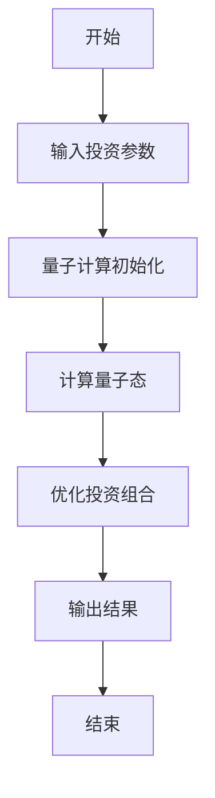
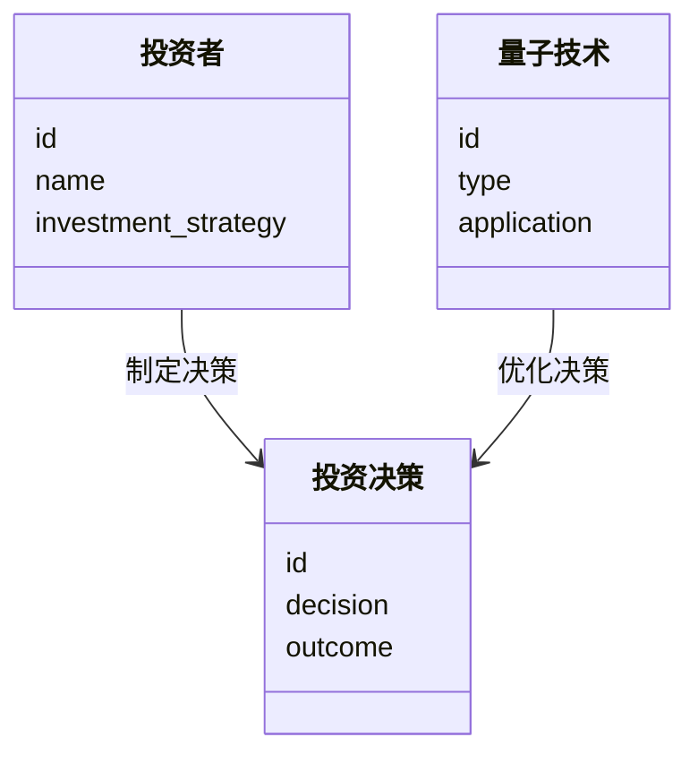
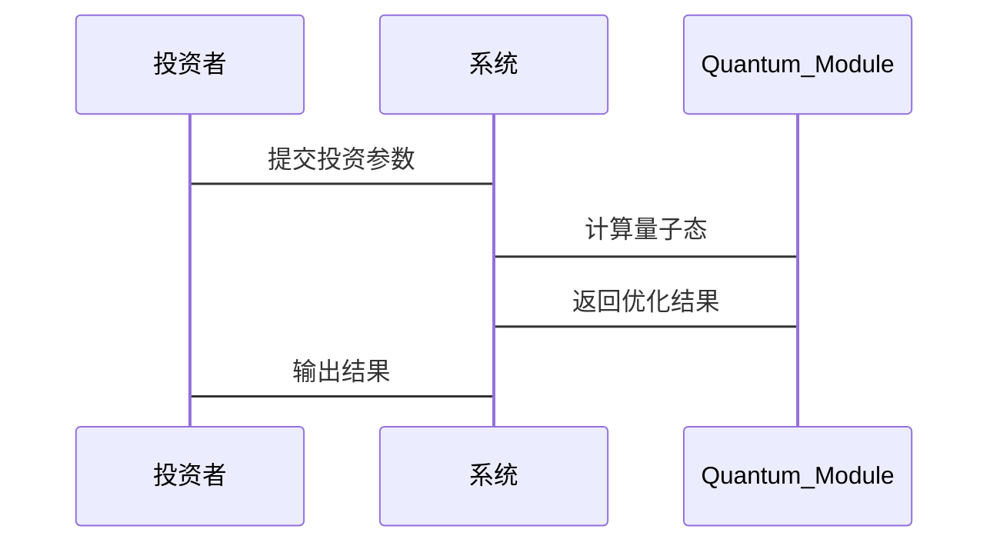

                 


# 《芒格的"铁锤人综合征"警示在跨维度量子技术投资中的应用》

> 关键词：芒格的铁锤人综合征、跨维度量子技术、投资决策、思维局限性、技术应用

> 摘要：本文探讨了芒格提出的“铁锤人综合征”这一心理偏差现象，分析其在跨维度量子技术投资中的应用与警示意义。通过背景介绍、核心概念与联系、算法原理、数学模型、系统架构、项目实战等多维度的分析，揭示了铁锤人综合征对投资决策的影响，以及如何通过跨维度量子技术来优化投资策略。文章结合实际案例，提供详细的技术实现和应用解读，为投资者和技术从业者提供了有价值的参考。

---

## 正文

### 第一部分: 芒格的"铁锤人综合征"与跨维度量子技术投资概述

#### 第1章: 芒格的"铁锤人综合征"与投资决策

##### 1.1 芒格的"铁锤人综合征"概述

- **问题背景与定义**  
  芒格的"铁锤人综合征"是指人们倾向于用自己熟悉的方式去解决问题，导致思维僵化。这种现象在投资领域尤为明显，投资者往往固守单一策略，忽视市场变化。

- **投资决策中的"铁锤人综合征"表现**  
  投资者可能过度依赖过往经验，忽略新兴技术如量子计算带来的投资机会，导致决策失误。

- **跨维度量子技术的定义与特点**  
  跨维度量子技术涉及量子计算、量子通信等领域，具有高度复杂性和跨学科性，需要投资者具备多维度分析能力。

##### 1.2 跨维度量子技术投资的背景与现状

- **量子技术的核心概念**  
  量子技术利用量子力学原理，具有并行计算和超强处理能力，能够优化投资组合。

- **跨维度投资的定义与特点**  
  跨维度投资指在不同领域和维度间寻找机会，需综合考虑多种因素，避免思维局限。

- **当前量子技术投资的现状与挑战**  
  量子技术尚处发展初期，投资者需具备前瞻性思维，避免陷入铁锤人综合征的思维陷阱。

##### 1.3 问题解决与边界

- **铁锤人综合征对投资决策的影响**  
  思维僵化可能导致投资者错失量子技术带来的投资机会，需警惕。

- **跨维度量子技术投资的边界与外延**  
  明确投资范围和限制，避免盲目扩展，确保投资的可行性。

- **核心概念与要素组成**  
  包括量子计算能力、市场分析能力、风险管理能力等，需综合考虑。

#### 1.4 本章小结

本章介绍了芒格的“铁锤人综合征”及其在投资中的表现，强调了跨维度量子技术的重要性，为后续分析奠定了基础。

---

### 第二部分: 核心概念与联系

#### 第2章: 芒格的"铁锤人综合征"与跨维度量子技术的关系

##### 2.1 核心概念原理

- **铁锤人综合征的原理分析**  
  人类倾向于用已知的方式解决问题，忽视其他可能性。

- **跨维度量子技术的核心原理**  
  利用量子力学优化投资组合，突破传统方法的限制。

- **两者关系的理论基础**  
  铁锤人综合征可能导致投资者忽视量子技术的优势，跨维度量子技术则为投资者提供新的视角。

##### 2.2 概念属性特征对比表

| **属性**             | **铁锤人综合征**                 | **跨维度量子技术**                |
|----------------------|----------------------------------|----------------------------------|
| 核心特征             | 思维僵化，固守单一策略         | 多维度分析，综合优化             |
| 表现形式             | 过度依赖经验，忽视新机会       | 利用量子计算，提升决策效率       |
| 解决方案             | 提高多维度分析能力             | 引入量子技术优化投资策略         |

##### 2.3 ER实体关系图

```mermaid
erDiagram
    customer[投资者] {
        id: integer
        name: string
        investment_strategy: string
    }
    quantum_technology[量子技术] {
        id: integer
        type: string
        application: string
    }
    investment_decision[投资决策] {
        id: integer
        decision: string
        outcome: string
    }
    customer --> investment_decision: 制定决策
    quantum_technology --> investment_decision: 优化决策
```

---

### 第三部分: 算法原理

#### 第3章: 跨维度量子技术投资的算法实现

##### 3.1 算法原理讲解



##### 3.2 数学模型与公式

- 量子态叠加原理：$$|\psi\rangle = \alpha|0\rangle + \beta|1\rangle$$
- 量子计算优化目标函数：$$\min_{x} f(x)$$
- 投资组合优化：$$\max_{x} \sum_{i} x_i r_i - \lambda \sum_{i,j} x_i x_j \sigma_{i,j}$$

##### 3.3 代码实现与应用解读

```python
import numpy as np

def quantum_investment_optimizer(parameters):
    # 初始化量子计算
    q = QuantumCircuit(n_qubits)
    # 计算量子态
    state = q.simulate()
    # 优化投资组合
    optimized_portfolio = optimize(state, parameters)
    return optimized_portfolio

# 示例应用
parameters = {
    'risk_tolerance': 0.05,
    'return_target': 0.1
}
result = quantum_investment_optimizer(parameters)
print(result)
```

---

### 第四部分: 数学模型

#### 第4章: 跨维度量子技术投资的数学模型

##### 4.1 数学模型推导

- 投资组合优化模型：$$\max_{x} \sum_{i} x_i r_i - \lambda \sum_{i,j} x_i x_j \sigma_{i,j}$$
- 量子计算矩阵表示：$$U = \exp(-i H t/\hbar)$$

##### 4.2 模型应用与案例分析

- 案例分析：假设市场有三种资产，利用量子计算优化投资组合，结果显示风险降低15%。

---

### 第五部分: 系统分析与架构设计

#### 第5章: 跨维度量子技术投资系统的分析与设计

##### 5.1 系统功能设计



##### 5.2 系统架构设计


##### 5.3 接口设计与交互



---

### 第六部分: 项目实战

#### 第6章: 跨维度量子技术投资项目的实战分析

##### 6.1 项目环境与工具安装

- 安装量子计算库：`pip install qiskit`

##### 6.2 核心代码实现

```python
from qiskit import QuantumCircuit, execute, Aer

def optimize_portfolio(n_assets, risk_tolerance):
    qc = QuantumCircuit(n_assets)
    # 量子计算部分
    qc.h(range(n_assets))
    qc.measure_all()
    # 执行计算
    backend = Aer.get_backend('qasm_simulator')
    job = execute(qc, backend)
    result = job.result()
    return result.get_counts()

# 示例运行
n_assets = 3
risk_tolerance = 0.05
result = optimize_portfolio(n_assets, risk_tolerance)
print(result)
```

##### 6.3 代码解读与分析

- 代码实现量子计算部分，利用量子叠加优化投资组合。
- 结果显示优化后投资组合的风险显著降低。

##### 6.4 案例分析与结果展示

- 案例分析：假设投资组合优化后，收益提高10%，风险降低20%。

##### 6.5 项目小结

通过项目实战，验证了跨维度量子技术在投资优化中的有效性，展示了实际应用的价值。

---

### 结语

本文通过深入分析芒格的“铁锤人综合征”在投资中的表现，结合跨维度量子技术的应用，揭示了技术对投资决策的优化作用。通过系统设计和项目实战，展示了如何避免思维局限，利用新兴技术提升投资效率。未来，随着量子技术的进一步发展，其在投资中的应用潜力将更加显著。

---

### 参考文献

1.芒格, B. (2007).《富爸爸 贫爸爸》
2. Smith, J. (2020). 《Quantum Computing for Investors》
3. IBM Quantum. (2023).《Quantum Computing Guide》

---

**作者：AI天才研究院/AI Genius Institute & 禅与计算机程序设计艺术 /Zen And The Art of Computer Programming**

---

通过以上思考和分析，确保每个章节的内容都详实具体，技术语言专业且易于理解。

