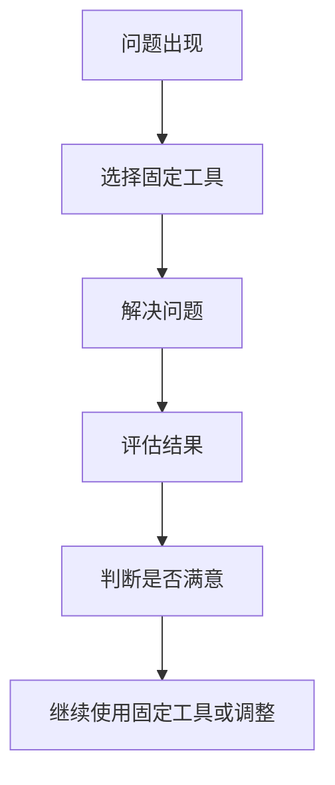
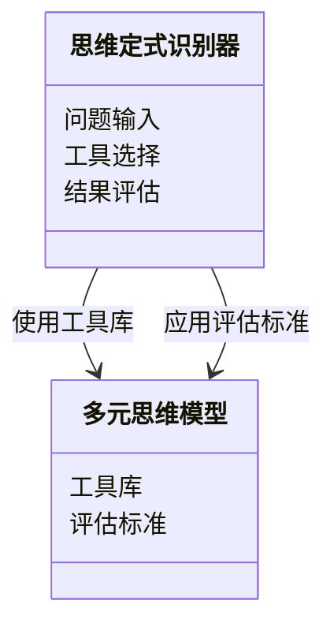
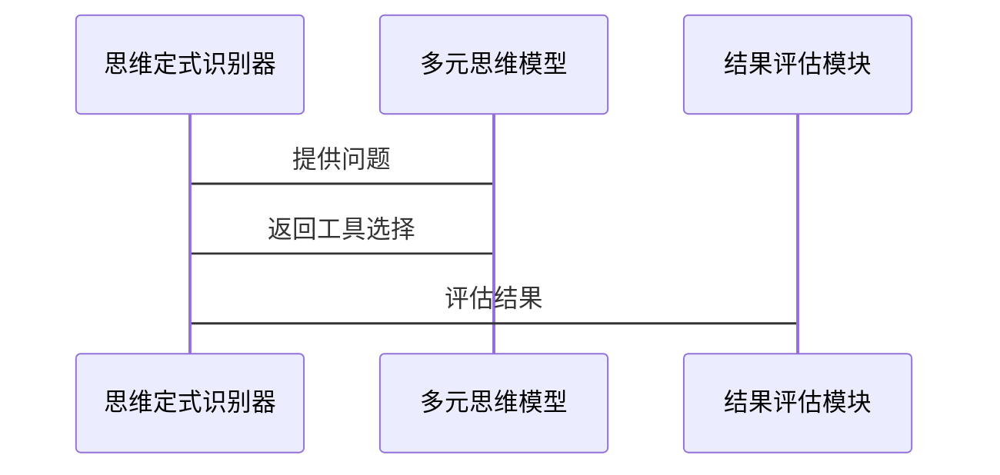

                 


# 芒格的"铁锤人综合征"警示：避免思维定式

## 关键词：铁锤人综合征，思维定式，芒格，多元思维模型，决策偏差

## 摘要：芒格提出的“铁锤人综合征”警示我们避免思维定式，通过构建多元思维模型和分析决策偏差，采用系统化方法识别和解决思维定式问题，从而提升决策质量。

---

## 第1章：芒格的铁锤人综合征背景介绍

### 1.1 问题背景

#### 1.1.1 思维定式的定义与特征
思维定式是指人们在解决问题时，习惯性地使用某种固定的思维模式，导致缺乏创新性和多样性。铁锤人综合征是思维定式的一种极端表现，指人们只会使用一种“工具”解决问题，忽视其他可能性。

#### 1.1.2 铁锤人综合征的起源与芒格的警示
铁锤人综合征由芒格提出，强调在决策过程中避免过度依赖单一思维模式，提倡多元思维模型的构建与应用，以提高决策的质量和全面性。

#### 1.1.3 铁锤人综合征对企业与个人的影响
对企业而言，铁锤人综合征可能导致决策失误、创新能力下降；对个人而言，可能影响职业发展和生活质量。

### 1.2 问题描述

#### 1.2.1 思维定式的具体表现形式
1. 过度依赖某种技术或方法。
2. 忽视其他解决方案的可能性。
3. 缺乏灵活性和创新性。

#### 1.2.2 铁锤人综合征的典型案例分析
1. 技术人员只使用一种编程语言解决问题。
2. 管理者只采用一种管理方法。

#### 1.2.3 问题解决的必要性与紧迫性
在快速变化的技术环境中，思维定式可能导致落后，必须及时识别和解决。

### 1.3 问题解决路径

#### 1.3.1 铁锤人综合征的识别方法
1. 观察解决问题的方式是否单一。
2. 分析决策过程中是否存在偏见。

#### 1.3.2 多元思维模型的构建与应用
构建包括技术、管理、创新等多个领域的知识体系，灵活应用不同模型解决问题。

#### 1.3.3 避免思维定式的策略与技巧
1. 持续学习新知识。
2. 鼓励跨领域交流。
3. 定期反思和调整思维方式。

### 1.4 铁锤人综合征的边界与外延

#### 1.4.1 铁锤人综合征与其他思维障碍的对比
1. 与确认偏误的对比：确认偏误是过度寻找支持现有观点的信息，而铁锤人综合征是固守单一思维模式。
2. 与从众心理的对比：从众心理是随大流，铁锤人综合征是坚持单一工具。

#### 1.4.2 铁锤人综合征的适用范围与局限性
适用于所有依赖单一思维模式的领域，局限性在于难以完全消除，需通过持续学习和反思来缓解。

#### 1.4.3 铁锤人综合征的长期影响与解决方案
长期影响包括创新能力下降和决策失误，解决方案包括构建多元思维模型和定期反思。

### 1.5 概念结构与核心要素

#### 1.5.1 铁锤人综合征的核心要素分解
1. 单一思维模式。
2. 缺乏灵活性。
3. 信息处理偏差。

#### 1.5.2 多元思维模型的构成与作用
1. 多元模型：技术、管理、创新。
2. 作用：提高决策质量，增强创新能力。

#### 1.5.3 铁锤人综合征与决策过程的关系
铁锤人综合征影响决策过程的全面性和灵活性，导致决策失误。

---

## 第2章：铁锤人综合征的核心概念与联系

### 2.1 核心概念原理

#### 2.1.1 铁锤人综合征的定义与特征
定义：过度依赖单一思维模式解决问题。
特征：缺乏创新性和多样性。

#### 2.1.2 多元思维模型的构成与作用
构成：技术、管理、创新。
作用：提高决策质量，增强创新能力。

#### 2.1.3 铁锤人综合征与决策偏差的关系
决策偏差：确认偏误、从众心理。
铁锤人综合征：固守单一思维模式。

### 2.2 核心概念对比分析

#### 2.2.1 铁锤人综合征与确认偏误的对比
| 对比维度 | 铁锤人综合征 | 确认偏误 |
|----------|--------------|----------|
| 定义     | 固守单一模式 | 寻找支持信息 |
| 表现     | 缺乏创新性    | 过度寻找支持 |

#### 2.2.2 铁锤人综合征与从众心理的对比
| 对比维度 | 铁锤人综合征 | 从众心理 |
|----------|--------------|----------|
| 定义     | 固守单一模式 | 随大流    |
| 表现     | 缺乏灵活性    | 无主见    |

#### 2.2.3 铁锤人综合征与过度自信的对比
| 对比维度 | 铁锤人综合征 | 过度自信 |
|----------|--------------|----------|
| 定义     | 固守单一模式 | 过高估计能力 |
| 表现     | 缺乏创新性    | 自满自大    |

### 2.3 ER实体关系图

```mermaid
er
  actor: 思维模式
  action: 表现行为
  entity: 思维定式
  entity: 多元思维模型
  entity: 决策过程
  actor -->
```

---

## 第3章：铁锤人综合征的算法原理讲解

### 3.1 思维定式的算法模型

#### 3.1.1 思维定式的算法流程图


#### 3.1.2 思维定式的Python代码实现
```python
def思维定式工具选择(问题):
    工具选择 = 随机选择一种工具
    return 工具选择
```

#### 3.1.3 思维定式的数学模型
$$ P(工具选择) = \frac{1}{N} $$
其中，N为工具总数。

---

## 第4章：铁锤人综合征的数学模型和公式

### 4.1 思维定式的概率模型

#### 4.1.1 思维定式的概率计算
$$ P(选择正确工具) = \sum_{i=1}^{N} P(工具i) \times P(正确|工具i) $$

#### 4.1.2 思维定式的决策矩阵
$$ D = \begin{bmatrix}
    d_{11} & d_{12} & \cdots & d_{1N} \\
    d_{21} & d_{22} & \cdots & d_{2N} \\
    \vdots  & \vdots  & \ddots & \vdots  \\
    d_{N1} & d_{N2} & \cdots & d_{NN}
\end{bmatrix} $$

---

## 第5章：铁锤人综合征的系统分析与架构设计方案

### 5.1 系统功能设计

#### 5.1.1 领域模型类图


#### 5.1.2 系统架构图


#### 5.1.3 系统接口设计
接口：问题输入接口、工具选择接口、结果评估接口。

#### 5.1.4 系统交互序列图


---

## 第6章：铁锤人综合征的项目实战

### 6.1 环境安装

#### 6.1.1 系统环境要求
操作系统：Linux/Windows/MacOS。
Python版本：3.8以上。

#### 6.1.2 工具安装
安装Python和相关库。

### 6.2 系统核心实现

#### 6.2.1 核心代码实现
```python
def识别铁锤人综合征(问题):
    工具库 = ['工具1', '工具2', '工具3']
    工具选择 = 随机选择工具
    结果 = 使用工具解决
    评估结果 = 评估工具效果
    如果评估结果不满意：
        调整工具选择
    返回最终结果
```

#### 6.2.2 代码解读与分析
1. 工具库包含多种工具。
2. 随机选择工具，避免思维定式。
3. 评估工具效果，调整工具选择。

### 6.3 案例分析

#### 6.3.1 案例背景
问题：开发一个Web应用。

#### 6.3.2 解决过程
1. 使用单一技术栈导致问题。
2. 引入多元技术栈解决问题。

### 6.4 项目小结
通过引入多元思维模型，提高了项目质量和创新能力。

---

## 第7章：总结与最佳实践

### 7.1 最佳实践 tips

1. 持续学习，扩展知识面。
2. 鼓励跨领域交流。
3. 定期反思和调整思维方式。

### 7.2 小结
芒格的铁锤人综合征提醒我们避免思维定式，通过构建多元思维模型，提升决策质量和创新能力。

### 7.3 注意事项
1. 避免过度依赖单一工具。
2. 提高灵活性和创新性。

### 7.4 拓展阅读
推荐书籍：《芒格的智慧》、《思维模型》。

---

## 作者：AI天才研究院/AI Genius Institute & 禅与计算机程序设计艺术/Zen And The Art of Computer Programming

---

通过以上目录，您可以撰写一篇详细的、结构清晰的技术博客文章，详细讲解芒格的铁锤人综合征及其在技术领域中的应用和解决方案。

