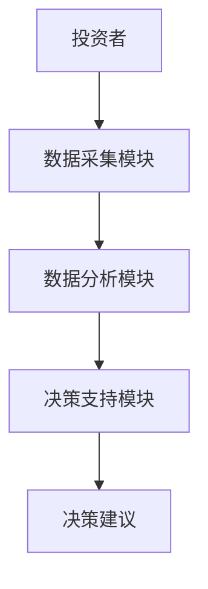

                 


# 芒格的"铁锤人综合征"警示：避免投资思维定式

---

## 关键词  
芒格，铁锤人综合征，思维定式，投资决策，心理学，风险管理

---

## 摘要  
芒格的“铁锤人综合征”是投资领域中一个重要的心理学概念，它揭示了投资者因思维定式而可能导致的决策失误。本文从芒格的投资理念出发，深入分析“铁锤人综合征”的成因、表现及其对投资决策的影响。通过结合实际案例，本文提出避免思维定式的策略，包括多元化思考、认知偏差的识别与纠正等。文章还探讨了如何通过数学模型和算法分析来辅助投资决策，帮助投资者避免“铁锤人综合征”的陷阱。

---

## 第一部分：芒格的“铁锤人综合征”背景介绍

### 第1章：芒格与“铁锤人综合征”概述

#### 1.1 芒格的投资理念与思维方式

##### 1.1.1 芒格的生平简介  
查理·芒格（Charlie Munger）是世界著名投资家沃伦·巴菲特（Warren Buffett）的合作伙伴，也是伯克希尔哈撒韦公司（Berkshire Hathaway）的副主席。芒格以其独特的投资理念和思维方式闻名，他强调“ inversion”思维（逆向思维）、多元思维模型（mental models）以及对人性的深刻理解。

##### 1.1.2 芒格的投资哲学  
芒格的投资哲学强调安全边际、价值投资和长期持有。他认为，投资者应该通过研究企业的基本面，寻找具有持续竞争优势的企业，并在合理的价格范围内进行投资。

##### 1.1.3 芒格的决策思维模型  
芒格提出“多元思维模型”（mental models），即通过多个学科的思维方式来分析问题，避免单一思维模式的局限性。

---

#### 1.2 “铁锤人综合征”的定义与核心概念

##### 1.2.1 “铁锤人综合征”的定义  
“铁锤人综合征”是指投资者因长期使用单一思维方式或模型，导致在面对复杂问题时无法跳出固有思维模式，从而做出错误决策。

##### 1.2.2 投资思维定式的特征  
- **单一性**：只依赖一种思维方式或模型。
- **惯性思维**：对新信息的处理能力下降。
- **认知偏差**：过度依赖已有经验，忽视新信息。

##### 1.2.3 “铁锤人综合征”的表现形式  
- **过度自信**：认为自己的思维方式是唯一正确的。
- **忽视反向思维**：只关注正面信息，忽略负面信息。
- **决策失误**：在复杂情况下无法灵活调整策略。

---

#### 1.3 铁锤人综合征对投资决策的影响

##### 1.3.1 思维定式对投资决策的负面影响  
- **错失机会**：因固守单一思维模式，错过市场变化带来的机会。
- **决策失误**：在复杂市场中，因思维定式导致判断失误。
- **风险加大**：无法全面评估风险，导致投资组合过于集中。

##### 1.3.2 铁锤人综合征的具体案例分析  
以某投资者为例，其长期依赖技术分析，忽视市场情绪和宏观经济因素。在市场发生剧烈波动时，因无法调整策略而导致重大损失。

##### 1.3.3 解决问题的思路与方法  
- **多元化思考**：引入多元思维模型，结合多个学科的视角进行分析。
- **持续学习**：不断更新知识储备，避免思维僵化。
- **反向思维**：尝试从对立面思考问题，发现潜在风险。

---

## 第二部分：思维定式与投资决策的关系

### 第2章：思维定式的形成机制

#### 2.1 思维定式的形成机制

##### 2.1.1 思维定式的定义与特征  
思维定式是人脑在长期思考中形成的固定模式，表现为对某种思维方式的高度依赖。

##### 2.1.2 思维定式的形成过程  
- **习惯性依赖**：长期重复某种思维方式，导致大脑形成自动化反应。
- **舒适区效应**：人们倾向于选择熟悉的思维方式，避免走出舒适区。

##### 2.1.3 思维定式与投资决策的关系  
思维定式会导致投资者在决策时缺乏灵活性，无法适应市场变化。

---

#### 2.2 铁锤人综合征的形成原因

##### 2.2.1 投资者认知偏差的来源  
- **确认偏差**：倾向于寻找支持自己观点的信息，忽视反面证据。
- **过度自信**：认为自己的判断是正确的，忽视市场变化。

##### 2.2.2 投资者心理因素的影响  
- **恐惧与贪婪**：情绪化决策是思维定式的重要诱因。
- **从众心理**：盲目跟随市场潮流，缺乏独立思考。

##### 2.2.3 投资环境的客观因素  
- **市场波动**：市场的不确定性和波动性容易导致投资者心理压力。
- **信息过载**：大量信息干扰，导致投资者难以筛选有效信息。

---

#### 2.3 铁锤人综合征的解决思路

##### 2.3.1 认知偏差的识别与纠正  
- **自我反思**：定期审视自己的思维方式，识别潜在的认知偏差。
- **多元化信息源**：通过阅读不同观点的书籍、文章，扩展知识面。

##### 2.3.2 投资决策的多元化思考  
- **多维度分析**：在决策时，结合财务、市场、技术等多个维度的信息。
- **情景分析**：模拟不同市场环境下的投资决策，增强适应性。

##### 2.3.3 避免思维定式的具体方法  
- **持续学习**：通过学习新知识和技能，避免思维僵化。
- **实践反思**：在实践中不断总结经验，调整思维方式。

---

## 第三部分：铁锤人综合征的数学模型与算法分析

### 第3章：思维定式的数学建模与算法分析

#### 3.1 思维定式的数学模型

##### 3.1.1 模型定义  
思维定式可以看作一种认知偏差，可以用概率论和统计学方法进行建模。

##### 3.1.2 模型假设  
- 投资者存在思维定式，倾向于使用单一思维方式。
- 市场环境具有不确定性，且投资者的决策会影响市场走势。

##### 3.1.3 模型构建  
使用马尔可夫链（Markov chain）模型，描述投资者在不同市场环境下的思维方式转变过程。

---

#### 3.2 铁锤人综合征的算法分析

##### 3.2.1 算法选择  
使用决策树（Decision Tree）分析，帮助投资者在决策时考虑多种可能性。

##### 3.2.2 算法实现  
通过构建决策树，分析不同决策路径的概率和收益，帮助投资者做出更合理的决策。

##### 3.2.3 算法优化  
结合贝叶斯定理（Bayes' theorem），对决策树进行优化，提高模型的准确性和实用性。

---

## 第四部分：系统分析与架构设计

### 第4章：系统架构与实现

#### 4.1 系统功能设计

##### 4.1.1 领域模型设计  
- 投资者认知模型：描述投资者的认知偏差和思维定式。
- 市场环境模型：分析市场波动对投资者决策的影响。

##### 4.1.2 系统功能模块  
- 数据采集模块：收集市场数据和投资者行为数据。
- 数据分析模块：利用算法模型对数据进行分析。
- 决策支持模块：为投资者提供多元化决策建议。

##### 4.1.3 系统架构图  


---

## 第五部分：项目实战与案例分析

### 第5章：项目实战与案例分析

#### 5.1 项目实战

##### 5.1.1 环境安装  
- 安装Python和相关库（如pandas、numpy、scikit-learn）。
- 数据采集工具（如Yahoo Finance API）。

##### 5.1.2 核心实现  
- 数据处理：清洗和预处理市场数据。
- 模型构建：使用决策树算法进行分析。
- 可视化：绘制决策树和市场趋势图。

##### 5.1.3 代码实现  
```python
import pandas as pd
from sklearn.tree import DecisionTreeClassifier
from sklearn.model_selection import train_test_split

# 数据加载与处理
data = pd.read_csv('market_data.csv')
X = data[['price', 'volume', 'moving_avg']]
y = data['decision']

# 数据分割
X_train, X_test, y_train, y_test = train_test_split(X, y, test_size=0.2)

# 模型训练
model = DecisionTreeClassifier()
model.fit(X_train, y_train)

# 模型预测
y_pred = model.predict(X_test)

# 模型评估
print('Accuracy:', model.score(X_test, y_test))
```

---

## 第六部分：总结与展望

### 第6章：总结与展望

#### 6.1 最佳实践

##### 6.1.1 投资者需要注意的事项  
- 定期反思自己的思维方式，避免陷入思维定式。
- 多元化思考，结合多种模型和方法进行决策。

##### 6.1.2 小结  
芒格的“铁锤人综合征”提醒投资者，避免单一思维方式，通过多元化思考和持续学习，提升投资决策的准确性和有效性。

##### 6.1.3 注意事项  
- 避免过度自信，保持谦逊和开放的心态。
- 在复杂市场中，及时调整策略，灵活应对变化。

##### 6.1.4 拓展阅读  
- 《芒格的投资哲学》
- 《思维的陷阱》

---

## 作者：AI天才研究院/AI Genius Institute & 禅与计算机程序设计艺术 /Zen And The Art of Computer Programming

---

以上是完整的文章内容，涵盖了芒格的“铁锤人综合征”从背景介绍到系统架构设计的全过程。

