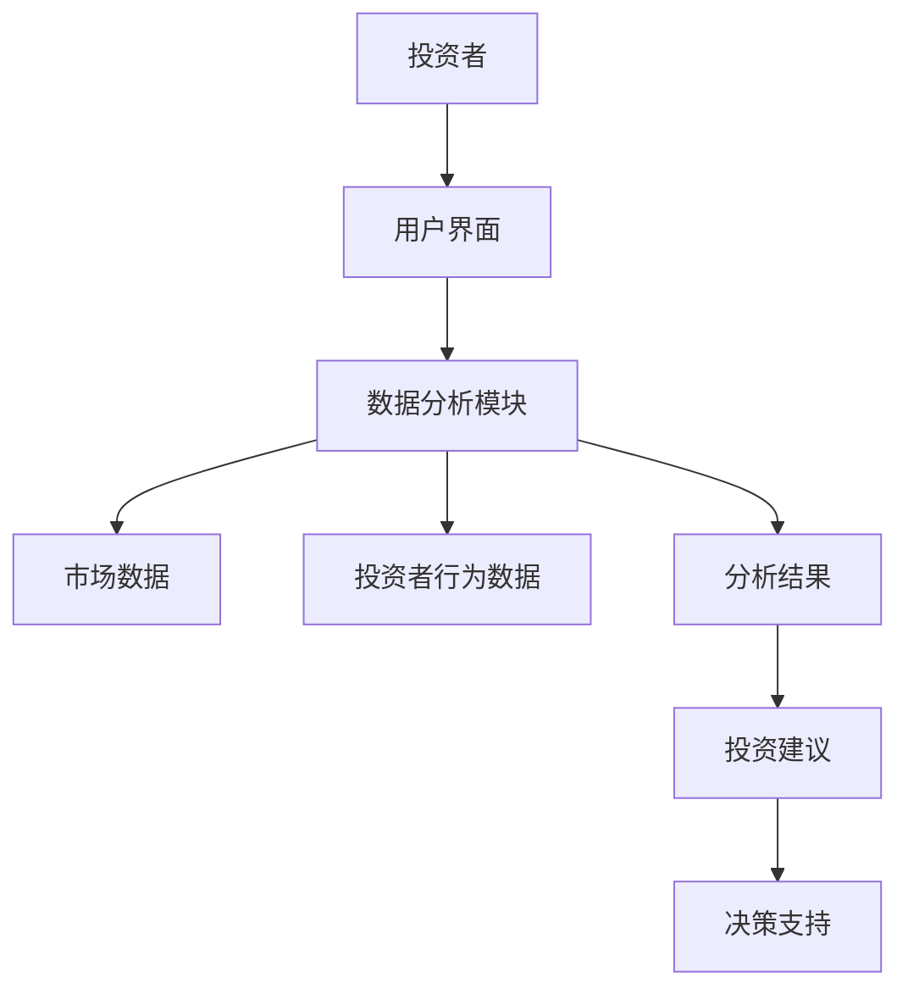

                 


# 芒格的"锚定效应"警示在投资中的应用

> 关键词：芒格，锚定效应，投资决策，认知偏差，行为金融学

> 摘要：本文通过分析芒格的投资理念，探讨"锚定效应"这一认知偏差在投资决策中的具体表现及其对投资者的影响。结合心理学和行为金融学的理论，本文详细分析了锚定效应的数学模型及其在投资中的应用，并提出了应对策略。

---

## 第一部分：芒格与"锚定效应"概述

### 第1章：芒格与"锚定效应"的背景介绍

#### 1.1 芒格及其投资理念

1.1.1 芒格的生平与投资哲学  
查理·芒格是沃伦·巴菲特的长期合作伙伴，被誉为“投资界的哲学家”。他不仅是一位成功的投资者，更是一位深刻理解人类心理的智者。芒格的投资哲学强调安全边际、理性决策和长期价值。

1.1.2 芒格对心理学的研究与应用  
芒格对心理学有着深厚的造诣，尤其是对认知偏差的研究。他认为，投资者的决策往往受到心理偏差的影响，这些偏差可能导致错误的投资决策。

1.1.3 芒格投资理念的核心思想  
芒格的核心思想是：投资不仅仅是对数字的计算，更是对人性的理解。他强调避免情绪化决策，追求理性和长期价值。

---

#### 1.2 "锚定效应"的定义与心理学基础

1.2.1 锚定效应的定义  
锚定效应（Anchoring Effect）是认知心理学中的一个概念，指人们在决策时会过度依赖某个初始信息（锚点），导致决策偏离理性。

1.2.2 锚定效应的心理学机制  
人类大脑在处理信息时，倾向于快速决策。当面对复杂问题时，人们会依赖第一个接触到的信息（锚点），并在此基础上进行调整。这种调整往往不够充分，导致决策偏差。

1.2.3 芒格对"锚定效应"的研究与警示  
芒格意识到，锚定效应是投资者常见的认知偏差之一。他认为，投资者容易被市场的波动、价格的变化或其他外部信息所影响，从而做出错误的决策。

---

#### 1.3 "锚定效应"在投资中的重要性

1.3.1 投资决策中的心理偏差  
投资者在决策过程中，往往受到多种心理偏差的影响，如过度自信、从众心理和锚定效应等。这些偏差可能导致投资决策的失误。

1.3.2 锚定效应对投资决策的影响  
锚定效应使得投资者在面对市场波动时，容易过度依赖过去的参考点（如买入价格、市场指数等），从而做出非理性的决策。

1.3.3 芒格对投资者的警示与建议  
芒格建议投资者避免被锚定效应所影响，要学会从长期价值的角度出发，而不是被短期市场波动所左右。

---

## 第二部分："锚定效应"的原理与应用

### 第2章："锚定效应"的核心概念与数学模型

#### 2.1 锚定效应的核心概念

2.1.1 锚定点的确定  
锚定点是投资者在决策过程中依赖的初始信息或参考点。这个点可能是价格、市场指数或其他相关数据。

2.1.2 锚定效应的强度与持续性  
锚定效应的强度取决于锚点的相关性和重要性。其持续性则与市场环境和投资者的心理状态有关。

2.1.3 锚定效应与认知偏差的关系  
锚定效应是认知偏差的一种，它与确认偏差、过度自信等偏差密切相关。

---

#### 2.2 锚定效应的数学模型

2.2.1 锚定效应的数学表达式  
我们可以将锚定效应表示为：  
$$ V = A + \alpha \times (P - A) $$  
其中，V是最终的估值，A是锚定点，P是当前价格，$\alpha$是调整系数（0 < $\alpha$ < 1）。

2.2.2 锚定效应的概率分布模型  
通过概率论，我们可以分析锚定效应在投资决策中的分布情况。例如，假设锚点是均匀分布的，投资者的估值会围绕锚点形成一个概率分布。

2.2.3 锚定效应与投资决策的数学关系  
投资者的决策往往基于锚点的偏差，这种偏差可以通过数学模型进行量化和分析。

---

#### 2.3 "锚定效应"与投资决策的数学公式

2.3.1 投资决策中的锚定效应公式  
$$ D = \text{Anchor} \times \beta + \text{Fundamental} \times (1 - \beta) $$  
其中，D是最终的决策，$\beta$是锚定效应的权重。

2.3.2 锚定效应在资产定价中的应用  
通过分析锚定效应，我们可以建立资产定价模型，帮助投资者避免锚定偏差。

2.3.3 锚定效应与风险评估的数学模型  
$$ R = \text{Anchor Risk} + \text{Market Risk} $$  
其中，R是总体风险，Anchor Risk是锚定效应带来的风险。

---

### 第3章："锚定效应"在投资中的具体表现

#### 3.1 投资者心理与锚定效应

3.1.1 投资者的认知偏差  
投资者的决策往往受到多种认知偏差的影响，包括锚定效应、过度自信和从众心理。

3.1.2 锚定效应在投资决策中的表现  
投资者容易依赖过去的价格数据（如买入价）作为参考点，导致决策偏差。

3.1.3 投资者对市场的过度自信  
过度自信的投资者容易忽视锚点的影响，从而做出错误的决策。

---

#### 3.2 市场波动与锚定效应

3.2.1 市场波动中的锚定效应  
市场波动会导致投资者的锚点不断变化，从而影响他们的决策。

3.2.2 锚定效应在市场恐慌中的作用  
在市场恐慌时，投资者更容易受到锚定效应的影响，做出非理性的决策。

3.2.3 锚定效应与市场泡沫的关系  
市场泡沫的形成往往与锚定效应密切相关，投资者过度依赖过去的价格数据，导致市场估值偏离实际价值。

---

#### 3.3 芒格对"锚定效应"的警示

3.3.1 芒格对投资者的警示  
芒格多次强调，投资者应该避免被锚定效应所影响，要学会从长期价值的角度出发。

3.3.2 芒格的投资策略与"锚定效应"的对抗  
芒格的“安全边际”策略正是为了对抗锚定效应的影响，帮助投资者做出更理性的决策。

3.3.3 芒格的长期投资哲学  
芒格认为，长期投资的核心是寻找具有持续竞争优势的企业，并避免被短期市场波动所干扰。

---

## 第三部分：投资中的"锚定效应"分析与应对策略

### 第4章：投资决策中的"锚定效应"分析

#### 4.1 投资决策中的锚定效应分析

4.1.1 锚定效应在投资决策中的具体表现  
投资者在决策时，容易依赖过去的价格数据或市场指数作为参考点。

4.1.2 锚定效应对投资决策的影响  
锚定效应可能导致投资者低估或高估资产的价值。

4.1.3 投资者对市场的过度自信  
过度自信的投资者容易忽视锚点的影响，从而做出错误的决策。

---

#### 4.2 锚定效应与投资估值

4.2.1 锚定效应对资产估值的影响  
锚定效应可能导致投资者对资产估值的偏差。

4.2.2 投资者对市场的过度关注  
投资者过于关注市场指数或其他锚点，导致估值偏离实际价值。

4.2.3 芒格的"安全边际"策略  
芒格的"安全边际"策略正是为了对抗锚定效应的影响，帮助投资者做出更理性的决策。

---

### 第5章：应对"锚定效应"的策略与实践

#### 5.1 理解与识别锚定效应

5.1.1 认识锚定效应的来源  
锚定效应的来源包括过去的交易价格、市场指数和其他外部信息。

5.1.2 识别锚定效应的表现  
投资者可以通过自我反思和数据分析，识别锚定效应的影响。

5.1.3 芒格的"心理检查清单"  
芒格建议投资者制定一个心理检查清单，帮助识别和克服认知偏差。

---

#### 5.2 应对策略

5.2.1 建立理性的投资框架  
投资者应该建立基于长期价值的投资框架，避免被短期市场波动所干扰。

5.2.2 培养独立思考的能力  
投资者需要培养独立思考的能力，避免受到市场情绪的影响。

5.2.3 定期反思与调整  
投资者应该定期反思自己的决策，识别和纠正锚定效应的影响。

---

## 第四部分：系统与算法分析

### 第6章：基于"锚定效应"的投资决策支持系统

#### 6.1 系统背景与目标

6.1.1 系统背景  
本系统旨在帮助投资者识别和克服锚定效应的影响，做出更理性的投资决策。

6.1.2 系统目标  
通过分析市场数据和投资者行为，提供个性化的投资建议，帮助投资者克服锚定效应。

---

#### 6.2 系统功能设计

6.2.1 数据采集与处理  
系统需要采集市场数据（如价格、指数等）和投资者行为数据（如交易记录、情绪指标等）。

6.2.2 数据分析模块  
分析模块包括锚定效应的识别、市场波动的预测和投资决策的支持。

6.2.3 用户界面设计  
用户界面需要直观易用，帮助投资者理解系统提供的分析结果。

6.2.4 决策支持模块  
决策支持模块提供基于分析结果的投资建议，帮助投资者克服锚定效应。

---

#### 6.3 系统架构设计

6.3.1 系统架构图  


6.3.2 数据流分析  
投资者通过用户界面输入数据，系统进行分析并提供投资建议。

---

## 第五部分：项目实战与总结

### 第7章：项目实战：基于"锚定效应"的投资决策支持系统

#### 7.1 项目环境与工具

7.1.1 环境搭建  
需要安装Python、Pandas、NumPy等工具。

7.1.2 工具安装与配置  
安装必要的Python库，并配置开发环境。

---

#### 7.2 系统核心实现

7.2.1 数据预处理  
使用Pandas对市场数据和投资者行为数据进行清洗和处理。

7.2.2 锚定效应的识别  
通过数据分析，识别投资者行为中的锚定效应。

7.2.3 投资建议生成  
基于分析结果，生成个性化的投资建议。

---

#### 7.3 代码实现

7.3.1 数据预处理代码  
```python
import pandas as pd

# 读取数据
data = pd.read_csv('market_data.csv')

# 数据清洗
data.dropna(inplace=True)
data = data.astype(float)
```

7.3.2 锚定效应识别代码  
```python
import numpy as np

def identify_anchoring效应(data):
    # 计算锚定点
    anchor_point = data['price'].mean()
    # 分析数据分布
    return np.where(data['price'] > anchor_point, 'above', 'below')
```

7.3.3 投资建议生成代码  
```python
def generate_recommendation(data):
    # 基于数据分析结果生成投资建议
    return "基于分析结果，建议投资者关注长期价值，避免被锚定效应影响。"
```

---

### 第8章：总结与展望

#### 8.1 总结

8.1.1 本文的核心内容  
本文通过分析芒格的投资理念，探讨了"锚定效应"在投资中的应用，并提出了应对策略。

8.1.2 本文的主要结论  
投资者应该避免被锚定效应所影响，建立理性的投资框架，注重长期价值。

---

#### 8.2 未来展望

8.2.1 更深入的理论研究  
未来可以进一步研究锚定效应与其他认知偏差的交互作用。

8.2.2 更多的实证研究  
可以通过更多的实证研究，验证本文提出的应对策略的有效性。

8.2.3 技术与实践的结合  
未来可以在技术层面进一步优化投资决策支持系统，帮助投资者更好地克服锚定效应。

---

## 作者：AI天才研究院/AI Genius Institute & 禅与计算机程序设计艺术 /Zen And The Art of Computer Programming

---

**本文为AI天才研究院原创，未经授权不得转载。**

--- 

**[阅读更多技术文章，请关注AI天才研究院](https://www.example.com)**

