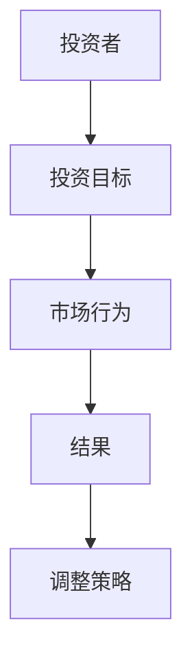
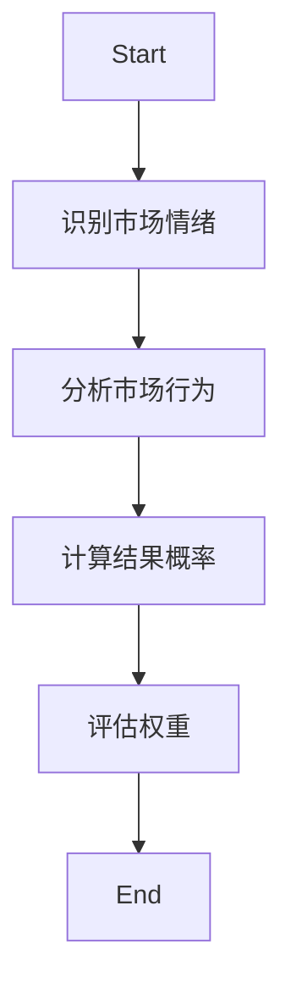

                 


# 芒格的"颠倒思考"在投资分析中的应用

> 关键词：芒格，颠倒思考，投资分析，价值投资，风险管理，算法原理，系统设计

> 摘要：本文深入探讨了芒格的“颠倒思考”方法在投资分析中的应用。通过分析芒格的投资理念、颠倒思考的核心概念及其算法原理，结合实际案例和系统设计，展示了如何在现代投资决策中运用颠倒思考来优化分析流程和提升决策质量。

---

# 第一部分：芒格的“颠倒思考”背景介绍

## 第1章：芒格的生平与投资理念

### 1.1 芒格的生平简介
- **早年经历与职业发展**：芒格的职业生涯从律师转向投资家，他在法律背景中培养了严谨的逻辑思维能力。
- **与巴菲特的合作关系**：两人共同创立伯克希尔哈撒韦公司，芒格为巴菲特的投资理念注入了价值投资的哲学基础。
- **芒格的主要成就与影响力**：作为伯克希尔的副主席，芒格以其独特的投资哲学闻名，尤其是颠倒思考法。

### 1.2 芒格的投资理念
- **价值投资的核心思想**：芒格强调购买优秀的企业，而不是便宜的股票，关注企业的内在价值。
- **格栅模型的概念与应用**：芒格提出格栅模型，将多个学科的知识框架应用于决策中，避免单一思维。
- **颠倒思考在投资中的重要性**：通过逆向思维，芒格能够提前识别风险，发现市场中的潜在机会。

## 第2章：颠倒思考的定义与核心要素

### 2.1 颠倒思考的定义
- **正向思考与逆向思考的对比**：正向思考是从原因到结果，逆向思考则是从结果推断原因。
- **颠倒思考的哲学基础**：芒格的颠倒思考借鉴了投资心理学和决策科学，强调避免情绪化决策。

### 2.2 颠倒思考的核心要素
- **问题背景与问题描述**：在投资分析中，颠倒思考常用于识别市场的过度反应和忽视的机会。
- **颠倒思考的目标与边界**：目标是通过逆向分析发现价值，边界在于避免过度依赖单一因素。
- **核心概念与联系**：颠倒思考与价值评估、风险管理、决策优化密切相关。

---

# 第二部分：颠倒思考的核心概念与联系

## 第3章：颠倒思考的核心原理

### 3.1 颠倒思考的原理分析
- **颠倒思考的逻辑框架**：从结果出发，推断可能的原因，再评估原因的可能性和权重。
- **颠倒思考的心理学基础**：芒格指出，市场参与者往往过于情绪化，颠倒思考帮助避开这种情绪干扰。

### 3.2 颠倒思考与投资决策的关系
- **颠倒思考如何影响投资决策**：通过识别市场的非理性行为，投资者可以找到低估的机会。
- **颠倒思考在风险管理中的应用**：芒格强调通过逆向思维识别潜在风险，避免投资组合中的系统性风险。

## 第4章：颠倒思考的核心概念对比

### 4.1 颠倒思考与正向思考的对比分析
| 对比维度       | 正向思考                 | 颠倒思考                 |
|----------------|--------------------------|--------------------------|
| 思维方向       | 从原因到结果             | 从结果到原因             |
| 应用场景       | 分析市场趋势             | 寻找市场失衡             |
| 优势           | 适用于确定性高的场景     | 适用于不确定性高的场景   |

### 4.2 颠倒思考的ER实体关系图


---

# 第三部分：颠倒思考的算法原理讲解

## 第5章：颠倒思考的算法原理

### 5.1 算法原理的数学模型
- **数学模型的建立与解释**：颠倒思考可以通过概率模型来评估不同结果的可能性。
- **核心公式与推导过程**：
  - 预测市场反转的概率 $P$，通过分析当前市场情绪和历史数据。
  - 计算每种结果的权重 $W_i = \frac{P_i}{\sum P_i}$。

### 5.2 算法流程的Mermaid图


## 第6章：算法实现与案例分析

### 6.1 算法实现
- **环境安装**：需要安装Python和数据分析库（如Pandas、NumPy）。
- **核心代码**：
  ```python
  import pandas as pd
  import numpy as np

  # 示例数据：市场行为指标
  data = {'指标': ['情绪指数', '估值水平', '资金流入'],
          '值': [75, 80, 60]}
  df = pd.DataFrame(data)

  # 计算结果概率
  def calculate_probability(values):
      return np.mean(values) / max(values)

  probabilities = df['值'].apply(lambda x: calculate_probability([x]))
  df['概率'] = probabilities

  print(df)
  ```

### 6.2 案例分析
- **案例背景**：假设市场情绪指数为75，估值水平为80，资金流入为60。
- **分析过程**：计算每种情况的概率，并评估权重。
- **结果解读**：较高的估值水平可能意味着市场被高估，投资者应考虑逆向思维，寻找低估的机会。

---

# 第四部分：系统分析与架构设计

## 第7章：系统功能设计

### 7.1 系统功能设计
- **领域模型类图**：
  ```mermaid
  classDiagram
      class 投资者 {
          帐户资产
          投资组合
          风险承受能力
      }
      class 投资目标 {
          市场行为
          结果预测
          调整策略
      }
      class 算法模型 {
          计算概率
          评估权重
      }
      投资者 --> 投资目标
      投资目标 --> 算法模型
  ```

## 第8章：系统架构设计

### 8.1 系统架构设计
- **系统架构图**：
  ```mermaid
  architecture
      Client ---(1..n)--> Service
      Service ---(1)--> Database
      Service ---(1)--> Algorithm
  ```

---

# 第五部分：项目实战与总结

## 第9章：项目实战

### 9.1 项目实战环境安装
- **安装Python和数据分析库**：使用pip安装Pandas、NumPy等库。

### 9.2 核心代码实现
- **核心代码**：
  ```python
  import pandas as pd
  import numpy as np

  data = {'指标': ['情绪指数', '估值水平', '资金流入'], '值': [75, 80, 60]}
  df = pd.DataFrame(data)

  def calculate_probability(values):
      return np.mean(values) / max(values)

  df['概率'] = df['值'].apply(lambda x: calculate_probability([x]))
  print(df)
  ```

### 9.3 项目总结
- **小结**：通过颠倒思考，投资者可以更好地识别市场失衡，做出更明智的投资决策。
- **经验与教训**：需要注意数据质量和模型的适用性，避免过度简化问题。

---

# 第六部分：最佳实践与未来展望

## 第10章：最佳实践

### 10.1 小结
- 颠倒思考是一种强大的工具，能够帮助投资者在复杂市场中找到机会。

### 10.2 注意事项
- 数据质量：确保输入数据的准确性和相关性。
- 模型适用性：根据具体情况调整模型参数。

### 10.3 未来展望
- 结合人工智能技术，进一步优化颠倒思考的应用，提升投资决策的智能化水平。

### 10.4 拓展阅读
- 建议阅读芒格的《穷查理宝典》和巴菲特的《巴菲特致股东的信》。

---

# 作者信息

作者：AI天才研究院/AI Genius Institute & 禅与计算机程序设计艺术/Zen And The Art of Computer Programming

