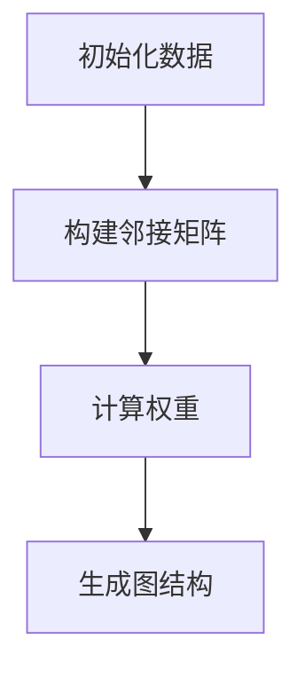
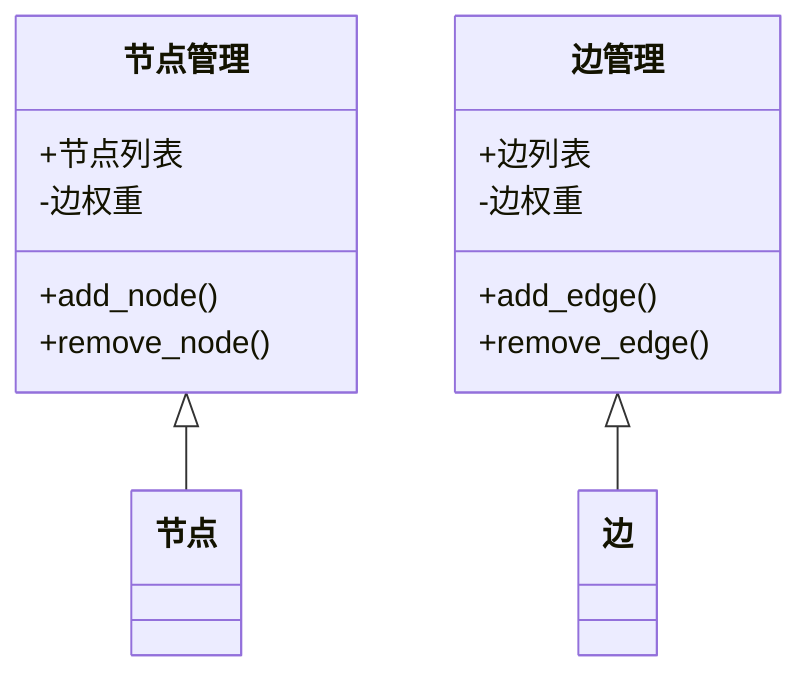

                 


# 菲利普·费雪的信息网络构建方法

> **关键词**：信息网络构建、图论算法、系统架构、机器学习、网络分析、数据科学

> **摘要**：本文详细探讨菲利普·费雪的信息网络构建方法，从背景介绍、核心概念、算法原理到系统架构、项目实战和最佳实践，全面解析信息网络构建的理论与实践。通过丰富的案例分析和详细的代码实现，帮助读者掌握信息网络构建的关键技术。

---

## 第1章：信息网络构建的背景与问题描述

### 1.1 信息网络的基本概念

信息网络是指通过节点和边构成的复杂关系网络，用于描述数据之间的关联性。信息网络构建是将散乱的数据组织成有意义的网络结构的过程，其核心目标是发现数据中的潜在关联和模式。

### 1.2 问题背景与重要性

在现代信息技术中，信息网络构建的重要性日益凸显。通过对海量数据进行建模，信息网络可以帮助我们发现隐藏的关系和模式，支持决策分析、数据挖掘和知识图谱构建等应用。

---

## 第2章：信息网络的核心概念与联系

### 2.1 核心概念

信息网络的核心概念包括节点、边、权重和标签。节点代表数据实体，边表示实体之间的关系，权重反映关系的强度，标签用于分类节点。

### 2.2 实体关系分析

#### 实体关系表格

| 实体 | 关系 | 描述 |
|------|------|------|
| 节点 | 边    | 表示节点之间的连接 |
| 边   | 权重  | 表示边的强度 |
| 节点 | 标签  | 表示节点的属性 |

#### Mermaid 实体关系图


---

## 第3章：信息网络构建的算法原理

### 3.1 基于图论的构建算法

#### Mermaid 流程图



#### Python 代码实现

```python
def build_network(nodes, edges):
    network = {}
    for node in nodes:
        network[node] = {}
    for edge in edges:
        network[edge[0]][edge[1]] = edge[2]
    return network
```

#### 数学公式

$$
\text{权重} = \frac{\text{边数}}{\text{节点数}}
$$

---

## 第4章：信息网络构建的系统分析与架构设计

### 4.1 系统功能设计

#### Mermaid 类图



### 4.2 系统架构设计

#### Mermaid 架构图


---

## 第5章：信息网络构建的项目实战

### 5.1 环境安装与配置

安装Python和必要的库（如networkx、pandas）。

### 5.2 核心算法实现

#### 代码实现

```python
import networkx as nx

def main():
    G = nx.Graph()
    G.add_nodes_from(['A', 'B', 'C'])
    G.add_edges_from([('A', 'B'), ('B', 'C')])
    print(G.nodes())
    print(G.edges())

if __name__ == '__main__':
    main()
```

---

## 第6章：信息网络构建的最佳实践

### 6.1 实践中的关键点

- 数据预处理的重要性
- 算法选择与优化
- 网络可视化与分析工具的使用

### 6.2 成功案例分析

通过社交网络分析案例，展示信息网络构建的实际应用。

---

## 结语

菲利普·费雪的信息网络构建方法为我们提供了一套系统化的方法论，帮助我们在复杂的数据环境中发现潜在关系。通过本文的详细讲解，读者可以掌握信息网络构建的核心技术，并在实际项目中灵活运用。

---

**作者**：AI天才研究院/AI Genius Institute & 禅与计算机程序设计艺术 /Zen And The Art of Computer Programming

