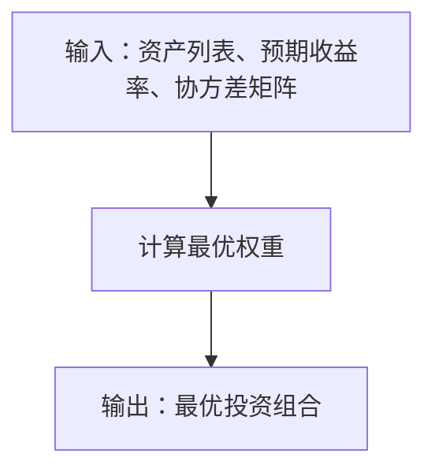
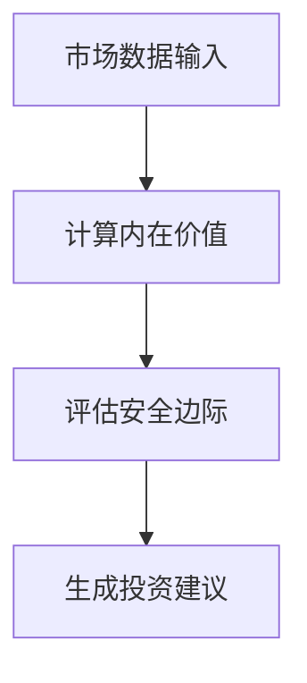
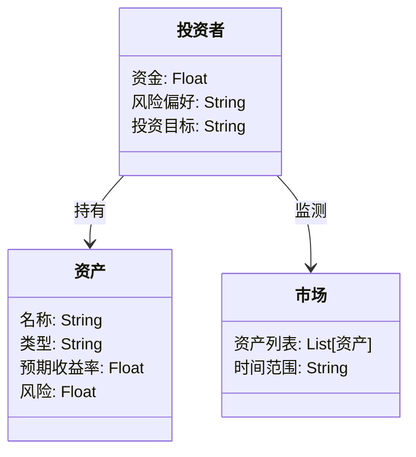
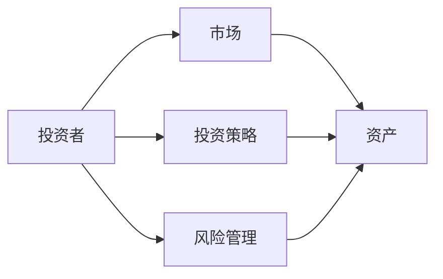

                 


# 菲利普·费雪的全球化投资视野

> **关键词**: 菲利普·费雪, 全球化投资, 价值投资, 投资策略, 投资模型, 投资哲学

> **摘要**: 本文深入探讨菲利普·费雪的投资理论及其在全球化背景下的应用。通过分析其核心思想、数学模型、算法原理以及系统架构，结合实际案例和项目实战，阐述如何在现代投资环境中运用费雪的理论实现长期价值投资。文章结构清晰，内容详实，适合对投资理论和全球化市场感兴趣的专业人士阅读。

---

# 第一部分: 菲利普·费雪投资理论基础

## 第1章: 菲利普·费雪投资理论概述

### 1.1 菲利普·费雪的生平与贡献

#### 1.1.1 菲利普·费雪的生平简介
菲利普·费雪（Philip Fisher）是美国著名的投资家和价值投资者，被誉为“成长投资之父”。他出生于1907年，逝世于2004年，是投资界的重要人物之一。费雪的职业生涯始于1930年代，他在投资领域的主要贡献在于强调长期投资和深入研究公司基本面的重要性。

#### 1.1.2 费雪在投资领域的贡献
费雪是最早一批深入研究公司基本面的投资者之一，他提出的“成长投资”理念对现代投资理论产生了深远影响。他强调选择具有强大成长潜力的公司，并长期持有这些股票，以实现资本的长期增值。

#### 1.1.3 费雪投资理论的核心思想
费雪的核心思想是：投资的最终目标是通过选择具有强大竞争优势和持续增长潜力的公司，实现资本的长期增值。他提出了“烟圈”理论，即选择那些能够在市场中产生“烟圈”的公司，这些公司具有强大的品牌、技术优势和市场支配地位。

### 1.2 价值投资的基本概念

#### 1.2.1 价值投资的定义与特点
价值投资是一种以低于内在价值的价格购买优质资产的投资策略。其核心在于寻找市场先生的错误定价，通过深入分析公司的财务状况、行业地位和竞争优势，确定其内在价值。

#### 1.2.2 价值投资与成长投资的区别
价值投资关注的是市场价格与内在价值的差异，追求以低于价值的价格购买资产；而成长投资则更关注公司的成长潜力和未来收益，愿意以较高的价格购买具有强大增长潜力的公司。

#### 1.2.3 费雪对价值投资的独特见解
费雪在价值投资的基础上，提出了“成长投资”的理念。他认为，选择具有强大成长潜力的公司，长期持有，能够实现资本的快速增值。他强调对公司基本面的深入研究，尤其是公司的管理团队、行业地位和竞争优势。

---

## 第2章: 费雪投资理论的数学模型与算法原理

### 2.1 投资组合优化的数学模型

#### 2.1.1 投资组合优化的定义
投资组合优化是指在给定的风险水平下，寻找能够实现最大收益的投资组合。它是现代投资组合理论的核心内容之一。

#### 2.1.2 费雪投资模型的数学表达
费雪的投资模型可以表示为以下优化问题：

$$
\text{目标函数：} \quad \max \sum_{i=1}^{n} w_i r_i
$$

$$
\text{约束条件：} \quad \sum_{i=1}^{n} w_i = 1
$$

其中，\( w_i \) 表示第 \( i \) 个资产的投资权重，\( r_i \) 表示第 \( i \) 个资产的预期收益率。

#### 2.1.3 投资组合优化的算法流程
以下是投资组合优化的算法流程图：



### 2.2 费雪投资策略的算法流程

#### 2.2.1 算法输入
- 市场数据：包括资产的历史价格、成交量等
- 公司基本面数据：包括财务报表、管理层信息等

#### 2.2.2 算法处理
1. 计算内在价值：通过分析公司的财务数据，估算其内在价值。
2. 评估安全边际：确定市场价格与内在价值之间的差异，确保以低于内在价值的价格购买资产。

#### 2.2.3 算法输出
- 投资建议：包括买入、卖出或持有某资产的建议
- 风险提示：基于市场环境和公司基本面的分析，给出风险提示。

### 2.3 费雪投资模型的 Mermaid 流程图



---

# 第二部分: 全球化投资视野的扩展

## 第3章: 全球化投资的机遇与挑战

### 3.1 全球化对投资的影响

#### 3.1.1 全球化带来的投资机会
- 市场多样性：全球化使得投资者可以接触到全球范围内的资产，分散投资风险。
- 增长潜力：新兴市场和高科技产业的增长潜力巨大，为投资者提供了更多的机会。

#### 3.1.2 全球化带来的投资风险
- 市场波动性：全球化导致市场的波动性增加，尤其是全球经济危机时，风险更加显著。
- 货币风险：汇率波动对跨国投资产生重大影响。

#### 3.1.3 费雪理论在全球化背景下的适用性
费雪的理论强调深入研究公司基本面，选择具有强大竞争优势的公司。在全球化背景下，投资者需要更加关注跨国公司的全球竞争力和市场地位。

---

## 第4章: 全球化资产配置策略

### 4.1 资产配置的基本原则

#### 4.1.1 投资者风险承受能力
根据投资者的风险承受能力和投资目标，确定资产配置的比例。

#### 4.1.2 资产分散化
通过分散投资不同资产类别和地域，降低投资风险。

### 4.2 全球化资产配置的优劣势分析

#### 4.2.1 优势
- 分散风险：通过投资不同地区的资产，降低单一市场的风险。
- 捕捉全球机会：全球化使得投资者能够接触到更多的增长机会。

#### 4.2.2 劣势
- 跨境风险：包括汇率风险、政治风险等。
- 管理复杂性：全球化资产配置需要更多的研究和监控。

---

## 第5章: 全球化投资的系统架构设计

### 5.1 系统功能设计

#### 5.1.1 领域模型 Mermaid 类图


#### 5.1.2 系统架构设计 Mermaid 图


### 5.2 系统接口设计

#### 5.2.1 输入接口
- 投资者信息：风险偏好、资金规模
- 市场数据：资产价格、成交量、财务报表

#### 5.2.2 输出接口
- 投资建议：买入、卖出或持有某资产
- 风险报告：基于市场环境和公司基本面的分析报告

---

## 第6章: 项目实战

### 6.1 环境安装

#### 6.1.1 安装 Python 环境
```bash
python --version
pip install numpy pandas matplotlib
```

#### 6.1.2 安装 Jupyter Notebook
```bash
pip install jupyter
jupyter notebook
```

### 6.2 核心实现源代码

#### 6.2.1 数据获取与处理
```python
import pandas as pd
import numpy as np

# 获取市场数据
data = pd.read_csv('market_data.csv')
data.head()
```

#### 6.2.2 费雪模型实现
```python
def fisher_model/assets.csv
import pandas as pd
import numpy as np

def calculate_intrinsic_value/assets.csv
import pandas as pd
import numpy as np

def calculate_intrinsic_value(data):
    # 假设数据包括收入、净利润等关键指标
    revenue = data['revenue'].values
    net_income = data['net_income'].values
    # 简单的内在价值计算方法（实际模型应更复杂）
    intrinsic_value = (revenue * 0.8 + net_income * 0.2)
    return intrinsic_value

# 应用模型
data['intrinsic_value'] = calculate_intrinsic_value(data)
data.head()
```

---

## 第7章: 总结与展望

### 7.1 总结
菲利普·费雪的投资理论强调深入研究公司基本面，选择具有强大竞争优势的公司，并长期持有。在全球化背景下，投资者需要更加关注跨国公司的全球竞争力和市场地位。

### 7.2 展望
未来，随着人工智能和大数据技术的发展，投资分析将更加精准和高效。结合费雪的理论，投资者可以更好地在全球市场中捕捉机会，实现长期价值投资。

---

**作者：AI天才研究院 & 禅与计算机程序设计艺术**

