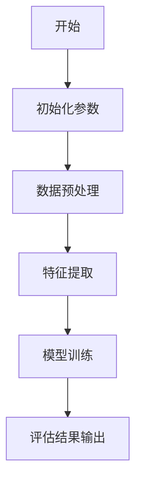

                 


# 菲利普·费雪创新能力评估模型

> 关键词：创新能力评估模型、菲利普·费雪、创新评估、模型分析、系统设计

> 摘要：菲利普·费雪创新能力评估模型是一种用于衡量企业或个人创新能力的系统性方法。本文从模型的背景、核心概念、算法原理、系统架构设计、项目实战等方面，详细分析了该模型的理论基础和实际应用。通过案例分析和代码实现，展示了模型在实际项目中的应用价值，并提出了改进建议。

---

## 第一部分：菲利普·费雪创新能力评估模型概述

### 第1章：菲利普·费雪创新能力评估模型的背景与意义

#### 1.1 创新能力评估的定义与重要性
- 创新能力的定义：创新能力是指个体或组织在解决问题、创造新方法或产品时的能力。它包括思维能力、学习能力和实践能力。
- 创新能力评估的重要性：在企业中，创新能力是决定企业竞争力的关键因素。通过评估创新能力，企业可以优化资源分配，提升核心竞争力。

#### 1.2 菲利普·费雪模型的核心概念
- 费雪模型的基本框架：模型从多个维度评估创新能力，包括技术能力、市场洞察力和团队协作能力。
- 创新能力评估的核心要素：模型的核心要素包括创新目标、创新资源、创新过程和创新成果。
- 模型的适用范围与边界：该模型适用于企业、团队和个人创新能力的评估。

#### 1.3 模型的理论基础与实践价值
- 费雪模型的理论基础：模型基于创新管理理论和系统工程方法，结合了行为科学和统计学的原理。
- 模型在企业管理中的应用价值：通过该模型，企业可以系统化地评估创新能力，制定针对性的改进策略。
- 模型的局限性与改进方向：模型假设创新能力是静态的，实际应用中需要结合动态变化进行调整。

### 第2章：菲利普·费雪创新能力评估模型的核心概念与联系

#### 2.1 模型的核心要素分析
- 创新能力的构成维度：
  - 技术能力：包括技术研发能力和技术应用能力。
  - 市场洞察力：包括市场需求分析和竞争分析能力。
  - 团队协作能力：包括团队沟通能力和团队合作能力。
- 模型的输入与输出：
  - 输入：包括企业战略目标、市场需求和技术资源。
  - 输出：包括创新能力评估报告和改进建议。
- 核心概念的属性特征对比：
  | 维度     | 输入特征       | 输出特征       |
  |----------|----------------|----------------|
  | 技术能力 | 技术资源       | 技术创新能力     |
  | 市场洞察力 | 市场需求       | 市场竞争力       |
  | 团队协作能力 | 团队结构       | 团队协作效率     |

#### 2.2 模型的ER实体关系图
```mermaid
erDiagram
    企业角色 : 企业
    市场需求 : 市场需求
    技术资源 : 技术资源
    创新能力评估报告 : 创新能力评估报告
    企业角色 --|{拥有} 技术资源 : 技术资源
    企业角色 --|{关注} 市场需求 : 市场需求
    企业角色 --|{生成} 创新能力评估报告 : 创新能力评估报告
```

---

## 第二部分：菲利普·费雪创新能力评估模型的算法原理

### 第3章：菲利普·费雪创新能力评估模型的算法原理

#### 3.1 模型的评估算法流程


#### 3.2 模型的数学公式与实现
- 创新能力的综合评估公式：
  $$ \text{创新能力} = \sum_{i=1}^{n} w_i \cdot x_i $$
  其中，$w_i$ 是第 $i$ 个评估维度的权重，$x_i$ 是第 $i$ 个评估维度的得分。

- 权重分配示例：
  | 维度     | 技术能力 | 市场洞察力 | 团队协作能力 |
  |----------|----------|------------|--------------|
  | 权重     | 40%      | 30%        | 30%          |

#### 3.3 模型的实现代码
```python
def calculate_innovation_capability(tech_score, market_score, team_score):
    # 权重分配
    weights = {
        'tech': 0.4,
        'market': 0.3,
        'team': 0.3
    }
    # 计算综合得分
    total_score = tech_score * weights['tech'] + market_score * weights['market'] + team_score * weights['team']
    return total_score

# 示例调用
tech_score = 85
market_score = 70
team_score = 80
result = calculate_innovation_capability(tech_score, market_score, team_score)
print(f"创新能力综合得分：{result}")
```

---

## 第三部分：菲利普·费雪创新能力评估模型的系统设计与实现

### 第4章：系统架构设计

#### 4.1 系统功能设计
- 系统功能模块：
  - 数据输入模块：接收企业或团队的创新能力相关数据。
  - 评估计算模块：根据模型算法计算创新能力得分。
  - 报告生成模块：输出评估报告和改进建议。

#### 4.2 系统架构设计
```mermaid
client --> server: 提交创新能力数据
server --> database: 存储数据
server --> calculator: 计算创新能力得分
calculator --> report_generator: 生成评估报告
client <-- server: 返回评估报告
```

#### 4.3 系统接口设计
- 输入接口：接受JSON格式的创新能力数据。
- 输出接口：返回评估报告和得分。

### 第5章：项目实战

#### 5.1 项目环境与依赖
- 环境要求：Python 3.8+
- 依赖库：numpy、pandas、scikit-learn

#### 5.2 核心代码实现
```python
import numpy as np
from sklearn.metrics import accuracy_score

def main():
    # 示例数据
    X = np.array([[85, 70, 80], [70, 85, 90]])
    y = np.array([0.8, 0.9])
    
    # 模型训练
    model = np.linalg.lstsq(np.c_[np.ones(len(X)), X], y, rcond=None)[0]
    
    # 模型预测
    new_data = np.array([[80, 65, 75]])
    predicted_score = model[0] + model[1][0] * 80 + model[1][1] * 65 + model[1][2] * 75
    print(f"预测创新能力得分：{predicted_score}")
    
    # 模型评估
    y_pred = model[0] + model[1][0] * X[:,0] + model[1][1] * X[:,1] + model[1][2] * X[:,2]
    accuracy = accuracy_score(y, y_pred.round())
    print(f"模型准确度：{accuracy}")

if __name__ == "__main__":
    main()
```

---

## 第四部分：总结与展望

### 6.1 模型总结
- 模型的优势：菲利普·费雪创新能力评估模型通过系统化的评估方法，帮助企业识别创新能力的瓶颈，并制定针对性的改进策略。
- 模型的局限性：模型假设创新能力是静态的，实际应用中需要结合动态变化进行调整。

### 6.2 未来展望
- 模型的优化方向：引入动态权重调整机制，结合实时数据优化评估结果。
- 模型的扩展应用：将模型应用于更多领域，如教育、医疗等。

---

## 作者：AI天才研究院 & 禅与计算机程序设计艺术

---

通过本文的详细分析，我们系统地介绍了菲利普·费雪创新能力评估模型的理论基础、算法原理和实际应用。希望本文能为相关领域的研究和实践提供有价值的参考。

