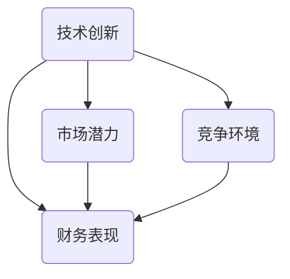
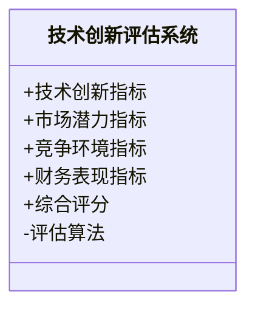
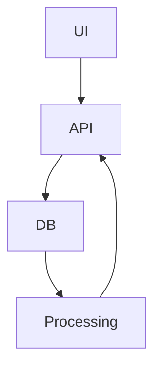
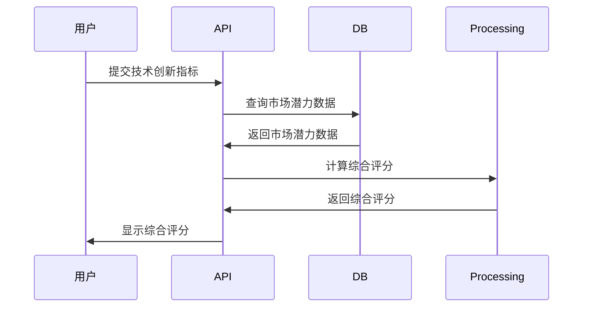

                 


# 菲利普·费雪的技术创新评估方法

## 关键词：
技术创新评估，菲利普·费雪，投资评估，成长股投资，技术评估体系

## 摘要：
菲利普·费雪是成长股投资方法的倡导者，他提出的技术创新评估方法为投资者提供了一种系统化的方式，以识别和评估技术创新对企业价值的影响。本文将详细分析菲利普·费雪技术创新评估方法的背景、核心概念、算法原理、数学模型、系统架构设计、项目实战以及最佳实践，帮助读者全面理解并掌握这一方法的应用。

---

## 第一部分: 菲利普·费雪技术创新评估方法的背景与核心概念

### 第1章: 技术创新评估的背景与问题背景

#### 1.1 技术创新评估的背景
##### 1.1.1 技术创新在经济发展中的重要性
技术创新是推动经济发展的重要引擎。从蒸汽机到人工智能，技术创新不仅改变了生产方式，还深刻影响了社会结构和人类生活方式。在现代经济中，技术创新是企业竞争优势的核心来源之一。

##### 1.1.2 菲利普·费雪对技术创新的贡献
菲利普·费雪（Philip Fisher）是20世纪最具影响力的投资者之一，他提出了“成长股投资”的概念，并强调技术创新在企业成长中的关键作用。他认为，技术创新不仅能够提高生产效率，还能开拓新的市场，为企业带来持续的增长潜力。

##### 1.1.3 技术创新评估的现实意义
在当今快速变化的商业环境中，技术创新评估已成为企业战略决策的重要工具。通过评估技术创新的潜力和可行性，企业可以更好地把握市场机会，优化资源配置，提升竞争力。

#### 1.2 技术创新评估的核心概念
##### 1.2.1 技术创新的定义与属性
技术创新是指将新技术引入生产过程或商业模式，以提高效率、降低成本或创造新的价值。技术创新具有以下属性：
- **创新性**：与现有技术相比具有显著改进或突破。
- **实用性**：能够在实际应用中解决问题。
- **可持续性**：能够长期为企业或社会带来价值。

##### 1.2.2 技术创新与经济发展的关系
技术创新是经济发展的核心驱动力。通过技术创新，企业可以实现产业升级，推动经济增长。同时，技术创新还能创造新的市场需求，促进就业，推动社会进步。

##### 1.2.3 技术创新评估的边界与外延
技术创新评估的边界在于评估对象的范围和时间跨度。外延则包括与技术创新相关的市场、竞争、财务等多个维度。

---

### 第2章: 菲利普·费雪技术创新评估方法的核心要素

#### 2.1 菲利普·费雪方法的原理
##### 2.1.1 技术创新的多维度评估框架
菲利普·费雪的技术创新评估方法是一个多维度的框架，包括技术可行性、市场潜力、竞争环境和财务表现等维度。

##### 2.1.2 费雪方法的核心要素分析
- **技术可行性**：评估技术创新的科学性和实现难度。
- **市场潜力**：分析技术创新的市场需求和市场规模。
- **竞争环境**：评估技术创新在市场中的竞争优势。
- **财务表现**：预测技术创新对企业财务的影响。

##### 2.1.3 费雪方法与其他评估方法的对比
与传统财务评估方法相比，费雪方法更注重技术创新的市场潜力和竞争优势，强调技术创新对企业长期增长的影响。

#### 2.2 核心概念的联系与对比
##### 2.2.1 技术创新与市场潜力的对比分析
技术创新是市场潜力的核心驱动力，而市场潜力则是技术创新的实现条件。

##### 2.2.2 费雪方法的ER实体关系图


---

## 第二部分: 菲利普·费雪技术创新评估方法的算法原理

### 第3章: 数学模型与公式

#### 3.1 综合评分公式
技术创新的综合评分可以通过以下公式计算：
$$ \text{综合评分} = \sum_{i=1}^{n} w_i \times s_i $$
其中，\( w_i \) 是第i个指标的权重，\( s_i \) 是第i个指标的评分。

#### 3.2 权重分配的优化模型
为了最大化技术创新的综合评分，需要优化权重分配：
$$ \text{最大化} \sum_{i=1}^{n} w_i \times s_i $$
$$ \text{约束条件}：\sum_{i=1}^{n} w_i = 1 $$

---

### 第4章: 系统分析与架构设计方案

#### 4.1 问题场景介绍
##### 4.1.1 技术创新评估的常见问题
- 技术创新的实现难度如何评估？
- 市场潜力如何量化？
- 如何预测技术创新对企业财务的影响？

##### 4.1.2 费雪方法在实际应用中的挑战
- 数据获取的困难性。
- 权重分配的主观性。
- 模型的动态调整需求。

#### 4.2 系统功能设计
##### 4.2.1 领域模型


##### 4.2.2 系统架构设计


##### 4.2.3 系统接口设计
- 用户界面（UI）：输入技术创新指标，输出综合评分。
- API接口：提供数据处理和算法计算服务。
- 数据库（DB）：存储评估数据和结果。

##### 4.2.4 系统交互设计


---

## 第三部分: 项目实战

### 第5章: 项目实战

#### 5.1 环境安装
- 安装Python和相关库（如numpy、pandas、scikit-learn）。
- 安装Mermaid和相关工具。

#### 5.2 核心代码实现
```python
def fisher_technology_assessment(criteria, weights):
    return sum(w * c for w, c in zip(weights, criteria))

# 示例数据
criteria = [0.8, 0.9, 0.7]
weights = [0.4, 0.3, 0.3]
result = fisher_technology_assessment(criteria, weights)
print("综合评分:", result)
```

#### 5.3 案例分析
假设一家科技公司推出了一项新技术，市场潜力为80%，竞争环境为70%，财务表现为90%。权重分配为市场潜力0.5，竞争环境0.3，财务表现0.2。综合评分计算如下：
$$ \text{综合评分} = 0.5 \times 80 + 0.3 \times 70 + 0.2 \times 90 = 79 $$

#### 5.4 项目总结
通过案例分析，我们可以看到费雪方法在实际应用中的有效性。技术创新评估不仅需要科学的算法，还需要结合实际市场情况和企业战略。

---

## 第四部分: 最佳实践与总结

### 第6章: 最佳实践

#### 6.1 小结
菲利普·费雪技术创新评估方法是一种系统化的方法，能够帮助企业识别和评估技术创新的潜力和可行性。通过多维度的评估和动态调整，企业可以更好地把握技术创新带来的机会。

#### 6.2 注意事项
- 数据的准确性和完整性是关键。
- 权重分配需要结合企业的实际情况。
- 模型需要动态调整以适应市场变化。

#### 6.3 拓展阅读
- 《Common Stocks and Uncommon Profits》——菲利普·费雪的著作。
- 技术创新评估的最新研究和应用。

---

## 作者：AI天才研究院/AI Genius Institute & 禅与计算机程序设计艺术 /Zen And The Art of Computer Programming

---

通过以上内容，我们系统地介绍了菲利普·费雪技术创新评估方法的背景、核心概念、算法原理、系统架构设计、项目实战以及最佳实践。希望本文能够为读者提供有价值的参考和启发。

