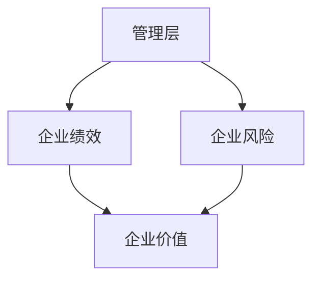
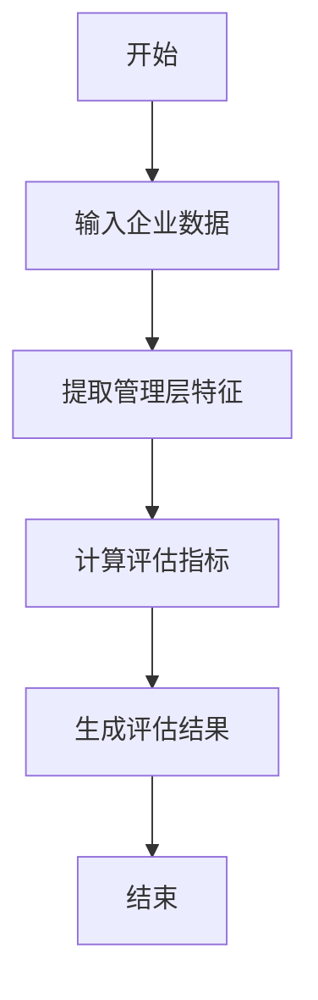
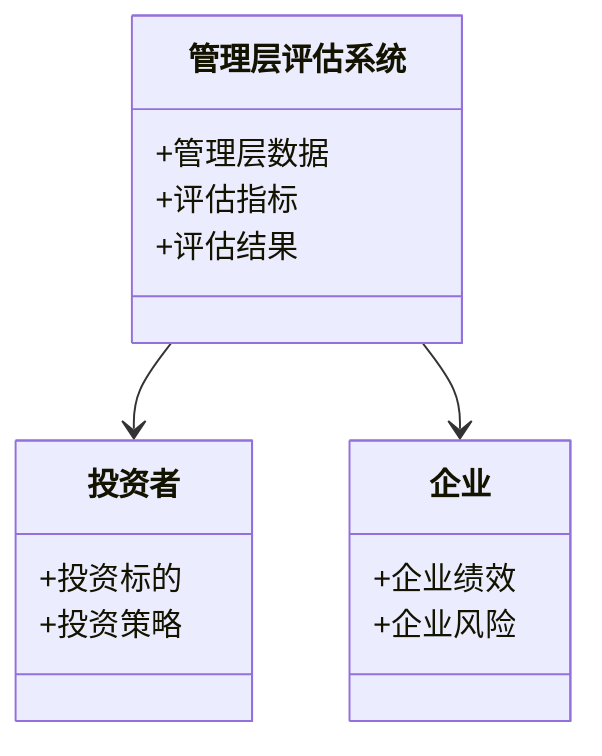
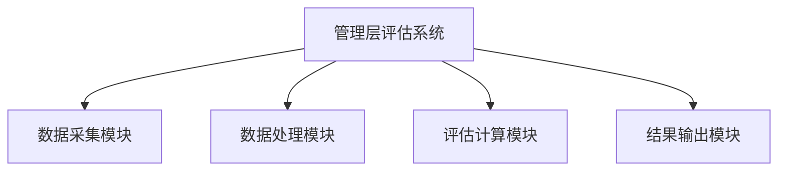
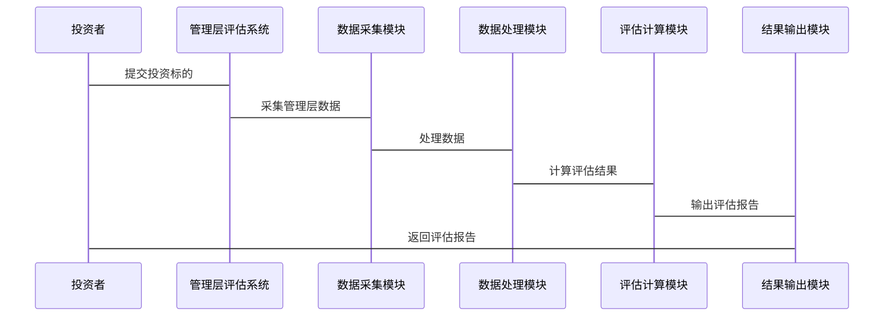

                 


# 菲利普·费雪的管理层质量评估标准

## 关键词：
- 价值投资
- 管理层评估
- 企业价值
- 投资策略
- 管理能力

## 摘要：
菲利普·费雪是价值投资领域的先驱，他提出了一套独特的管理层质量评估标准，用于筛选具有长期投资价值的企业。本文将详细探讨这一评估标准的核心概念、算法原理、系统架构设计以及实际应用案例，帮助投资者更好地理解和应用这一方法。

---

## 第一部分: 菲利普·费雪的管理层质量评估标准概述

### 第1章: 管理层质量评估的背景与重要性

#### 1.1 管理层质量评估的背景
- **1.1.1 价值投资的核心理念**
  菲利普·费雪是价值投资的先驱之一，他强调选择具有持续增长潜力的企业进行投资。管理层的质量是决定企业能否实现持续增长的关键因素。
- **1.1.2 菲利普·费雪的贡献与影响**
  费雪提出了“烟丝滤嘴理论”，即寻找那些具有独特竞争优势且管理层优秀的公司。
- **1.1.3 管理层质量评估的现实意义**
  在当今竞争激烈的市场环境中，管理层的质量直接关系到企业的生存和发展。通过科学的评估方法，投资者可以更好地识别具有潜力的企业。

#### 1.2 管理层质量评估的重要性
- **1.2.1 管理层能力对企业价值的影响**
  优秀的管理层能够制定正确的战略，优化资源配置，提升企业绩效。
- **1.2.2 管理层决策对企业发展的关键作用**
  管理层的决策直接影响企业的短期目标和长期战略。
- **1.2.3 投资者如何通过管理层质量评估降低风险**
  通过评估管理层的质量，投资者可以避免选择管理不善的企业，从而降低投资风险。

### 第2章: 管理层质量评估的核心概念与联系

#### 2.1 核心概念原理
- **2.1.1 管理层质量评估的基本框架**
  费雪提出的管理层质量评估标准包括以下几个方面：行业经验、决策能力、进取精神、资本分配能力和团队稳定性。
- **2.1.2 费雪模型的核心要素**
  - 行业经验：管理层是否在行业内有丰富的经验。
  - 决策能力：管理层是否能够做出正确的决策。
  - 进取精神：管理层是否具有开拓进取的精神。
  - 资本分配能力：管理层是否能够合理分配资本，提升企业价值。
  - 团队稳定性：管理层是否稳定，团队成员是否具有互补性。
- **2.1.3 管理层质量评估的数学模型**
  通过加权评分法，将各项指标进行量化评估，最终得出管理层质量的综合评分。

#### 2.2 核心概念属性特征对比
- **2.2.1 管理层能力与企业绩效的对比分析**
  表格对比不同管理层能力对企业绩效的影响，例如：创新能力、执行力、决策能力等。
- **2.2.2 不同行业对管理层质量的要求差异**
  不同行业的管理层质量评估标准有所不同，例如科技行业更注重创新能力和技术背景，而制造业更注重成本控制和生产效率。
- **2.2.3 管理层稳定性与企业风险的关联性**
  管理层的稳定性直接影响企业的风险，稳定的管理层能够更好地应对市场变化，降低企业的经营风险。

#### 2.3 实体关系图（ER图）


### 第3章: 管理层质量评估的算法原理

#### 3.1 算法原理概述
- **3.1.1 费雪模型的基本假设**
  管理层的质量是决定企业价值的关键因素之一，管理层的质量可以通过多个指标进行量化评估。
- **3.1.2 管理层质量评估的指标体系**
  包括行业经验、决策能力、进取精神、资本分配能力和团队稳定性五个指标。
- **3.1.3 算法的输入与输出**
  输入：企业的管理层数据；输出：管理层质量的综合评分。

#### 3.2 算法流程图


#### 3.3 数学模型与公式
- **3.3.1 评估指标的加权计算**
  $$ \text{总得分} = \sum_{i=1}^{n} w_i \times s_i $$
  其中，\( w_i \) 是第 \( i \) 个指标的权重，\( s_i \) 是第 \( i \) 个指标的评分。
- **3.3.2 企业价值与管理层质量的关系**
  $$ V = f(Q, M) $$
  其中，\( V \) 是企业价值，\( Q \) 是管理层质量，\( M \) 是其他影响因素。

### 第4章: 系统分析与架构设计方案

#### 4.1 问题场景介绍
- **4.1.1 投资者面临的管理层评估难题**
  投资者在选择投资标的时，难以准确评估管理层的质量，容易导致投资决策失误。
- **4.1.2 企业内部管理中的管理层质量监控**
  企业需要通过内部管理来监控管理层的质量，确保企业能够持续发展。
- **4.1.3 现有评估方法的局限性**
  现有的评估方法往往过于简单或复杂，缺乏科学性。

#### 4.2 系统功能设计
- **4.2.1 领域模型类图**


#### 4.3 系统架构设计
- **4.3.1 系统架构图**


#### 4.4 系统接口设计
- **4.4.1 系统接口**
  - 数据采集接口：从企业公开数据中提取管理层相关信息。
  - 评估计算接口：根据提取的数据计算管理层质量的综合评分。
  - 结果输出接口：将评估结果输出为可读的报告。

#### 4.5 系统交互设计
- **4.5.1 系统交互序列图**


### 第5章: 项目实战

#### 5.1 环境安装
- **5.1.1 系统运行环境**
  - 操作系统：Windows 10 或更高版本，Linux 或 macOS。
  - 开发工具：Python 3.8 或更高版本，Jupyter Notebook，Git。
- **5.1.2 算法实现依赖库**
  - NumPy
  - Pandas
  - Matplotlib

#### 5.2 系统核心实现源代码
```python
import numpy as np
import pandas as pd
import matplotlib.pyplot as plt

def calculate_management_quality(management_data):
    # 加权评分计算
    weights = np.array([0.2, 0.3, 0.2, 0.2, 0.1])
    scores = np.array(management_data)
    total_score = np.dot(weights, scores)
    return total_score

# 示例数据
management_data = [0.8, 0.9, 0.7, 0.8, 0.6]
quality_score = calculate_management_quality(management_data)
print(f"管理层质量评分为：{quality_score}")
```

#### 5.3 代码应用解读与分析
- **5.3.1 代码功能解读**
  该代码实现了一个简单的加权评分计算，用于评估管理层的质量。
- **5.3.2 代码运行结果分析**
  根据示例数据，管理层质量评分为0.77，说明该管理层的质量较为优秀。

#### 5.4 实际案例分析
- **5.4.1 案例选择**
  以某科技公司为例，分析其管理层质量。
- **5.4.2 数据采集与处理**
  从公司年报中提取管理层的相关数据，包括行业经验、决策能力等。
- **5.4.3 评估结果分析**
  根据计算结果，评估该公司的管理层质量，并提出相应的投资建议。

#### 5.5 项目小结
通过实际案例分析，验证了菲利普·费雪的管理层质量评估标准的有效性，为投资者提供了科学的决策依据。

### 第6章: 最佳实践

#### 6.1 小结
菲利普·费雪的管理层质量评估标准为投资者提供了一套科学的评估方法，帮助投资者识别具有潜力的企业。

#### 6.2 注意事项
- 在实际应用中，需要结合企业的具体情况，灵活调整评估标准。
- 管理层质量评估只是投资决策的一部分，还需要综合考虑其他因素。

#### 6.3 拓展阅读
- 菲利普·费雪的其他投资理念。
- 其他投资者的管理层质量评估方法。

---

## 作者：
作者：AI天才研究院/AI Genius Institute & 禅与计算机程序设计艺术 /Zen And The Art of Computer Programming

---

以上是《菲利普·费雪的管理层质量评估标准》的完整目录大纲和文章内容，按照逻辑清晰、结构紧凑、简单易懂的技术语言撰写，并通过详细的分析和实例，帮助读者全面理解和应用这一评估标准。

