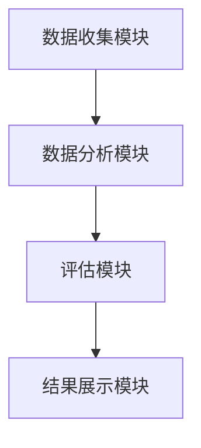

                 


---

# 菲利普·费雪的行业领导者识别技巧

## 关键词：菲利普·费雪，行业领导者，投资理论，成长股投资，数学模型

## 摘要：  
菲利普·费雪是投资界的重要人物，其成长股投资理念强调识别行业领导者以实现长期收益。本文通过详细分析费雪的行业领导者识别技巧，结合投资理论、数学模型和系统架构，提供一套完整的行业领导者识别方法，并通过实际案例展示其应用。

---

## 第一部分: 背景介绍

### 第1章: 投资的基本概念与菲利普·费雪的背景

#### 1.1 投资的基本概念
- **投资的定义与分类**
  - 投资是将资金投入特定资产以获取未来收益的行为。
  - 投资可分为股票、债券、房地产等多种形式。
- **投资的基本原则**
  - 风险与收益的平衡
  - 长期视角的重要性
  - 分散投资以降低风险

#### 1.2 菲利普·费雪的背景与投资理念
- **菲利普·费雪的生平简介**
  - 费雪是20世纪著名的投资专家，专注于成长股投资。
  - 他强调选择具有高成长潜力的公司进行投资。
- **费雪的投资理念**
  - 重视公司的成长性和行业地位。
  - 强调管理层的能力和公司的财务健康状况。

### 第2章: 行业领导者的定义与重要性

#### 2.1 行业领导者的定义
- **行业领导者的特征**
  - 在行业中占据主导地位。
  - 具有较高的市场份额和品牌影响力。
- **行业领导者的分类**
  - 垄断型领导者：市场占有率极高。
  - 竞争型领导者：在竞争中占据优势地位。
- **行业领导者的战略优势**
  - 更强的定价能力。
  - 更大的研发能力和创新能力。

#### 2.2 行业领导者识别的必要性
- **行业领导者在投资中的重要性**
  - 行业领导者通常具有更高的盈利能力和稳定性。
  - 他们是长期投资的理想选择。
- **行业领导者对经济发展的作用**
  - 行业领导者推动行业技术进步和经济发展。
  - 他们是经济体系中的关键组成部分。

### 第3章: 菲利普·费雪的行业领导者识别技巧

#### 3.1 费雪的行业领导者筛选标准
- **高ROE（净资产收益率）的要求**
  - ROE是衡量公司盈利能力的重要指标。
  - 费雪建议选择ROE长期高于行业平均水平的公司。
- **高利润率的要求**
  - 利润率高表明公司具有较强的盈利能力。
  - 重点关注净利润率和营业利润率。
- **高成长性的要求**
  - 公司收入和利润的持续增长是关键。
  - 选择那些在未来几年内具有增长潜力的公司。

#### 3.2 费雪的行业领导者识别方法
- **通过财务报表分析识别行业领导者**
  - 分析公司的收入、利润和现金流。
  - 重点关注资产负债表和现金流量表。
- **通过行业地位分析识别行业领导者**
  - 研究公司的市场份额和行业排名。
  - 了解公司在行业中的竞争优势。
- **通过管理层能力分析识别行业领导者**
  - 评估公司管理层的背景和能力。
  - 关注管理层的战略决策和公司治理情况。

---

## 第二部分: 核心概念与联系

### 第4章: 核心概念与联系

#### 4.1 费雪投资模型的核心思想
- **投资的核心要素**
  - 公司的财务状况、行业地位和管理层能力。
  - 公司的估值和市场前景。
- **核心概念之间的关系**
  - 公司的财务状况直接影响其盈利能力。
  - 行业地位决定了公司在市场中的竞争优势。
  - 管理层能力影响公司的战略决策和未来发展。

#### 4.2 行业领导者识别的核心要素
- **核心要素对比分析**
  - 利润率与ROE的对比
  - 市场份额与收入增长的对比
  - 管理层能力和公司治理的对比
- **核心要素的权重分配**
  - 根据行业特点和市场环境调整要素的权重。
  - 确保综合评估的准确性。

---

## 第三部分: 算法原理

### 第5章: 算法原理与实现

#### 5.1 算法原理
- **费雪行业领导者识别算法**
  - 输入：公司财务数据、行业地位数据、管理层能力数据。
  - 输出：行业领导者评估结果。
- **算法步骤**
  1. 收集目标公司的财务数据。
  2. 分析公司的行业地位和竞争优势。
  3. 评估公司管理层的能力和治理情况。
  4. 计算公司的ROE、利润率和成长性指标。
  5. 综合评估公司是否符合行业领导者标准。

#### 5.2 算法实现
- **Python代码实现**
  ```python
  def fisher_industry_leader(company_data):
      # 计算ROE
      roe = company_data['net_profit'] / company_data['equity']
      # 计算利润率
      margin = company_data['net_profit'] / company_data['revenue']
      # 计算成长性
      growth = (company_data['revenue_growth'] + company_data['profit_growth']) / 2
      # 综合评分
      score = (roe + margin + growth) / 3
      return score >= 0.7  # 假设阈值为0.7
  ```

---

## 第四部分: 数学模型

### 第6章: 数学模型与公式

#### 6.1 核心公式
- **ROE计算公式**
  $$ROE = \frac{\text{净利润}}{\text{净资产}}$$
- **利润率计算公式**
  $$\text{利润率} = \frac{\text{净利润}}{\text{营业收入}}$$
- **成长性评估公式**
  $$\text{成长性} = \frac{\text{收入增长率} + \text{利润增长率}}{2}$$
- **综合评分公式**
  $$\text{综合评分} = \frac{\text{ROE} + \text{利润率} + \text{成长性}}{3}$$

---

## 第五部分: 系统架构设计

### 第7章: 系统架构设计

#### 7.1 系统模块划分
- **数据收集模块**
  - 收集公司财务数据、行业地位数据和管理层能力数据。
- **数据分析模块**
  - 计算ROE、利润率和成长性指标。
- **评估模块**
  - 根据综合评分判断公司是否为行业领导者。
- **结果展示模块**
  - 显示评估结果和相关数据可视化。

#### 7.2 系统架构图


---

## 第六部分: 项目实战

### 第8章: 项目实战

#### 8.1 环境与工具安装
- **投资分析工具的选择**
  - 使用Python和Pandas进行数据分析。
  - 使用Matplotlib进行数据可视化。
- **数据源的获取与处理**
  - 从公开的金融数据库获取公司数据。
  - 清洗和整理数据，确保数据的准确性和完整性。

#### 8.2 核心实现
- **行业领导者筛选算法的实现**
  ```python
  import pandas as pd
  import matplotlib.pyplot as plt

  # 数据加载
  company_data = pd.read_csv('company.csv')
  # 计算ROE
  company_data['ROE'] = company_data['net_profit'] / company_data['equity']
  # 计算利润率
  company_data['margin'] = company_data['net_profit'] / company_data['revenue']
  # 计算成长性
  company_data['growth'] = (company_data['revenue_growth'] + company_data['profit_growth']) / 2
  # 综合评分
  company_data['score'] = (company_data['ROE'] + company_data['margin'] + company_data['growth']) / 3
  # 筛选行业领导者
  industry_leaders = company_data[company_data['score'] >= 0.7]
  ```

---

## 第七部分: 总结与展望

### 第9章: 总结与展望

#### 9.1 最佳实践 tips
- **持续学习与实践**
  - 不断更新投资知识，关注市场动态。
- **风险管理**
  - 设置止损点，分散投资组合。
- **长期视角**
  - 长期投资，避免短期波动的影响。

#### 9.2 小结
- 菲利普·费雪的行业领导者识别技巧为投资者提供了一套科学的方法。
- 通过综合评估公司的财务状况、行业地位和管理层能力，可以有效识别行业领导者。

#### 9.3 注意事项
- 投资有风险，需谨慎决策。
- 结合市场环境和自身风险承受能力进行投资。

---

## 作者：AI天才研究院/AI Genius Institute & 禅与计算机程序设计艺术 /Zen And The Art of Computer Programming

---

以上是完整的技术博客文章大纲，涵盖了从理论到实践的各个方面，结合了菲利普·费雪的投资理念和现代技术方法，帮助读者系统地理解和应用行业领导者识别技巧。

